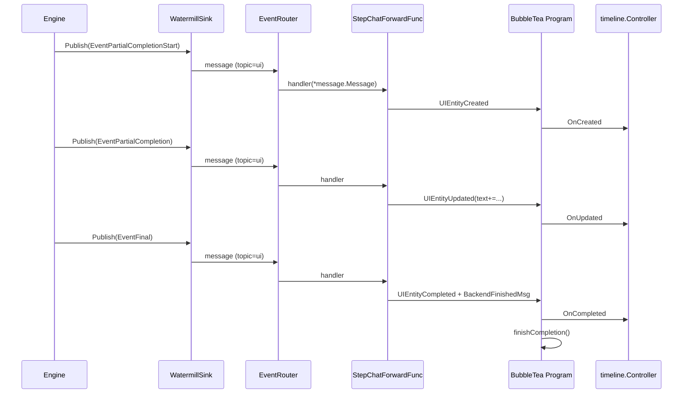

Title: Pinocchio Chat UI Architecture, Control Flow, and Event Flow (with files and functions)

Audience: New developers/interns building features on the Pinocchio chat UI that is powered by Geppetto engines and bobatea’s timeline widgets.

Outcome: Understand the components, how they connect, and the end-to-end data flow from inference engines to Bubble Tea UI. Includes architecture overview, control flow, event flow, key structs/functions, and compact pseudocode and diagrams.

## 0) Package imports (quick reference)

These imports are the essential toolkit you will use across the stack. Bubble Tea (`tea`) powers the terminal UI and its message loop. Bobatea contributes the chat model and a timeline system with entity lifecycle messaging and pluggable renderers, which we use to render conversation content. Geppetto provides the abstraction over AI providers (OpenAI, Claude, Gemini, etc.), along with factories to create engines from configuration and an event-sink mechanism for streaming. Watermill is the message bus used by Geppetto’s `EventRouter` to route engine events to application handlers. Having these imports at hand will help you read and write code that touches any part of the pipeline from engine to UI.

```go
import (
    // Bubble Tea
    tea "github.com/charmbracelet/bubbletea"

    // Bobatea chat + timeline
    boba_chat "github.com/go-go-golems/bobatea/pkg/chat"
    "github.com/go-go-golems/bobatea/pkg/timeline"
    renderers "github.com/go-go-golems/bobatea/pkg/timeline/renderers"

    // Geppetto engines + events
    "github.com/go-go-golems/geppetto/pkg/inference/engine"
    "github.com/go-go-golems/geppetto/pkg/inference/engine/factory"
    "github.com/go-go-golems/geppetto/pkg/inference/middleware"
    "github.com/go-go-golems/geppetto/pkg/events"
    "github.com/go-go-golems/geppetto/pkg/turns"

    // Watermill (wrapped by events.EventRouter)
    "github.com/ThreeDotsLabs/watermill/message"
)
```

## 1) Architecture overview

At a high level, Pinocchio wires a provider-agnostic Geppetto `engine.Engine` to a Bubble Tea UI via Watermill events. Engines publish streaming events (start/partial/final/error) to a `WatermillSink`, which the `events.EventRouter` delivers to a UI handler (`pinocchio/pkg/ui/backend.go:StepChatForwardFunc`). This handler turns engine events into bobatea timeline lifecycle messages that the Bubble Tea program consumes and renders. The unit of inference is a `*turns.Turn`, which aggregates ordered `Block`s (system, user, assistant, tools) and metadata; the engine reads an input `Turn`, performs inference, and returns an updated `Turn` while also emitting streaming progress. By isolating provider specifics inside engines and translating everything into uniform events and timeline messages, the system stays testable, extensible, and easy to reason about.

Key files and responsibilities:

- Engine and streaming (Geppetto)
  This layer defines the minimal execution surface (`RunInference`) and how to construct engines for different providers. Engines emit `events.Event` to attached sinks for streaming; the `WatermillSink` serializes those events and publishes them to a topic for subscribers. This lets client code observe progress without coupling to any provider API or transport specifics.
  - `geppetto/pkg/inference/engine/engine.go`: `type Engine interface { RunInference(ctx, *turns.Turn) (*turns.Turn, error) }`
  - `geppetto/pkg/inference/engine/factory/*`: factories to instantiate concrete provider engines
  - `geppetto/pkg/inference/middleware/sink_watermill.go`: `WatermillSink` to publish `events.Event` to Watermill
  - `geppetto/pkg/events/*`: `EventRouter` wrapper around Watermill; typed events like `EventPartialCompletion`, `EventFinal`, etc.

- UI backend bridge (Pinocchio)
  The `EngineBackend` provides the `bobatea` backend interface and keeps lightweight state such as prior turns and cancellation. It also implements `SetSeedTurn` and `emitInitialEntities` so that existing conversation context is visible when the UI starts. The `StepChatForwardFunc` is the adapter that consumes engine events and injects UI lifecycle messages directly into the Bubble Tea program.
  - `pinocchio/pkg/ui/backend.go`:
    - `type EngineBackend struct{ ... }` implements `bobatea/pkg/chat/Backend`
    - `Start(ctx, prompt)` reduces prior turns, appends user prompt block, calls `engine.RunInference`, then returns `boba_chat.BackendFinishedMsg`
    - `SetSeedTurn(t *turns.Turn)` and `emitInitialEntities(t)` to pre-populate the timeline
    - `StepChatForwardFunc(p *tea.Program) func(*message.Message) error`: Watermill → Bubble Tea bridge

- Chat runner and program bootstrapping
  The orchestration code for starting the chat experience exists in two places: a general-purpose `ChatSession` builder and the CLI-oriented `PinocchioCommand` path. Both set up an `EventRouter`, create an engine with a UI sink, build a Bubble Tea program with a bobatea chat model, and register the forwarding handler. They differ mostly in how they read configuration and whether they begin with a blocking step.
  - `pinocchio/pkg/chatrunner/chat_runner.go`:
    - `type ChatSession` and `ChatSession.Run()` modes: `RunModeChat`, `RunModeInteractive`, `RunModeBlocking`
    - `runChatInternal()` creates engine with `engine.WithSink(uiSink)` and runs `EventRouter` and Bubble Tea program with `StepChatForwardFunc`
  - `pinocchio/pkg/cmds/cmd.go`:
    - Command execution path. In chat mode, creates `EngineBackend`, Bubble Tea program, attaches `StepChatForwardFunc`, then seeds via `SetSeedTurn` once router is running. Optional auto-submit of prompt.

- Bubble Tea chat UI (Bobatea)
  The chat UI is composed of a text area and a timeline controlled by a `timeline.Controller`. The controller stores entities and orchestrates interactive entity models created via registered factories. The chat model listens for backend messages and timeline lifecycle messages, maintains UI state (input mode vs streaming), and updates the viewport efficiently as entities evolve.
  - `bobatea/pkg/chat/model.go`:
    - `InitialModel(backend Backend, ...) model`
    - Processes timeline lifecycle messages (`timeline.UIEntityCreated/Updated/Completed`) and `BackendFinishedMsg`
    - Maintains `timeline.Controller` and registers renderers like `renderers.NewLLMTextFactory()`
  - `bobatea/pkg/timeline/controller.go`: `OnCreated`, `OnUpdated`, `OnCompleted`, `OnDeleted` apply lifecycle to internal store and entity models
  - `bobatea/pkg/timeline/renderers/llm_text_model.go`: `LLMTextModel` renders assistant/user text, metadata, and handles copy actions

### High-level diagram

The diagram below shows the end-to-end data plane. The engine emits typed events while running; the Watermill sink publishes them to a topic; the `EventRouter` invokes our UI handler; the handler injects UI lifecycle messages into Bubble Tea; the program hands those to the timeline controller, which drives renderers to update the terminal UI. Each arrow represents a strict dependency boundary and helps keep responsibilities separated.

```mermaid
graph TD
  A[Engine (geppetto/pkg/inference/engine)] -->|RunInference publishes events| B[WatermillSink (geppetto/pkg/inference/middleware)]
  B --> C[EventRouter (geppetto/pkg/events)]
  C -->|handler| D[StepChatForwardFunc (pinocchio/pkg/ui/backend.go)]
  D -->|p.Send(...)| E[Bubble Tea Program]
  E --> F[timeline.Controller (bobatea/pkg/timeline/controller.go)]
  F --> G[LLMTextModel / renderers (bobatea/pkg/timeline/renderers)]
```

## 2) Control flow (modes and wiring)

There are three primary execution modes—chat, interactive, and blocking—that determine how the user experiences inference and streaming. Chat mode launches the full Bubble Tea UI with streaming; interactive mode starts with a single blocking run and then offers to transition into chat if the terminal is interactive; blocking mode performs a single run and prints the result without starting the UI. Under the hood, the same engine abstraction is used; only the router, sink, and UI program are omitted in blocking mode. Two main entry points wire things up:

- `pinocchio/pkg/cmds/cmd.go` (PinocchioCommand)
- `pinocchio/pkg/chatrunner/chat_runner.go` (ChatSession)

### 2.1 Chat mode (UI-first, streaming)

Chat mode is the primary experience for conversational workflows. The application creates a router and an engine with a UI sink for streaming, constructs an `EngineBackend` that implements the bobatea `Backend` interface, and builds a Bubble Tea program using `chat.InitialModel`. It then registers `StepChatForwardFunc` to translate engine events into UI messages and starts the router. Once the router signals readiness, the backend is seeded with prior turns so the timeline shows context immediately, and the user’s prompt may be auto-submitted to kick off streaming.

Functions:
- `pinocchio/pkg/cmds/cmd.go: runChat(ctx, rc *run.RunContext)`
- `pinocchio/pkg/chatrunner/chat_runner.go: (*ChatSession).runChatInternal()`

Key steps:
- Create an `events.EventRouter`
- Create `WatermillSink` for topic `ui` and pass to engine via `engine.WithSink(uiSink)` at creation time
- Create `EngineBackend` with the engine
- Build Bubble Tea program with `bobatea/pkg/chat.InitialModel(backend, ...)`
- Add router handler `router.AddHandler("ui", "ui", ui.StepChatForwardFunc(p))`
- Start router; after `router.Running()`, optionally seed the backend with `SetSeedTurn` and auto-submit prompt

Pseudocode:

```go
router, _ := events.NewEventRouter()
uiSink := middleware.NewWatermillSink(router.Publisher, "ui")
eng, _ := factory.NewEngineFromParsedLayers(parsed, engine.WithSink(uiSink))

backend := ui.NewEngineBackend(eng)
model := boba_chat.InitialModel(backend, boba_chat.WithTitle("pinocchio"))
p := tea.NewProgram(model)

router.AddHandler("ui", "ui", ui.StepChatForwardFunc(p))

go router.Run(ctx)
<-router.Running()
backend.SetSeedTurn(seedTurn)
p.Run()
```

### 2.2 Interactive mode (blocking step, then ask to continue to chat)

Interactive mode is useful for one-off queries that may evolve into a full conversation. It performs a blocking inference and writes the final assistant text to the configured writer. If stderr is a TTY, it prompts the user (via `askForChatContinuation`) to continue into the chat UI. If accepted, the same chat wiring is executed—router, sink, Bubble Tea program—and the previously produced output can be seeded into the timeline for continuity.

Function:
- `pinocchio/pkg/chatrunner/chat_runner.go: (*ChatSession).runInteractiveInternal()`

Key steps:
- Call `runBlockingInternal()` to print initial result to `outputWriter`
- If TTY is available, prompt via `askForChatContinuation`, and if accepted, call `runChatInternal()` (same as chat mode)

### 2.3 Blocking mode (no UI)

Blocking mode executes `RunInference` on a `*turns.Turn` and prints the assistant’s final text to the output writer. Because no router or UI program is started, there are no streaming updates or event handlers. This mode is ideal for pipelines or scripts where a single result is sufficient and interactive rendering would be unnecessary overhead.

Function:
- `pinocchio/pkg/chatrunner/chat_runner.go: (*ChatSession).runBlockingInternal()`

Key steps:
- Create engine without sinks (or with non-UI sinks)
- Prepare `seedTurn` and call `engine.RunInference(ctx, seedTurn)`
- Print final assistant text to `outputWriter`

## 3) Event flow (streaming → timeline → UI)

The most important data path is how engine streaming events turn into Bubble Tea messages and timeline entities. Engines are intentionally decoupled from UI concerns; they publish typed events to any configured sinks, which allows multiple consumers (e.g., UI, logs, metrics) to subscribe independently. The UI registers a single translation handler that turns engine events into concise timeline operations: create on stream start, update on partial deltas, and complete on final/interrupt/error. This keeps the rendering logic simple and robust against provider-specific complexities.

### 3.1 Engine publishes to Watermill

When an engine is created with `engine.WithSink(watermillSink)`, it emits events throughout the lifecycle of a streaming run. The `WatermillSink` serializes those events as JSON and publishes them to a topic on the Watermill publisher. This means any number of handlers can subscribe to the same topic and process the stream in different ways (printing, UI rendering, storage), all without the engine having to know about them.

- Engines created with `engine.WithSink(watermillSink)` publish `events.Event` such as:
  - `*events.EventPartialCompletionStart`
  - `*events.EventPartialCompletion`
  - `*events.EventFinal`
  - `*events.EventInterrupt`
  - `*events.EventError`

- Publisher implementation: `geppetto/pkg/inference/middleware/sink_watermill.go: (*WatermillSink).PublishEvent`

### 3.2 EventRouter delivers to StepChatForwardFunc

The `EventRouter` wraps Watermill’s router and provides a simple `AddHandler` API. For the UI path, we add `StepChatForwardFunc` as a handler on the `ui` topic. Inside this function, the message payload is parsed back into a typed event, metadata is extracted (including a stable `ID` used as the timeline entity identifier), and a bobatea timeline message is crafted. This indirection lets us evolve UI behavior (e.g., add tool-call renderers) without touching engines.

- The UI handler is registered with:
  - `pinocchio/pkg/ui/backend.go: StepChatForwardFunc(p *tea.Program)` via `router.AddHandler("ui", "ui", handler)`

- Mapping inside `StepChatForwardFunc`:
  - `EventPartialCompletionStart` → `timeline.UIEntityCreated{ ID.Kind: "llm_text", Props: { role: "assistant", text: "" } }`
  - `EventPartialCompletion` → `timeline.UIEntityUpdated{ Patch: { text: e.Completion } }`
  - `EventFinal` → `timeline.UIEntityCompleted{ Result: { text: e.Text } }` then `boba_chat.BackendFinishedMsg{}`
  - `EventInterrupt` → `timeline.UIEntityCompleted{ Result: { text: intr.Text } }` then `boba_chat.BackendFinishedMsg{}`
  - `EventError` → `timeline.UIEntityCompleted{ Result: { text: "**Error**\n\n" + e.ErrorString } }` then `boba_chat.BackendFinishedMsg{}`

### 3.3 Bubble Tea program receives messages

Bubble Tea delivers these messages to the chat model’s `Update` method (`bobatea/pkg/chat/model.go`). The chat model doesn’t directly render text; instead, it calls `timeline.Controller.OnCreated/OnUpdated/OnCompleted` which updates internal props and dispatches size/focus/prop updates to the entity-specific model (e.g., `LLMTextModel`). When a `BackendFinishedMsg` arrives, the model calls `finishCompletion()` to return to input mode and ensure the input field regains focus.

- The Bubble Tea program created by Pinocchio uses bobatea’s chat model:
  - `bobatea/pkg/chat/model.go: (model).Update`
  - It handles timeline lifecycle messages by calling:
    - `timeline.Controller.OnCreated/OnUpdated/OnCompleted/OnDeleted`
  - It also handles `boba_chat.BackendFinishedMsg` by calling `finishCompletion()` to reset state and focus input.

### 3.4 Timeline renders entities

The `timeline.Controller` manages a store of entities keyed by `timeline.EntityID`, their props, and versioning. It resolves a renderer model via registered factories (e.g., `NewLLMTextFactory`) and forwards updates so models can update their internal state and produce a view string. This model-centric approach keeps rendering logic modular and enables rich interactions (copy text/code, selection/focus) without bloating the main chat model.

- `bobatea/pkg/timeline/controller.go` stores the entity records and dispatches `timeline.Entity*` messages to entity models.
- `bobatea/pkg/timeline/renderers/llm_text_model.go: LLMTextModel` renders the Markdown content, metadata, and highlights selected/focused states.

### Event sequence diagram

This sequence diagram follows a single streaming run from the moment the engine starts producing events until the UI marks the entity completed and re-enables input. Use it to mentally simulate timing-sensitive behavior like partial updates and finalization.



## 4) Seeding behavior and history

Seeding ensures the timeline shows prior context (system/user/assistant text) immediately when chat begins, which is critical for conversational continuity. Rather than requiring the engine to replay history as new events, Pinocchio sends `UIEntityCreated` and `UIEntityCompleted` messages for existing blocks once the Bubble Tea program is attached. The backend maintains a small `emitted` set to avoid duplicates, and the history of turns is reduced when starting a new run so the engine gets complete context without double-injecting entities into the UI.

Two cooperating mechanisms ensure chat history is reflected in the UI:

- `pinocchio/pkg/cmds/cmd.go: runChat(...)`
  - After `router.Running()`, builds an initial `*turns.Turn` and calls `(*ui.EngineBackend).SetSeedTurn(seed)`.

- `pinocchio/pkg/ui/backend.go`
  - `SetSeedTurn(t)` records the turn in history and calls `emitInitialEntities(t)` if a program is attached.
  - `emitInitialEntities(t)` iterates over existing blocks and sends `timeline.UIEntityCreated` followed by `timeline.UIEntityCompleted` for user/assistant text blocks. It de-duplicates emissions using `EngineBackend.emitted`.
  - When the user submits a new message, `EngineBackend.Start` reduces history (`reduceHistory()`), appends the new user block, and calls `engine.RunInference(...)`.

## 5) Important structs and functions (by file)

Use this section as a navigation guide. Start from these files/functions when tracing a behavior: from `StepChatForwardFunc` to the chat model’s `Update`, from there to the timeline controller, and finally to an entity renderer like `LLMTextModel`. Knowing these anchors reduces onboarding time and prevents spelunking through unrelated code.

- `bobatea/pkg/chat/backend.go`
  - `type Backend interface`
  - `type BackendFinishedMsg struct{}`

- `pinocchio/pkg/ui/backend.go`
  - `type EngineBackend struct`
  - `Start(ctx context.Context, prompt string) (tea.Cmd, error)`
  - `SetSeedTurn(t *turns.Turn)`
  - `emitInitialEntities(t *turns.Turn)`
  - `Interrupt()`, `Kill()`, `IsFinished() bool`
  - `reduceHistory() *turns.Turn`
  - `StepChatForwardFunc(p *tea.Program) func(*message.Message) error`

- `pinocchio/pkg/chatrunner/chat_runner.go`
  - `type ChatSession struct`
  - `Run() error`, `runChatInternal() error`, `runBlockingInternal() error`, `runInteractiveInternal() error`
  - `type ChatBuilder struct` and `NewChatBuilder()`, `WithEngineFactory`, `WithSettings`, `WithMode`, `WithExternalRouter`, `Build()`

- `pinocchio/pkg/cmds/cmd.go`
  - `runChat(ctx, rc *run.RunContext)` wires router, sink, handler, Bubble Tea program, and seeding

- `bobatea/pkg/chat/model.go`
  - `InitialModel(backend Backend, options ...ModelOption) model`
  - `(model).Update` handles `timeline.UIEntity*` and `BackendFinishedMsg`
  - `finishCompletion()` transitions state after backend finishes

- `bobatea/pkg/timeline/controller.go`
  - `OnCreated`, `OnUpdated`, `OnCompleted`, `OnDeleted`

- `bobatea/pkg/timeline/renderers/llm_text_model.go`
  - `LLMTextModel`, `LLMTextFactory`, `NewLLMTextFactory()`

## 6) How 06-inference-engines.md connects to this implementation

The documentation in `geppetto/pkg/doc/topics/06-inference-engines.md` codifies the architectural principles realized here: a minimal `Engine` interface, provider-agnostic factories, and event-driven streaming via sinks. By attaching a `WatermillSink` at creation time, engines publish progress without caring who listens. The `EventRouter` then delivers those events to our UI adapter, which translates them into timeline lifecycle messages and a `BackendFinishedMsg` signal to restore the UI to input mode.

- This is realized by:
  - Passing `engine.WithSink(middleware.NewWatermillSink(router.Publisher, "ui"))` at engine creation time
  - Using `events.EventRouter` to deliver events to `StepChatForwardFunc`
  - Transforming engine events to timeline messages and `BackendFinishedMsg` for the UI

## 7) End-to-end pseudocode (condensed)

This minimal skeleton shows all the moving pieces in the correct order: build an `EventRouter`, create an engine with a UI sink, wire the Watermill handler to `StepChatForwardFunc`, start the router, then seed and run the UI. From here, you can add options (alt-screen, mouse), additional handlers (logging, metrics), or different renderers.

```go
// Build engine with UI sink
router, _ := events.NewEventRouter()
sink := middleware.NewWatermillSink(router.Publisher, "ui")
eng, _ := factory.NewEngineFromParsedLayers(parsed, engine.WithSink(sink))

// Create backend and UI
backend := ui.NewEngineBackend(eng)
model := boba_chat.InitialModel(backend)
p := tea.NewProgram(model)

// Wire Watermill → Bubble Tea
router.AddHandler("ui", "ui", ui.StepChatForwardFunc(p))

// Run router and UI
go router.Run(ctx)
<-router.Running()
backend.SetSeedTurn(seed)
p.Run()
```

## 8) Developer notes and gotchas

Treat `<-router.Running()` as a readiness barrier; do not seed or submit before the router is up or messages can be dropped silently. If you add new entity kinds, register their renderer factories in the chat model and extend `StepChatForwardFunc` to convert engine events appropriately. Keep `BackendFinishedMsg` semantics consistent—it indicates the backend is done with the current run so the UI can re-enable input. Turn on debug/trace logs for `chat`, `timeline_controller`, and `engine_backend` to diagnose rendering or message routing issues.

- Always attach sinks at engine creation time (e.g., `engine.WithSink(uiSink)`), not later.
- Ensure the router is running before seeding or submitting: wait on `<-router.Running()>`.
- Deduplication in `emitInitialEntities` avoids duplicate history entities when seeding multiple times.
- `BackendFinishedMsg` is sent both by `EngineBackend.Start` (post-RunInference) and by `StepChatForwardFunc` on final/interrupt/error; model.Update treats either as completion triggers.

## 9) Verification checklist

Before merging, validate happy paths (final) and exceptional paths (error/interrupt) both produce `UIEntityCompleted` and exactly one `BackendFinishedMsg`. Confirm seeding is idempotent across repeated program starts. In non-TTY environments, ensure UI options route output correctly (e.g., using stderr or disabling alt-screen). These checks prevent subtle regressions in event routing and UI state handling.

- [ ] In chat mode, confirm `router.AddHandler("ui", "ui", StepChatForwardFunc(...))` is registered.
- [ ] Confirm `engine.WithSink(NewWatermillSink(..., "ui"))` is used.
- [ ] Verify `SetSeedTurn` is called after `router.Running()` and entities appear for prior blocks.
- [ ] Submit a prompt → see `UIEntityCreated/Updated/Completed` and then `BackendFinishedMsg`.
- [ ] Check that `finishCompletion()` returns the UI to input-ready state.

## 10) References (files and functions)

Use these references when jumping between layers. Start from Pinocchio to see orchestration, inspect bobatea for UI behavior, and consult Geppetto for engine/streaming semantics. The ttmp design docs provide additional rationale and context for recent refactors.

- Engines and streaming:
  - `geppetto/pkg/inference/engine/engine.go: type Engine`
  - `geppetto/pkg/inference/middleware/sink_watermill.go: NewWatermillSink, PublishEvent`
  - `geppetto/pkg/events/*`: `EventRouter`, typed events

- Pinocchio integration:
  - `pinocchio/pkg/ui/backend.go: EngineBackend, StepChatForwardFunc`
  - `pinocchio/pkg/chatrunner/chat_runner.go: ChatSession, runChatInternal, runBlockingInternal, runInteractiveInternal`
  - `pinocchio/pkg/cmds/cmd.go: runChat`

- UI and timeline:
  - `bobatea/pkg/chat/model.go: InitialModel, (model).Update, finishCompletion`
  - `bobatea/pkg/timeline/controller.go: OnCreated, OnUpdated, OnCompleted, OnDeleted`
  - `bobatea/pkg/timeline/renderers/llm_text_model.go: LLMTextModel, LLMTextFactory, NewLLMTextFactory`

- Docs:
  - `geppetto/pkg/doc/topics/06-inference-engines.md`
  - `bobatea/ttmp/2025-08-13/01-design-for-msg-driven-ui-model-rendering-of-timeline-entities.md`

---

This report should give a new contributor the full mental model to navigate from engines to UI. If you need deeper dives, we can add inline code excerpts or instrument the event flow with an additional handler to log parsed events.
