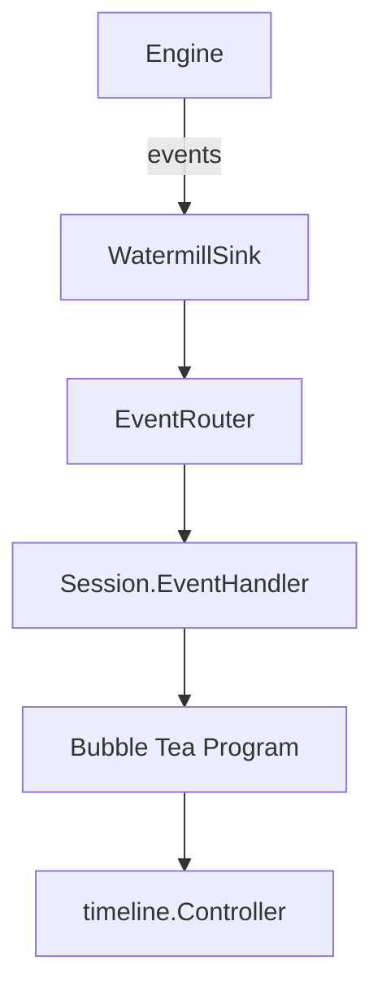

Title: Unified ChatBuilder/ChatSession Plan (for CLI and Embedding) with External Autosubmit

Audience: New intern and contributors who need full context and a step-by-step, engaging guide to implement the unified chat orchestration API.

Outcome: Implement a clean, shared `ChatBuilder/ChatSession` API that both `pinocchio/pkg/cmds/cmd.go` and embedding applications can use to add streaming chat. Autosubmit is handled externally (caller sends messages into the Bubble Tea program after the router is ready), keeping the builder simple and reusable.

Scope: This plan addresses the unified builder/session API (1B + 2) and external autosubmit. It does not cover removal of legacy Stream* messages or chat model reorganization (items 4 and 5). We will handle those separately.

---

## Background and Context

Pinocchio’s current chat wiring exists in two parallel paths:
- `pinocchio/pkg/cmds/cmd.go: runChat(...)` — the CLI path that stands up the `events.EventRouter`, creates an engine via `factory.EngineFactory` with `engine.WithSink(ui)`, instantiates `pinocchio/pkg/ui/backend.go:EngineBackend`, builds a Bubble Tea program from `bobatea/pkg/chat.InitialModel`, registers `ui.StepChatForwardFunc` as a handler, seeds prior context via `SetSeedTurn`, and optionally autosubmits a prompt.
- `pinocchio/pkg/chatrunner/chat_runner.go: ChatSession` — a general orchestrator with `RunModeChat`, `RunModeInteractive`, `RunModeBlocking` and matching internal wiring.

These paths duplicate orchestration (router/sink/backend/program/handler setup, seeding, readiness gating). This duplication risks drift and makes it harder to embed the chat UI into other Bubble Tea apps. We aim to unify orchestration behind a shared `ChatBuilder/ChatSession` API that the CLI reuses, and which embedding apps can call directly.

Key moving parts:
- Engine abstraction and streaming events (`geppetto/pkg/inference/engine`, `geppetto/pkg/inference/middleware/sink_watermill.go`, `geppetto/pkg/events/chat-events.go`).
- UI backend bridge (`pinocchio/pkg/ui/backend.go:EngineBackend`) and Watermill-to-UI adapter (`StepChatForwardFunc`).
- Bubble Tea chat UI (`bobatea/pkg/chat/model.go`) and timeline (`bobatea/pkg/timeline/...`).

---

## Goals

- Provide a single, clean `ChatBuilder/ChatSession` API that:
  - Works for standalone CLI use (returns a complete `*tea.Program`).
  - Works for embedding into an existing Bubble Tea app (returns components: model, backend, event handler).
- Keep autosubmit out of the builder/session by design. Callers trigger autosubmit via messages once the router is ready.
- Bind the event handler (`StepChatForwardFunc` logic) to `ChatSession`, so callers do not import a free function.

Out-of-scope for this plan: removing legacy non-timeline messages (4) and reorganizing `model.go` (5). We will address them later.

---

## Architecture overview (quick refresher)

- Engines emit streaming events (start/partial/final/error/interrupt) when a sink is attached (`engine.WithSink(watermillSink)`).
- `events.EventRouter` delivers these events to handlers. The UI handler converts events into `timeline.UIEntity*` lifecycle messages and a `BackendFinishedMsg` on finalization.
- `EngineBackend` runs inference, keeps minimal history, and exposes `Start(ctx, prompt)` (which we’ll keep non-blocking with immediate blur per the refactor).
- Bubble Tea program runs the chat model and timeline controller, rendering entities and managing input/selection UX.

Diagram (end-to-end):


---

## API Design (ChatBuilder and ChatSession)

We define a builder that can produce either a ready-to-run program (CLI) or the constituent parts for embedding.

Proposed types:
```go
// pinocchio/pkg/chatrunner (or pinocchio/pkg/ui/runtime)

type ChatBuilder struct {
  ctx            context.Context
  engineFactory  factory.EngineFactory
  settings       *settings.StepSettings
  router         *events.EventRouter // optional: create if nil
  programOptions []tea.ProgramOption
  modelOptions   []boba_chat.ModelOption
  seedTurn       *turns.Turn
}

func NewChatBuilder() *ChatBuilder
func (b *ChatBuilder) WithContext(ctx context.Context) *ChatBuilder
func (b *ChatBuilder) WithEngineFactory(f factory.EngineFactory) *ChatBuilder
func (b *ChatBuilder) WithSettings(s *settings.StepSettings) *ChatBuilder
func (b *ChatBuilder) WithRouter(r *events.EventRouter) *ChatBuilder
func (b *ChatBuilder) WithProgramOptions(opts ...tea.ProgramOption) *ChatBuilder
func (b *ChatBuilder) WithModelOptions(opts ...boba_chat.ModelOption) *ChatBuilder
func (b *ChatBuilder) WithSeedTurn(t *turns.Turn) *ChatBuilder

// Standalone usage (CLI): returns session and ready-to-run program
func (b *ChatBuilder) BuildProgram() (*ChatSession, *tea.Program, error)

// Embedding usage: returns session, chat model, backend, and a bound handler to register
func (b *ChatBuilder) BuildComponents() (*ChatSession, tea.Model, boba_chat.Backend, func(*message.Message) error, error)

// Session keeps references and exposes a bound event handler
type ChatSession struct {
  Router  *events.EventRouter
  Backend *ui.EngineBackend
  handler func(*message.Message) error
}
func (cs *ChatSession) EventHandler() func(*message.Message) error
```

Implementation notes:
- Internally, `BuildProgram` creates the engine via `engineFactory.CreateEngine(settings, engine.WithSink(uiSink))`, builds `EngineBackend`, constructs the chat model (passing any `modelOptions`), creates a `tea.Program` (with `programOptions`), attaches the program to `EngineBackend` (for `SetSeedTurn` emissions), binds the event handler (`StepChatForwardFunc` logic) to `ChatSession`, and returns both.
- `BuildComponents` performs the same internal wiring but returns the `tea.Model` instead of a full program, along with the backend and the handler (for registration).

---

## Usage Examples

### Standalone (CLI-style) in `pinocchio/pkg/cmds/cmd.go`

```go
sess, prog, err := NewChatBuilder().
  WithContext(ctx).
  WithEngineFactory(factory.NewStandardEngineFactory()).
  WithSettings(stepSettings).
  WithRouter(rc.Router).
  WithProgramOptions(ttyProgramOptions...).     // e.g., WithAltScreen() if TTY, WithOutput(os.Stderr) if not
  WithModelOptions(boba_chat.WithTitle("pinocchio")).
  WithSeedTurn(seed).
  BuildProgram()
if err != nil { return err }

rc.Router.AddHandler("ui", "ui", sess.EventHandler())
if err := rc.Router.RunHandlers(ctx); err != nil { return err }

// Seed after readiness
go func(){ <-rc.Router.Running(); sess.Backend.SetSeedTurn(seed) }()

// External autosubmit: keep builder clean
go func(){
  <-rc.Router.Running()
  prog.Send(boba_chat.ReplaceInputTextMsg{Text: renderedPrompt})
  prog.Send(boba_chat.SubmitMessageMsg{})
}()

_, err = prog.Run()
return err
```

### Embedding into an existing Bubble Tea app

```go
sess, chatModel, backend, handler, err := NewChatBuilder().
  WithContext(ctx).
  WithEngineFactory(ef).
  WithSettings(step).
  WithRouter(router).
  WithModelOptions(boba_chat.WithTitle("embedded-chat")).
  WithSeedTurn(seed).
  BuildComponents()
if err != nil { /* handle */ }

// Integrate chatModel into your parent model
parent := NewParentModel(chatModel)
p := tea.NewProgram(parent, parentProgramOptions...)

router.AddHandler("ui", "ui", handler)
_ = router.RunHandlers(ctx)

_, _ = p.Run()
```

---

## Control Flow and Responsibilities

- Builder constructs engine, backend, UI model, and a bound UI event adapter (the `StepChatForwardFunc` logic) and returns either a full program or components.
- The caller manages router lifecycle: `RunHandlers(ctx)` and checks readiness via `<-router.Running()`.
- Seeding is caller-triggered after router readiness: `sess.Backend.SetSeedTurn(seed)`.
- Autosubmit is entirely external: the caller sends `ReplaceInputTextMsg` and `SubmitMessageMsg` after `<-router.Running()>`. This keeps the builder free of autosubmit policy.

Diagram (builder responsibilities in green):
```mermaid
graph LR
  subgraph Builder
    E[Create Engine (WithSink)] --> B[EngineBackend]
    B --> M[chat.InitialModel]
    M --> P[tea.Program]
    P --> A[Bound UI Event Handler]
  end
  R[EventRouter] --> A
  Caller -.seed/autosubmit.-> P
```

---

## Migration Steps

- Implement the builder and session API (new file under `pinocchio/pkg/chatrunner` or `pinocchio/pkg/ui/runtime`).
- Adapt `cmd.go: runChat` to use `BuildProgram()`:
  - Move all wiring currently in `runChat` into the builder (engine creation, backend/program creation, handler binding).
  - Keep TTY-related options and seed construction in `cmd.go` and pass via `WithProgramOptions`/`WithSeedTurn`.
  - Replace direct calls to `ui.StepChatForwardFunc` with `sess.EventHandler()` returned from the builder.
  - Keep autosubmit external (unchanged logic using `p.Send(...)` after readiness).
- Write a small example for embedding (in docs or examples directory).
- Document the new API in `pinocchio/ttmp/...` and update any contributor guides referencing the old flow.

---

## Testing Plan

- Unit tests:
  - `BuildProgram()` returns non-nil session and program; `EventHandler()` is non-nil.
  - `BuildComponents()` returns model, backend, handler, and session with the router reference.
- Integration tests:
  - Simulate engine events published to the `ui` topic; verify that `EventHandler()` transforms them into timeline lifecycle messages that the chat model consumes.
  - Verify readiness gating: seeding and autosubmit only after `<-router.Running()>` result in deterministic entity creation.
- CLI smoke test:
  - Launch chat via CLI using the builder; ensure basic streaming renders and finalization occurs.

---

## Risks and Mitigations

- Risk: Regressions while moving wiring from `cmd.go` into the builder.
  - Mitigation: Migrate incrementally and keep `cmd.go` semantics (TTY options, seeding and autosubmit timing) unchanged.
- Risk: Confusion between program vs component builds.
  - Mitigation: Clear API docs and examples for both paths; naming (`BuildProgram` vs `BuildComponents`) is explicit.
- Risk: Event handler location change.
  - Mitigation: Keep `ui.StepChatForwardFunc` exported for compatibility, but prefer `sess.EventHandler()`; deprecate later.

---

## What’s Not in Scope (for later)

- Removing legacy `Stream*` messages and fully standardizing on timeline lifecycle + `BackendFinishedMsg`.
- Reorganizing `bobatea/pkg/chat/model.go` into a reusable chat timeline shell with separate input widget.

We will take those on in subsequent design documents and refactors once the unified builder/session API is in place.
