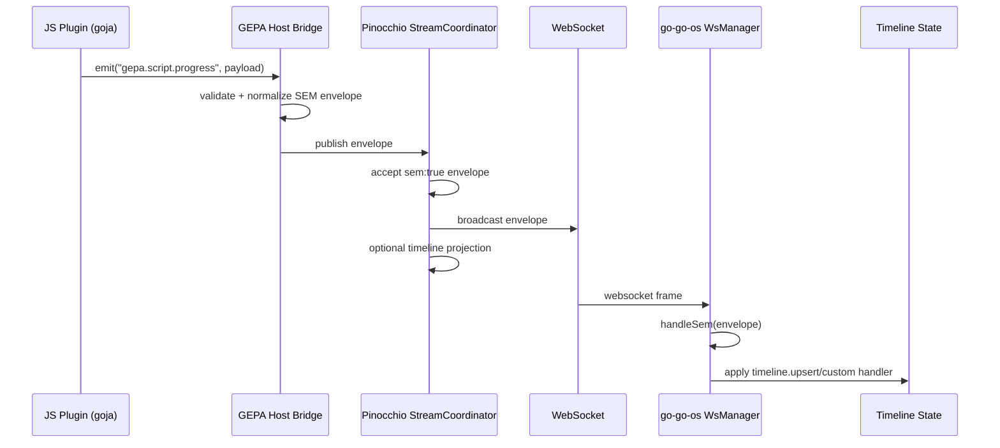
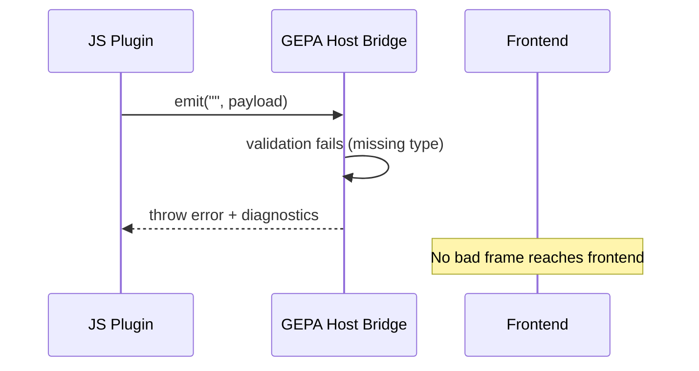

# GEPA Event Streaming Architecture Investigation

## 1. Executive Summary

This investigation answers one core question:

> Can scripts like `exp-11-coaching-dataset-generator.js` stream their runtime events to the web frontend through the existing engine/SEM pipeline?

### Short answer

1. **Engine-side events:** **Yes, already supported today** through Pinocchio's event sink -> stream coordinator -> SEM translation -> websocket delivery pipeline.
2. **Script/VM-side custom events from `go-go-gepa`:** **Not end-to-end today**. The current runner exposes console logging and optimizer hooks, but no first-class script event emitter wired into Pinocchio SEM transport.
3. **Feasibility:** **High**. The receiving side is already strong (Pinocchio + go-go-os). Most work is on the GEPA runner emission boundary and backend registration/mapping for custom event families.

### Why this is the verdict

1. Pinocchio already attaches conversation sinks to inference engines and translates incoming geppetto events into SEM envelopes (`conversation_service.go:373`, `stream_coordinator.go:176`, `sem_translator.go:133`).
2. go-go-os already consumes websocket SEM envelopes, dispatches by `event.type`, and supports both timeline projection and raw debug event viewing (`wsManager.ts:122`, `semRegistry.ts:66`, `eventBus.ts:63`).
3. GEPA runner currently executes scripts in goja and provides no script-level structured event bus API; script output is effectively console text + Go-side optimizer hook prints (`js_runtime.go:31`, `console.go:17`, `optimizer.go:574`, `main.go:315`).

> [!IMPORTANT]
> The system is **partially complete**: transport/projection/rendering exists, but a robust **VM event emission contract** is missing at the GEPA source side.

## 1.1 Implementation Update (2026-02-27)

Since the initial investigation, Pinocchio timeline JS runtime was migrated to a module-first API:

1. `require("pinocchio")` is now canonical.
2. `require("pnocchio")` alias is supported for unified naming.
3. Reducers/handlers register via:
   - `p.timeline.registerSemReducer(eventType, fn)`
   - `p.timeline.onSem(eventType, fn)`
4. Integration and harness tests were updated and passed (`pkg/webchat`, `cmd/web-chat` targeted harness tests).

This confirms the module-side shape needed for Option C is practical in production runtime paths and no longer depends on global VM bindings.

---

## 2. Problem Statement and Scope

## 2.1 User goal

You want JS scripts (for example `exp-11-coaching-dataset-generator.js`) to emit live events that reach a web UI, with support for converting those events into SEM so they can flow through timeline projection and debugging tools.

## 2.2 Scope of this investigation

1. Analyze runtime/event architecture in:
   - `pinocchio/`
   - `/home/manuel/code/wesen/corporate-headquarters/go-go-os`
   - `go-go-gepa` runner surfaces touching VM/plugin execution
2. Determine current capability vs missing pieces.
3. Propose concrete architecture/API plan to implement missing pieces.
4. Provide implementation phases, pseudocode, tests, and risk analysis.

## 2.3 Out of scope

1. Full implementation in this ticket.
2. Production rollout configuration values.
3. UX redesign of the event viewer.

---

## 3. Fundamentals (System Model)

## 3.1 Key terms

1. **Engine event**: runtime event emitted from inference/tool orchestration layers (LLM start/delta/final, tool call/result, etc.).
2. **Script event**: event intentionally emitted by user JS plugin/VM code (progress checkpoints, custom statuses, dataset generation milestones).
3. **SEM envelope**: JSON frame with `sem: true` and `event` object (id/type/data/metadata/cursors) used as cross-boundary event contract.
4. **Timeline projection**: transformation from stream of SEM frames to `TimelineEntityV2` state for UI rendering/hydration.
5. **Hydration**: restoring timeline snapshot via `/api/timeline` before replaying buffered websocket frames.

## 3.2 Why SEM matters here

SEM gives one event protocol for:

1. live websocket streaming,
2. timeline persistence/hydration,
3. frontend type-based dispatch,
4. extensibility via event registries.

Without SEM normalization, each producer path creates custom ad-hoc websocket payload handling and breaks replay/projector invariants.

---

## 4. Current-State Evidence

## 4.1 Pinocchio backend already has robust event pipeline

### 4.1.1 Engine event sink is already attached

In chat submission flow, inference runner is configured with conversation sink as event sink (`conversation_service.go:373`).

### 4.1.2 Stream coordinator handles both geppetto JSON and direct SEM

`StreamCoordinator` path:

1. Subscribes per-conversation stream (`stream_coordinator.go:127`).
2. If incoming payload is already SEM envelope, passes through with cursor patch (`stream_coordinator.go:152`).
3. Else parses geppetto event JSON (`stream_coordinator.go:165`) and translates with `SemanticEventsFromEventWithCursor` (`stream_coordinator.go:176`).

### 4.1.3 Translator maps event types through registry handlers

`sem_translator.go` uses `EventTranslator.Translate -> semregistry.Handle` (`sem_translator.go:133`, `sem_translator.go:153`) with default handlers for `llm.*`, `tool.*`, `log`, `agent.mode`, `debugger.pause` families.

### 4.1.4 Websocket fanout and timeline projection exist

1. Conversation stream callback publishes envelopes to websocket pool (`conversation.go:414`, `connection_pool.go:106`).
2. `TimelineProjector.ApplySemFrame` handles frame-to-entity projection (`timeline_projector.go:82`).

### 4.1.5 Important limitation

Unknown/unregistered event families are not automatically persisted/projected unless handlers are registered (`timeline_projector.go:116`, `timeline_handlers_builtin.go:10`).

---

## 4.2 go-go-os frontend already consumes SEM and can inspect raw streams

### 4.2.1 WS ingest + hydration + replay already implemented

`WsManager`:

1. receives websocket messages (`wsManager.ts:265`),
2. parses JSON and validates envelope semantics (`wsManager.ts:122`, `wsManager.ts:123`),
3. dispatches `handleSem` (`wsManager.ts:283`),
4. hydrates from `/api/timeline` and replays buffered frames by sequence (`wsManager.ts:367`, `wsManager.ts:372`, `wsManager.ts:427`).

### 4.2.2 SEM dispatch and state projection already modular

`semRegistry.ts` supports handler registration and default mappings (`semRegistry.ts:50`, `semRegistry.ts:320`).

### 4.2.3 Raw envelope tap already exists

`ConversationManager` forwards envelopes to debug event bus (`conversationManager.ts:51`, `conversationManager.ts:70`).

`eventBus.ts` stores per-conversation history (bounded), and `EventViewerWindow.tsx` renders/filter this stream (`eventBus.ts:17`, `eventBus.ts:63`, `EventViewerWindow.tsx:144`).

### 4.2.4 Important frontend constraints

1. Frame must be SEM-conformant (`sem: true`, valid `event.type`, `event.id`) to be accepted (`wsManager.ts:123`, `wsManager.ts:287`).
2. Unknown types are visible in debug path but inert unless registered in SEM handlers or converted to `timeline.upsert`.

---

## 4.3 GEPA runner currently has VM execution but no script-event streaming bridge

### 4.3.1 VM runtime

Goja runtime initialization is present (`js_runtime.go:31`, `js_runtime.go:34`, `js_runtime.go:40`) with Node-style require and registered modules (`js_runtime.go:51`).

### 4.3.2 Host APIs today

1. `require("geppetto")`
2. `require("gepa/plugins")`
3. globals: `ENV`, `console.log`, `console.error`, `assert` (`console.go:12`, `console.go:17`, `console.go:21`, `console.go:29`)

### 4.3.3 Script-level event channel is missing

There is no first-class `emitEvent` host API for scripts. Output is primarily console text.

For target script `exp-11-coaching-dataset-generator.js`, the stream-related behavior is optional console stderr logging (`...generator.js:131`), and config currently disables that path (`...config.yaml:113`).

### 4.3.4 Optimizer events exist but channel is limited

`OptimizerEvent` is structured (`optimizer.go:50`) and emitted by hook (`optimizer.go:574`), but current default output path is text lines when `--show-events` (`main.go:315`, `main.go:318`), not SEM streaming.

### 4.3.5 Integration gap

No existing wiring from GEPA runner VM hooks to Pinocchio stream backend/SEM publisher in current code path.

---

## 5. Capability Matrix (Current Truth)

| Capability | Status Today | Evidence | Practical Meaning |
| --- | --- | --- | --- |
| Engine/geppetto events -> SEM -> WS | Yes | Pinocchio `conversation_service.go`, `stream_coordinator.go`, `sem_translator.go` | Works for built-in runtime families |
| Frontend SEM ingestion and rendering | Yes | go-go-os `wsManager.ts`, `semRegistry.ts`, `rendererRegistry.ts` | Can display existing timeline entities |
| Raw event inspection for custom families | Yes (debug) | go-go-os `eventBus.ts`, `EventViewerWindow.tsx` | You can inspect unknown SEM events live |
| Custom event family projection into timeline | Partial | Requires registration in backend + frontend | Not automatic for unknown types |
| GEPA script-level structured event emit API | No | `js_runtime.go`, `console.go`, plugin loaders | Missing emission contract at source |
| GEPA -> Pinocchio SEM bridge | No | GEPA code paths analyzed | Must be introduced |

---

## 6. Architecture Options

## 6.1 Option A: Scripts emit custom geppetto events, backend translates to SEM

Flow:

1. JS script emits host event (`gepa.script.progress`).
2. GEPA runner publishes geppetto event JSON to stream topic.
3. Pinocchio `sem_translator` handler maps to SEM/timeline events.

Pros:

1. Reuses existing translator abstractions.
2. Keeps event typing close to existing geppetto event model.

Cons:

1. Requires event factory registration and translator handlers.
2. Adds one translation hop.

## 6.2 Option B: Scripts emit directly as SEM envelopes

Flow:

1. JS script emits already-normalized SEM envelope.
2. Pinocchio stream coordinator pass-through path handles it (`stream_coordinator.go:152`).
3. Frontend receives immediately.

Pros:

1. Fastest transport path.
2. Minimal backend translation logic.

Cons:

1. Script authors need SEM envelope discipline.
2. Easier to send malformed envelopes unless validated in host.

## 6.3 Option C: Hybrid (recommended)

1. Expose one JS host API (`emitEvent(type, payload, options)`).
2. Host always validates and normalizes to canonical SEM envelope.
3. Optionally emit secondary `timeline.upsert` for low-friction rendering.
4. Custom projections remain possible through registration.

Pros:

1. Stable script API, stable transport contract.
2. Keeps SEM correctness in host layer, not per-script.
3. Supports both debug visibility and timeline UX.

Cons:

1. Slightly more host-layer implementation work.

---

## 7. Recommended Target Architecture

## 7.1 High-level data flow

```mermaid
flowchart LR
  A[GEPA JS Script in goja VM] -->|emitEvent| B[GEPA Host Event Bridge]
  B -->|validated SEM envelope| C[Pinocchio Stream Backend topic]
  C --> D[StreamCoordinator]
  D -->|SEM pass-through or translate| E[TimelineProjector]
  D --> F[WebSocket fanout]
  E --> G[/api/timeline snapshot]
  F --> H[go-go-os WsManager]
  H --> I[semRegistry handlers]
  H --> J[eventBus/EventViewer]
  I --> K[timelineSlice + renderers]
```

## 7.2 Contract boundaries

1. **Emission boundary (new):** GEPA host API for script events.
2. **Transport boundary (existing):** Pinocchio stream backend and coordinator.
3. **Projection boundary (existing + extensible):** timeline handler registry.
4. **Presentation boundary (existing + extensible):** go-go-os sem/renderer registries.

## 7.3 Event classes to support

1. `gepa.script.progress` (percent, phase, counters)
2. `gepa.script.log` (structured, not raw console text)
3. `gepa.optimizer.iteration` (iteration metrics)
4. `gepa.optimizer.candidate.accepted/rejected`
5. `gepa.run.start/done/error`

---

## 8. API Sketches

## 8.1 JS API (script-side)

```js
// Proposed host API inside go-go-gepa JS runtime
const gepaEvents = require("gepa/events");

gepaEvents.emit("gepa.script.progress", {
  phase: "dataset_generation",
  step: 42,
  total: 100,
  label: "writing-example",
}, {
  timeline: true,
  level: "info",
  tags: ["dataset", "exp-11"],
});
```

## 8.2 Go host interface

```go
type ScriptEventEmitter interface {
    Emit(ctx context.Context, req ScriptEventRequest) error
}

type ScriptEventRequest struct {
    Type      string
    Payload   map[string]any
    Metadata  map[string]any
    Timeline  bool
    RunID     string
    ConvID    string
    TurnID    string
    ScriptID  string
    Timestamp time.Time
}
```

## 8.3 Envelope normalization rule

```go
func NormalizeToSEM(req ScriptEventRequest) (map[string]any, error) {
    // enforce sem:true + event object + id/type fields
    // attach metadata (run id, script id, profile, tags)
    // optionally produce timeline.upsert companion event when req.Timeline == true
}
```

## 8.4 Timeline strategy

Two acceptable strategies:

1. **Emit `timeline.upsert` directly** from host for low-friction render path.
2. **Emit custom `gepa.*` types + register backend projector handlers** for richer domain modeling.

For initial delivery, strategy 1 is faster and lower risk.

---

## 9. Sequence Diagrams

## 9.1 Happy path: script progress event to UI



## 9.2 Failure path: malformed envelope blocked at source



---

## 10. Implementation Plan (Phased)

## Phase 0: Contract alignment and naming

1. Finalize initial event types (`gepa.script.*`, `gepa.optimizer.*`, `gepa.run.*`).
2. Decide whether first milestone uses direct `timeline.upsert` or custom projection handlers.
3. Define metadata minimum set: `run_id`, `script_id`, `profile`, `conversation_id`, `turn_id`.

Deliverable: short contract doc in `reference/` with canonical payload schemas.

## Phase 1: GEPA runtime emission primitives

Target files:

1. `go-go-gepa/cmd/gepa-runner/js_runtime.go`
2. `go-go-gepa/cmd/gepa-runner/console.go`
3. `go-go-gepa/cmd/gepa-runner/plugin_loader.go`
4. `go-go-gepa/cmd/gepa-runner/main.go`
5. `go-go-gepa/pkg/optimizer/gepa/optimizer.go`

Work:

1. Add native module `require("gepa/events")` exposing `emit(...)`.
2. Add host validator/normalizer to SEM envelope.
3. Hook optimizer events (`SetEventHook`) into same emitter path.
4. Preserve console output but separate from structured event channel.

## Phase 2: Bridge to Pinocchio stream transport

Target files:

1. GEPA side adapter module (new): e.g., `cmd/gepa-runner/event_bridge.go`
2. Pinocchio integration surface for accepted ingress (choose stream publisher boundary already used by conversation flow).

Work:

1. Introduce publishing adapter that can send normalized envelope to conversation stream topic.
2. Ensure correlation IDs and sequence semantics are preserved or assigned at coordinator.

## Phase 3: Pinocchio projection extensions (if using custom `gepa.*`)

Target files:

1. `pinocchio/pkg/webchat/sem_translator.go`
2. `pinocchio/pkg/webchat/timeline_registry.go`
3. `pinocchio/pkg/webchat/timeline_handlers_builtin.go` (or feature module handler registration)

Work:

1. Register `gepa.*` SEM handlers.
2. Map events to `TimelineEntityV2` kinds (e.g., `gepa.progress`, `gepa.iteration`).
3. Guarantee hydration compatibility.

## Phase 4: go-go-os frontend modules

Target files:

1. `/home/manuel/code/wesen/corporate-headquarters/go-go-os/packages/engine/src/chat/sem/semRegistry.ts`
2. `/home/manuel/code/wesen/corporate-headquarters/go-go-os/packages/engine/src/chat/renderers/rendererRegistry.ts`
3. `/home/manuel/code/wesen/corporate-headquarters/go-go-os/packages/engine/src/chat/debug/EventViewerWindow.tsx`

Work:

1. Register custom sem handlers if not emitting direct `timeline.upsert`.
2. Add `gepa.*` timeline renderers.
3. Optionally improve Event Viewer family classification to avoid all `gepa.*` in `other`.

## Phase 5: rollout and hardening

1. Feature-flag script event streaming.
2. Add payload size limits + rate limiting.
3. Add observability counters (events emitted, dropped, malformed, projected).

---

## 11. Testing and Validation Strategy

## 11.1 Unit tests

1. GEPA host validator:
   - accept valid envelopes,
   - reject missing `sem`, `event.type`, `event.id`,
   - enforce metadata shape.
2. Optimizer hook bridge:
   - ensures `OptimizerEvent` -> SEM conversion.
3. Pinocchio translator/projector (if custom family):
   - `gepa.*` event maps to timeline entity.
4. go-go-os sem registry:
   - handler registration for `gepa.*` and state transitions.

## 11.2 Integration tests

1. End-to-end: emit synthetic script event -> websocket frame observed.
2. End-to-end: `timeline.upsert` emitted -> appears in `/api/timeline` snapshot.
3. Reconnect/hydration: event visible after reconnect, sequence replay stable.

## 11.3 Manual operational checks

1. Open event viewer and confirm `gepa.*` live events are visible.
2. Confirm malformed emission is blocked before websocket transport.
3. Confirm high-volume progress events do not saturate websocket clients.

---

## 12. Risks, Tradeoffs, and Mitigations

## 12.1 Risk: event flood/backpressure

Evidence: connection pool can drop slow clients under pressure (`connection_pool.go:121-124`).

Mitigations:

1. coalesce progress events,
2. rate-limit low-value updates,
3. keep payload small,
4. split debug vs user-facing channels if needed.

## 12.2 Risk: schema drift and malformed frames

Evidence: frontend accepts only SEM-conformant frames (`wsManager.ts:123`, `wsManager.ts:287`).

Mitigations:

1. central host validator,
2. strict typed helper API for scripts,
3. integration tests on envelope compatibility.

## 12.3 Risk: unknown events not projected

Evidence: default timeline handlers are narrow; unknown families need registration.

Mitigations:

1. start with `timeline.upsert` for guaranteed rendering,
2. add custom handlers once domain model stabilizes.

## 12.4 Tradeoff: direct SEM vs translated geppetto event

1. Direct SEM is faster to ship but pushes protocol details into emitter boundary.
2. Translation path preserves layered separation but adds mapping overhead.
3. Recommended hybrid keeps emitter API simple while host owns SEM normalization.

---

## 13. Concrete Answer to "Can We Already?"

## 13.1 What already works now

1. Engine-originated events can be streamed to frontend through SEM and websocket.
2. Frontend can display these via timeline renderers and debug event viewer.
3. Custom backend event families are feasible with explicit registration patterns (hypercard example).

## 13.2 What does not already work

1. GEPA JS scripts do not currently have a structured `emitEvent` API.
2. GEPA runner is not wired to publish script events into Pinocchio SEM stream.
3. Unknown event families are not automatically projected/rendered unless you add handlers or emit `timeline.upsert`.

## 13.3 Effort estimate (engineering rough order)

1. Phase 1 (GEPA emission primitives): 2-4 days
2. Phase 2 (bridge integration): 2-3 days
3. Phase 3/4 (projection + renderer extension): 2-4 days
4. Test and hardening: 2-3 days

Total: ~1.5 to 2.5 weeks for first robust version, depending on scope of custom visualization.

---

## 14. Reference Prototype from This Ticket

A small prototype script was added and executed:

- `scripts/sem-envelope-prototype.js`

Purpose:

1. Demonstrate canonical envelope normalization rules.
2. Show acceptance/rejection behavior for valid vs malformed frames.
3. Illustrate that `timeline.upsert` can be generated from script-side intent.

Observed output:

1. valid `gepa.script.progress` envelope: accepted,
2. valid `timeline.upsert`: accepted,
3. missing `sem=true`: rejected,
4. missing `event.type`: rejected.

---

## 15. External Documentation Links

1. goja runtime docs: <https://github.com/dop251/goja>
2. goja Node compatibility/event loop: <https://github.com/dop251/goja_nodejs>
3. Watermill event router/pub-sub: <https://watermill.io/docs/getting-started/>
4. Gorilla websocket package docs: <https://pkg.go.dev/github.com/gorilla/websocket>
5. Protocol Buffers JSON mapping reference: <https://protobuf.dev/programming-guides/proto3/#json>

---

## 16. Open Questions

1. Should GEPA script events be conversation-bound (single `conv_id`) or run-bound with optional conversation fanout?
2. Is `timeline.upsert` acceptable as initial canonical delivery, or do we require dedicated `gepa.timeline.*` semantics from day one?
3. Do we need durable storage of raw script events in GEPA SQLite for offline replay, separate from Pinocchio timeline?
4. What payload redaction policy is needed before exposing script internals in live UI?
5. Should Event Viewer in go-go-os add a dedicated `gepa` family filter in first implementation?

---

## 17. Key Evidence References

### Pinocchio

1. `pinocchio/pkg/webchat/conversation_service.go:373`
2. `pinocchio/pkg/webchat/stream_coordinator.go:127`
3. `pinocchio/pkg/webchat/stream_coordinator.go:152`
4. `pinocchio/pkg/webchat/stream_coordinator.go:176`
5. `pinocchio/pkg/webchat/sem_translator.go:133`
6. `pinocchio/pkg/webchat/sem_translator.go:153`
7. `pinocchio/pkg/webchat/timeline_projector.go:82`
8. `pinocchio/pkg/webchat/timeline_handlers_builtin.go:10`
9. `pinocchio/pkg/webchat/connection_pool.go:121`

### go-go-os

1. `/home/manuel/code/wesen/corporate-headquarters/go-go-os/packages/engine/src/chat/ws/wsManager.ts:122`
2. `/home/manuel/code/wesen/corporate-headquarters/go-go-os/packages/engine/src/chat/ws/wsManager.ts:367`
3. `/home/manuel/code/wesen/corporate-headquarters/go-go-os/packages/engine/src/chat/sem/semRegistry.ts:66`
4. `/home/manuel/code/wesen/corporate-headquarters/go-go-os/packages/engine/src/chat/runtime/conversationManager.ts:51`
5. `/home/manuel/code/wesen/corporate-headquarters/go-go-os/packages/engine/src/chat/debug/eventBus.ts:63`
6. `/home/manuel/code/wesen/corporate-headquarters/go-go-os/packages/engine/src/chat/debug/EventViewerWindow.tsx:144`
7. `/home/manuel/code/wesen/corporate-headquarters/go-go-os/go-inventory-chat/internal/pinoweb/hypercard_events.go:129`

### go-go-gepa

1. `go-go-gepa/cmd/gepa-runner/js_runtime.go:31`
2. `go-go-gepa/cmd/gepa-runner/console.go:17`
3. `go-go-gepa/cmd/gepa-runner/main.go:315`
4. `go-go-gepa/pkg/optimizer/gepa/optimizer.go:50`
5. `go-go-gepa/pkg/optimizer/gepa/optimizer.go:574`
6. `go-go-gepa/cmd/gepa-runner/plugin_loader.go:254`
7. `go-go-gepa/ttmp/2026/02/26/GEPA-02-ANALYZE-RUNNER--analyze-js-runner-and-design-gepa-optimization-tooling/scripts/exp-11-coaching-dataset-generator.js:131`
