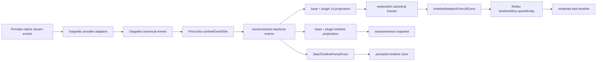
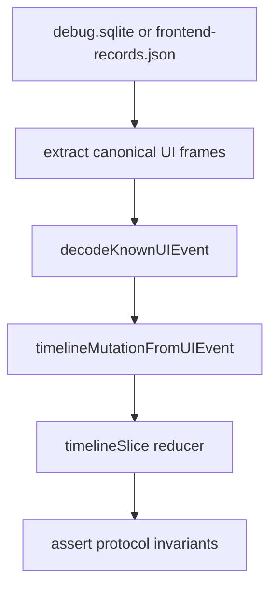

# Chat protocol conformance analysis and implementation guide

## Executive summary

Pinocchio now sits in the middle of a canonical event protocol, but the protocol starts one layer earlier than Pinocchio. Provider-specific stream events are first normalized inside Geppetto, and only then do they become the canonical Geppetto events that Pinocchio consumes:

1. Provider adapters normalize provider-native events from OpenAI Responses, OpenAI-compatible Chat Completions, Claude, and Gemini.
2. Geppetto emits typed canonical events with `events.Correlation`.
3. Pinocchio translates them into `pinocchio.chatapp.v1` protobuf backend events.
4. Sessionstream projects backend events into timeline entities and UI events.
5. The web-chat frontend maps UI events into sparse timeline patches.
6. Redux merges those patches into renderable state.
7. Timeline persistence writes durable snapshots from the event stream.

Recent review fixes were correct, but they were reactive. The same class of defects can recur whenever a terminal event is sparse, a run fails after partial text, a stop arrives before text exists, a tool finish omits input, or a provider sends optional correlation fields such as zero indexes. The systematic fix is not more one-off tests. The systematic fix is a small protocol conformance layer with explicit lifecycle invariants, deterministic table-driven programs, reducer merge-contract tests, and eventually trace replay and fuzz/property checks.

This document is the intern-oriented implementation guide for that conformance layer. It explains the current architecture, identifies the missing contracts, defines invariants, provides pseudocode, names concrete test files, and gives validation commands. The recommended initial implementation is intentionally boring: table-driven tests first, no fuzzing until the deterministic invariant matrix exists.

## Problem statement

The chat protocol is a multi-stage pipeline, not a single function. A bug may be introduced in any one of these stages and only become visible after a browser run:

- Provider-specific stream normalization into Geppetto canonical events.
- Geppetto canonical event emission.
- Pinocchio runtime event sink translation.
- Feature plugin event projection.
- Sessionstream timeline projection.
- Timeline persistence.
- Frontend UI-event-to-entity mutation mapping.
- Redux sparse patch merging.

The recent issues were examples of two broader missing contracts:

1. **Lifecycle contract:** terminal run/tool/text events must leave child entities in a terminal state, but must not manufacture transcript entities when no transcript segment existed.
2. **Patch/merge contract:** sparse terminal/update events must not erase meaningful fields that arrived earlier, such as content, tool name, tool input, or correlation keys.

Without explicit protocol tests, each review comment becomes a local repair. The next provider shape or sparse event can trigger the same class of regression in another stage.

## Scope

### In scope

- Geppetto provider-adapter tests for provider-native event normalization into canonical run/provider-call/text/reasoning/tool events.
- Pinocchio chat runtime tests for canonical run, provider-call, text, reasoning, and tool lifecycles.
- Plugin projection tests for tool and reasoning events.
- Sessionstream timeline snapshot assertions.
- Web-chat event mapper and Redux reducer merge-contract tests.
- Timeline persistence behavior for stop/error after partial text.
- Trace replay design using saved debug/frontend frames.
- File-level implementation guidance and validation commands.

### Out of scope for the first implementation pass

- Changing the Geppetto canonical event vocabulary itself.
- Replacing provider SDK clients or provider API contracts.
- Adding backwards-compatible legacy event aliases.
- Browser E2E automation for every matrix row.
- Fuzz/property testing before deterministic invariants are encoded.
- Visual UI snapshot testing beyond final-state entity invariants.

## Glossary

- **Canonical event:** a Geppetto event such as `EventTextDelta`, `EventToolCallFinished`, or `EventReasoningSegmentFinished` that exposes typed `events.Correlation`.
- **Backend event:** a Pinocchio `sessionstream.Event` with a protobuf payload such as `ChatTextDelta`.
- **UI event:** a projected event sent to the browser over sessionstream/websocket frames.
- **Timeline entity:** a durable projected object such as `ChatMessage`, `ChatToolCall`, or `ChatToolResult`.
- **Sparse patch:** a frontend upsert that intentionally includes only fields that should change.
- **Protocol program:** a deterministic list of synthetic Geppetto events, plus optional runtime return error, used as a conformance test fixture.
- **Terminal event:** a lifecycle-ending event, e.g. `ChatRunFinished`, `ChatRunStopped`, `ChatRunFailed`, `ChatTextSegmentFinished`, or `ChatToolCallFinished`.

## Current-state architecture

### End-to-end flow



The important architectural point is that no single test currently owns this whole contract. Existing tests cover useful cases, but they are distributed across runtime, plugin, persistence, and frontend mapper tests. The conformance layer should connect them through a shared vocabulary of lifecycle cases.

### Source evidence map

| Area | Evidence | Why it matters |
|---|---|---|
| Provider correlation builders | `geppetto/pkg/events/correlation_builders.go:25`, `:79`, `:107`, `:131`, `:153` | Provider adapters must use stable provider-specific correlation builders instead of ad hoc metadata joins. |
| OpenAI Responses normalization | `geppetto/pkg/steps/ai/openai_responses/streaming.go:98`, `:166`, `:266`, `:302`, `:579`, `:733`, `:888` | OpenAI Responses stream events normalize into provider-call, text, reasoning, and tool lifecycles. |
| OpenAI Chat Completions normalization | `geppetto/pkg/steps/ai/openai/engine_openai.go:225`, `:322`, `:351`, `:380`, `:430`, `:437`, `:483` | Chat Completions streams require choice-scoped text/reasoning/tool correlation and accumulated tool arguments. |
| Claude normalization | `geppetto/pkg/steps/ai/claude/content-block-merger.go:187`, `:214`, `:277`, `:296`, `:337`, `:352`, `:370` | Claude message events and content blocks normalize into distinct provider, text, and tool lifecycles. |
| Gemini normalization | `geppetto/pkg/steps/ai/gemini/engine_gemini.go:332`, `:412`, `:425`, `:429`, `:434`, `:475` | Gemini candidate parts normalize into provider-call, text segment, and tool request lifecycles. |
| Geppetto typed correlation | `geppetto/pkg/events/correlation.go:7` | `Correlation` is the identity object that should be preserved through Pinocchio and the frontend. |
| Geppetto text/provider/reasoning events | `geppetto/pkg/events/canonical_events.go:65`, `:112`, `:126`, `:142`, `:157` | These are the canonical input event types Pinocchio must translate. |
| Geppetto tool events | `geppetto/pkg/events/canonical_tool_events.go:3`, `:17`, `:32`, `:47`, `:62`, `:77` | These define the tool lifecycle inputs and distinguish current argument delta from accumulated input. |
| Runtime command entrypoint | `pkg/chatapp/runtime_inference.go:18` | `handleStartInference` publishes the user message, creates an active run, and starts runtime execution. |
| Runtime inference failure path | `pkg/chatapp/runtime_inference.go:63`, `:126`, `:129`, `:141` | Runtime errors after partial output must close the active text segment before run failure; successful runs publish `ChatRunFinished`. |
| Geppetto-to-Pinocchio sink | `pkg/chatapp/runtime_sink.go:30` | `runtimeEventSink.PublishEvent` translates canonical Geppetto events into Pinocchio protobuf events. |
| Active text finalization | `pkg/chatapp/runtime_sink.go:74`, `:82`, `:91` | Error/interrupt paths call `finishActiveTextSegment`, which is the current central lifecycle helper. |
| Text segment ID mapping | `pkg/chatapp/runtime_sink.go:115`, `:128`, `:143` | Text entity IDs are derived from segment correlation/index and the parent assistant message ID. |
| Base UI/timeline projections | `pkg/chatapp/projections.go:12`, `:27` | Base projections forward canonical UI events and delay empty assistant timeline entities. |
| Tool plugin runtime/projection | `pkg/chatapp/plugins/toolcall.go:67`, `:100`, `:177` | Tool events are translated, projected, and merged with sparse-field preservation. |
| Reasoning plugin runtime/projection | `pkg/chatapp/plugins/reasoning.go:52`, `:113`, `:171` | Reasoning uses stable thinking-message IDs and avoids empty timeline entities. |
| Protobuf contract | `proto/pinocchio/chatapp/v1/chat.proto:23`, `:95`, `:116`, `:165`, `:214` | The wire contract contains typed correlation and separate text/tool lifecycle payloads. |
| Frontend patch mapper | `cmd/web-chat/web/src/ws/timelineEvents.ts:20`, `:26`, `:86`, `:253` | UI frames become sparse `TimelineEntity` patches; undefined/empty fields must be omitted. |
| Redux merge behavior | `cmd/web-chat/web/src/store/timelineSlice.ts:59` | `upsertEntity` shallow-merges `props`, so incoming sparse patches define preservation semantics. |
| Timeline persistence | `pkg/ui/timeline_persist.go:28`, `:83`, `:169`, `:202` | Persistence tracks current text IDs and should finish the current segment on interruption. |
| Existing runtime regressions | `pkg/chatapp/chat_test.go:250`, `:290`, `:326` | Current tests already encode error/interrupt/closed-segment behavior and should become part of the matrix. |
| Existing frontend regressions | `cmd/web-chat/web/src/ws/wsManager.test.ts:168`, `:316` | Current tests cover sparse correlation and sparse tool finish preservation. |

## Current behavior, stage by stage

### 1. Provider-specific normalization is the lowest and hardest layer

The protocol starts before Pinocchio sees anything. OpenAI Responses, OpenAI-compatible Chat Completions, Claude, and Gemini each expose a different stream vocabulary. Geppetto provider adapters translate those provider-native objects into the canonical event vocabulary. This layer is the most complex layer because it has to reconcile different provider event taxonomies, late provider IDs, stream deltas, accumulated buffers, content block indexes, tool-call fragments, final usage chunks, and provider stop reasons.

The canonical contract at this boundary is strict:

- Provider envelope events become provider-call lifecycle events. They do not create transcript text.
- Provider text deltas become text segment lifecycle events. They start, append to, and finish actual text segments.
- Provider reasoning deltas become reasoning segment lifecycle events. They do not become assistant text.
- Provider tool-call events become tool lifecycle events. Argument delta events carry both the current fragment and accumulated input.
- Provider terminal events, such as OpenAI response completion or Claude message stop, close the provider call. They do not manufacture text segment finals unless a text-specific provider event has established an actual text segment.
- Every canonical event emitted by a provider adapter carries typed `events.Correlation`.

The provider-specific risks are not identical:

| Provider family | Difficult normalization points | Files to inspect |
|---|---|---|
| OpenAI Responses | Output item identity, response IDs that become known late, reasoning summary deltas, output text done/backfill behavior, function-call argument deltas. | `geppetto/pkg/steps/ai/openai_responses/streaming.go`, `nonstreaming.go` |
| OpenAI-compatible Chat Completions | Choice indexes, compatible-provider reasoning fields, usage-only chunks, EOF/final chunks, streamed tool-call fragments that must accumulate. | `geppetto/pkg/steps/ai/openai/engine_openai.go`, `chat_stream.go` |
| Claude | Message envelope events versus content block events, text deltas, input JSON deltas, content block stop, tool-use stop reasons. | `geppetto/pkg/steps/ai/claude/content-block-merger.go` |
| Gemini | Candidate parts, function call parts, finish reasons, text segment existence, provider metadata, and tool request IDs. | `geppetto/pkg/steps/ai/gemini/engine_gemini.go` |

This provider-adapter layer needs its own conformance tests. Pinocchio tests can prove that canonical Geppetto events are projected correctly, but they cannot prove that a provider adapter emitted the right canonical events in the first place. A bug at this layer propagates cleanly through Pinocchio because every downstream layer may faithfully process the wrong canonical event.

Provider-adapter tests should use provider-native fixtures, not only synthetic canonical Geppetto events. A good fixture is a short provider stream with expected canonical output:

```text
Provider stream:
  Claude MessageStart
  Claude ContentBlockStart(type=text, index=0)
  Claude ContentBlockDelta(text_delta="hello")
  Claude ContentBlockStop(index=0)
  Claude MessageStop(stop_reason=end_turn)

Expected Geppetto events:
  EventProviderCallStarted
  EventTextSegmentStarted(segment_type=text, content_block_index=0)
  EventTextDelta(delta="hello", text="hello")
  EventTextSegmentFinished(text="hello")
  EventProviderCallFinished(stop_reason=end_turn, has_tool_calls=false)
```

The same pattern should be written for OpenAI Responses text/reasoning/tool streams, Chat Completions streamed tool-call fragments, and Gemini text/function-call responses.

### 2. Geppetto canonical events are the protocol input

Geppetto canonical events expose `Correlation() events.Correlation` instead of requiring consumers to inspect debug metadata. Pinocchio should treat this typed correlation as the routing and joining authority.

Relevant API surface:

```go
// geppetto/pkg/events/correlation.go
type Correlation struct {
    SessionID            string
    RunID                string
    InferenceID          string
    ProviderCallID       string
    ProviderCallIndex    int32
    Provider             string
    Model                string
    ResponseID           string
    ItemID               string
    OutputIndex          *int32
    SummaryIndex         *int32
    ChoiceIndex          *int32
    ContentBlockIndex    *int32
    SegmentID            string
    SegmentIndex         int32
    SegmentType          string
    StreamKind           string
    ToolCallID           string
    ToolCallIndex        *int32
    CorrelationKey       string
    ParentCorrelationKey string
}
```

Intern note: optional indexes are pointers in Go because zero is meaningful. A provider can legitimately use index `0`; tests must assert that zero survives decoding and patch generation.

### 3. Runtime inference creates one assistant run and connects the sink

`pkg/chatapp/runtime_inference.go:63` publishes `ChatRunStarted`, builds a `runtimeEventSink`, wraps it if needed, starts Geppetto inference, waits for completion, and then publishes either `ChatRunFinished` or `ChatRunFailed`.

Important current behavior:

- `EventUserMessageAccepted` is published before the active run begins (`runtime_inference.go:31-42`).
- Runtime errors after `handle.Wait()` call `sink.finishActiveTextSegment("failed", "error", "")` before `ChatRunFailed` if the sink has not already received a terminal event (`runtime_inference.go:126-134`).
- Successful runtime completion publishes `ChatRunFinished` only if the sink is not already terminal (`runtime_inference.go:137-141`).

This stage needs conformance tests because it is where run-level terminal events and child text state interact.

### 4. `runtimeEventSink` translates canonical events and tracks active text

`pkg/chatapp/runtime_sink.go:30` is the primary bridge from Geppetto canonical events to Pinocchio backend events.

Current state variables include:

```go
type runtimeEventSink struct {
    lastText            string
    lastTextMessageID   string
    lastTextCorrelation gepevents.Correlation
    terminal            bool
    textSegment         int32
    textActive          bool
}
```

Important current behavior:

- `EventTextSegmentStarted` marks text active and publishes `ChatTextSegmentStarted` (`runtime_sink.go:41-49`).
- `EventTextDelta` updates `lastText`, marks text active, and publishes `ChatTextDelta` (`runtime_sink.go:50-59`).
- `EventTextSegmentFinished` marks text inactive and publishes `ChatTextSegmentFinished` (`runtime_sink.go:60-69`).
- `EventError` marks the run terminal, finishes active text as `failed`, then publishes `ChatRunFailed` (`runtime_sink.go:70-77`).
- `EventInterrupt` marks the run terminal, finishes active text as `stopped`, then publishes `ChatRunStopped` (`runtime_sink.go:78-85`).
- `finishActiveTextSegment` only emits a synthetic terminal text event if `textActive == true` and a text message ID exists (`runtime_sink.go:91-105`).

This is a good start, but it is still implicit state. The conformance suite should make the expected state transitions explicit.

### 5. Base projections intentionally avoid empty assistant entities

`pkg/chatapp/projections.go:27` projects backend events into sessionstream timeline entities. The projection delays assistant entity creation until there is content or an existing entity:

- `ChatTextSegmentStarted` returns no entity for an empty, unseen segment (`projections.go:44-65`).
- `ChatTextDelta` returns no entity if content is empty (`projections.go:66-87`).
- `ChatTextSegmentFinished` uses current entity content as fallback and avoids creating empty unseen entities (`projections.go:88-110`).

The conformance suite should preserve this behavior. A stopped run with no assistant text should not create an empty assistant entity just to satisfy a terminal run event.

### 6. Tool projection already uses a sparse merge model

`pkg/chatapp/plugins/toolcall.go:100` projects tool backend events. It reads the current timeline entity and calls `mergeToolCallFields` (`toolcall.go:107`, `:177`). The merge helper only updates non-empty `MessageID`, `ToolCallID`, `ToolName`, `Input`, `Status`, and non-nil correlation.

This is the backend equivalent of the frontend sparse-patch contract. A sparse `ChatToolCallFinished` should mark `Status` and `Executing`, but must not clear `ToolName` or `Input` learned earlier.

### 7. Reasoning projection uses separate thinking entities

`pkg/chatapp/plugins/reasoning.go:52` translates canonical Geppetto reasoning events into Pinocchio reasoning events. The timeline projection uses `reasoningEntityFromFields` (`reasoning.go:171`) and keeps reasoning entities separate from assistant text:

- Message ID: parent assistant message ID plus `:thinking:<segment>`.
- Role: `thinking`.
- Segment type: `reasoning` when present.
- Empty, unseen reasoning starts do not create a timeline entity.

The conformance suite should assert reasoning does not pollute assistant text state and that terminal reasoning events preserve previous content.

### 8. The protobuf contract encodes the lifecycle vocabulary

`proto/pinocchio/chatapp/v1/chat.proto` is the browser/backend contract. The important separation is visible in the schema:

- `CorrelationInfo` at `chat.proto:23` mirrors Geppetto correlation.
- Run lifecycle: `ChatRunStarted`, `ChatRunFinished`, `ChatRunStopped`, `ChatRunFailed`.
- Provider-call lifecycle: `ChatProviderCallStarted`, `ChatProviderCallMetadataUpdated`, `ChatProviderCallFinished`.
- Text lifecycle: `ChatTextSegmentStarted`, `ChatTextDelta`, `ChatTextSegmentFinished`.
- Reasoning lifecycle: `ChatReasoningSegmentStarted`, `ChatReasoningDelta`, `ChatReasoningSegmentFinished`.
- Tool lifecycle: `ChatToolCallStarted`, `ChatToolCallArgumentsDelta`, `ChatToolCallRequested`, `ChatToolExecutionStarted`, `ChatToolResultReady`, `ChatToolCallFinished`.

Intern note: proto3 scalar strings default to empty strings. The frontend must not interpret an omitted field decoded as `""` as an instruction to clear previous state unless the protocol explicitly defines clearing semantics.

### 9. Frontend mapping creates sparse patches

`cmd/web-chat/web/src/ws/timelineEvents.ts:86` maps typed UI events to timeline mutations. The important helpers are:

- `definedProps` (`timelineEvents.ts:20`) omits `undefined` and empty string fields.
- `correlationProps` (`timelineEvents.ts:26`) maps typed correlation fields into render props while preserving optional zero values.
- Tool events (`timelineEvents.ts:253-279`) only include `input` and `inputRaw` when the event actually carries non-empty input.

The Redux reducer then shallow-merges entity props in `timelineSlice.upsertEntity` (`timelineSlice.ts:59-98`). Therefore frontend correctness depends on both sides:

1. The mapper must omit absent data.
2. The reducer must merge sparse data without deleting prior props.

## Gap analysis

### Gap 0: provider-specific normalization is not covered as a first-class protocol layer

The first draft of this guide started with canonical Geppetto events. That misses the hardest layer. Provider adapters translate OpenAI Responses, OpenAI-compatible Chat Completions, Claude, and Gemini streams into canonical Geppetto events. Many previous defects originated there: duplicate final text, provider terminal events treated as transcript events, missing observability hooks, unstable correlation, and streamed tool-call arguments that exposed only the latest fragment instead of accumulated input.

Pinocchio runtime tests cannot detect all of these defects because they consume already-normalized Geppetto events. If the provider adapter emits the wrong canonical event, downstream layers may process it correctly and still produce the wrong user-visible behavior. The conformance strategy therefore needs provider-native fixture tests before the Pinocchio matrix.

### Gap 1: lifecycle invariants are implicit

The code has behaviors such as `textActive` and `terminal`, but the test suite does not yet present a single lifecycle matrix that answers questions like:

- What happens when a run fails before any text segment exists?
- What happens when a run fails after a text delta but before `TextSegmentFinished`?
- What happens when a run fails after a text segment is already finished?
- What happens when a stop arrives after a partial text segment?
- What happens when tool lifecycle events interleave with text segments?

Some individual tests exist, but they are not organized as a conformance matrix.

### Gap 2: backend and frontend merge contracts are tested separately

Backend tool projection has `mergeToolCallFields`. Frontend mapping has `definedProps` and Redux merge behavior. These are the same conceptual contract, but they are not tested as one protocol rule.

### Gap 3: optional zero correlation values are easy to regress

Correlation indexes such as `outputIndex: 0` and `toolCallIndex: 0` are valid. A generic truthiness check in TypeScript would drop them. Existing tests cover one reasoning case, but the conformance suite should include zero values for text, reasoning, and tools.

### Gap 4: trace replay is not yet part of CI/local validation

The browser/debug SQLite traces contain realistic event streams that table tests may miss. They should become replay fixtures after the deterministic matrix is in place.

## Protocol invariants

The following invariants are the contract. Tests should name these invariants explicitly in helper assertions and failure messages.

### I0. Provider-native normalization boundary

For each provider adapter:

- Provider envelope events map only to provider-call lifecycle events.
- Provider terminal events do not manufacture text, reasoning, or tool transcript events.
- Provider text deltas map to text segment lifecycle events and only finish a text segment that exists.
- Provider reasoning deltas map to reasoning segment lifecycle events, not assistant text.
- Provider tool-call argument fragments map to tool lifecycle events with `Delta` as the current fragment and `Arguments` as accumulated input.
- Provider-specific correlation builders are used consistently, and every emitted canonical event carries typed `events.Correlation`.
- Late provider IDs, output indexes, content block indexes, choice indexes, and tool call IDs remain stable enough to join provider rows to Geppetto events and downstream frontend entities.

### I1. Run lifecycle terminality

For a single assistant run:

- A run may publish at most one terminal run event:
  - `ChatRunFinished`
  - `ChatRunStopped`
  - `ChatRunFailed`
- After a terminal run event, no visible text or tool entity should remain `streaming=true` or `executing=true` unless a later new run starts.
- A terminal run event must not manufacture an assistant text entity if no text segment ever started or produced content.
- A run terminal event must not rewrite already closed text segments.

### I2. Text segment lifecycle

For each text segment identity:

- `ChatTextSegmentStarted` may create protocol state but should not create an empty visible assistant entity.
- `ChatTextDelta` carries the current delta and cumulative visible text.
- `ChatTextSegmentFinished` closes the segment with `streaming=false` and `final=true`.
- If the runtime stops or fails while a text segment is active, Pinocchio must emit a terminal `ChatTextSegmentFinished` for that active segment with status `stopped` or `failed`.
- If the text segment is already closed, a later run error must not change it from `finished` to `failed`.

### I3. Reasoning segment lifecycle

For each reasoning segment identity:

- Reasoning entities use role `thinking`, not `assistant`.
- Reasoning segment IDs must be stable for `started`, `delta`, and `finished` events.
- Empty, unseen reasoning segment starts or finishes should not create visible empty entities.
- A finished reasoning segment should preserve prior content if the terminal event is sparse.

### I4. Tool lifecycle and sparse terminal events

For each tool call identity:

- Argument deltas may arrive before a full requested event.
- `ChatToolCallArgumentsDelta.input` represents accumulated input so far.
- `ChatToolCallRequested` or `ChatToolExecutionStarted` may provide tool name and full input.
- `ChatToolCallFinished` may be sparse. It must mark the tool done and non-executing, but must not clear known name/input/correlation fields.
- `ChatToolResultReady` creates a separate result entity and should preserve correlation to the same tool call.

### I5. Correlation preservation

For every lifecycle entity:

- Preserve typed `CorrelationInfo` when present.
- Preserve meaningful string fields such as `provider`, `model`, `responseId`, `correlationKey`, `parentCorrelationKey`, `segmentId`, and `toolCallId`.
- Preserve optional zero indexes such as `outputIndex=0`, `choiceIndex=0`, and `toolCallIndex=0`.
- Omit missing/empty correlation props from sparse patches so older non-empty props are not erased by Redux merge.

### I6. Backend/frontend projection equivalence

For the same logical event program:

- The backend sessionstream timeline snapshot and the frontend Redux state should agree on final visible entities, statuses, content, and correlation keys.
- Differences in shape are allowed only where explicitly intentional, e.g. backend kind `ChatMessage` vs frontend kind `message`.

### I7. Persistence uses the current segment identity

For persistence:

- Partial text should persist under the canonical current text segment ID.
- Interrupt/error finalization should update the same current text segment ID.
- Empty stop/error events should not create a new root assistant message when no segment content exists.

## Proposed solution

### Overview

Add a conformance test layer in five pieces:

1. **Geppetto provider-normalization matrix** in provider adapter packages.
2. **Go runtime protocol matrix** in `pkg/chatapp`.
3. **Go plugin projection matrix** in `pkg/chatapp/plugins`.
4. **TypeScript frontend patch/reducer matrix** in `cmd/web-chat/web/src/ws` and optionally `src/store`.
5. **Trace replay harness** that can ingest saved provider/debug/UI frames after the deterministic matrix exists.

The first version should not change production code unless tests expose a true bug. The goal is to encode the contract before adding more edge-case patches.

### Recommended file layout

```text
geppetto/
  pkg/steps/ai/openai_responses/
    provider_protocol_conformance_test.go    # provider-native Responses stream fixtures
  pkg/steps/ai/openai/
    provider_protocol_conformance_test.go    # Chat Completions stream fixtures
  pkg/steps/ai/claude/
    provider_protocol_conformance_test.go    # Claude message/content-block fixtures
  pkg/steps/ai/gemini/
    provider_protocol_conformance_test.go    # Gemini candidate/function-call fixtures

pinocchio/
  pkg/chatapp/
    chat_protocol_conformance_test.go        # runtime + sessionstream snapshot matrix
    protocol_assertions_test.go              # optional shared assertion helpers
  pkg/chatapp/plugins/
    toolcall_protocol_conformance_test.go    # tool sparse merge matrix
    reasoning_protocol_conformance_test.go   # reasoning stable identity matrix
  pkg/ui/
    timeline_persist_protocol_test.go        # persistence stop/error identity matrix
  cmd/web-chat/web/src/ws/
    protocolConformance.test.ts              # UI frame -> mutation -> reducer matrix
  cmd/web-chat/web/src/store/
    timelineSlice.test.ts                    # optional reducer-only merge tests
  ttmp/2026/05/08/PINO-PROTOCOL-CONFORMANCE--.../
    scripts/
      extract_ui_frames_from_debug_sqlite.py # later trace replay helper
```

Keep the first implementation in test files only. If the assertion helpers become useful outside tests, then promote them later.

## Geppetto provider-normalization conformance design

Provider normalization deserves its own test layer because it is the first place where protocol semantics can be lost. The tests should feed provider-native stream fixtures into the provider adapter and assert the canonical Geppetto events produced by that adapter. These tests should run before any Pinocchio runtime projection test.

### Provider fixture API sketch

Use a small test fixture shape per provider. The provider-native event type differs across packages, so the generic idea matters more than a shared concrete type.

```go
type ProviderFixture[NativeEvent any] struct {
    Name   string
    Events []NativeEvent
    Want   []CanonicalExpectation
}

type CanonicalExpectation struct {
    Type             events.EventType
    SegmentType      string
    StreamKind       string
    Provider         string
    ResponseID       string
    ItemID           string
    ContentBlockIndex *int32
    ChoiceIndex      *int32
    ToolCallID       string
    Delta            string
    Text             string
    Arguments        string
    StopReason       string
}
```

The expectation should focus on canonical semantics, not every provider field. A test should fail when the adapter emits a provider-call terminal as a text terminal, drops a correlation key, loses a zero index, or reports a tool argument fragment as the full accumulated input.

### Provider fixture matrix

| Provider | Fixture | Expected canonical behavior |
|---|---|---|
| OpenAI Responses | response created, text output item start, text delta, text done, response completed | provider start, text start/delta/finish, provider finish; response completion does not create extra text. |
| OpenAI Responses | reasoning summary start/delta/done, response completed | reasoning start/delta/finish; no assistant text entity. |
| OpenAI Responses | function call item, argument deltas, argument done, response completed | tool started, argument deltas with accumulated arguments, tool requested, provider finish with `has_tool_calls=true`. |
| Chat Completions | content delta chunks, final finish reason | text start/delta/finish and provider finish; usage-only chunks do not create text. |
| Chat Completions | streamed tool call args `{"q"` then `:"gold"}` | first tool args event has `Delta={"q"`, `Arguments={"q"`; second has current fragment as `Delta` and accumulated JSON as `Arguments`. |
| Chat Completions | reasoning delta from compatible provider | reasoning segment events, not text segment events. |
| Claude | message start, text content block start/delta/stop, message stop | provider start, text start/delta/finish, provider finish. |
| Claude | tool-use content block start, input_json deltas, content block stop, message stop with `tool_use` | tool started, accumulated argument deltas, tool requested, provider metadata/finish with tool-use stop reason. |
| Claude | message stop with no text block | provider finish only; no manufactured text finish. |
| Gemini | text part and finish reason | provider start, text start/delta/finish, provider finish. |
| Gemini | function call part and finish reason | tool started/requested, provider finish with tool calls; no fake text segment. |

### Provider-level assertions

Add shared assertion helpers in Geppetto tests where possible:

```go
func AssertCanonicalEventsCarryCorrelation(t *testing.T, got []events.Event)
func AssertProviderTerminalDoesNotManufactureText(t *testing.T, got []events.Event)
func AssertToolArgumentsAccumulate(t *testing.T, got []events.Event, toolID string, deltas []string)
func AssertNoRoutingThroughMetadataExtra(t *testing.T, got []events.Event)
func AssertSegmentFinishRequiresSegmentStart(t *testing.T, got []events.Event, segmentType string)
```

The most important helper is `AssertSegmentFinishRequiresSegmentStart`. It should scan canonical events by `Correlation.SegmentID` or `Correlation.CorrelationKey` and fail if a text or reasoning finish appears for a segment that had no start or delta. Provider final events should close provider calls, not invent transcript lifecycle.

### Provider validation commands

```bash
cd /home/manuel/workspaces/2026-05-02/use-sessionstream-coinvault/geppetto
go test ./pkg/steps/ai/openai_responses ./pkg/steps/ai/openai ./pkg/steps/ai/claude ./pkg/steps/ai/gemini -run 'ProviderProtocol|Canonical|ToolArguments' -count=1
go test ./pkg/steps/ai/openai_responses ./pkg/steps/ai/openai ./pkg/steps/ai/claude ./pkg/steps/ai/gemini -count=1
```

These tests should be committed in Geppetto, while Pinocchio runtime/frontend tests live in Pinocchio. The ticket can track both because the protocol spans both repositories.

## Go runtime conformance design

### Protocol program API sketch

Create a test-only DSL for deterministic runtime event programs.

```go
type ProtocolProgram struct {
    Name       string
    Prompt     string
    Events     []gepevents.Event
    ReturnErr  error
    Want       ProtocolExpectations
}

type ProtocolExpectations struct {
    RunStatus       string
    AbsentEntityIDs []string
    Messages        map[string]MessageExpectation
    ToolCalls       map[string]ToolExpectation
    ToolResults     map[string]ToolResultExpectation
}

type MessageExpectation struct {
    Role       string
    Content    string
    Status     string
    Streaming  bool
    Final      bool
    Segment    int32
    SegmentType string
}

type ToolExpectation struct {
    ToolName  string
    InputRaw  string
    Status    string
    Executing bool
    Done      bool
}
```

The fake runtime engine is simple:

```go
type protocolProgramEngine struct {
    events []gepevents.Event
    err    error
}

func (e protocolProgramEngine) RunInference(ctx context.Context, t *turns.Turn) (*turns.Turn, error) {
    for _, ev := range e.events {
        gepevents.PublishEventToContext(ctx, ev)
    }
    return t, e.err
}
```

The runner uses the real `NewEngine`, `sessionstream.Hub`, `CommandStartInference`, and projection path. This keeps the test close to actual behavior.

```go
func runProtocolProgram(t *testing.T, p ProtocolProgram) sessionstream.Snapshot {
    t.Helper()

    engine := NewEngine(WithChunkDelay(time.Millisecond))
    hub := newTestHub(t, engine)
    engine.setPendingRequest("request-"+p.Name, PromptRequest{
        Prompt: p.Prompt,
        Runtime: &infruntime.ComposedRuntime{
            Engine: protocolProgramEngine{events: p.Events, err: p.ReturnErr},
        },
    })

    err := hub.Submit(context.Background(), "chat-"+p.Name, CommandStartInference,
        &chatappv1.StartInferenceCommand{RequestId: "request-" + p.Name})
    require.NoError(t, err)
    require.NoError(t, engine.WaitIdle(context.Background(), "chat-"+p.Name))

    snap, err := hub.Snapshot(context.Background(), "chat-"+p.Name)
    require.NoError(t, err)
    return snap
}
```

### Runtime matrix

Implement a single table test, for example `TestChatProtocolConformance_RuntimeLifecycleMatrix`.

| Case | Event program | Expected invariant coverage |
|---|---|---|
| `no-text-finished` | no text events, runtime returns nil | run finishes; only user entity exists; no empty assistant entity. |
| `no-text-failed` | no text events, runtime returns error | run fails; no assistant entity is manufactured. |
| `no-text-interrupt` | `EventInterrupt` before text | run stopped; no assistant entity is manufactured. |
| `started-no-delta-interrupt` | text started, then interrupt with empty text | no empty assistant entity unless a prior visible delta existed. |
| `delta-then-finished` | text started, delta, text finished | assistant segment is `finished`, `streaming=false`, `final=true`. |
| `delta-then-runtime-error` | text started, delta, runtime returns error | active text segment is closed as `failed`. |
| `delta-then-event-error` | text started, delta, `EventError` | active text segment is closed as `failed`; run failed. |
| `delta-then-interrupt` | text started, delta, `EventInterrupt` | active text segment is closed as `stopped`; run stopped. |
| `finished-then-error` | complete text segment, runtime returns error | completed segment remains `finished`, not rewritten as `failed`. |
| `text-tool-text` | text segment, tool requested/result/finished, second text segment | two distinct text segments plus tool result; no ID collision. |
| `two-text-segments-second-active-error` | first finished, second delta, runtime error | first remains `finished`; second becomes `failed`. |
| `provider-finished-no-text` | provider call start/finish only | provider events do not create transcript text. |

The existing tests already cover several rows:

- `TestRuntimeErrorAfterPartialStopsActiveTextSegment` (`pkg/chatapp/chat_test.go:250`).
- `TestRuntimeInterruptAfterPartialStopsActiveTextSegment` (`pkg/chatapp/chat_test.go:290`).
- `TestRuntimeErrorAfterClosedTextSegmentDoesNotDuplicateSegmentContent` (`pkg/chatapp/chat_test.go:326`).
- `TestRuntimeInterleavedTextToolTextUsesDistinctTextSegments` (`pkg/chatapp/chat_test.go:215`).

The conformance work can either consolidate those into the matrix or keep them as named regression tests and add the missing rows.

### Runtime assertion helpers

Write helpers that fail with invariant names.

```go
func assertNoActiveEntitiesAfterTerminal(t *testing.T, snap sessionstream.Snapshot) {
    for _, entity := range snap.Entities {
        switch payload := entity.Payload.(type) {
        case *chatappv1.ChatMessageEntity:
            require.Falsef(t, payload.GetStreaming(),
                "I1 violation: message %s is still streaming after terminal run", entity.Id)
        case *chatappv1.ToolCallEntity:
            require.Falsef(t, payload.GetExecuting(),
                "I1/I4 violation: tool %s is still executing after terminal run", entity.Id)
        }
    }
}

func assertNoPhantomAssistant(t *testing.T, snap sessionstream.Snapshot, rootMessageID string) {
    _, ok := findMessage(snap, rootMessageID)
    require.Falsef(t, ok, "I1/I2 violation: root assistant entity was manufactured")
}
```

Intern note: keep invariant labels (`I1`, `I2`, etc.) in failure messages. That makes CI failures teach the protocol, not just report a mismatch.

## Plugin projection conformance design

### Tool plugin matrix

Place in `pkg/chatapp/plugins/toolcall_protocol_conformance_test.go`.

Key cases:

| Case | Backend events | Expected projection |
|---|---|---|
| `args-delta-accumulates-input` | `ChatToolCallArgumentsDelta` with partial input, then requested | tool entity input advances, final requested input wins. |
| `finish-sparse-preserves-input` | execution started with input, then finish with only ID/status | tool entity still has input/name and `executing=false`. |
| `result-preserves-correlation` | result ready with correlation | result entity has `toolCallId`, `toolName`, `result`, correlation key. |
| `zero-tool-index-preserved` | correlation `toolCallIndex=0` | projected entity preserves optional zero index. |

Backend projection pseudocode:

```go
func TestToolProtocolConformanceSparseFinishPreservesInput(t *testing.T) {
    plugin := plugins.NewToolCallPlugin()
    view := staticTimelineViewWith(
        plugins.TimelineEntityToolCall,
        "call_1",
        &chatappv1.ToolCallEntity{
            ToolCallId: "call_1",
            ToolName: "search",
            Input: `{"query":"gold"}`,
            Executing: true,
            Status: "executing",
        },
    )

    entities, handled, err := plugin.ProjectTimeline(ctx,
        sessionstream.Event{Name: chatapp.EventChatToolCallFinished, Payload: &chatappv1.ChatToolCallFinished{
            ToolCallId: "call_1",
            Status: "completed",
        }}, nil, view)

    require.NoError(t, err)
    require.True(t, handled)
    got := entities[0].Payload.(*chatappv1.ToolCallEntity)
    require.Equal(t, "search", got.GetToolName())
    require.Equal(t, `{"query":"gold"}`, got.GetInput())
    require.False(t, got.GetExecuting())
    require.Equal(t, "completed", got.GetStatus())
}
```

### Reasoning plugin matrix

Place in `pkg/chatapp/plugins/reasoning_protocol_conformance_test.go`.

Key cases:

| Case | Backend events | Expected projection |
|---|---|---|
| `stable-id-by-segment-index` | start/delta/finish for segment 2 | message ID remains `<parent>:thinking:2`. |
| `empty-start-no-visible-entity` | start only, no existing entity | no timeline entity. |
| `finish-sparse-preserves-content` | delta creates content, finish has empty content | final entity keeps existing content and becomes not streaming. |
| `summary-source-from-correlation` | summary index present | source is `summary`, not generic thinking. |
| `zero-index-preserved` | `summaryIndex=0` or `outputIndex=0` | optional zero value survives. |

## Frontend conformance design

### Why frontend tests need reducer execution

Testing only `timelineMutationFromUIEvent` is useful, but the contract is actually `frame -> mutation -> reducer merge -> final state`. A sparse patch is only correct if Redux preserves previous props.

Add a helper in `cmd/web-chat/web/src/ws/protocolConformance.test.ts`:

```ts
import { configureStore } from '@reduxjs/toolkit';
import { timelineSlice } from '../store/timelineSlice';
import { timelineMutationFromUIEvent } from './timelineEvents';

function applyFrames(frames: CanonicalFrame[]) {
  const store = configureStore({ reducer: { timeline: timelineSlice.reducer } });
  for (const frame of frames) {
    const mutation = timelineMutationFromUIEvent(frame);
    if (mutation?.upsert) {
      store.dispatch(timelineSlice.actions.upsertEntity(mutation.upsert));
    }
    if (mutation?.deleteId) {
      store.dispatch(timelineSlice.actions.deleteEntity(mutation.deleteId));
    }
  }
  return store.getState().timeline;
}
```

### Frontend matrix

| Case | Frames | Expected final state |
|---|---|---|
| `tool-sparse-finish-preserves-input` | execution started with input, finish with only ID/status | input/name/correlation preserved; done true; executing false. |
| `tool-result-linked-by-correlation` | execution started, result ready | result entity has same tool correlation key. |
| `correlation-sparse-terminal-preserves-provider` | delta with provider fields, finish with only segment index | provider/response/correlation key preserved. |
| `optional-zero-indexes-preserved` | reasoning/tool event with index 0 | props include `0`, not omitted. |
| `empty-finished-text-does-not-clear-content` | text delta with content, finished event with no content | final content remains previous content after reducer merge. |
| `empty-finished-reasoning-does-not-create-entity` | reasoning finished with no content and no prior entity | no entity. |

Current tests cover two important rows:

- Sparse correlation props are omitted (`wsManager.test.ts:168`).
- Sparse tool finish does not include input fields that would clear previous input (`wsManager.test.ts:316`).

The conformance suite should add reducer-backed versions of those cases.

### Frontend tool sparse finish example

```ts
it('I4: sparse tool finish preserves earlier tool input after reducer merge', () => {
  const state = applyFrames([
    {
      name: 'ChatToolExecutionStarted',
      payload: {
        messageId: 'chat-msg-1',
        toolCallId: 'call_1',
        toolName: 'search',
        input: '{"query":"gold"}',
        executing: true,
        status: 'executing',
        correlation: { correlationKey: 'tool:call_1', toolCallIndex: 0 },
      },
    },
    {
      name: 'ChatToolCallFinished',
      payload: {
        messageId: 'chat-msg-1',
        toolCallId: 'call_1',
        status: 'completed',
      },
    },
  ]);

  expect(state.byId.call_1.props.name).toBe('search');
  expect(state.byId.call_1.props.input).toEqual({ query: 'gold' });
  expect(state.byId.call_1.props.inputRaw).toBe('{"query":"gold"}');
  expect(state.byId.call_1.props.done).toBe(true);
  expect(state.byId.call_1.props.executing).toBe(false);
  expect(state.byId.call_1.props.toolCallIndex).toBe(0);
});
```

## Timeline persistence conformance design

Persistence should be tested separately because it consumes Geppetto event JSON, not Pinocchio protobuf UI events. The key file is `pkg/ui/timeline_persist.go`.

Add or extend tests in `pkg/ui/timeline_persist_protocol_test.go`:

| Case | Geppetto event stream | Expected stored entity |
|---|---|---|
| `interrupt-finishes-current-text-id` | text delta, interrupt with empty text | same text ID stored with `streaming=false`. |
| `error-finishes-current-text-id` | text delta, error | same text ID stored with `streaming=false` and prior content. |
| `interrupt-before-text-no-root-assistant` | interrupt only | no assistant entity stored. |
| `finished-then-error-not-rewritten` | finished text, later error | finished content/status remains stable. |

The existing code tracks `currentTextID` (`timeline_persist.go:83`) and uses it for interrupts (`timeline_persist.go:202-220`). The conformance test should make that identity rule explicit.

## Trace replay design

Trace replay should come after the deterministic matrix. It is valuable because saved traces include realistic provider quirks, but it is less useful when invariants are not yet named.

### Input sources

Use one of these sources:

1. `frontend-records.json` from browser validation runs.
2. Debug SQLite tables containing UI frames or parsed frontend frames.
3. A small hand-curated JSON fixture checked into a testdata directory.

### Replay pipeline



### Minimal replay fixture format

```json
{
  "name": "tool-use-gpt-5-nano-20260508",
  "source": "browser-run path or sqlite digest",
  "frames": [
    { "name": "ChatTextDelta", "payload": { "messageId": "..." } },
    { "name": "ChatToolExecutionStarted", "payload": { "toolCallId": "..." } }
  ],
  "expect": {
    "noStreamingAfterTerminal": true,
    "toolCalls": {
      "call_1": { "done": true, "preserveInput": true }
    }
  }
}
```

### Extraction helper sketch

```python
#!/usr/bin/env python3
import json
import sqlite3
import sys

conn = sqlite3.connect(sys.argv[1])
conn.row_factory = sqlite3.Row
rows = conn.execute("""
  select event_name, payload_json
  from frontend_parsed_frames
  where event_name like 'Chat%'
  order by rowid
""").fetchall()
frames = [
    {"name": row["event_name"], "payload": json.loads(row["payload_json"])}
    for row in rows
]
json.dump({"frames": frames}, sys.stdout, indent=2)
```

Keep this script in the ticket first. Promote it only when the fixture format stabilizes.

## Implementation plan

### Phase 0: Land this ticket and guide

- Keep the ticket documentation under `pinocchio/ttmp/.../PINO-PROTOCOL-CONFORMANCE--...`.
- Relate the source files that define the protocol.
- Upload the guide to reMarkable for review.

Exit criteria:

- `docmgr doctor --root pinocchio/ttmp --ticket PINO-PROTOCOL-CONFORMANCE --stale-after 30` passes.
- reMarkable upload succeeds.

### Phase 1: Add Geppetto provider-normalization matrices

Files:

- `geppetto/pkg/steps/ai/openai_responses/provider_protocol_conformance_test.go`
- `geppetto/pkg/steps/ai/openai/provider_protocol_conformance_test.go`
- `geppetto/pkg/steps/ai/claude/provider_protocol_conformance_test.go`
- `geppetto/pkg/steps/ai/gemini/provider_protocol_conformance_test.go`

Steps:

1. Add provider-native stream fixtures for text, reasoning, tool, and terminal-only cases.
2. Assert canonical Geppetto event sequences and typed correlation fields.
3. Assert provider terminal events do not manufacture text segments.
4. Assert tool-call argument deltas expose current `Delta` and accumulated `Arguments`.
5. Assert provider-specific correlation builders preserve response/item/choice/content-block/tool identities.

Validation:

```bash
cd geppetto
go test ./pkg/steps/ai/openai_responses ./pkg/steps/ai/openai ./pkg/steps/ai/claude ./pkg/steps/ai/gemini -run 'ProviderProtocol|Canonical|ToolArguments' -count=1
go test ./pkg/steps/ai/openai_responses ./pkg/steps/ai/openai ./pkg/steps/ai/claude ./pkg/steps/ai/gemini -count=1
```

### Phase 2: Add Go runtime matrix

Files:

- `pkg/chatapp/chat_protocol_conformance_test.go`
- optional helper file `pkg/chatapp/protocol_assertions_test.go`

Steps:

1. Add the `ProtocolProgram` test-only DSL.
2. Add event constructors for text, provider, tool, and interrupt/error events.
3. Add the runtime matrix rows listed above.
4. Reuse or migrate existing regression tests where it reduces duplication.
5. Add invariant assertion helpers with `I1`, `I2`, etc. in failure messages.

Validation:

```bash
cd pinocchio
go test ./pkg/chatapp -run 'TestChatProtocolConformance|TestRuntime' -count=1
go test ./pkg/chatapp -count=1
```

### Phase 3: Add plugin projection matrices

Files:

- `pkg/chatapp/plugins/toolcall_protocol_conformance_test.go`
- `pkg/chatapp/plugins/reasoning_protocol_conformance_test.go`

Steps:

1. Build static timeline views with existing entities.
2. Feed sparse terminal events into `ProjectTimeline`.
3. Assert previous non-empty fields survive.
4. Assert optional zero correlation indexes survive.

Validation:

```bash
cd pinocchio
go test ./pkg/chatapp/plugins -count=1
```

### Phase 4: Add frontend reducer-backed matrix

Files:

- `cmd/web-chat/web/src/ws/protocolConformance.test.ts`
- optionally `cmd/web-chat/web/src/store/timelineSlice.test.ts`

Steps:

1. Add `applyFrames` helper that dispatches real reducer actions.
2. Add sparse tool finish preservation test.
3. Add sparse text/reasoning terminal preservation tests.
4. Add optional zero correlation tests for text, reasoning, and tools.
5. Keep existing `wsManager.test.ts` tests unless the new file fully supersedes them.

Validation:

```bash
cd pinocchio/cmd/web-chat/web
npx vitest run src/ws/wsManager.test.ts src/ws/protocolConformance.test.ts
npm run typecheck
npm run lint
```

### Phase 5: Add persistence matrix

Files:

- `pkg/ui/timeline_persist_protocol_test.go`

Steps:

1. Use the existing fake/in-memory timeline store pattern from current persistence tests.
2. Serialize Geppetto events to JSON, feed them to `StepTimelinePersistFuncWithVersion`.
3. Assert stored entity IDs and props.
4. Cover interrupt/error before, during, and after text segments.

Validation:

```bash
cd pinocchio
go test ./pkg/ui -count=1
```

### Phase 6: Add trace replay fixtures

Files:

- `cmd/web-chat/web/src/ws/traceReplay.test.ts` or a Node-side fixture test.
- `cmd/web-chat/web/src/ws/testdata/*.json` for curated small traces.
- ticket script first: `ttmp/.../scripts/extract_ui_frames_from_debug_sqlite.py`.

Steps:

1. Extract a small UI-frame fixture from a known good browser run.
2. Remove sensitive prompt/provider payloads if necessary.
3. Replay through `decodeKnownUIEvent`, `timelineMutationFromUIEvent`, and reducer.
4. Assert final invariants.

Validation:

```bash
cd pinocchio/cmd/web-chat/web
npx vitest run src/ws/traceReplay.test.ts
```

### Phase 7: Add fuzz/property tests only after deterministic coverage

Potential targets:

- Go fuzz target over bounded semantic event programs.
- TypeScript property tests with `fast-check` or a small custom generator.

Do not start here. Fuzzing without named invariants tends to produce hard-to-debug failures and encourages shrinking around implementation details rather than protocol semantics.

## Review checklist for interns

Before opening a PR, answer these questions in the PR description:

1. Which invariants (`I0`-`I7`) does this PR add or change?
2. Which provider-normalization and lifecycle matrix rows are covered?
3. If provider adapter code changed, which provider-native fixtures prove the normalized Geppetto events are correct?
4. Does any test rely on `metadata.Extra` for routing or joining? It should not.
4. Do sparse terminal events omit absent fields instead of sending empty strings that clear state?
5. Are optional zero indexes preserved in Go protobuf payloads and TypeScript props?
6. Does a terminal run leave any entity `streaming=true` or `executing=true`?
7. Does a no-text stop/failure avoid creating an empty assistant entity?
8. Do backend sessionstream snapshots and frontend reducer state agree for the same logical program?

## Validation command set

Use this command set for the first conformance PR:

```bash
cd /home/manuel/workspaces/2026-05-02/use-sessionstream-coinvault/geppetto
go test ./pkg/steps/ai/openai_responses ./pkg/steps/ai/openai ./pkg/steps/ai/claude ./pkg/steps/ai/gemini -count=1

cd /home/manuel/workspaces/2026-05-02/use-sessionstream-coinvault/pinocchio
go test ./pkg/chatapp ./pkg/chatapp/plugins ./pkg/ui -count=1
make gosec

cd cmd/web-chat/web
npx vitest run src/ws/wsManager.test.ts src/ws/protocolConformance.test.ts
npm run typecheck
npm run lint
```

If the PR modifies generated protobuf files, also run the repository's normal generation/build checks before committing.

## Risks and mitigations

### Risk: tests duplicate implementation details

Mitigation: write assertions in terms of protocol invariants and final entities, not private fields like `textActive`. It is fine for tests to use synthetic Geppetto events; it is not ideal for tests to assert every internal state transition.

### Risk: frontend and backend expected shapes drift

Mitigation: keep a small mapping table in tests that translates backend kinds to frontend kinds. Assert semantic fields: role, content, status, streaming, final, tool input, tool status, and correlation.

### Risk: trace fixtures become huge or flaky

Mitigation: store curated minimal fixtures, not full browser artifacts. Keep full artifacts in ticket `various/` directories when needed, not in source testdata.

### Risk: proto3 empty strings look like intentional clears

Mitigation: keep sparse-patch construction centralized and always filter absent/empty optional fields. Only add clearing semantics if the protocol defines an explicit clear field or oneof.

### Risk: fuzzing creates noise

Mitigation: defer fuzzing until deterministic table tests cover all named invariants.

## Alternatives considered

### Alternative A: continue adding one-off regression tests

Rejected as the primary strategy. One-off tests are useful for exact bugs, but they do not teach the lifecycle contract or prevent the same bug class from moving to a different stage.

### Alternative B: build a full protocol state machine before tests

Not recommended as the first step. A state machine may be worthwhile later, but table-driven conformance tests should come first so refactors have a safety net.

### Alternative C: rely on browser E2E only

Rejected. Browser E2E is necessary for confidence but too slow and too coarse for every lifecycle edge case. Keep browser runs for integration smoke and trace fixture generation.

### Alternative D: fuzz immediately

Rejected for now. Fuzzing is valuable only after invariants and deterministic examples are clear.

## Open questions

1. Should `ChatTextSegmentFinished` with empty content and an existing frontend entity explicitly preserve previous content in the frontend mapper, or should backend always send final content? Current backend projection preserves content, but UI events may still be sparse.
2. Should protocol conformance tests live in one large matrix file or split by stage? Recommendation: one runtime matrix file plus stage-specific plugin/frontend files.
3. Should trace replay fixtures be committed to Pinocchio or remain ticket artifacts until the format stabilizes? Recommendation: ticket first, curated source fixture later.
4. Should `runtimeEventSink` eventually be refactored into an explicit state machine type? Recommendation: consider after conformance tests land.

## Quick implementation checklist

- [ ] Add provider-normalization protocol matrix.
- [ ] Add runtime protocol matrix.
- [ ] Add tool plugin sparse merge matrix.
- [ ] Add reasoning plugin stable identity matrix.
- [ ] Add frontend reducer-backed sparse patch matrix.
- [ ] Add persistence identity matrix.
- [ ] Add trace extraction script in the ticket.
- [ ] Promote one curated trace fixture after deterministic tests are stable.
- [ ] Add fuzz/property tests only after matrix coverage is accepted.

## References

- `geppetto/pkg/events/correlation.go`
- `geppetto/pkg/events/canonical_events.go`
- `geppetto/pkg/events/canonical_tool_events.go`
- `geppetto/pkg/events/correlation_builders.go`
- `geppetto/pkg/steps/ai/openai_responses/streaming.go`
- `geppetto/pkg/steps/ai/openai_responses/nonstreaming.go`
- `geppetto/pkg/steps/ai/openai/engine_openai.go`
- `geppetto/pkg/steps/ai/openai/chat_stream.go`
- `geppetto/pkg/steps/ai/claude/content-block-merger.go`
- `geppetto/pkg/steps/ai/gemini/engine_gemini.go`
- `pinocchio/proto/pinocchio/chatapp/v1/chat.proto`
- `pinocchio/pkg/chatapp/runtime_inference.go`
- `pinocchio/pkg/chatapp/runtime_sink.go`
- `pinocchio/pkg/chatapp/projections.go`
- `pinocchio/pkg/chatapp/plugins/toolcall.go`
- `pinocchio/pkg/chatapp/plugins/reasoning.go`
- `pinocchio/pkg/ui/timeline_persist.go`
- `pinocchio/cmd/web-chat/web/src/ws/timelineEvents.ts`
- `pinocchio/cmd/web-chat/web/src/store/timelineSlice.ts`
- `pinocchio/pkg/chatapp/chat_test.go`
- `pinocchio/cmd/web-chat/web/src/ws/wsManager.test.ts`
