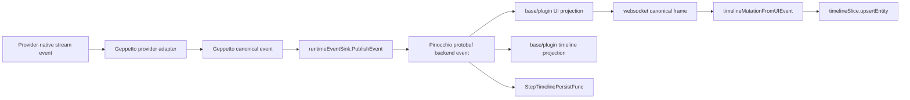

# Static analysis for protocol conformance

## Purpose of this document

This document teaches the static-analysis side of the Pinocchio protocol conformance strategy. It is written for an intern who can read Go and TypeScript but has not yet built static analysis tools. By the end, the reader should understand what static analysis can prove, which Pinocchio protocol assumptions are good static-analysis targets, how to build the first analyzers, and where to study further.

The goal is not to turn static analysis into a replacement for tests. The goal is to make structural protocol mistakes difficult to commit. A static analyzer should catch violations such as “provider-call terminal events publish text terminal events,” “canonical payloads forget correlation,” “runtime routing reads `metadata.Extra`,” and “frontend sparse patches clear meaningful state.” Those are code-shape errors. They can often be detected without executing the program.

The companion finite-state-model document covers sequence semantics: whether every possible event sequence leaves the run, text, reasoning, and tool lifecycles in a valid final state. Static analysis and finite-state modeling answer different questions. This document stays focused on the static side.

## Executive summary

The chat protocol is an event transformation pipeline that starts at provider-native streams, not at Pinocchio. OpenAI Responses, OpenAI-compatible Chat Completions, Claude, and Gemini each expose a different event vocabulary. Geppetto provider adapters normalize those streams into canonical Geppetto events. Pinocchio maps those canonical events to protobuf backend events. Sessionstream projects them into UI events and timeline entities. The browser maps UI events into sparse timeline patches. Redux merges those patches into renderable state.

The provider-adapter layer is the most complex static-analysis target because provider APIs combine envelope events, text deltas, reasoning deltas, function-call fragments, content block indexes, finish reasons, late IDs, and usage metadata. A static analysis tool can inspect this code and extract facts:

```text
openai_responses streaming case response.output_text.delta publishes EventTextDelta
claude ContentBlockDeltaType/InputJSONDeltaType publishes EventToolCallArgumentsDelta
openai Chat Completions tool argument fragment publishes Delta=current fragment and Arguments=accumulated buffer
runtimeEventSink.PublishEvent consumes *events.EventTextDelta
runtimeEventSink.PublishEvent publishes EventChatTextDelta
EventChatTextDelta payload includes Correlation: correlationInfoFromEvent(ev)
ChatToolCallFinished frontend patch omits input/inputRaw when input is absent
```

Once facts are extracted, rule checks can validate the protocol:

```text
Provider-native terminal events must not publish transcript text events.
Provider tool argument fragments must preserve both current delta and accumulated input.
ProviderCallLifecycle must not publish TextSegmentLifecycle.
Canonical runtime translations must propagate correlation.
metadata.Extra must not be used for routing or joining.
Sparse frontend patches must not clear prior non-empty props.
Optional numeric indexes must not be filtered by truthiness.
```

The recommended implementation is a staged protocol linter:

1. Start with AST-based Go analyzers for high-confidence rules.
2. Add SSA only where ordering or data-flow facts are needed.
3. Add TypeScript ESLint rules for frontend sparse-patch contracts.
4. Emit JSON protocol facts and validate them with graph-coloring rules.
5. Integrate into local validation and CI after false positives are under control.

The first version should be deliberately narrow. It should check a few important files and report precise diagnostics. A small accurate analyzer is more useful than a broad analyzer that developers learn to ignore.

## Learning goals

After reading this document, an intern should be able to:

- Define static analysis, AST analysis, type analysis, SSA, call graphs, and data-flow analysis.
- Explain which provider-normalization and Pinocchio protocol invariants are structural and which are sequence-semantic.
- Build a `go/analysis` analyzer that scans Geppetto provider adapters and Pinocchio runtime code and reports diagnostics.
- Use `buildssa` when control-flow or data-flow information is required.
- Write TypeScript/ESLint rules that enforce sparse-patch safety in `timelineEvents.ts`.
- Emit protocol facts as JSON and validate them as a colored graph.
- Add analyzer tests using `analysistest` and frontend rule tests using the ESLint rule tester.
- Decide when not to use static analysis.

## What static analysis means here

Static analysis inspects source code, typed syntax trees, or intermediate representations without running the application’s normal runtime behavior. The analyzer is another program. It reads code and reports diagnostics when it sees a pattern that violates a rule.

The simplest static analysis is a grep-like symbol search:

```text
Find references to EventFinal outside docs and tests.
```

The next level is AST analysis:

```text
Find calls to engine.publish where the event name argument is EventChatTextDelta.
```

The next level is typed AST analysis:

```text
Confirm that ev in this switch branch has type *gepevents.EventTextDelta.
```

The next level is SSA and control-flow analysis:

```text
In the EventError branch, prove that finishActiveTextSegment is called on every path before EventChatRunFailed is published.
```

The next level is interprocedural analysis:

```text
Follow helper calls across functions to discover which backend events may be published by a feature plugin.
```

Each level has a cost. The first implementation should use the lowest level that enforces the rule accurately.

## What static analysis can and cannot prove

Static analysis is effective when the rule is visible in source structure.

Good static-analysis targets:

- Forbidden symbol references.
- Forbidden package or field usage, such as runtime routing through `EventMetadata.Extra`.
- Provider-native switch-case routing into canonical Geppetto constructors.
- Provider terminal events, such as response completion or Claude message stop, directly publishing transcript text events.
- Provider tool-argument delta constructors that fail to distinguish current fragment from accumulated arguments.
- Switch-case routing from Geppetto event type to Pinocchio event name.
- Required field assignment in composite literals, such as `Correlation: correlationInfoFromEvent(ev)`.
- Local call ordering, such as `finishActiveTextSegment` before `publishRunFailed` in the same branch.
- Frontend sparse-patch construction, such as avoiding unconditional `input: payload.input` for sparse events.
- Reducer merge semantics, such as preserving `props: { ...existing.props, ...incoming.props }`.

Poor static-analysis targets without a separate state model:

- All possible sequences of events across an entire run.
- Whether a sequence of text/tool/reasoning events leaves no active entities.
- Whether two asynchronous subscribers observe events in the same order under every scheduler behavior.
- Whether a real provider emits semantically valid event streams.
- Whether frontend state and backend snapshot state agree after a long trace.

Those sequence questions belong to deterministic conformance tests, trace replay, model-based testing, and property testing. A static analyzer should still help by ensuring the code has the right structural shape before those runtime checks execute.

## Current provider-to-browser protocol pipeline

The protocol pipeline is the target of the analyzer. The first draft of this document started at “Geppetto canonical event type.” That is not low enough. Several of the migration bugs happened one layer earlier, where provider-specific stream events were normalized into Geppetto canonical events. The analyzer must therefore include a Layer 0 provider-adapter stage.



The source files that define this path are:

| Stage | Files | Analyzer interest |
|---|---|---|
| Provider-specific normalization | `geppetto/pkg/steps/ai/openai_responses/streaming.go`, `geppetto/pkg/steps/ai/openai_responses/nonstreaming.go`, `geppetto/pkg/steps/ai/openai/engine_openai.go`, `geppetto/pkg/steps/ai/openai/chat_stream.go`, `geppetto/pkg/steps/ai/claude/content-block-merger.go`, `geppetto/pkg/steps/ai/gemini/engine_gemini.go` | Extract provider-native event cases and the canonical Geppetto events they publish. Verify provider terminal events do not manufacture text, tool arguments accumulate correctly, and provider-specific correlation builders are used. |
| Geppetto input vocabulary | `geppetto/pkg/events/canonical_events.go`, `geppetto/pkg/events/canonical_tool_events.go`, `geppetto/pkg/events/correlation.go`, `geppetto/pkg/events/correlation_builders.go` | Enumerate canonical event constructors, correlation API, and provider-specific correlation builders. |
| Runtime event translation | `pinocchio/pkg/chatapp/runtime_sink.go`, `pinocchio/pkg/chatapp/runtime_inference.go` | Extract consumed event types, published backend events, correlation propagation, terminal ordering. |
| Base projections | `pinocchio/pkg/chatapp/projections.go` | Ensure provider events do not project transcript entities and text terminal events close correctly. |
| Plugin projections | `pinocchio/pkg/chatapp/plugins/toolcall.go`, `pinocchio/pkg/chatapp/plugins/reasoning.go` | Ensure tool/reasoning events stay in their lifecycle classes and preserve sparse fields. |
| Protobuf contract | `pinocchio/proto/pinocchio/chatapp/v1/chat.proto` | Define backend event names, payload fields, and typed correlation. |
| Timeline persistence | `pinocchio/pkg/ui/timeline_persist.go` | Ensure persistence uses typed correlation/current segment identity, not debug metadata, for lifecycle state. |
| Frontend event mapping | `pinocchio/cmd/web-chat/web/src/ws/timelineEvents.ts` | Ensure sparse patches omit absent fields and preserve optional zero indexes. |
| Frontend reducer | `pinocchio/cmd/web-chat/web/src/store/timelineSlice.ts` | Ensure entity props are merged, not replaced. |

The first analyzer should focus on these files. Whole-repository analysis can come later.

## Layer 0: provider-specific event normalization

Provider adapters are the lowest layer of the protocol. They receive provider-specific stream objects and publish canonical Geppetto events. This layer is where provider API vocabulary is translated into the canonical run/provider/text/reasoning/tool vocabulary used everywhere else.

This layer deserves static analysis because the provider APIs are not uniform:

- OpenAI Responses has response-level events, output item events, text deltas, reasoning summary deltas, function-call argument deltas, and response completion events.
- OpenAI-compatible Chat Completions has choice deltas, role/content fields, reasoning fields used by some compatible providers, streamed tool-call deltas, final tool-call objects, finish reasons, and usage-only chunks.
- Claude has message events, content block start/delta/stop events, text deltas, input JSON deltas, tool-use blocks, message deltas, and message stop events.
- Gemini has candidate parts, function calls, text parts, finish reasons, and provider response metadata.

The canonical rules are the same across providers:

```text
Provider envelope events map to provider-call lifecycle events.
Provider text deltas map to text segment lifecycle events.
Provider reasoning deltas map to reasoning segment lifecycle events.
Provider tool-call deltas/requests map to tool lifecycle events.
Provider final/EOF/message-stop events do not manufacture transcript text.
Text segment finish is emitted only for a segment that actually exists.
Tool-call argument delta keeps both the current fragment and the accumulated input.
Every canonical event carries typed events.Correlation.
```

Static analysis can check much of this structure before any provider test runs.

### Provider adapter fact extraction

Add a provider-adapter fact category beside the Pinocchio route facts.

```json
{
  "providerRoutes": [
    {
      "provider": "openai_responses",
      "file": "pkg/steps/ai/openai_responses/streaming.go",
      "nativeCase": "response.output_text.delta",
      "publishes": ["EventTextDelta"],
      "correlationBuilder": "BuildResponsesCorrelation",
      "notes": ["text segment start may be emitted earlier when output item starts"]
    },
    {
      "provider": "claude",
      "file": "pkg/steps/ai/claude/content-block-merger.go",
      "nativeCase": "ContentBlockDeltaType/InputJSONDeltaType",
      "publishes": ["EventToolCallArgumentsDelta"],
      "correlationBuilder": "BuildClaudeSegmentCorrelation",
      "argumentDeltaField": "Delta",
      "argumentAccumulatedField": "Arguments"
    }
  ]
}
```

The provider fact extractor does not need to understand every provider SDK type perfectly in the first version. It can start with the explicit switch cases and constructor calls already present in the provider adapter files.

### Provider adapter graph colors

Provider-native cases should receive colors before they are mapped to canonical events.

```yaml
colors:
  provider.openai_responses.response.completed: provider_call_terminal
  provider.openai_responses.response.output_text.delta: provider_text_delta
  provider.openai_responses.response.function_call_arguments.delta: provider_tool_args_delta
  provider.openai_chat.choice.delta.content: provider_text_delta
  provider.openai_chat.choice.delta.tool_calls.arguments: provider_tool_args_delta
  provider.claude.message_stop: provider_call_terminal
  provider.claude.content_block_delta.text_delta: provider_text_delta
  provider.claude.content_block_delta.input_json_delta: provider_tool_args_delta
  provider.gemini.finish_reason: provider_call_terminal
  provider.gemini.part.text: provider_text_delta
  provider.gemini.part.function_call: provider_tool_request
```

Canonical event constructors already have colors:

```yaml
colors:
  geppetto.NewProviderCallFinishedEvent: provider_call_terminal
  geppetto.NewTextSegmentFinishedEvent: text_segment_terminal
  geppetto.NewToolCallArgumentsDeltaEvent: tool_args_delta
```

Forbidden edges:

```yaml
forbiddenEdges:
  - name: provider-terminal-must-not-manufacture-text
    fromColor: provider_call_terminal
    toColor: text_segment_terminal

  - name: provider-terminal-must-not-create-text-delta
    fromColor: provider_call_terminal
    toColor: provider_text_delta
```

Required edges:

```yaml
requiredFields:
  - name: provider-adapter-events-carry-correlation
    canonicalConstructors:
      - NewProviderCallStartedEvent
      - NewProviderCallFinishedEvent
      - NewTextDeltaEvent
      - NewTextSegmentFinishedEvent
      - NewReasoningDeltaEvent
      - NewToolCallArgumentsDeltaEvent
      - NewToolCallRequestedEvent
    requiredArgument: events.Correlation
```

### Provider-specific checks

#### OpenAI Responses

Static checks for `pkg/steps/ai/openai_responses/streaming.go` and `nonstreaming.go`:

- Response-created/start logic publishes `NewProviderCallStartedEvent` with `BuildProviderCallCorrelation`.
- Response completion publishes `NewProviderCallFinishedEvent` and does not directly publish `NewTextSegmentFinishedEvent` unless an actual text segment state is being closed by text-specific logic.
- Text delta branches publish `NewTextDeltaEvent` with `BuildResponsesCorrelation` or a helper derived from it.
- Reasoning summary deltas publish reasoning events, not text events.
- Function-call argument delta branches publish `NewToolCallArgumentsDeltaEvent` with current delta and accumulated arguments.
- Function-call completion/request branches publish `NewToolCallRequestedEvent` with full input.

Some OpenAI Responses details are state-dependent. For example, a text finish event is valid only if an output text segment was started. Static analysis can flag suspicious direct routes from response terminal cases to text terminal constructors, but the finite-state model and provider fixtures should verify the segment-existence condition.

#### OpenAI-compatible Chat Completions

Static checks for `pkg/steps/ai/openai/engine_openai.go` and `chat_stream.go`:

- Choice content deltas publish `NewTextDeltaEvent`, not provider-call events.
- Reasoning deltas publish reasoning events and use reasoning stream correlation.
- Tool-call streamed argument fragments publish `NewToolCallArgumentsDeltaEvent` where `Delta` is the current fragment and `Arguments` is the accumulated buffer.
- Final merged tool calls publish `NewToolCallRequestedEvent` with the complete input.
- EOF, finish reason, or usage-only chunks publish provider metadata/finished events rather than text segment events.
- Correlation uses `BuildChatCompletionsCorrelation` for choice/text/reasoning/tool stream identity and `BuildProviderCallCorrelation` for provider-call envelope identity.

The streamed tool argument accumulation issue is a good example of a partially static rule. The analyzer can check that the constructor arguments are not the same raw fragment expression for both `Delta` and `Arguments`. The finite-state model should still verify accumulated behavior over a sequence of fragments.

#### Claude

Static checks for `pkg/steps/ai/claude/content-block-merger.go`:

- `MessageStartType` publishes provider-call started.
- `MessageDeltaType` publishes provider metadata updated, not text.
- `MessageStopType` publishes provider-call finished, not text.
- `ContentBlockStartType` with text starts a text segment.
- `ContentBlockStartType` with tool use starts a tool call.
- `ContentBlockDeltaType` with text delta publishes `NewTextDeltaEvent` and accumulates block text.
- `ContentBlockDeltaType` with input JSON delta publishes `NewToolCallArgumentsDeltaEvent` and accumulates tool input.
- `ContentBlockStopType` finishes text segments for text blocks and requests tool calls for tool blocks.
- Correlation uses `BuildClaudeProviderCallCorrelation` for message envelope and `BuildClaudeSegmentCorrelation` for content blocks.

Claude is especially important because message stop events previously looked tempting as final text markers. The static rule should make that forbidden route explicit.

#### Gemini

Static checks for `pkg/steps/ai/gemini/engine_gemini.go`:

- Provider-call started/finished events wrap the Gemini provider request.
- Text parts start and update text segments.
- Function-call parts publish tool call started/requested events.
- Finish reasons publish provider-call finished and only finish text if text content exists.
- Correlation uses `BuildProviderCallCorrelation` and segment/tool correlations rather than debug metadata.

Gemini provider responses are less string-switch-driven than OpenAI Responses. The first analyzer can therefore focus on constructor calls and correlation builders rather than native event strings.

### Provider adapter static analysis limits

Provider adapters contain stateful normalization: buffers, current item IDs, content-block arrays, accumulated tool arguments, and late response IDs. Static analysis can check that the code shape is plausible. It cannot prove every stream sequence is normalized correctly.

Use static analysis for:

```text
native case -> canonical constructor route
canonical constructor -> correlation builder presence
provider terminal -> no direct transcript constructor
argument delta constructor -> distinct delta and accumulated arguments expressions
forbidden metadata.Extra routing
```

Use finite-state models and provider fixtures for:

```text
text finish only after actual text start
tool arguments accumulate over multiple fragments
Claude content block indexes remain stable
OpenAI Responses done/backfill emits only missing text
Gemini finish does not close nonexistent text
provider response ID updates preserve correlation joins
```

The analyzer should report the structural violations and then defer sequence semantics to the model-based tests.

## Static analysis foundations

### AST

An abstract syntax tree is the parsed structure of source code. In Go, `go/parser` and `go/ast` provide nodes such as `*ast.CallExpr`, `*ast.CompositeLit`, `*ast.SwitchStmt`, and `*ast.TypeSwitchStmt`. In TypeScript, ESLint rules operate on ESTree-compatible nodes produced by the parser.

AST analysis answers questions about the code’s written form:

```text
Is there a call expression named s.engine.publish?
Is the third argument EventChatTextDelta?
Does the composite literal include a field named Correlation?
```

AST analysis is fast and usually enough for protocol lints that inspect explicit switch branches and object literals.

### Type information

Type information connects syntax to meaning. A selector named `PublishEvent` is only relevant when it belongs to `*runtimeEventSink`. A composite literal named `ChatTextDelta` is only relevant when it refers to `chatappv1.ChatTextDelta`.

Go analyzers receive `pass.TypesInfo`, which maps expressions to types and identifiers to objects. Type information lets the analyzer distinguish two identifiers with the same spelling but different packages.

Example checks that require type information:

```text
This switch case variable has type *github.com/go-go-golems/geppetto/pkg/events.EventTextDelta.
This composite literal has type *github.com/go-go-golems/pinocchio/pkg/chatapp/pb/.../ChatTextDelta.
This selector accesses EventMetadata.Extra, not another field named Extra.
```

### Control-flow graph

A control-flow graph represents possible execution order inside a function. Nodes are basic blocks. Edges represent possible branch flow.

Control-flow helps with rules such as:

```text
In the EventError branch, finishActiveTextSegment must run before ChatRunFailed is published.
```

A simple AST scan can find both calls, but it cannot always prove that one dominates the other. Dominance means every path to the later operation passes through the earlier operation. For the first version, the code shape in `runtime_sink.go` is simple enough that local AST ordering may be acceptable. If the branch becomes more complex, SSA basic blocks provide a more reliable method.

### SSA

Static Single Assignment is an intermediate representation where each variable assignment creates a new value. In Go, `golang.org/x/tools/go/ssa` represents functions, basic blocks, instructions, values, calls, stores, and control flow.

SSA is useful when the analyzer needs to answer questions about data movement or control paths:

```text
Which value reaches the event-name argument of publish?
Does the correlation field come from correlationInfoFromEvent(ev)?
Does every branch path call finishActiveTextSegment before publishing ChatRunFailed?
```

Use SSA when AST rules become fragile. Do not start with SSA for every rule. SSA increases implementation complexity and can produce diagnostics that are harder to connect back to source code.

### Call graph

A call graph records which functions may call which other functions. In Go, `golang.org/x/tools/go/callgraph` defines the data structure and related algorithms. Call graphs are useful when a publish helper hides the actual publish call.

For the first Pinocchio analyzer, direct AST scans are enough for `runtimeEventSink.PublishEvent`, `baseTimelineProjection`, and the plugin projection methods. Call graphs become useful when the analyzer needs to follow helper functions such as:

```text
publishRunFailed -> e.publish -> pub.Publish
handleFeatureRuntimeEvent -> plugin.HandleRuntimeEvent -> runtime.Publish
```

Call graphs are approximate. Polymorphic calls, interfaces, function values, and dependency injection reduce precision. The analyzer should report conservative facts and avoid claiming more certainty than the analysis supports.

### Data-flow analysis

Data-flow analysis computes how facts move through code. A fact can be a value origin, a possible event color, a taint marker, or a protocol role.

For this project, useful data-flow facts include:

```text
value ev has color TextLifecycle
value corr came from ev.Correlation()
published payload field Correlation came from correlationInfoFromEvent(ev)
frontend prop input came from payload.input
```

Data-flow is more expensive than AST pattern matching. Use it when the code begins to hide important values behind helpers.

### Graph coloring

Graph coloring in this document means assigning protocol classes to nodes and validating edges between classes. The graph is not a compiler CFG. It is a protocol fact graph.

Example node colors:

```yaml
EventProviderCallFinished: provider_call_terminal
EventChatProviderCallFinished: provider_call_terminal
EventTextSegmentFinished: text_terminal
ChatMessage: transcript_entity
ChatToolCall: tool_entity
metadata.Extra: debug_only
```

Example forbidden edge:

```yaml
forbid:
  - from: provider_call_terminal
    to: transcript_entity
```

The analyzer extracts edges:

```text
EventProviderCallFinished -> EventChatProviderCallFinished
EventChatTextSegmentFinished -> ChatMessage
```

The rule engine checks whether any extracted edge crosses a forbidden color boundary.

This is the simplest way to use “graph coloring” for this protocol. It gives the team a small, readable rule file instead of burying all rules in analyzer code.

## Protocol invariants suitable for static checking

The conformance plan defines several invariants. Some are good static checks; others require runtime sequence tests.

| Invariant | Static check? | Runtime/model check? | Notes |
|---|---:|---:|---|
| Provider-call events do not create transcript text. | Yes | Yes | Static graph coloring can catch forbidden routes. Runtime tests confirm final snapshots. |
| Canonical translations include typed correlation. | Yes | Yes | Static checks catch missing fields; runtime tests catch empty/incorrect values. |
| `metadata.Extra` is not routing state. | Yes | Sometimes | Static check can forbid reads in runtime/projection packages. |
| Active text closes on stop/error. | Partially | Yes | Static checks can verify call ordering; runtime model proves sequence outcome. |
| Closed text is not rewritten by later error. | No | Yes | Requires event history. |
| Sparse tool finish does not clear input/name. | Yes | Yes | Static TS rule catches object-literal shape; reducer test confirms merge result. |
| Optional zero indexes are preserved. | Yes | Yes | Static TS rule can forbid truthiness filtering; tests confirm decoded values. |
| No terminal run leaves streaming entities. | No | Yes | Requires final state after sequence. |

The analyzer should claim only the left-column checks. That boundary keeps diagnostics trustworthy.

## The protocol fact model

The analyzer should extract facts before applying rules. Facts make the tool easier to test, debug, and extend.

A useful first fact schema:

```json
{
  "version": 1,
  "goRoutes": [
    {
      "file": "pkg/chatapp/runtime_sink.go",
      "function": "(*runtimeEventSink).PublishEvent",
      "caseType": "*events.EventTextDelta",
      "publishes": "EventChatTextDelta",
      "payloadType": "*chatappv1.ChatTextDelta",
      "fields": ["MessageId", "Role", "Prompt", "Chunk", "Text", "Content", "Status", "Streaming", "Correlation"],
      "correlationSource": "correlationInfoFromEvent(ev)"
    }
  ],
  "frontendPatches": [
    {
      "file": "cmd/web-chat/web/src/ws/timelineEvents.ts",
      "eventName": "ChatToolCallFinished",
      "entityKind": "tool_call",
      "fields": ["messageId", "toolCallId", "status", "done"],
      "omittedWhenEmpty": ["input", "inputRaw", "toolName", "correlationKey"]
    }
  ]
}
```

This schema has three benefits:

1. The analyzer can print facts during development.
2. The rule engine can be tested independently from parsing.
3. A human reviewer can inspect the protocol graph without reading analyzer internals.

## Graph colors and rules

A small color registry should live in a YAML or JSON file.

```yaml
colors:
  geppetto.EventProviderCallStarted: provider_call
  geppetto.EventProviderCallMetadataUpdated: provider_call
  geppetto.EventProviderCallFinished: provider_call_terminal
  geppetto.EventTextSegmentStarted: text_segment
  geppetto.EventTextDelta: text_segment
  geppetto.EventTextSegmentFinished: text_segment_terminal
  geppetto.EventToolCallStarted: tool
  geppetto.EventToolCallArgumentsDelta: tool
  geppetto.EventToolCallFinished: tool_terminal

  pinocchio.EventChatProviderCallFinished: provider_call_terminal
  pinocchio.EventChatTextSegmentFinished: text_segment_terminal
  pinocchio.EventChatToolCallFinished: tool_terminal

  timeline.ChatMessage: transcript_entity
  timeline.ChatToolCall: tool_entity
  timeline.ChatToolResult: tool_result_entity
```

Rules can then be stated declaratively:

```yaml
forbiddenEdges:
  - name: provider-terminal-must-not-create-transcript
    fromColor: provider_call_terminal
    toColor: transcript_entity

  - name: provider-call-must-not-publish-text-terminal
    fromColor: provider_call_terminal
    toColor: text_segment_terminal

requiredFields:
  - name: canonical-runtime-events-carry-correlation
    eventColors: [provider_call, provider_call_terminal, text_segment, text_segment_terminal, tool, tool_terminal]
    field: Correlation

forbiddenReads:
  - name: metadata-extra-routing-forbidden
    packagePrefixes:
      - github.com/go-go-golems/pinocchio/pkg/chatapp
      - github.com/go-go-golems/pinocchio/pkg/ui
    selector: EventMetadata.Extra
    allowedFileSubstrings:
      - debug
      - observability
```

This rule file should be small enough for reviewers to understand. Avoid building a general policy language in the first version.

## Go static analyzer architecture

### Recommended package layout

Add a small command under Pinocchio:

```text
pinocchio/
  cmd/protocolcheck/
    main.go
  internal/protocolcheck/
    facts.go
    colors.go
    rules.go
    render.go
    goanalysis/
      analyzer.go
      routes.go
      correlation.go
      metadata_extra.go
      terminal_order.go
      projections.go
      testdata/
        src/...
```

The command can start as a standalone tool:

```bash
go run ./cmd/protocolcheck ./pkg/chatapp ./pkg/chatapp/plugins ./pkg/ui
```

Later it can be packaged as a `go vet` vettool if that integration is useful:

```bash
go vet -vettool=$(which protocolcheck) ./pkg/chatapp ./pkg/chatapp/plugins ./pkg/ui
```

Start standalone. It is easier to iterate and easier to print JSON facts.

### Minimal `go/analysis` analyzer

The official Go analysis framework centers on `analysis.Analyzer`:

```go
var Analyzer = &analysis.Analyzer{
    Name: "pinoprotocol",
    Doc:  "checks Pinocchio chat protocol routing invariants",
    Run:  run,
}

func run(pass *analysis.Pass) (any, error) {
    for _, file := range pass.Files {
        ast.Inspect(file, func(n ast.Node) bool {
            // inspect switch cases, call expressions, composite literals
            return true
        })
    }
    return nil, nil
}
```

A singlechecker command is enough for the first version:

```go
package main

import (
    "github.com/go-go-golems/pinocchio/internal/protocolcheck/goanalysis"
    "golang.org/x/tools/go/analysis/singlechecker"
)

func main() {
    singlechecker.Main(goanalysis.Analyzer)
}
```

For multiple analyzers, use `multichecker`. Keep one analyzer until the rules become large enough to split.

### Testing analyzers

Use `golang.org/x/tools/go/analysis/analysistest`. The testdata directory contains small Go packages with comments marking expected diagnostics.

Example test file:

```go
package bad

func badRoute(s *runtimeEventSink, ev *events.EventProviderCallFinished) error {
    return s.engine.publish(ctx, sid, pub,
        EventChatTextSegmentFinished, // want "provider-call event must not publish text segment event"
        &chatappv1.ChatTextSegmentFinished{})
}
```

Test runner:

```go
func TestAnalyzer(t *testing.T) {
    testdata := analysistest.TestData()
    analysistest.Run(t, testdata, goanalysis.Analyzer, "bad", "good")
}
```

Analyzer tests should be small. Do not use the full Pinocchio repository as the analyzer’s only test fixture.

## Go analyzer rule 1: forbidden legacy event symbols

This rule is a low-cost guardrail.

```text
No active runtime/API code may reference removed legacy symbols:
- EventFinal
- EventPartialCompletion
- EventThinkingPartial
- ChatInferenceStarted
- ChatTokensDelta
- ChatInferenceFinished
```

Implementation approach:

1. Traverse identifiers and selector expressions.
2. Resolve the referenced object with `pass.TypesInfo.Uses`.
3. If the name matches a forbidden symbol and the file is not in an allowed directory, report.

Allowed locations:

```text
*.md
archive/
ttmp/
*_test.go, if explicitly allowed for migration tests
```

This rule can be implemented without SSA.

Diagnostic example:

```text
pkg/chatapp/foo.go:42:17: legacy event symbol ChatTokensDelta is forbidden in active protocol code; use ChatTextDelta
```

## Go analyzer rule 2: `metadata.Extra` is debug-only

The event-vocabulary cutover requires typed correlation for routing and joining. `EventMetadata.Extra` may exist for debug and observability, but it must not be the source of protocol identity.

Rule:

```text
Reads of EventMetadata.Extra are forbidden in active runtime, projection, and persistence code unless the file/package is explicitly debug/observability code.
```

Implementation approach:

1. Traverse selector expressions.
2. Find selectors named `Extra`.
3. Use type information to confirm the receiver is `events.EventMetadata` or a variable derived from `ev.Metadata()`.
4. Check file allowlist.
5. Report diagnostics for forbidden reads.

The analyzer should not ban every occurrence globally. The current code may legitimately use metadata for debug attribution. The rule should be scoped to routing-sensitive packages and allow files with names such as `debug_*` or packages named `observability`.

Pseudocode:

```go
func checkMetadataExtra(pass *analysis.Pass, file *ast.File) {
    ast.Inspect(file, func(n ast.Node) bool {
        sel, ok := n.(*ast.SelectorExpr)
        if !ok || sel.Sel.Name != "Extra" {
            return true
        }
        if isAllowedDebugFile(pass.Fset.Position(sel.Pos()).Filename) {
            return true
        }
        if receiverLooksLikeEventMetadata(pass.TypesInfo, sel.X) {
            pass.Reportf(sel.Pos(), "metadata.Extra is debug-only; route protocol state through typed CorrelationInfo")
        }
        return true
    })
}
```

This rule can start syntactic and become more type-aware over time.

## Go analyzer rule 3: provider adapter route table

The lowest-level Go rule is a route-table check for provider adapter files. This rule answers: “When this provider-native event case is handled, which canonical Geppetto constructors can be published?”

The intended high-level route table is:

| Provider family | Native event class | Canonical Geppetto event class |
|---|---|---|
| OpenAI Responses | response created/start | `EventProviderCallStarted` |
| OpenAI Responses | response metadata/completion | `EventProviderCallMetadataUpdated`, `EventProviderCallFinished` |
| OpenAI Responses | output text delta/done | `EventTextSegmentStarted`, `EventTextDelta`, `EventTextSegmentFinished` |
| OpenAI Responses | reasoning summary/text delta | `EventReasoningSegmentStarted`, `EventReasoningDelta`, `EventReasoningSegmentFinished` |
| OpenAI Responses | function-call arguments delta/done | `EventToolCallStarted`, `EventToolCallArgumentsDelta`, `EventToolCallRequested` |
| OpenAI Chat Completions | choice content delta | `EventTextSegmentStarted`, `EventTextDelta`, `EventTextSegmentFinished` |
| OpenAI Chat Completions | choice reasoning delta | `EventReasoningSegmentStarted`, `EventReasoningDelta`, `EventReasoningSegmentFinished` |
| OpenAI Chat Completions | streamed tool call delta/final merged call | `EventToolCallStarted`, `EventToolCallArgumentsDelta`, `EventToolCallRequested` |
| Claude | message start/delta/stop | provider-call lifecycle only |
| Claude | content block text start/delta/stop | text segment lifecycle |
| Claude | content block tool-use start/input-json/stop | tool lifecycle |
| Gemini | provider request/finish | provider-call lifecycle |
| Gemini | text part | text segment lifecycle |
| Gemini | function-call part | tool lifecycle |

Implementation approach:

1. Restrict the rule to known provider adapter files first.
2. Traverse switch statements and constructor calls.
3. Record native case labels when they are explicit strings or SDK enum constants.
4. Record calls to canonical constructors such as `events.NewTextDeltaEvent`.
5. Record correlation builder calls near the constructor arguments.
6. Apply provider-specific graph color rules.

Pseudocode:

```go
type ProviderRouteFact struct {
    Provider      string
    File          string
    Function      string
    NativeCase    string
    Constructor   string
    CanonicalKind string
    CorrBuilder   string
    Line          int
}

func extractProviderRoutes(pass *analysis.Pass, file *ast.File) []ProviderRouteFact {
    provider := providerFromFilename(pass.Fset.Position(file.Pos()).Filename)
    if provider == "" {
        return nil
    }

    var currentCase string
    var facts []ProviderRouteFact
    ast.Inspect(file, func(n ast.Node) bool {
        switch node := n.(type) {
        case *ast.CaseClause:
            currentCase = renderCaseLabels(pass, node.List)
            for _, stmt := range node.Body {
                facts = append(facts, constructorCallsInStmt(pass, provider, currentCase, stmt)...)
            }
            return false
        case *ast.CallExpr:
            if constructor := canonicalEventConstructor(pass, node); constructor != "" {
                facts = append(facts, ProviderRouteFact{
                    Provider: provider,
                    NativeCase: currentCase,
                    Constructor: constructor,
                    CorrBuilder: correlationBuilderInArgs(pass, node.Args),
                    Line: pass.Fset.Position(node.Pos()).Line,
                })
            }
        }
        return true
    })
    return facts
}
```

Important diagnostics:

```text
openai_responses/streaming.go: response.completed publishes NewTextSegmentFinishedEvent; provider terminal events must not manufacture text segment finals
openai/engine_openai.go: NewToolCallArgumentsDeltaEvent uses the same expression for delta and accumulated arguments; Arguments must be accumulated state
claude/content-block-merger.go: MessageStopType publishes text lifecycle event; message stop is provider-call lifecycle only
```

This rule will not prove segment existence or accumulated string values. It makes the route graph visible and blocks direct forbidden edges.

## Go analyzer rule 4: runtime sink route table

The highest-value Pinocchio Go rule is a route-table check for `runtimeEventSink.PublishEvent`.

The intended route table is:

| Geppetto input event | Pinocchio backend event | Payload type |
|---|---|---|
| `*gepevents.EventProviderCallStarted` | `EventChatProviderCallStarted` | `ChatProviderCallStarted` |
| `*gepevents.EventProviderCallMetadataUpdated` | `EventChatProviderCallMetadataUpdated` | `ChatProviderCallMetadataUpdated` |
| `*gepevents.EventProviderCallFinished` | `EventChatProviderCallFinished` | `ChatProviderCallFinished` |
| `*gepevents.EventTextSegmentStarted` | `EventChatTextSegmentStarted` | `ChatTextSegmentStarted` |
| `*gepevents.EventTextDelta` | `EventChatTextDelta` | `ChatTextDelta` |
| `*gepevents.EventTextSegmentFinished` | `EventChatTextSegmentFinished` | `ChatTextSegmentFinished` |
| `*gepevents.EventError` | `EventChatRunFailed` | `ChatRunFailed` |
| `*gepevents.EventInterrupt` | `EventChatRunStopped` | `ChatRunStopped` |

The analyzer should inspect the type switch cases and collect publish calls.

Pseudocode:

```go
func extractRuntimeSinkRoutes(pass *analysis.Pass, fn *ast.FuncDecl) []RouteFact {
    if !isMethod(fn, "runtimeEventSink", "PublishEvent") {
        return nil
    }

    var facts []RouteFact
    ast.Inspect(fn.Body, func(n ast.Node) bool {
        ts, ok := n.(*ast.TypeSwitchStmt)
        if !ok {
            return true
        }
        for _, clause := range ts.Body.List {
            cc := clause.(*ast.CaseClause)
            caseTypes := typeSwitchCaseTypes(pass, cc)
            publishes := publishCallsInStatements(pass, cc.Body)
            for _, caseType := range caseTypes {
                for _, publish := range publishes {
                    facts = append(facts, RouteFact{
                        Function: "(*runtimeEventSink).PublishEvent",
                        CaseType: caseType,
                        EventName: publish.EventName,
                        PayloadType: publish.PayloadType,
                        HasCorrelation: publish.HasCorrelationField,
                        CorrelationSource: publish.CorrelationSource,
                    })
                }
            }
        }
        return false
    })
    return facts
}
```

Rule checks then compare facts to expected routes.

Example diagnostic:

```text
pkg/chatapp/runtime_sink.go:40: provider-call case *events.EventProviderCallFinished must not publish EventChatTextSegmentFinished
```

## Go analyzer rule 5: correlation propagation

Every canonical translated backend payload should carry typed correlation where the protobuf schema has a correlation field.

For runtime sink branches, the analyzer can inspect composite literals:

```go
&chatappv1.ChatTextDelta{
    MessageId: textMessageID,
    Role: "assistant",
    Correlation: correlationInfoFromEvent(ev),
}
```

Expected forms:

```text
Correlation: correlationInfoFromEvent(ev)
Correlation: CorrelationInfoFromGeppetto(corr)
Correlation: chatapp.CorrelationInfoFromEvent(ev)
```

Allowing a short list of recognized constructors is better than requiring one exact spelling. The analyzer should report missing correlation, but it should not reject legitimate helper usage.

Pseudocode:

```go
func payloadCorrelationSource(pass *analysis.Pass, lit *ast.CompositeLit) string {
    for _, elt := range lit.Elts {
        kv, ok := elt.(*ast.KeyValueExpr)
        if !ok {
            continue
        }
        if identName(kv.Key) != "Correlation" {
            continue
        }
        return renderExpr(pass.Fset, kv.Value)
    }
    return ""
}

func isAcceptedCorrelationSource(src string) bool {
    return strings.Contains(src, "correlationInfoFromEvent") ||
           strings.Contains(src, "CorrelationInfoFromEvent") ||
           strings.Contains(src, "CorrelationInfoFromGeppetto") ||
           strings.Contains(src, "cloneCorrelationInfo")
}
```

This rule should apply to runtime translation and projections. It should not require correlation on events that intentionally have no correlation field, such as user-message acceptance.

## Go analyzer rule 6: terminal ordering

Recent PR feedback centered on stopped/failed active text segments. The static rule should ensure that terminal error/interrupt branches call `finishActiveTextSegment` before run terminal publication.

Initial AST rule:

```text
Within the EventError case body, the first publish of EventChatRunFailed must occur after a call to finishActiveTextSegment.
Within the EventInterrupt case body, the first publish of EventChatRunStopped must occur after a call to finishActiveTextSegment.
Within runRuntimeInference handle.Wait error branch, publishRunFailed must occur after sink.finishActiveTextSegment when sink is not terminal.
```

A simple statement-order scan is enough for the current code shape.

Pseudocode:

```go
func checkTerminalOrdering(caseBody []ast.Stmt, terminalEvent string) error {
    seenFinish := false
    for _, stmt := range flattenStatements(caseBody) {
        if callsFunction(stmt, "finishActiveTextSegment") {
            seenFinish = true
        }
        if publishesEvent(stmt, terminalEvent) && !seenFinish {
            return fmt.Errorf("%s must be preceded by finishActiveTextSegment", terminalEvent)
        }
    }
    return nil
}
```

If the branch later contains nested conditionals, returns, or helper calls, promote this rule to SSA and dominance analysis.

SSA version:

1. Build SSA with `buildssa.Analyzer`.
2. Find the function `(*runtimeEventSink).PublishEvent`.
3. Find basic blocks containing calls to `finishActiveTextSegment`.
4. Find basic blocks containing publish calls for `EventChatRunFailed` or `EventChatRunStopped`.
5. Compute dominators within the branch region or conservatively require the publish block to be dominated by a finish block.

The SSA version should be added only when necessary.

## Go analyzer rule 7: projection boundaries

Projection code should preserve lifecycle classes.

Rules:

```text
baseTimelineProjection must not project provider-call events into ChatMessage entities.
ToolCallPlugin.ProjectTimeline must project tool lifecycle events only into ChatToolCall or ChatToolResult entities.
ReasoningPlugin.ProjectTimeline must project reasoning lifecycle events into ChatMessage entities with role thinking.
```

Implementation approach:

1. Inspect switch cases in projection functions.
2. Extract event names from case clauses.
3. Extract returned `TimelineEntity{Kind: ...}` composite literals.
4. Color event names and entity kinds.
5. Apply graph rules.

Example extracted fact:

```json
{
  "function": "(*ToolCallPlugin).ProjectTimeline",
  "eventName": "EventChatToolCallFinished",
  "timelineEntityKind": "TimelineEntityToolCall"
}
```

Forbidden example:

```text
EventChatProviderCallFinished -> TimelineEntityChatMessage
```

Required example:

```text
EventChatReasoningDelta -> TimelineEntityChatMessage with role thinking
```

The role check may require inspecting fields assigned to `ChatMessageEntity`. If the projection passes through a helper, the first version can whitelist the helper and rely on direct unit tests for field-level semantics.

## TypeScript static analysis architecture

The frontend analyzer should be implemented as a custom ESLint plugin or local ESLint rules. Use `typescript-eslint` utilities when type information is needed.

Recommended layout:

```text
pinocchio/cmd/web-chat/web/
  eslint-local-rules/
    protocol/
      index.ts
      no-sparse-clear.ts
      preserve-zero-correlation-indexes.ts
      timeline-merge-contract.ts
      rule-tester.test.ts
```

Alternative layout if the project prefers scripts:

```text
cmd/web-chat/web/scripts/protocolcheck/
  checkTimelineEvents.ts
  checkTimelineSlice.ts
```

Start with ESLint rules if possible. Developers already run `npm run lint`, and ESLint diagnostics appear in a familiar format.

## TypeScript rule 1: sparse patch must not clear prior state

The frontend mapper creates sparse patches in `timelineEvents.ts`. The reducer merges incoming `props` over existing `props`. This contract works only if absent fields are omitted rather than represented as empty strings or `undefined` values.

Bad pattern:

```ts
return {
  upsert: toolCallEntity(payload.toolCallId, {
    input: payload.input,
    inputRaw: payload.input,
  }),
};
```

If `payload.input` is the proto3 default empty string for a sparse terminal event, this patch clears a previously known input.

Good pattern:

```ts
const hasInput = 'input' in payload && payload.input !== '';
return {
  upsert: toolCallEntity(
    payload.toolCallId,
    definedProps({
      ...(hasInput ? { input: parseToolInput(payload.input), inputRaw: payload.input } : {}),
      status: payload.status,
      done: event.name === 'ChatToolCallFinished',
    }),
  ),
};
```

Rule:

```text
Inside timelineMutationFromUIEvent, object literals passed to toolCallEntity, toolResultEntity, or messageEntity must not directly assign optional proto fields that can be empty by default. They must use definedProps, conditional spread, or a helper approved by the rule.
```

First implementation scope:

- Check `ChatToolCallFinished` case.
- Forbid direct properties `input`, `inputRaw`, `toolName`, `name` when their value reads directly from `payload.*` without a guard.
- Allow conditional spreads guarded by `hasInput`.
- Allow values inside `definedProps`, but still inspect direct `input: payload.input` inside it.

## TypeScript rule 2: preserve optional zero indexes

Optional numeric indexes in protobuf correlation are meaningful when zero:

```ts
outputIndex: 0
summaryIndex: 0
choiceIndex: 0
toolCallIndex: 0
```

A truthiness filter drops those values.

Bad pattern:

```ts
Object.entries(props).filter(([, value]) => value)
```

Good pattern:

```ts
Object.entries(props).filter(([, value]) =>
  value !== undefined && !(typeof value === 'string' && value === ''),
)
```

Rule:

```text
The helper that filters correlation props must not use truthiness filtering. It must preserve 0 and false unless the field is explicitly meant to be removed.
```

This can be implemented with AST checks for `filter` callbacks that return a bare identifier or boolean coercion:

```ts
.filter(([, value]) => value)
.filter(([, value]) => Boolean(value))
.filter(([, value]) => !!value)
```

The rule should specifically check `definedProps` and `correlationProps` first, not the entire frontend.

## TypeScript rule 3: reducer merge contract

The reducer must merge entity props. It must not replace props wholesale during upsert.

Required pattern:

```ts
props: { ...(existing.props ?? {}), ...(e.props ?? {}) }
```

Rule:

```text
timelineSlice.upsertEntity must preserve existing props when applying an incoming entity patch.
```

This rule can be narrow:

1. Find `timelineSlice` definition.
2. Find reducer method `upsertEntity`.
3. Find assignments to `state.byId[e.id]` or equivalent.
4. Require object literal assignments to include a `props` field with spreads from both existing and incoming props.

This rule may be brittle if the reducer is refactored. Keep the diagnostic direct and update the rule with the reducer.

## TypeScript rule 4: event switch exhaustiveness

`timelineMutationFromUIEvent` switches over typed event names. When new canonical event names are added, the mapper should either handle them intentionally or ignore them intentionally.

Rule:

```text
Every event name decoded by decodeKnownUIEvent must be represented in timelineMutationFromUIEvent as either handled or explicitly ignored.
```

Implementation options:

- Extract event names from generated TypeScript protobuf/decoder types.
- Maintain a local list of known canonical UI event names.
- Compare against `case` labels in `timelineMutationFromUIEvent`.

This rule is less urgent than sparse-patch safety. Add it after the first three frontend rules are stable.

## Fact extraction before enforcement

The analyzer should support a mode that prints facts without failing.

Example command:

```bash
go run ./cmd/protocolcheck --facts-json /tmp/pinocchio-protocol-facts.json ./pkg/chatapp ./pkg/chatapp/plugins ./pkg/ui
```

Example output excerpt:

```json
{
  "routes": [
    {
      "from": "geppetto.EventTextDelta",
      "to": "pinocchio.EventChatTextDelta",
      "function": "(*runtimeEventSink).PublishEvent",
      "file": "pkg/chatapp/runtime_sink.go",
      "line": 50
    }
  ],
  "projections": [
    {
      "from": "pinocchio.EventChatToolCallFinished",
      "to": "timeline.ChatToolCall",
      "function": "(*ToolCallPlugin).ProjectTimeline"
    }
  ],
  "frontendPatches": [
    {
      "from": "ChatToolCallFinished",
      "to": "tool_call",
      "omitsWhenEmpty": ["input", "inputRaw"]
    }
  ]
}
```

Fact extraction helps during rollout. The team can inspect facts, tune rules, and then enable diagnostics.

## Datalog, CodeQL, and Soufflé

The first implementation should be a small Go/TypeScript analyzer. Datalog and CodeQL become useful if the fact graph grows.

### CodeQL

CodeQL provides a query language and data-flow framework. It is useful for repository-wide security and code-structure queries. It can express rules such as source-to-sink data-flow and forbidden call patterns. The official CodeQL data-flow documentation is a good next step for engineers who want to learn declarative static analysis.

For this project, CodeQL is attractive if:

- We want GitHub-native static analysis alerts.
- We want cross-language rules that include Go and TypeScript.
- We want to reuse existing CodeQL data-flow libraries.

It is less attractive for the first version if the team wants a small repo-local tool with custom protocol facts.

### Soufflé Datalog

Soufflé is a Datalog system designed for static analysis. It works well when a tool extracts relations and a separate declarative program computes derived facts.

Example relations:

```souffle
.decl Route(from: symbol, to: symbol, file: symbol, line: number)
.decl Color(node: symbol, color: symbol)
.decl Forbidden(fromColor: symbol, toColor: symbol, name: symbol)
.decl Violation(name: symbol, from: symbol, to: symbol, file: symbol, line: number)

Violation(name, from, to, file, line) :-
  Route(from, to, file, line),
  Color(from, fromColor),
  Color(to, toColor),
  Forbidden(fromColor, toColor, name).
```

This is powerful, but it adds another toolchain. Use it when rules become numerous enough that declarative relation logic is clearer than Go code.

## Implementation phases

### Phase 1: AST-only Go protocolcheck

Files:

```text
cmd/protocolcheck/main.go
internal/protocolcheck/goanalysis/analyzer.go
internal/protocolcheck/goanalysis/provider_routes.go
internal/protocolcheck/goanalysis/routes.go
internal/protocolcheck/goanalysis/metadata_extra.go
internal/protocolcheck/goanalysis/correlation.go
```

Checks:

- Forbidden legacy event symbols.
- Forbidden `metadata.Extra` reads in scoped packages.
- Provider adapter route table from provider-native cases to Geppetto canonical constructors.
- Runtime sink route table from Geppetto canonical events to Pinocchio backend events.
- Required correlation field on canonical translated payloads.

Validation:

```bash
cd /home/manuel/workspaces/2026-05-02/use-sessionstream-coinvault/pinocchio
go test ./internal/protocolcheck/... -count=1
go run ./cmd/protocolcheck ../geppetto/pkg/steps/ai/openai_responses ../geppetto/pkg/steps/ai/openai ../geppetto/pkg/steps/ai/claude ../geppetto/pkg/steps/ai/gemini ./pkg/chatapp ./pkg/chatapp/plugins ./pkg/ui
```

### Phase 2: Graph fact output and color rules

Files:

```text
internal/protocolcheck/facts.go
internal/protocolcheck/colors.go
internal/protocolcheck/rules.go
internal/protocolcheck/testdata/protocol-colors.yaml
```

Checks:

- Provider-native terminal events do not route directly to transcript text events.
- Provider-native tool argument fragments route to tool argument deltas with accumulated arguments.
- Provider-call events do not route to transcript entities.
- Tool events route only to tool entities/results.
- Reasoning events route to thinking message entities.

Validation:

```bash
go run ./cmd/protocolcheck --facts-json /tmp/protocol-facts.json ../geppetto/pkg/steps/ai/openai_responses ../geppetto/pkg/steps/ai/openai ../geppetto/pkg/steps/ai/claude ../geppetto/pkg/steps/ai/gemini ./pkg/chatapp ./pkg/chatapp/plugins ./pkg/ui
jq '.providerRoutes, .routes, .projections' /tmp/protocol-facts.json
```

### Phase 3: Terminal ordering check

Start with AST statement-order checks. Promote to SSA only if the code shape requires it.

Checks:

- `EventError` branch finishes active text before `ChatRunFailed`.
- `EventInterrupt` branch finishes active text before `ChatRunStopped`.
- `handle.Wait()` error path finishes active text before run failure when sink is not terminal.

Validation:

```bash
go test ./internal/protocolcheck/... -run TerminalOrdering -count=1
go run ./cmd/protocolcheck ./pkg/chatapp
```

### Phase 4: Frontend ESLint protocol rules

Files:

```text
cmd/web-chat/web/eslint-local-rules/protocol/no-sparse-clear.ts
cmd/web-chat/web/eslint-local-rules/protocol/preserve-zero-correlation-indexes.ts
cmd/web-chat/web/eslint-local-rules/protocol/timeline-merge-contract.ts
```

Checks:

- Sparse patches do not clear optional fields.
- Correlation prop filtering preserves zero indexes.
- Timeline reducer merges props.

Validation:

```bash
cd pinocchio/cmd/web-chat/web
npx vitest run src/ws/wsManager.test.ts
npm run lint
npm run protocolcheck
```

### Phase 5: CI integration

Add a lightweight target:

```makefile
protocolcheck:
	go run ./cmd/protocolcheck ../geppetto/pkg/steps/ai/openai_responses ../geppetto/pkg/steps/ai/openai ../geppetto/pkg/steps/ai/claude ../geppetto/pkg/steps/ai/gemini ./pkg/chatapp ./pkg/chatapp/plugins ./pkg/ui
	cd cmd/web-chat/web && npm run protocolcheck
```

Then wire it into CI after a few local runs prove it is stable.

## Diagnostic quality requirements

Static analyzers fail when diagnostics are vague. Every diagnostic should include:

- the violated invariant;
- the source event or field;
- the forbidden target or missing field;
- the local fix.

Bad diagnostic:

```text
protocol violation
```

Good diagnostic:

```text
I2/provider-boundary: *events.EventProviderCallFinished publishes EventChatTextSegmentFinished; provider-call terminal events must not create or finish transcript text segments
```

Good frontend diagnostic:

```text
I4/sparse-patch: ChatToolCallFinished assigns input from payload.input without a non-empty guard; omit input/inputRaw on sparse terminal events so Redux preserves prior input
```

Diagnostics should use the same invariant names as the conformance tests.

## False positives and false negatives

A static analyzer must be judged by how developers respond to it.

A false positive is a diagnostic on valid code. Too many false positives cause developers to bypass the tool. Use narrow file scopes, allowlists, and precise pattern matching.

A false negative is a missed violation. Some false negatives are acceptable in the first version if the tool catches common mistakes and does not block valid code.

A good rollout rule:

```text
Prefer no diagnostic over a low-confidence diagnostic.
Prefer fact output over enforcement for uncertain rules.
```

## Where to look further

### Go static analysis

Read these in order:

1. `golang.org/x/tools/go/analysis`: learn the `Analyzer`, `Pass`, diagnostics, facts, and drivers.
2. `golang.org/x/tools/go/analysis/analysistest`: learn how analyzer tests are written.
3. `golang.org/x/tools/go/analysis/passes/inspect`: learn efficient AST traversal helpers.
4. `golang.org/x/tools/go/analysis/passes/buildssa`: learn how to require SSA from another analyzer.
5. `golang.org/x/tools/go/ssa`: learn functions, basic blocks, instructions, values, and calls.
6. `golang.org/x/tools/go/callgraph`: learn call graph terminology and limitations.

After that, inspect existing analyzers in `golang.org/x/tools/go/analysis/passes`. They are concise examples of production-quality analyzer structure.

### TypeScript static analysis

Read these in order:

1. `typescript-eslint` custom rules documentation.
2. ESLint custom rule documentation.
3. TypeScript compiler API documentation if type-aware rules become necessary.
4. Existing rules in the project’s ESLint stack to match style and configuration.

### Declarative static analysis

Read these after the first protocolcheck tool exists:

1. CodeQL data-flow documentation.
2. Soufflé Datalog tutorial and examples.
3. Code property graph literature if the team wants a broader multi-language analysis layer.

Do not start with these tools unless the small analyzer has already proven that the rule set needs declarative graph solving.

## Review checklist

Before merging a static-analysis PR:

- [ ] Does every diagnostic mention the invariant it enforces?
- [ ] Are provider-adapter diagnostics included for provider-native normalization changes?
- [ ] Are analyzer tests included for both good and bad code?
- [ ] Does the analyzer avoid scanning docs, ticket artifacts, and generated code unless explicitly needed?
- [ ] Are allowlists narrow and documented?
- [ ] Can developers print extracted facts for debugging?
- [ ] Does the analyzer avoid claiming sequence properties that require runtime/model tests?
- [ ] Does the frontend rule preserve zero-valued indexes?
- [ ] Does the sparse-patch rule permit intentional conditional spreads?
- [ ] Does CI run the analyzer in a mode that is stable and fast?

## Key points

- Static analysis should enforce structural protocol rules, not all lifecycle sequence semantics.
- The analyzer must cover provider-specific normalization because that is the earliest and most complex protocol transformation layer.
- AST and typed AST checks are enough for the first useful analyzer.
- SSA should be introduced only when local ordering or data-flow cannot be checked reliably from syntax.
- Graph coloring is a practical way to express forbidden protocol routes.
- TypeScript sparse-patch rules are as important as Go runtime rules because Redux merge behavior depends on omitted fields.
- Fact extraction should come before broad enforcement.
- Diagnostics must be precise enough to teach the protocol rule they enforce.

## References

### Local source references

- `geppetto/pkg/events/correlation.go`
- `geppetto/pkg/events/canonical_events.go`
- `geppetto/pkg/events/canonical_tool_events.go`
- `geppetto/pkg/events/correlation_builders.go`
- `geppetto/pkg/steps/ai/openai_responses/streaming.go`
- `geppetto/pkg/steps/ai/openai_responses/nonstreaming.go`
- `geppetto/pkg/steps/ai/openai/engine_openai.go`
- `geppetto/pkg/steps/ai/openai/chat_stream.go`
- `geppetto/pkg/steps/ai/claude/content-block-merger.go`
- `geppetto/pkg/steps/ai/gemini/engine_gemini.go`
- `pinocchio/proto/pinocchio/chatapp/v1/chat.proto`
- `pinocchio/pkg/chatapp/runtime_inference.go`
- `pinocchio/pkg/chatapp/runtime_sink.go`
- `pinocchio/pkg/chatapp/projections.go`
- `pinocchio/pkg/chatapp/plugins/toolcall.go`
- `pinocchio/pkg/chatapp/plugins/reasoning.go`
- `pinocchio/pkg/ui/timeline_persist.go`
- `pinocchio/cmd/web-chat/web/src/ws/timelineEvents.ts`
- `pinocchio/cmd/web-chat/web/src/store/timelineSlice.ts`

### External references

- Go analysis framework: <https://pkg.go.dev/golang.org/x/tools/go/analysis>
- Go SSA build analyzer: <https://pkg.go.dev/golang.org/x/tools/go/analysis/passes/buildssa>
- Go SSA package: <https://pkg.go.dev/golang.org/x/tools/go/ssa>
- Go call graph package: <https://pkg.go.dev/golang.org/x/tools/go/callgraph>
- Go analyzer test utilities: <https://pkg.go.dev/golang.org/x/tools/go/analysis/analysistest>
- typescript-eslint custom rules: <https://typescript-eslint.io/developers/custom-rules>
- ESLint custom rules: <https://eslint.org/docs/latest/extend/custom-rules>
- CodeQL data-flow analysis: <https://codeql.github.com/docs/writing-codeql-queries/about-data-flow-analysis/>
- Soufflé Datalog static analysis: <https://souffle-lang.github.io/>
