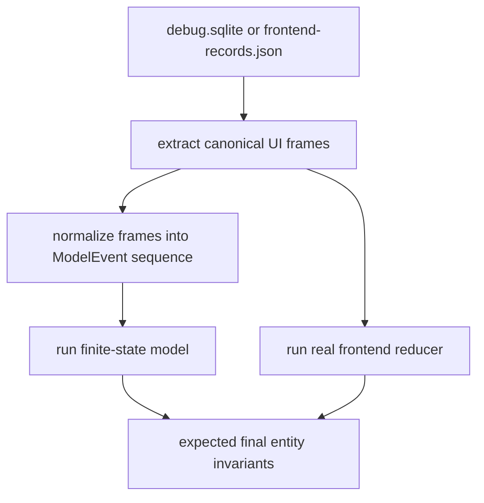

# Finite-state model for protocol conformance

## Purpose of this document

This document teaches the finite-state-model side of the Pinocchio protocol conformance strategy. It assumes the reader knows basic Go and TypeScript, but does not assume prior experience with model-based testing, property-based testing, or formal methods. The document builds the model from first principles, then connects it to Pinocchio’s current runtime, projection, persistence, and frontend code.

The central idea is precise:

```text
current model state + incoming abstract event -> next model state + expected observable outputs
```

That function becomes an executable specification. Production code receives a sequence of real Geppetto or Pinocchio events. The model receives the same sequence in simplified form. The test compares production behavior to the model’s expected lifecycle state and outputs.

This document does not ask the intern to start with TLA+, Apalache, or randomized property testing. Those tools are useful later. The first useful model should be a small Go test helper that covers the chat protocol’s run, text, reasoning, and tool lifecycles with deterministic event programs.

## Executive summary

The provider-to-browser protocol contains several lifecycles that interact:

- provider-native stream lifecycle;
- Geppetto provider-normalization lifecycle;
- run lifecycle;
- provider-call lifecycle;
- text segment lifecycle;
- reasoning segment lifecycle;
- tool call lifecycle;
- timeline persistence lifecycle;
- frontend sparse-patch lifecycle.

A finite-state model makes those lifecycles explicit. It names each lifecycle state, defines the allowed transitions, and records the outputs that production should emit for each transition.

For example:

```text
State before:
  run = streaming
  text[1] = active(content="partial")

Input event:
  RuntimeError("provider failed")

Expected transition:
  text[1] = failed(content="partial", streaming=false, final=true)
  run = failed

Expected observable outputs:
  ChatTextSegmentFinished(status="failed", content="partial", final=true)
  ChatRunFailed(status="failed")
```

This catches a class of bugs that static analysis alone cannot prove. Static analysis can check that the error branch calls `finishActiveTextSegment`; the finite-state model checks that the observable result of a whole sequence is correct.

The recommended path is:

1. Define a small provider-native event alphabet for OpenAI Responses, Chat Completions, Claude, and Gemini.
2. Define the canonical Geppetto event alphabet that provider adapters should produce.
3. Define model state for provider calls, run, text, reasoning, tool, persistence, and frontend entities.
4. Implement provider adapter transition functions and downstream `Step(state, event)` functions as test-only code.
5. Write deterministic table tests that compare provider adapter output and Pinocchio production output to model expectations.
6. Add bounded exhaustive generation for short event sequences.
7. Add property-based random generation only after deterministic coverage is stable.
8. Add trace replay from saved provider/debug/browser artifacts.
9. Consider TLA+ or Apalache only for protocol rules that need independent formal model checking.

## Learning goals

After reading this document, an intern should be able to:

- Define finite state, event alphabet, transition function, model state, expected output, invariant, and counterexample trace.
- Explain why the model must be simpler than production code.
- Identify both provider-adapter states and Pinocchio lifecycle states that matter for conformance.
- Implement a test-only Go model for provider-native event normalization and runtime lifecycle behavior.
- Generate deterministic and bounded event sequences.
- Compare production sessionstream snapshots and frontend reducer state against model expectations.
- Understand when to use property-based testing with Rapid or fast-check.
- Understand when to consider TLA+ or Apalache.
- Read a failing model trace and translate it into a production bug report.

## What a finite-state model is

A finite-state model is a specification with a finite set of states and transitions. Each transition describes how the state changes when an event occurs. For protocol conformance, transitions also describe expected observable outputs.

A minimal definition has five parts:

```text
States:      the finite set of possible lifecycle states.
Events:      the finite set of inputs the model accepts.
Transition:  the function from state and event to next state.
Outputs:     the observable events or entity changes expected from a transition.
Invariants:  properties that must hold after every transition or at terminal points.
```

For Pinocchio, states are lifecycle states such as `streaming`, `finished`, `stopped`, `failed`, `active`, `executing`, and `completed`. Events are abstract inputs such as `TextDelta`, `TextFinished`, `ToolExecutionStarted`, `ToolFinished`, `Interrupt`, and `RuntimeError`.

The model is finite because it deliberately limits the values that affect lifecycle behavior. It does not store arbitrary provider response payloads, timestamps, Watermill message IDs, or raw SQLite rows. It stores only the fields needed to decide lifecycle legality and expected outputs.

## What the model is not

The finite-state model is not a reimplementation of Pinocchio. It should not duplicate every production type and helper. If the model copies the production code too closely, both can share the same mistake.

The model is not the static analyzer. Static analysis inspects code paths. The finite-state model executes event sequences against an abstract spec.

The model is not a browser E2E test. Browser E2E validates real integration. The model validates many lifecycle sequences quickly and locally.

The model is not a proof of all behavior unless every relevant input and scheduler behavior is modeled. The first version is a strong conformance test harness, not a complete formal proof.

## Core vocabulary

### State

State is the data the model keeps between events.

Example:

```go
type RunState string

type ModelState struct {
    Run      RunState
    Text     map[int32]TextSegmentState
    Tools    map[string]ToolState
    LastText int32
}
```

### Event alphabet

The event alphabet is the finite set of input event kinds.

Example:

```go
type ModelEventKind string

const (
    EvRunStarted          ModelEventKind = "RunStarted"
    EvProviderCallStarted ModelEventKind = "ProviderCallStarted"
    EvTextStarted         ModelEventKind = "TextStarted"
    EvTextDelta           ModelEventKind = "TextDelta"
    EvTextFinished        ModelEventKind = "TextFinished"
    EvToolRequested       ModelEventKind = "ToolRequested"
    EvToolExecutionStarted ModelEventKind = "ToolExecutionStarted"
    EvToolFinished        ModelEventKind = "ToolFinished"
    EvInterrupt           ModelEventKind = "Interrupt"
    EvRuntimeError        ModelEventKind = "RuntimeError"
    EvRunFinished         ModelEventKind = "RunFinished"
)
```

### Transition function

The transition function is the model’s executable rule.

```go
func Step(s ModelState, ev ModelEvent) (ModelState, []ExpectedOutput, error)
```

It may return an error for invalid event sequences. Invalid sequences are useful when testing provider adapters, but production conformance tests usually generate valid sequences unless intentionally testing rejection behavior.

### Expected output

Expected output is what production should emit or persist because of a transition.

Example:

```go
type ExpectedOutput struct {
    Kind      string
    MessageID string
    ToolID    string
    Status    string
    Content   string
    Streaming bool
    Final     bool
}
```

Expected outputs should match observable behavior, not private fields. Good observables include backend event names, protobuf payload fields, sessionstream timeline entity fields, persisted timeline props, and frontend reducer state.

### Invariant

An invariant is a property that must hold at defined points.

Examples:

```text
A terminal run has no active text segment.
A terminal run has no executing tool call.
A closed text segment is not rewritten by a later run error.
Provider-call terminal events do not create transcript text.
Sparse terminal tool events do not erase known input.
```

The model can check invariants after every transition and again at the end of a sequence.

### Counterexample trace

A counterexample trace is the sequence that makes an invariant fail.

Example:

```text
1. RunStarted
2. TextStarted(segment=1)
3. TextDelta(segment=1, text="partial")
4. RuntimeError("provider failed")

Failure:
  expected text[1].streaming=false after terminal run
  got text[1].streaming=true
```

The test harness should print counterexample traces in a readable form. A trace that cannot be understood quickly will slow down debugging.

## Why this matters for Pinocchio

Recent bugs were not isolated syntax errors. They were lifecycle errors:

- A run could stop or fail while a text segment was active.
- A terminal text or tool event could be sparse.
- A terminal run event could arrive after a child entity was already closed.
- Provider-call terminal events could be mistaken for transcript terminal events.
- Provider-specific stream events could be normalized into the wrong Geppetto canonical lifecycle.
- Streamed provider tool-call arguments could expose only the latest fragment instead of accumulated input.
- Optional zero indexes could be accidentally dropped.

These bugs depend on event order. Static analysis can check structural properties of the code, but it cannot, by itself, explore the lifecycle state reached by many event sequences. A finite-state model is the right tool for those sequence properties.

## Provider-normalization model

The finite-state model must include the lowest provider-specific layer. This is the hardest layer because it is where external provider semantics are converted into our internal protocol. Downstream Pinocchio tests assume the Geppetto canonical input is already correct. They cannot prove that OpenAI Responses, Chat Completions, Claude, or Gemini were normalized correctly.

A provider-normalization model has two alphabets:

```text
Provider-native input alphabet:
  events as the provider exposes them: response.completed, message_stop, content_block_delta, tool_calls[].function.arguments, candidate.parts, etc.

Canonical output alphabet:
  Geppetto events: EventProviderCallStarted, EventTextDelta, EventReasoningDelta, EventToolCallArgumentsDelta, EventProviderCallFinished, etc.
```

The model transition consumes provider-native input and emits expected canonical output.

```go
type ProviderModelState struct {
    Provider       string
    ProviderCall   ProviderCallModel
    TextSegments   map[string]ProviderSegmentModel
    Reasoning      map[string]ProviderSegmentModel
    ToolCalls      map[string]ProviderToolModel
    CurrentResponseID string
}

type ProviderNativeEvent struct {
    Provider     string
    Kind         string
    ResponseID   string
    ItemID       string
    ChoiceIndex  *int32
    OutputIndex  *int32
    ContentBlockIndex *int32
    ToolCallID   string
    ToolName     string
    Delta        string
    Text         string
    Arguments    string
    StopReason   string
}

func ProviderStep(s ProviderModelState, ev ProviderNativeEvent) (ProviderModelState, []CanonicalExpectation, error)
```

The provider model should not duplicate the full provider SDK. It should encode the provider behaviors that caused or could cause protocol bugs:

- envelope start/finish events;
- text start/delta/done events;
- reasoning delta/done events;
- function-call argument fragments;
- content block indexes;
- output item IDs;
- choice indexes;
- late response IDs;
- stop reasons and finish classes.

### Provider-specific model tables

| Provider | Native state to model | Canonical expectation |
|---|---|---|
| OpenAI Responses | current response ID, output item ID, output index, reasoning summary index, pending function-call args | response lifecycle emits provider-call events; text output events emit text segment events; reasoning summary events emit reasoning events; function-call argument deltas emit accumulated tool arguments. |
| Chat Completions | current choice index, current response ID, stream kind, tool call ID/index, accumulated tool argument buffers | content deltas emit text events; compatible-provider reasoning fields emit reasoning events; tool-call fragments emit `Delta` as current fragment and `Arguments` as accumulated input. |
| Claude | message ID, message stop reason, content block index, content block type, accumulated block text/input | message start/stop emits provider-call events; text content blocks emit text lifecycle; tool-use content blocks emit tool lifecycle; message stop does not create text. |
| Gemini | provider call, candidate parts, text message buffer, function-call parts, finish reason | text parts emit text lifecycle; function-call parts emit tool lifecycle; finish reason emits provider-call finish and only finishes text when text exists. |

### Provider-normalization invariants

```text
PN1: Provider envelope terminal events only close provider calls.
PN2: Provider text terminal events can close only an existing text segment.
PN3: Provider reasoning events never become assistant text.
PN4: Tool argument fragment events preserve both current fragment and accumulated arguments.
PN5: Provider-specific indexes and IDs remain in typed correlation.
PN6: Usage-only or metadata-only provider events never create transcript entities.
PN7: A provider fixture's canonical output validates with events.ValidateCanonicalEvent.
```

These invariants should be checked before the downstream Pinocchio model runs. If the provider-normalization model fails, the bug belongs in Geppetto provider adapter code. If provider normalization passes but the downstream model fails, the bug belongs in Pinocchio projection, persistence, or frontend code.

## Current provider-to-browser lifecycles

The model should be grounded in current code.

| Lifecycle | Production code | What the model should represent |
|---|---|---|
| Provider normalization | `geppetto/pkg/steps/ai/openai_responses/streaming.go`, `geppetto/pkg/steps/ai/openai/engine_openai.go`, `geppetto/pkg/steps/ai/claude/content-block-merger.go`, `geppetto/pkg/steps/ai/gemini/engine_gemini.go` | Provider-native event state and expected canonical Geppetto output. |
| Run | `pkg/chatapp/runtime_inference.go`, `pkg/chatapp/runtime_sink.go` | `idle`, `streaming`, `finished`, `stopped`, `failed`. |
| Provider call | Geppetto provider events translated in `runtime_sink.go` | Provider-call status and the rule that provider terminal events do not create transcript text. |
| Text segment | `runtime_sink.go`, `projections.go`, `timeline_persist.go`, `timelineEvents.ts` | Per-segment `none`, `active`, `finished`, `stopped`, `failed`, content, finality, streaming. |
| Reasoning segment | `pkg/chatapp/plugins/reasoning.go`, `timelineEvents.ts` | Separate thinking segments with stable IDs and streaming/final state. |
| Tool call | `pkg/chatapp/plugins/toolcall.go`, `timelineEvents.ts` | Per-tool `pending`, `streaming_args`, `requested`, `executing`, `result_ready`, `completed`, `failed`, input/name preservation. |
| Frontend patch | `cmd/web-chat/web/src/ws/timelineEvents.ts`, `timelineSlice.ts` | Sparse patch merge behavior and field preservation. |
| Persistence | `pkg/ui/timeline_persist.go` | Current text segment identity and persisted streaming/content state. |

## Model boundaries

A useful model is smaller than production. The first version should include these fields:

```go
type ModelState struct {
    ProviderNormalization ProviderModelState
    Run       RunModel
    Providers map[int32]ProviderCallModel
    Text      map[int32]TextModel
    Reasoning map[int32]ReasoningModel
    Tools     map[string]ToolModel
    Frontend  map[string]FrontendEntityModel
    LastTextSegment int32
}
```

Do include:

- provider-native normalization state;
- lifecycle status;
- text/reasoning/tool content needed for terminal preservation;
- segment/tool identities;
- streaming/executing/final flags;
- correlation fields that affect joins;
- whether an entity is visible.

Do not include in the first version:

- raw provider JSON;
- full protobuf descriptors;
- timestamps;
- Watermill message UUIDs;
- SQLite row IDs;
- every render-only frontend prop;
- every profile/runtime attribute.

The model should be small enough that every field has a test reason to exist.

## Run lifecycle model

Run states:

```go
type RunStatus string

const (
    RunIdle      RunStatus = "idle"
    RunStreaming RunStatus = "streaming"
    RunFinished  RunStatus = "finished"
    RunStopped   RunStatus = "stopped"
    RunFailed    RunStatus = "failed"
)
```

Run transitions:

| Current state | Event | Next state | Expected output |
|---|---|---|---|
| `idle` | `RunStarted` | `streaming` | `ChatRunStarted` |
| `streaming` | `RunFinished` | `finished` | `ChatRunFinished` |
| `streaming` | `Interrupt` | `stopped` | optional active child finalization, then `ChatRunStopped` |
| `streaming` | `RuntimeError` | `failed` | optional active child finalization, then `ChatRunFailed` |
| terminal | any child event | invalid or ignored, depending on production contract | diagnostic in model tests |

The model should enforce at most one terminal run event.

```go
func terminalRun(s RunStatus) bool {
    return s == RunFinished || s == RunStopped || s == RunFailed
}
```

Invariant:

```text
I1: Once Run is terminal, it cannot transition to another terminal state in the same run.
```

## Provider-call lifecycle model

Provider-call states:

```go
type ProviderStatus string

const (
    ProviderNone      ProviderStatus = "none"
    ProviderStarted   ProviderStatus = "started"
    ProviderFinished  ProviderStatus = "finished"
)
```

Provider-call transitions:

| Current state | Event | Next state | Expected output |
|---|---|---|---|
| `none` | `ProviderCallStarted(index)` | `started` | `ChatProviderCallStarted` |
| `started` | `ProviderCallMetadataUpdated(index)` | `started` | `ChatProviderCallMetadataUpdated` |
| `started` or `none` | `ProviderCallFinished(index)` | `finished` | `ChatProviderCallFinished` |

The important rule is not the provider state itself. The important rule is that provider-call events are not transcript events.

Invariant:

```text
I-provider-boundary: ProviderCallFinished does not create, finish, or modify a text segment.
```

The model can enforce this by checking that a `ProviderCallFinished` transition produces no `ChatTextSegmentFinished` output and does not change any text state.

## Text segment lifecycle model

Text segment states:

```go
type TextStatus string

const (
    TextNone      TextStatus = "none"
    TextActive    TextStatus = "active"
    TextFinished  TextStatus = "finished"
    TextStopped   TextStatus = "stopped"
    TextFailed    TextStatus = "failed"
)

type TextModel struct {
    Status    TextStatus
    Content   string
    Visible   bool
    Streaming bool
    Final     bool
}
```

Text transitions:

| Current state | Event | Next state | Expected output |
|---|---|---|---|
| `none` | `TextStarted(segment)` | `active` | `ChatTextSegmentStarted`; no visible entity required |
| `none` or `active` | `TextDelta(segment, text)` | `active` | `ChatTextDelta`; visible if text non-empty |
| `active` | `TextFinished(segment, text)` | `finished` | `ChatTextSegmentFinished(status=finished, final=true)` |
| `active` | `Interrupt` | `stopped` | `ChatTextSegmentFinished(status=stopped, final=true)` |
| `active` | `RuntimeError` | `failed` | `ChatTextSegmentFinished(status=failed, final=true)` |
| `finished` | `RuntimeError` | `finished` | no text rewrite |
| `none` | `Interrupt` or `RuntimeError` | `none` | no assistant text entity manufactured |

The model should track `Visible` separately from `Status`. A segment may be active because a start event arrived, but it should not necessarily be visible yet. Current projections intentionally avoid creating empty assistant entities for unseen text starts.

Important invariants:

```text
I2a: TextStarted alone does not require a visible assistant entity.
I2b: Active text becomes non-streaming and final when run stops or fails.
I2c: Finished text is not rewritten to failed by a later run error.
I2d: No-text stop/failure does not create a root assistant entity.
```

## Reasoning segment lifecycle model

Reasoning states:

```go
type ReasoningStatus string

const (
    ReasoningNone     ReasoningStatus = "none"
    ReasoningActive   ReasoningStatus = "active"
    ReasoningFinished ReasoningStatus = "finished"
)

type ReasoningModel struct {
    Status    ReasoningStatus
    Content   string
    Visible   bool
    Streaming bool
    Source    string
}
```

Reasoning transitions:

| Current state | Event | Next state | Expected output |
|---|---|---|---|
| `none` | `ReasoningStarted(segment)` | `active` | `ChatReasoningSegmentStarted`; no visible empty entity required |
| `none` or `active` | `ReasoningDelta(segment, text)` | `active` | `ChatReasoningDelta`; visible if text non-empty |
| `active` | `ReasoningFinished(segment, text)` | `finished` | `ChatReasoningSegmentFinished`; visible content preserved |
| `none` | `ReasoningFinished(segment, empty)` | `none` | no visible empty entity |

Reasoning invariants:

```text
I3a: Reasoning entities use role thinking.
I3b: Reasoning segment IDs are stable across start, delta, and finish.
I3c: Empty unseen reasoning finish does not create a visible entity.
I3d: Reasoning content is not merged into assistant text content.
```

The model should keep reasoning separate from text even when both belong to the same assistant message.

## Tool lifecycle model

Tool states:

```go
type ToolStatus string

const (
    ToolNone          ToolStatus = "none"
    ToolStarted       ToolStatus = "started"
    ToolStreamingArgs ToolStatus = "streaming_args"
    ToolRequested     ToolStatus = "requested"
    ToolExecuting     ToolStatus = "executing"
    ToolResultReady   ToolStatus = "result_ready"
    ToolCompleted     ToolStatus = "completed"
    ToolFailed        ToolStatus = "failed"
)

type ToolModel struct {
    Status    ToolStatus
    ToolName  string
    InputRaw  string
    ResultRaw string
    Executing bool
    Done      bool
}
```

Tool transitions:

| Current state | Event | Next state | Expected output |
|---|---|---|---|
| `none` | `ToolCallStarted(id, name)` | `started` | `ChatToolCallStarted` |
| `started` or `streaming_args` | `ToolArgumentsDelta(id, delta, accumulated)` | `streaming_args` | `ChatToolCallArgumentsDelta(input=accumulated)` |
| any non-terminal | `ToolRequested(id, name, input)` | `requested` | `ChatToolCallRequested` |
| `requested` or earlier | `ToolExecutionStarted(id, name, input)` | `executing` | `ChatToolExecutionStarted(executing=true)` |
| `executing` | `ToolResultReady(id, result)` | `result_ready` | `ChatToolResultReady` |
| `result_ready` or `executing` or `requested` | `ToolFinished(id, status)` | `completed` or `failed` | `ChatToolCallFinished(executing=false, done=true)` |

Tool sparse-patch invariants:

```text
I4a: ToolCallFinished may be sparse and must not clear known ToolName or InputRaw.
I4b: ToolArgumentsDelta.input is accumulated input, not only the current delta.
I4c: ToolResultReady creates a result entity linked to the same tool call ID.
I4d: Terminal run state does not leave tools executing=true.
```

The model should distinguish accumulated input from delta input. This directly protects the streamed OpenAI tool-call argument behavior.

## Frontend sparse-patch model

The frontend model can be simple. It only needs to represent what Redux should preserve or update.

```ts
type Entity = {
  id: string;
  kind: string;
  props: Record<string, unknown>;
};

type FrontendState = {
  byId: Record<string, Entity>;
  order: string[];
};

function applyPatch(state: FrontendState, patch: Entity): FrontendState {
  const existing = state.byId[patch.id];
  if (!existing) return insert(state, patch);
  return {
    ...state,
    byId: {
      ...state.byId,
      [patch.id]: {
        ...existing,
        ...patch,
        props: { ...(existing.props ?? {}), ...(patch.props ?? {}) },
      },
    },
  };
}
```

Frontend invariants:

```text
I5a: Sparse terminal patches omit absent fields.
I5b: Reducer merge preserves existing fields not present in the patch.
I5c: Optional zero indexes remain present after decoding and patch generation.
I5d: Tool finish patch sets done=true and executing=false without clearing input/name.
```

The model should generate UI-frame sequences and apply them through the real reducer when possible. The expected behavior can be checked with a small model of the entity props that matter.

## Persistence model

Persistence receives event JSON and writes timeline entities. It should track the same text segment identity across partial text and terminal interruption.

Persistence state:

```go
type PersistModel struct {
    CurrentTextID string
    Messages map[string]PersistedMessage
}

type PersistedMessage struct {
    Role      string
    Content   string
    Streaming bool
}
```

Persistence transitions:

| Event | Expected persistence behavior |
|---|---|
| `TextDelta(segment=1, text="partial")` | Persist segment 1 as assistant, streaming true. |
| `Interrupt(empty)` after delta | Persist same segment 1 as assistant, streaming false, content preserved. |
| `Interrupt(empty)` before text | Do not persist root assistant entity. |
| `TextFinished(segment=1)` then error | Do not rewrite segment 1 content as failed/empty. |

Invariant:

```text
I7: Stop/error persistence uses the current canonical text segment identity, not a root message fallback, when a visible text segment exists.
```

## Abstract event definitions

Use two levels of model events. Provider-normalization tests start with provider-native events and expect canonical Geppetto events. Downstream Pinocchio tests start with canonical model events and expect backend/UI/timeline state.

Provider-native model events can use one Go type with optional fields:

```go
type ProviderEventKind string

const (
    ProviderEnvelopeStarted ProviderEventKind = "ProviderEnvelopeStarted"
    ProviderEnvelopeMetadata ProviderEventKind = "ProviderEnvelopeMetadata"
    ProviderEnvelopeFinished ProviderEventKind = "ProviderEnvelopeFinished"
    ProviderTextStarted ProviderEventKind = "ProviderTextStarted"
    ProviderTextDelta ProviderEventKind = "ProviderTextDelta"
    ProviderTextFinished ProviderEventKind = "ProviderTextFinished"
    ProviderReasoningStarted ProviderEventKind = "ProviderReasoningStarted"
    ProviderReasoningDelta ProviderEventKind = "ProviderReasoningDelta"
    ProviderReasoningFinished ProviderEventKind = "ProviderReasoningFinished"
    ProviderToolStarted ProviderEventKind = "ProviderToolStarted"
    ProviderToolArgumentsDelta ProviderEventKind = "ProviderToolArgumentsDelta"
    ProviderToolFinished ProviderEventKind = "ProviderToolFinished"
)

type ProviderModelEvent struct {
    Provider string
    Kind ProviderEventKind
    NativeName string
    ResponseID string
    ItemID string
    OutputIndex *int32
    SummaryIndex *int32
    ChoiceIndex *int32
    ContentBlockIndex *int32
    ToolCallID string
    ToolName string
    Delta string
    Text string
    Arguments string
    StopReason string
}
```

Provider-normalization tests then compare expected canonical event kinds and correlation fields.

Downstream model tests can use one Go type with optional fields.

```go
type EventKind string

const (
    EventRunStarted EventKind = "RunStarted"
    EventRunFinished EventKind = "RunFinished"
    EventProviderStarted EventKind = "ProviderStarted"
    EventProviderFinished EventKind = "ProviderFinished"
    EventTextStarted EventKind = "TextStarted"
    EventTextDelta EventKind = "TextDelta"
    EventTextFinished EventKind = "TextFinished"
    EventReasoningStarted EventKind = "ReasoningStarted"
    EventReasoningDelta EventKind = "ReasoningDelta"
    EventReasoningFinished EventKind = "ReasoningFinished"
    EventToolStarted EventKind = "ToolStarted"
    EventToolArgumentsDelta EventKind = "ToolArgumentsDelta"
    EventToolRequested EventKind = "ToolRequested"
    EventToolExecutionStarted EventKind = "ToolExecutionStarted"
    EventToolResultReady EventKind = "ToolResultReady"
    EventToolFinished EventKind = "ToolFinished"
    EventInterrupt EventKind = "Interrupt"
    EventRuntimeError EventKind = "RuntimeError"
)

type ModelEvent struct {
    Kind       EventKind
    Segment    int32
    ToolID     string
    ToolName   string
    Delta      string
    Text       string
    InputRaw   string
    ResultRaw  string
    Status     string
    Correlation CorrelationModel
}
```

The downstream event type is intentionally abstract. It does not need full Geppetto event payloads. A translator can convert abstract model events into real Geppetto events for Pinocchio production tests. Provider-normalization tests use the provider-native model events and run provider adapter code directly.

## Transition function sketch

A simplified `Step` function:

```go
func Step(s State, ev ModelEvent) (State, []ExpectedOutput, error) {
    switch ev.Kind {
    case EventRunStarted:
        if s.Run.Status != RunIdle {
            return s, nil, invalid(ev, "run already started")
        }
        s.Run.Status = RunStreaming
        return s, []ExpectedOutput{{Kind: "ChatRunStarted"}}, nil

    case EventTextStarted:
        txt := s.ensureText(ev.Segment)
        if txt.isTerminal() {
            return s, nil, invalid(ev, "text segment already terminal")
        }
        txt.Status = TextActive
        txt.Streaming = true
        s.Text[ev.Segment] = txt
        s.LastTextSegment = ev.Segment
        return s, []ExpectedOutput{{Kind: "ChatTextSegmentStarted", Segment: ev.Segment}}, nil

    case EventTextDelta:
        txt := s.ensureText(ev.Segment)
        if txt.isTerminal() {
            return s, nil, invalid(ev, "text delta after terminal text")
        }
        txt.Status = TextActive
        txt.Content = ev.Text
        txt.Visible = strings.TrimSpace(ev.Text) != ""
        txt.Streaming = true
        s.Text[ev.Segment] = txt
        s.LastTextSegment = ev.Segment
        return s, []ExpectedOutput{{Kind: "ChatTextDelta", Segment: ev.Segment, Content: ev.Text, Streaming: true}}, nil

    case EventRuntimeError:
        out := []ExpectedOutput{}
        if s.Run.Status == RunStreaming {
            if active, ok := s.activeText(); ok {
                active.Status = TextFailed
                active.Streaming = false
                active.Final = true
                s.Text[active.Segment] = active
                out = append(out, ExpectedOutput{Kind: "ChatTextSegmentFinished", Segment: active.Segment, Status: "failed", Content: active.Content, Final: true})
            }
            s.Run.Status = RunFailed
            out = append(out, ExpectedOutput{Kind: "ChatRunFailed", Status: "failed"})
        }
        return s, out, nil
    }
    return s, nil, invalid(ev, "unknown event kind")
}
```

The real implementation should be split by lifecycle so each transition is readable.

## Expected production execution

The model itself is not enough. Tests need to execute production code with equivalent events.

The runtime conformance harness should do this:

```go
func TestRuntimeModelConformance(t *testing.T) {
    programs := []Program{
        {
            Name: "partial-then-error",
            Events: []ModelEvent{
                {Kind: EventRunStarted},
                {Kind: EventTextStarted, Segment: 1},
                {Kind: EventTextDelta, Segment: 1, Text: "partial"},
                {Kind: EventRuntimeError, Status: "failed"},
            },
        },
    }

    for _, p := range programs {
        t.Run(p.Name, func(t *testing.T) {
            expected := RunModel(p.Events)
            actual := RunProductionRuntime(t, p.Events)
            AssertConforms(t, expected, actual)
        })
    }
}
```

`RunProductionRuntime` translates model events into real Geppetto events and runs them through the real Pinocchio engine/sessionstream path.

```go
func geppettoEventsFor(modelEvents []ModelEvent) ([]gepevents.Event, error) {
    out := []gepevents.Event{}
    for _, ev := range modelEvents {
        switch ev.Kind {
        case EventTextStarted:
            out = append(out, gepevents.NewTextSegmentStartedEvent(meta(ev), textCorr(ev), "assistant"))
        case EventTextDelta:
            out = append(out, gepevents.NewTextDeltaEvent(meta(ev), textCorr(ev), ev.Text, ev.Text, 1))
        case EventTextFinished:
            out = append(out, gepevents.NewTextSegmentFinishedEvent(meta(ev), textCorr(ev), ev.Text, "stop"))
        case EventInterrupt:
            out = append(out, gepevents.NewInterruptEvent(meta(ev), ev.Text))
        }
    }
    return out, nil
}
```

For `RuntimeError`, the fake runtime should return an error after publishing prior events rather than publishing a Geppetto event, because that exercises `runRuntimeInference` error handling.

Provider-normalization production execution has a different shape. It feeds native provider fixture events into the provider adapter and captures canonical Geppetto events before Pinocchio is involved.

```go
func TestProviderNormalizationModelConformance(t *testing.T) {
    fixture := ProviderFixture{
        Name: "chat-completions-streamed-tool-args",
        Events: []ProviderModelEvent{
            {Provider: "openai", Kind: ProviderEnvelopeStarted},
            {Provider: "openai", Kind: ProviderToolStarted, ToolCallID: "call_1", ToolName: "lookup"},
            {Provider: "openai", Kind: ProviderToolArgumentsDelta, ToolCallID: "call_1", Delta: "{\"q\"", Arguments: "{\"q\""},
            {Provider: "openai", Kind: ProviderToolArgumentsDelta, ToolCallID: "call_1", Delta: ":\"gold\"}", Arguments: "{\"q\":\"gold\"}"},
            {Provider: "openai", Kind: ProviderEnvelopeFinished, StopReason: "tool_calls"},
        },
    }

    expected := RunProviderModel(fixture.Events)
    actual := RunProviderAdapterFixture(t, fixture)
    AssertCanonicalOutputConforms(t, expected, actual)
}
```

This test is intentionally lower than Pinocchio. It proves that provider-specific stream shapes become the right Geppetto canonical event sequence before any downstream projection code sees them.

## Comparing model output to production output

Production can be compared at multiple layers.

### Backend event comparison

Capture backend events through `WithHooks(Hooks{OnBackendEvent: ...})` or the sessionstream event store. Compare event names and relevant payload fields.

Good for:

- exact output order;
- terminal event presence;
- correlation propagation;
- status fields.

### Timeline snapshot comparison

Use `hub.Snapshot` after the run completes. Compare timeline entities.

Good for:

- final visible state;
- no phantom assistant entity;
- no streaming text after terminal run;
- tool input/name preservation in projected entities.

### Frontend reducer comparison

Replay UI frames through `timelineMutationFromUIEvent` and `timelineSlice.upsertEntity`.

Good for:

- sparse-patch behavior;
- optional zero index preservation;
- reducer merge semantics.

### Persistence comparison

Feed serialized Geppetto events to `StepTimelinePersistFuncWithVersion` and inspect the fake timeline store.

Good for:

- current text ID persistence;
- interrupt/error finalization under the same segment ID;
- no root assistant fallback when no text exists.

The first model harness should compare snapshots and selected backend events. Add frontend and persistence comparison as separate test layers.

## Deterministic matrix before generation

Before generating event sequences, write a deterministic matrix. This makes the model readable and gives reviewers fixed examples.

Initial rows:

| Name | Sequence | Main invariant |
|---|---|---|
| `no-text-finished` | RunStarted, RunFinished | no assistant entity manufactured |
| `no-text-failed` | RunStarted, RuntimeError | no assistant entity manufactured |
| `no-text-interrupt` | RunStarted, Interrupt | no assistant entity manufactured |
| `started-no-delta-interrupt` | RunStarted, TextStarted, Interrupt | no empty visible assistant unless content exists |
| `delta-finished` | RunStarted, TextStarted, TextDelta, TextFinished, RunFinished | text final and not streaming |
| `delta-runtime-error` | RunStarted, TextStarted, TextDelta, RuntimeError | active text failed and run failed |
| `delta-interrupt` | RunStarted, TextStarted, TextDelta, Interrupt | active text stopped and run stopped |
| `finished-then-error` | RunStarted, TextStarted, TextDelta, TextFinished, RuntimeError | finished text not rewritten |
| `provider-finished-no-text` | RunStarted, ProviderStarted, ProviderFinished, RunFinished | provider terminal does not create text |
| `text-tool-text` | RunStarted, TextFinished, ToolRequested, ToolExecutionStarted, ToolResultReady, ToolFinished, TextFinished, RunFinished | distinct text and tool lifecycles |

Existing Pinocchio tests already cover several of these. The model layer can either consolidate them or keep them and add model-backed rows for missing behavior.

## Bounded exhaustive generation

After deterministic rows pass, add bounded generation. Bounded generation enumerates event sequences up to a fixed length while respecting preconditions.

Example:

```go
func NextEvents(s State) []ModelEvent {
    events := []ModelEvent{}

    if s.Run.Status == RunIdle {
        return []ModelEvent{{Kind: EventRunStarted}}
    }
    if s.Run.Status != RunStreaming {
        return nil
    }

    events = append(events,
        ModelEvent{Kind: EventProviderStarted, ProviderIndex: 1},
        ModelEvent{Kind: EventProviderFinished, ProviderIndex: 1},
        ModelEvent{Kind: EventTextStarted, Segment: 1},
        ModelEvent{Kind: EventTextDelta, Segment: 1, Text: "x"},
        ModelEvent{Kind: EventTextFinished, Segment: 1, Text: "x"},
        ModelEvent{Kind: EventInterrupt},
        ModelEvent{Kind: EventRuntimeError},
        ModelEvent{Kind: EventRunFinished},
    )
    return filterByPreconditions(s, events)
}
```

Depth-first generation:

```go
func Enumerate(s State, prefix []ModelEvent, maxDepth int, visit func([]ModelEvent)) {
    if len(prefix) >= maxDepth || terminal(s.Run.Status) {
        visit(prefix)
        return
    }
    for _, ev := range NextEvents(s) {
        next, _, err := Step(s, ev)
        if err != nil {
            continue
        }
        Enumerate(next, append(prefix, ev), maxDepth, visit)
    }
}
```

Keep bounds small at first:

```text
max depth: 5 or 6
segments: 1 or 2
tools: 1
provider calls: 1
reasoning segments: 1
```

Bounded exhaustive generation is often more useful than immediate random testing because it produces a predictable list of cases and does not depend on shrinking.

## Property-based testing

Property-based testing generates many inputs and checks invariants. It is useful after deterministic and bounded tests are stable.

### Go with Rapid

Rapid is a Go property-based testing library with support for shrinking and stateful/model-based tests. It can generate event sequences and minimize failing sequences.

Example shape:

```go
func TestProtocolProperties(t *testing.T) {
    rapid.Check(t, func(t *rapid.T) {
        seq := GenerateValidEventSequence(t, MaxDepth(12), MaxSegments(2), MaxTools(1))
        expected := RunModel(seq)
        actual := RunProductionRuntime(t, seq)
        AssertInvariants(t, expected, actual)
    })
}
```

Do not start here. Without deterministic examples, random failures are harder to interpret. With a model and clear invariant names, property tests become productive.

### TypeScript with fast-check

fast-check can generate UI frame sequences and replay them through the real reducer.

Example shape:

```ts
it('preserves sparse patch invariants', () => {
  fc.assert(
    fc.property(validFrameSequenceArbitrary(), (frames) => {
      const model = runFrontendModel(frames);
      const actual = applyFramesThroughReducer(frames);
      expectNoSparseClear(model, actual);
      expectNoZeroIndexesDropped(actual);
    }),
  );
});
```

Use fast-check after the reducer-backed deterministic tests pass.

## Trace replay

Trace replay uses real saved frames from browser/debug artifacts. It verifies that the model handles realistic provider event order and frontend decoding behavior.

Replay pipeline:



Trace replay should use curated fixtures. Do not commit large browser artifacts. Extract small frame sequences that demonstrate protocol cases:

- tool call with streamed arguments;
- reasoning segment with optional zero indexes;
- text-tool-text interleaving;
- stopped run after partial text;
- failed run after partial text.

Fixture example:

```json
{
  "name": "tool-sparse-finish-preserves-input",
  "frames": [
    {
      "name": "ChatToolExecutionStarted",
      "payload": {
        "toolCallId": "call_1",
        "toolName": "search",
        "input": "{\"query\":\"gold\"}",
        "executing": true,
        "status": "executing"
      }
    },
    {
      "name": "ChatToolCallFinished",
      "payload": {
        "toolCallId": "call_1",
        "status": "completed"
      }
    }
  ],
  "expect": {
    "entities": {
      "call_1": {
        "inputRaw": "{\"query\":\"gold\"}",
        "status": "completed",
        "done": true,
        "executing": false
      }
    }
  }
}
```

## TLA+ and external model checking

TLA+ is a formal specification language for state machines, especially concurrent and distributed systems. TLC and Apalache are tools that check TLA+ specifications over bounded or symbolic state spaces.

TLA+ is useful when:

- the protocol rules involve concurrency or ordering that is hard to test exhaustively in Go;
- the team wants an implementation-independent model;
- the model is stable enough to justify a separate specification;
- review requires a precise statement of safety properties.

A small TLA+ sketch for the run/text part might define variables:

```tla
VARIABLES run, text, content

RunStarted ==
  /\ run = "idle"
  /\ run' = "streaming"
  /\ UNCHANGED <<text, content>>

TextDelta ==
  /\ run = "streaming"
  /\ text' = "active"
  /\ content' = "partial"
  /\ UNCHANGED run

RuntimeError ==
  /\ run = "streaming"
  /\ run' = "failed"
  /\ IF text = "active" THEN text' = "failed" ELSE text' = text
  /\ UNCHANGED content

NoActiveTextAfterTerminal ==
  run \in {"finished", "stopped", "failed"} => text # "active"
```

This is not the recommended first implementation. It is a later option if the Go model reveals tricky concurrent or ordering questions.

## State explosion

State explosion occurs when the number of possible states or sequences grows too quickly. The solution is not to model everything. The solution is to choose abstractions carefully.

Control the state space by:

- limiting segment count to one or two;
- limiting tool count to one for initial tests;
- using representative text values such as `""`, `"partial"`, and `"final"`;
- modeling status and preservation fields, not full payloads;
- keeping provider call count small;
- separating deterministic tests from random tests;
- adding preconditions that avoid invalid sequences unless testing invalid behavior.

A small model that catches real bugs is better than a large model that cannot be run or understood.

## Model validation strategy

The model itself can be wrong. Treat it as production-adjacent code and test it.

Validation layers:

1. Unit-test each transition rule directly.
2. Compare deterministic model programs to existing Pinocchio regression tests.
3. Review model transition tables in the design document.
4. Print model traces for every failure.
5. Keep model code simple enough for reviewers to read.
6. Add comments that link transition rules to protocol invariants.

Example model unit test:

```go
func TestModelRuntimeErrorClosesActiveText(t *testing.T) {
    s := InitialState().WithRun(RunStreaming).WithText(1, TextModel{
        Status: TextActive,
        Content: "partial",
        Streaming: true,
        Visible: true,
    })
    next, out, err := Step(s, ModelEvent{Kind: EventRuntimeError})
    require.NoError(t, err)
    require.Equal(t, TextFailed, next.Text[1].Status)
    require.False(t, next.Text[1].Streaming)
    require.Contains(t, out, ExpectedOutput{Kind: "ChatTextSegmentFinished", Segment: 1, Status: "failed", Content: "partial", Final: true})
}
```

## Assertion design

Assertions should report protocol invariants, not only field mismatches.

Bad failure:

```text
expected false, got true
```

Good failure:

```text
I2b violation after sequence [RunStarted, TextDelta(segment=1), RuntimeError]: text segment 1 remains streaming=true after run failed
```

Expected assertion helpers:

```go
func AssertNoActiveChildrenAfterTerminal(t *testing.T, state State, actual Snapshot)
func AssertNoPhantomAssistant(t *testing.T, state State, actual Snapshot)
func AssertClosedSegmentsNotRewritten(t *testing.T, before, after Snapshot)
func AssertToolSparseFieldsPreserved(t *testing.T, expected State, actual FrontendState)
func AssertCorrelationPreserved(t *testing.T, expected State, actual Snapshot)
```

Each helper should include the invariant ID in its error message.

## Implementation phases

### Phase 1: Deterministic provider-normalization model

Files:

```text
geppetto/pkg/steps/ai/openai_responses/provider_protocol_model_test.go
geppetto/pkg/steps/ai/openai/provider_protocol_model_test.go
geppetto/pkg/steps/ai/claude/provider_protocol_model_test.go
geppetto/pkg/steps/ai/gemini/provider_protocol_model_test.go
```

Tasks:

1. Define provider-native model events and canonical output expectations.
2. Implement provider model transitions for envelope, text, reasoning, and tool events.
3. Feed provider-native fixtures into each provider adapter.
4. Compare canonical Geppetto events against model output.
5. Assert `events.ValidateCanonicalEvent` passes for every canonical event.

Validation:

```bash
cd geppetto
go test ./pkg/steps/ai/openai_responses ./pkg/steps/ai/openai ./pkg/steps/ai/claude ./pkg/steps/ai/gemini -run 'ProviderProtocol|ProviderModel' -count=1
```

### Phase 2: Deterministic Go model for runtime lifecycle

Files:

```text
pkg/chatapp/protocol_model_test.go
pkg/chatapp/chat_protocol_conformance_test.go
```

Tasks:

1. Define `ModelEvent`, `State`, lifecycle status enums, and `ExpectedOutput`.
2. Implement run/text/provider transitions.
3. Translate model events into Geppetto events.
4. Run production through `NewEngine`, `sessionstream.Hub`, and fake runtime engines.
5. Compare final sessionstream snapshots and key backend events.

Validation:

```bash
cd pinocchio
go test ./pkg/chatapp -run 'TestProtocolModel|TestChatProtocolConformance' -count=1
```

### Phase 3: Add tool and reasoning lifecycles

Files:

```text
pkg/chatapp/plugins/protocol_model_test.go
pkg/chatapp/plugins/toolcall_protocol_conformance_test.go
pkg/chatapp/plugins/reasoning_protocol_conformance_test.go
```

Tasks:

1. Add tool state transitions.
2. Add reasoning state transitions.
3. Test sparse terminal tool finish behavior.
4. Test reasoning stable identity and content preservation.

Validation:

```bash
go test ./pkg/chatapp/plugins -count=1
```

### Phase 4: Add frontend reducer model

Files:

```text
cmd/web-chat/web/src/ws/protocolModel.test.ts
cmd/web-chat/web/src/ws/protocolConformance.test.ts
```

Tasks:

1. Define a small frontend entity model.
2. Replay UI frames through the real mapper and reducer.
3. Compare final props against model expectations.
4. Add deterministic sparse-patch cases.

Validation:

```bash
cd pinocchio/cmd/web-chat/web
npx vitest run src/ws/wsManager.test.ts src/ws/protocolConformance.test.ts src/ws/protocolModel.test.ts
npm run typecheck
npm run lint
```

### Phase 5: Add persistence model

Files:

```text
pkg/ui/timeline_persist_protocol_model_test.go
```

Tasks:

1. Define persistence model state.
2. Feed serialized Geppetto events to `StepTimelinePersistFuncWithVersion`.
3. Compare stored entities to model expectations.
4. Cover interrupt/error before, during, and after text.

Validation:

```bash
go test ./pkg/ui -count=1
```

### Phase 6: Add bounded exhaustive generation

Tasks:

1. Add `NextEvents(state)`.
2. Enumerate sequences up to small depth.
3. Run only fast model checks first.
4. Run a selected subset through production to avoid slow tests.
5. Print trace names and invariant failures.

Validation:

```bash
go test ./pkg/chatapp -run TestProtocolBoundedSequences -count=1
```

### Phase 7: Add property-based tests

Tasks:

1. Add Rapid for Go only if dependency policy allows it.
2. Add fast-check for frontend only if dependency policy allows it.
3. Generate valid sequences with preconditions.
4. Keep deterministic tests as the primary regression suite.

Validation:

```bash
go test ./pkg/chatapp -run TestProtocolProperties -count=1
cd cmd/web-chat/web && npx vitest run src/ws/protocolProperties.test.ts
```

### Phase 8: Add trace replay

Tasks:

1. Extract curated traces from browser artifacts.
2. Store small sanitized fixtures.
3. Replay through model and real reducer.
4. Assert final invariants.

Validation:

```bash
cd cmd/web-chat/web
npx vitest run src/ws/traceReplay.test.ts
```

## Reading failure traces

Every model failure should print:

1. sequence name;
2. event list;
3. model final state;
4. production final state;
5. violated invariant;
6. likely source file.

Example:

```text
FAIL: TestChatProtocolConformance/delta-runtime-error
Invariant: I2b active text must close on run failure
Sequence:
  1 RunStarted
  2 TextStarted(segment=1)
  3 TextDelta(segment=1, text="partial")
  4 RuntimeError("provider failed")
Model expected:
  text[1] status=failed streaming=false final=true content="partial"
Production got:
  text[1] status=streaming streaming=true final=false content="partial"
Likely files:
  pkg/chatapp/runtime_inference.go
  pkg/chatapp/runtime_sink.go
```

This style makes failures actionable for interns and reviewers.

## Common mistakes

### Modeling too much

Do not include every production field. If a field does not affect lifecycle status, identity, visibility, finality, sparse preservation, or correlation joins, leave it out of the first model.

### Generating invalid sequences first

Invalid sequences are useful later. Start with valid sequences that describe expected provider/runtime behavior. Invalid generation makes failures harder to interpret.

### Comparing private implementation details

Do not assert `runtimeEventSink.textActive` directly. Assert backend events, timeline entities, frontend props, or persisted records.

### Starting with random generation

Start with deterministic rows. Add bounded enumeration. Add property-based random generation after the model and assertions are trusted.

### Hiding model errors behind helper layers

Keep transition functions readable. If reviewers cannot inspect `Step`, they cannot trust the model.

## Where to look further

### Model-based testing

Study model-based testing after the deterministic model is implemented. The useful idea is that tests are generated from a model of allowed behavior. The model provides both operations and expected results.

Recommended topics:

- stateful model-based testing;
- command generation with preconditions;
- shrinking failing sequences;
- separating model state from real system state.

### Property-based testing

For Go, study Rapid. It supports random input generation, shrinking, and stateful testing patterns. For TypeScript, study fast-check. It has command-based model testing and integrates with common test runners.

Important concepts:

- arbitraries/generators;
- preconditions;
- properties/invariants;
- shrinking;
- reproducible seeds;
- failing counterexamples.

### TLA+

Study TLA+ after the team has a working Go model. TLA+ is valuable when a protocol needs implementation-independent specification and model checking. Start with the TLA+ Basics Tutorial from Informal Systems, then read Part I of Lamport’s *Specifying Systems*.

Important concepts:

- variables;
- initial state;
- next-state relation;
- invariants;
- temporal properties;
- bounded model checking;
- state-space control.

### Apalache

Apalache is a symbolic model checker for TLA+. It can check TLA+ specs with SMT solving. It is worth studying if the protocol model becomes complex enough that TLC-style enumeration is limiting.

### FsCheck and command-based testing

FsCheck’s stateful testing documentation is useful even if the implementation is not in F#. It explains model/real execution separation clearly and provides vocabulary that maps well to Rapid and fast-check.

## Review checklist

Before merging a finite-state-model PR:

- [ ] Are provider-normalization states explicitly named for changed provider adapters?
- [ ] Are lifecycle states explicitly named?
- [ ] Are transition rules readable and unit tested?
- [ ] Does every assertion name the invariant it checks?
- [ ] Does the model avoid duplicating production internals?
- [ ] Does production execution use real Geppetto provider adapter code for provider-normalization tests?
- [ ] Does production execution use real Pinocchio runtime/projection paths for downstream tests?
- [ ] Are deterministic matrix rows present before property-based tests?
- [ ] Are no-text stop/failure cases covered?
- [ ] Are active-text stop/failure cases covered?
- [ ] Are finished-text-then-error cases covered?
- [ ] Are provider-native terminal boundary cases covered before downstream canonical tests?
- [ ] Are provider-call terminal boundary cases covered?
- [ ] Are provider tool-argument accumulation cases covered?
- [ ] Are tool sparse finish preservation cases covered?
- [ ] Are optional zero correlation indexes covered?
- [ ] Are failing traces readable?

## Key points

- A finite-state model is an executable lifecycle specification.
- The model must include provider-native normalization because that is the most complex and earliest protocol layer.
- The model should be smaller than production and should track only lifecycle-relevant fields.
- Static analysis checks code structure; the finite-state model checks event sequence behavior.
- Deterministic matrix tests should come before bounded generation and property-based tests.
- Bounded exhaustive generation is useful when the state space is controlled.
- Property-based testing is useful after invariants and deterministic examples are stable.
- Trace replay connects the model to real provider/browser streams.
- TLA+ is a later option for independent formal specification, not the first implementation step.

## References

### Local source references

- `geppetto/pkg/steps/ai/openai_responses/streaming.go`
- `geppetto/pkg/steps/ai/openai_responses/nonstreaming.go`
- `geppetto/pkg/steps/ai/openai/engine_openai.go`
- `geppetto/pkg/steps/ai/openai/chat_stream.go`
- `geppetto/pkg/steps/ai/claude/content-block-merger.go`
- `geppetto/pkg/steps/ai/gemini/engine_gemini.go`
- `geppetto/pkg/events/correlation_builders.go`
- `pinocchio/pkg/chatapp/runtime_inference.go`
- `pinocchio/pkg/chatapp/runtime_sink.go`
- `pinocchio/pkg/chatapp/projections.go`
- `pinocchio/pkg/chatapp/plugins/toolcall.go`
- `pinocchio/pkg/chatapp/plugins/reasoning.go`
- `pinocchio/pkg/ui/timeline_persist.go`
- `pinocchio/cmd/web-chat/web/src/ws/timelineEvents.ts`
- `pinocchio/cmd/web-chat/web/src/store/timelineSlice.ts`
- `pinocchio/pkg/chatapp/chat_test.go`
- `pinocchio/cmd/web-chat/web/src/ws/wsManager.test.ts`

### External references

- Rapid, Go property-based testing: <https://github.com/flyingmutant/rapid>
- fast-check, TypeScript property-based testing: <https://github.com/dubzzz/fast-check>
- fast-check documentation: <https://fast-check.dev/>
- TLA+ Basics Tutorial, Informal Systems: <https://mbt.informal.systems/docs/tla_basics_tutorials/tutorial.html>
- Leslie Lamport, *Specifying Systems*: <https://lamport.azurewebsites.net/tla/book-02-08-08.pdf>
- Apalache documentation: <https://apalache-mc.org/docs/>
- FsCheck stateful/model-based testing: <https://fscheck.github.io/FsCheck/StatefulTestingNew.html>
