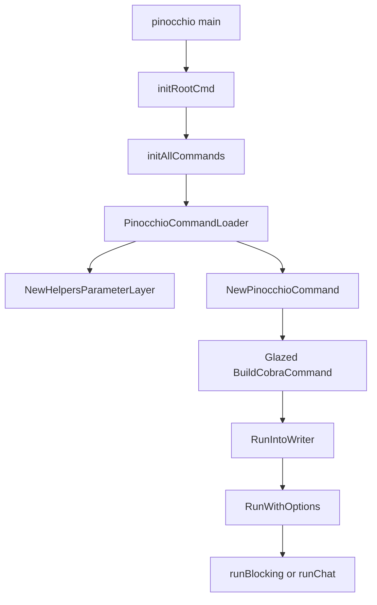
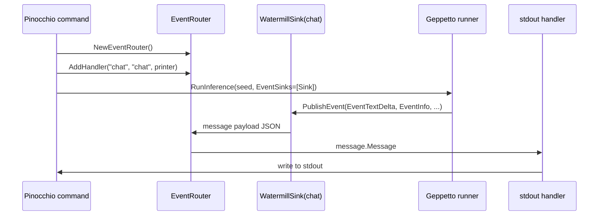

# JSONL RPC output mode for Pinocchio CLI verbs

## Executive summary

Pinocchio's prompt verbs are currently optimized for a human terminal experience. A normal streamed run sends Geppetto events through an `EventRouter`, then attaches either `events.StepPrinterFunc` for text or `events.NewStructuredPrinter` for `--output json|yaml`. The default text printer emits useful visual markers such as `--- Output started ---` and `--- Output ended ---`, while the structured printer emits simplified per-event records. Both behaviours are reasonable for humans and debugging, but neither is an explicit command-line RPC contract for scripts that need one JSON object per line, stable lifecycle messages, correlation identifiers, final result framing, and no decorative terminal text.

This ticket proposes a new parse-safe mode exposed as a Pinocchio helper flag. The recommended public surface is `--rpc` as a convenience boolean, plus an implementation-level output mode named `jsonl` so users can also ask for `--output jsonl` if that fits existing CLI conventions. In RPC mode, every event written to stdout is a single compact JSON object followed by `\n`. Human progress, logs, and TUI prompts must stay off stdout. The mode should support single-shot prompt execution first, with a clean extension path for multi-round line-oriented interaction.

The implementation should be small and centralized:

- Add helper-layer settings in `pkg/cmds/cmdlayers/helpers.go`.
- Carry the mode through `pkg/cmds/run/context.go`.
- Choose a new JSONL/RPC event handler in `pkg/cmds/cmd.go` wherever the current code chooses `StepPrinterFunc` or `NewStructuredPrinter`.
- Prefer adding the low-level JSONL printer in Geppetto's `pkg/events` package because Pinocchio already depends on Geppetto's event codec, event types, and printer implementations.
- Add tests around handler selection and line-valid JSON output before attempting a full live LLM integration test.

## Problem statement and scope

### User-facing problem

A shell script wants to run a Pinocchio verb and parse the result incrementally. Today, the default stream is not a machine contract:

```text
--- Output started ---
hello world
--- Output ended ---
```

This is hard to parse because the semantic stream is mixed with presentation strings. The existing `--output json` is closer, but it is not a dedicated RPC mode. It emits a simplified event-specific `type/content/metadata` shape rather than a stable envelope that can be extended with request IDs, final status, raw event payload, and protocol versioning.

The target outcome is a command that can be consumed like this:

```bash
pinocchio summarize --non-interactive --rpc --topic "..." |
  jq -rc 'select(.kind == "text.delta") | .delta'
```

or used as a subprocess transport where each stdout line is one JSON message:

```bash
while IFS= read -r line; do
  jq -e . >/dev/null <<<"$line" || exit 1
  kind=$(jq -r .kind <<<"$line")
  case "$kind" in
    run.started) ;;
    text.delta) jq -r .delta <<<"$line" ;;
    run.finished) break ;;
    error) exit 1 ;;
  esac
done < <(pinocchio my-verb --rpc --non-interactive)
```

### In scope

- A new parse-safe output mode for Pinocchio prompt verbs loaded through `PinocchioCommand`.
- Single process, stdout-based JSON Lines output.
- Compact one-object-per-line event envelopes.
- Stable lifecycle records for start, deltas, final text, tool calls, logs/info, finish, and error.
- Compatibility with the existing event router and Geppetto event codec.
- Tests that do not need a real provider API key.
- Documentation for future multi-round use.

### Out of scope for the first implementation phase

- A full bidirectional stdin/stdout daemon protocol.
- Replacing the Bubble Tea TUI chat runtime.
- Changing model provider streaming semantics.
- Persisting RPC streams to durable state.
- Making every auxiliary command (`tokens`, `catter`, `clip`, `js`) use the same RPC contract. Those commands may adopt the contract later, but the requested problem is Pinocchio's LLM verbs.

## Current-state architecture, with evidence

### High-level command flow

Pinocchio has three important CLI entry paths:

1. `cmd/pinocchio/main.go` builds the root Cobra command and initializes logging.
2. Built-in and repository YAML prompt commands are loaded through `PinocchioCommandLoader`.
3. Each loaded prompt command is wrapped as a Glazed/Cobra writer command and eventually calls `PinocchioCommand.RunIntoWriter`.

Evidence:

- `cmd/pinocchio/main.go:85` builds a Cobra command for `run-command` YAML files with `cmds.BuildCobraCommandWithGeppettoMiddlewares(cmds_[0])`.
- `cmd/pinocchio/main.go:207-245` loads prompt repositories through `PinocchioCommandLoader` and registers commands with Glazed repository loading.
- `pkg/cmds/loader.go:74` creates the helper layer with `cmdlayers.NewHelpersParameterLayer()` and prepends it to Geppetto sections.
- `pkg/cmds/cmd.go:192` also prepends the helper layer when constructing a `PinocchioCommand` directly.
- `pkg/cmds/cobra.go:35-48` centralizes Pinocchio's Cobra construction and middleware selection.



### Helper flags are the right public CLI surface

The helper-layer settings are global to Pinocchio LLM verbs. They already include presentation and interaction controls:

- `pkg/cmds/cmdlayers/helpers.go:17-35` defines `HelpersSettings`, including `StartInChat`, `Interactive`, `NonInteractive`, `Output`, `WithMetadata`, and `FullOutput`.
- `pkg/cmds/cmdlayers/helpers.go:138-140` defines `output` as a choice with help text `Output format (text, json, yaml)` and choices `text`, `json`, `yaml`.
- `pkg/cmds/cmd.go:301-304` copies helper settings into `run.UISettings` before execution.
- `pkg/cmds/run/context.go:23-31` stores the output-related values in `UISettings`.

This means an RPC mode does not need to be added to every YAML command. It belongs beside `--output`, `--with-metadata`, `--full-output`, and `--non-interactive` in the helper layer.

### Streaming output is event-router based

Blocking command execution constructs an event router and publishes model events into a `chat` topic. A printer handler subscribes to the same topic and writes to the command's writer.

Evidence:

- `pkg/cmds/cmd.go:307` creates a new `events.EventRouter` for each `RunIntoWriter` call.
- `pkg/cmds/cmd.go:427-444` in `runBlocking` creates a Watermill sink for topic `chat`, then attaches either `events.StepPrinterFunc` or `events.NewStructuredPrinter`.
- `pkg/cmds/cmd.go:498` passes event sinks into the Geppetto enginebuilder so inference events reach the router.
- `geppetto/pkg/events/sink.go:15-18` defines the `EventSink` interface as `PublishEvent(event Event) error`.
- `geppetto/pkg/events/event-router.go:53-69` defaults to an in-memory GoChannel pub/sub when no external transport is provided.
- `geppetto/pkg/events/event-router.go:103-122` registers handlers that consume a topic.



### The current default text printer intentionally emits decorative markers

The user's concrete complaint is explained by `events.StepPrinterFunc`:

- `geppetto/pkg/events/step-printer-func.go:12` defines `StepPrinterFunc`.
- `geppetto/pkg/events/step-printer-func.go:18` decodes each message with `NewEventFromJson`.
- `geppetto/pkg/events/step-printer-func.go:107` prints `--- Output started ---` when it receives an `EventInfo` message named `output-started`.
- `geppetto/pkg/events/step-printer-func.go:113` prints `--- Output ended ---` when it receives an `EventInfo` message named `output-ended`.

This output is useful for humans, but it is not safe as an RPC stream because framing and payload are mixed in text.

### The existing structured printer is not a complete RPC contract

`events.NewStructuredPrinter` already supports `json` and `yaml`:

- `geppetto/pkg/events/printer.go:60-68` defines `PrinterOptions` with `Format`, `Name`, `IncludeMetadata`, and `Full`.
- `geppetto/pkg/events/printer.go:71-76` defines a simplified `structuredOutput` envelope containing `type`, `content`, `metadata`, and `step_metadata`.
- `geppetto/pkg/events/printer.go:78-98` decodes `message.Payload` into a Geppetto event and dispatches to text, JSON, or YAML formatters.
- `geppetto/pkg/events/printer.go:181-229` maps selected event types into the simplified `structuredOutput` and writes one marshaled object plus newline.

That is close to JSON Lines because each JSON event is newline-terminated. However, it is missing several properties needed for a stable CLI RPC mode:

- No explicit protocol version.
- No envelope `kind` names optimized for clients.
- No consistent top-level `id`, `session_id`, `turn_id`, or `inference_id` extraction.
- No way to include raw event JSON for forward compatibility.
- No explicit `run.finished` record with final status if the provider exits normally but no final text event was emitted.
- No explicit mode that also forces `--non-interactive` behaviour.
- No public semantic distinction between "debug structured printing" and "script RPC contract".

### Events already have a canonical codec and metadata

A JSONL/RPC printer should not invent its own event model from scratch. Geppetto already has typed event interfaces and a codec:

- `geppetto/pkg/events/chat-events.go:98-102` defines the `Event` interface with `Type()`, `Metadata()`, and `Payload()`.
- `geppetto/pkg/events/chat-events.go:155-167` defines metadata fields including `message_id`, `session_id`, `inference_id`, and `turn_id`.
- `geppetto/pkg/events/chat-events.go:220` starts `NewEventFromJson`, which decodes raw JSON event payloads into concrete event types.

A stable RPC mode should therefore wrap Geppetto events, not bypass them.

## Gap analysis

| Requirement | Current behaviour | Gap |
|---|---|---|
| One JSON object per stdout line | `--output json` does this for simplified events; default text does not. | Need an explicit contract and flag, not a side effect of debug structured output. |
| No decorative markers | Default printer emits markers. | RPC mode must never use `StepPrinterFunc` on stdout. |
| Stable protocol envelope | Existing structured printer emits `type/content/metadata`. | Need version, kind, IDs, payload fields, and error shape. |
| Multi-round-friendly | TUI chat uses Bubble Tea; CLI stream is one shot. | First phase should avoid TUI and define future stdin request envelopes. |
| Script can stop on completion | Current stream may include `output-ended` as text or info event. | Emit `run.finished`/`error` records with machine-readable status. |
| Minimal code churn | Current selection logic is duplicated in blocking and interactive initial-step paths. | Centralize printer selection before adding more modes. |

## Proposed user-facing API

### Flags

Add the following helper-layer flags:

```text
--rpc
    Emit Pinocchio RPC JSON Lines on stdout. Implies non-interactive output and disables human text markers.

--output jsonl
    Emit JSON Lines event envelopes. Equivalent to --rpc for output formatting, but does not need to imply future stdin protocol semantics.
```

Recommended behaviour:

- `--rpc` sets `UISettings.RPC = true` and should make the command behave as if `--non-interactive` is set for the post-run chat prompt.
- `--rpc` should select the JSONL printer even if `--output text` remains default.
- If both `--rpc` and `--output json|yaml` are provided, `--rpc` wins for stdout because it is the stronger machine contract.
- Keep `--output json` unchanged for compatibility.
- Add `jsonl` to `--output` choices so users can use a format flag in scripts without learning a separate boolean.

### Initial command examples

Single-shot parse-safe execution:

```bash
pinocchio summarize --rpc --non-interactive --input article.md
```

Collect final text only:

```bash
pinocchio summarize --rpc --input article.md |
  jq -r 'select(.kind == "text.finished") | .text'
```

Stream deltas only:

```bash
pinocchio summarize --rpc --input article.md |
  jq -r 'select(.kind == "text.delta") | .delta'
```

Fail if any line is malformed JSON:

```bash
pinocchio summarize --rpc --input article.md | while IFS= read -r line; do
  jq -e . >/dev/null <<<"$line"
done
```

## Proposed RPC JSON Lines envelope

### Envelope goals

The envelope should be easy to parse in shell, Python, Node, and Go. It should be stable enough that interns can write tests against it, but flexible enough that new Geppetto events can pass through without breaking older clients.

### Envelope schema, version 1

```go
type RPCEnvelopeV1 struct {
    Version     int             `json:"version"`              // always 1 for this design
    Kind        string          `json:"kind"`                 // stable client-facing kind
    EventType   string          `json:"event_type,omitempty"` // original Geppetto event Type()
    ID          string          `json:"id,omitempty"`         // EventMetadata.ID
    SessionID   string          `json:"session_id,omitempty"`
    InferenceID string          `json:"inference_id,omitempty"`
    TurnID      string          `json:"turn_id,omitempty"`
    Timestamp   string          `json:"ts,omitempty"`         // optional, RFC3339Nano if added
    Delta       string          `json:"delta,omitempty"`      // for streaming deltas
    Text        string          `json:"text,omitempty"`       // for completed segments/final text
    Message     string          `json:"message,omitempty"`    // for info/log/error
    Level       string          `json:"level,omitempty"`      // for log/error severity
    ToolCall    any             `json:"tool_call,omitempty"`
    ToolResult  any             `json:"tool_result,omitempty"`
    Data        any             `json:"data,omitempty"`       // generic structured content
    Metadata    any             `json:"metadata,omitempty"`   // only with --with-metadata/--full-output
    RawEvent    json.RawMessage `json:"raw_event,omitempty"`  // only with --full-output or --rpc-raw-events
}
```

### Kind mapping

| Geppetto event | RPC `kind` | Important fields |
|---|---|---|
| `EventRunStarted` | `run.started` | `event_type`, IDs, metadata if requested |
| `EventRunFinished` | `run.finished` | status/metadata; final event for normal completion |
| `EventRunFailed` or `EventError` | `error` | `message`, `level: "error"`, raw details |
| `EventTextDelta` | `text.delta` | `delta` |
| `EventTextSegmentFinished` | `text.finished` | `text` |
| `EventReasoningDelta` | `reasoning.delta` | `delta` |
| `EventReasoningSegmentFinished` | `reasoning.finished` | `text` |
| `EventToolCallRequested` | `tool.call.requested` | `tool_call` object |
| `EventToolResultReady` | `tool.result.ready` | `tool_result` object |
| `EventLog` | `log` | `level`, `message`, `data`/fields |
| `EventInfo` | `info` | `message`, `data`; no decorative marker strings |
| Unknown typed event | `event` | `event_type`, `data` from raw event or metadata |

### Example stream

```jsonl
{"version":1,"kind":"run.started","event_type":"run-started","session_id":"...","inference_id":"..."}
{"version":1,"kind":"info","event_type":"info","message":"output-started"}
{"version":1,"kind":"text.delta","event_type":"text-delta","delta":"Hello"}
{"version":1,"kind":"text.delta","event_type":"text-delta","delta":" world"}
{"version":1,"kind":"text.finished","event_type":"text-segment-finished","text":"Hello world"}
{"version":1,"kind":"info","event_type":"info","message":"output-ended"}
{"version":1,"kind":"run.finished","event_type":"run-finished","session_id":"...","inference_id":"..."}
```

The important property is that even phase markers such as `output-started` are data, not presentation strings.

## Proposed code architecture

### Add settings to the helper layer

File: `pkg/cmds/cmdlayers/helpers.go`

```go
type HelpersSettings struct {
    // existing fields...
    Output string `glazed:"output"`
    RPC    bool   `glazed:"rpc"`
}
```

Update `NewHelpersParameterLayer`:

```go
fields.New(
    "output",
    fields.TypeChoice,
    fields.WithHelp("Output format (text, json, yaml, jsonl)"),
    fields.WithDefault("text"),
    fields.WithChoices("text", "json", "yaml", "jsonl"),
),
fields.New(
    "rpc",
    fields.TypeBool,
    fields.WithHelp("Emit parse-safe Pinocchio RPC JSON Lines on stdout; implies non-interactive output"),
    fields.WithDefault(false),
),
```

Rationale: all prompt commands already receive this helper layer from the loader (`pkg/cmds/loader.go:74`) and direct construction (`pkg/cmds/cmd.go:192`).

### Carry the mode in run.UISettings

File: `pkg/cmds/run/context.go`

```go
type UISettings struct {
    Interactive      bool
    ForceInteractive bool
    NonInteractive   bool
    StartInChat      bool
    PrintPrompt      bool
    Output           string
    RPC              bool
    WithMetadata     bool
    FullOutput       bool
}
```

In `PinocchioCommand.RunIntoWriter`, copy the decoded value:

```go
uiSettings := &run.UISettings{
    Interactive:      helpersSettings.Interactive,
    ForceInteractive: helpersSettings.ForceInteractive,
    NonInteractive:   helpersSettings.NonInteractive || helpersSettings.RPC,
    StartInChat:      helpersSettings.StartInChat,
    PrintPrompt:      helpersSettings.PrintPrompt,
    Output:           helpersSettings.Output,
    RPC:              helpersSettings.RPC || helpersSettings.Output == "jsonl",
    WithMetadata:     helpersSettings.WithMetadata,
    FullOutput:       helpersSettings.FullOutput,
}
```

Rationale: this keeps the user-visible flag handling near existing helper decoding and preserves `RunWithOptions` as the lower-level runtime API.

### Centralize printer selection in Pinocchio

`pkg/cmds/cmd.go` currently duplicates printer selection in at least two places:

- Blocking path: `pkg/cmds/cmd.go:435-444`.
- Initial interactive path: `pkg/cmds/cmd.go:584-593`.

Add a helper method or free function:

```go
func addCLIOutputHandler(router *events.EventRouter, topic string, w io.Writer, ui *run.UISettings) {
    if ui != nil && (ui.RPC || ui.Output == "jsonl") {
        router.AddHandler("chat-rpc-jsonl", topic, events.NewRPCJSONLPrinter(w, events.RPCPrinterOptions{
            IncludeMetadata: ui.WithMetadata,
            Full:            ui.FullOutput,
        }))
        return
    }

    if ui == nil || ui.Output == "" || ui.Output == "text" {
        router.AddHandler("chat", topic, events.StepPrinterFunc("", w))
        return
    }

    router.AddHandler("chat", topic, events.NewStructuredPrinter(w, events.PrinterOptions{
        Format:          events.PrinterFormat(ui.Output),
        Name:            "",
        IncludeMetadata: ui.WithMetadata,
        Full:            ui.FullOutput,
    }))
}
```

Use it from both current branches:

```go
addCLIOutputHandler(rc.Router, "chat", rc.Writer, rc.UISettings)
```

Rationale: adding an output mode should not create a third copy of the same conditional.

### Add the JSONL/RPC printer in Geppetto events

Recommended file: `geppetto/pkg/events/rpc_printer.go`.

The printer can follow the same pattern as `NewStructuredPrinter`: consume a Watermill message, decode it with `NewEventFromJson`, convert to an envelope, marshal compact JSON, append newline, and acknowledge the message.

Pseudocode:

```go
type RPCPrinterOptions struct {
    IncludeMetadata bool
    Full            bool
    IncludeRawEvent bool
}

func NewRPCJSONLPrinter(w io.Writer, options RPCPrinterOptions) func(msg *message.Message) error {
    return func(msg *message.Message) error {
        defer msg.Ack()

        ev, err := NewEventFromJson(msg.Payload)
        if err != nil {
            // The payload was not decodable as a Geppetto event. Still emit a JSON error line
            // so stdout remains valid JSONL, then return the error for router-level handling.
            _ = writeRPCEnvelope(w, RPCEnvelopeV1{
                Version: 1,
                Kind:    "error",
                Level:   "error",
                Message: err.Error(),
            })
            return err
        }

        env := RPCEnvelopeFromEvent(ev, msg.Payload, options)
        return writeRPCEnvelope(w, env)
    }
}

func writeRPCEnvelope(w io.Writer, env RPCEnvelopeV1) error {
    b, err := json.Marshal(env)
    if err != nil {
        return err
    }
    _, err = w.Write(append(b, '\n'))
    return err
}
```

Event mapping pseudocode:

```go
func RPCEnvelopeFromEvent(ev Event, raw []byte, opts RPCPrinterOptions) RPCEnvelopeV1 {
    meta := ev.Metadata()
    env := RPCEnvelopeV1{
        Version:     1,
        Kind:        "event",
        EventType:   string(ev.Type()),
        ID:          meta.ID.String(),
        SessionID:   meta.SessionID,
        InferenceID: meta.InferenceID,
        TurnID:      meta.TurnID,
    }

    switch e := ev.(type) {
    case *EventTextDelta:
        env.Kind = "text.delta"
        env.Delta = e.Delta
    case *EventTextSegmentFinished:
        env.Kind = "text.finished"
        env.Text = e.Text
    case *EventReasoningDelta:
        env.Kind = "reasoning.delta"
        env.Delta = e.Delta
    case *EventReasoningSegmentFinished:
        env.Kind = "reasoning.finished"
        env.Text = e.Text
    case *EventToolCallRequested:
        env.Kind = "tool.call.requested"
        env.ToolCall = map[string]any{"id": e.ToolCallID, "name": e.ToolName, "input": e.Input}
    case *EventToolResultReady:
        env.Kind = "tool.result.ready"
        env.ToolResult = map[string]any{"id": e.ToolCallID, "name": e.ToolName, "result": e.Result, "status": e.Status}
    case *EventLog:
        env.Kind = "log"
        env.Level = defaultString(e.Level, "info")
        env.Message = e.Message
        env.Data = e.Fields
    case *EventInfo:
        env.Kind = "info"
        env.Message = e.Message
        env.Data = e.Data
    case *EventError:
        env.Kind = "error"
        env.Level = "error"
        env.Message = e.ErrorString
    case *EventRunStarted:
        env.Kind = "run.started"
    case *EventRunFinished:
        env.Kind = "run.finished"
    case *EventRunFailed:
        env.Kind = "error"
        env.Level = "error"
        env.Message = e.ErrorString
    }

    if opts.Full || opts.IncludeMetadata {
        env.Metadata = meta
    }
    if opts.Full || opts.IncludeRawEvent {
        env.RawEvent = append(json.RawMessage(nil), raw...)
    }
    return env
}
```

### Handle command errors as JSONL if possible

Errors returned from `RunIntoWriter` are still handled by Cobra/Glazed outside the event stream. If the engine publishes an `EventError`, the printer can encode it as JSONL. If the engine returns a Go error before publishing any event, the current CLI stack may still write a human error to stderr. That is acceptable for phase 1 if stdout remains valid JSONL. The implementation should prefer stderr for non-JSON process errors and document that clients must check exit status.

For stronger RPC semantics, a later phase can wrap `RunWithOptions` errors in a final `error` line before returning:

```go
result, err := g.RunWithOptions(...)
if err != nil {
    if uiSettings.RPC || uiSettings.Output == "jsonl" {
        _ = events.WriteRPCError(w, err)
    }
    return err
}
```

Be careful to avoid duplicate error lines if the error was already emitted as an event.

## Multi-round RPC direction

The requested feature is "in a way a `--rpc` mode" because it should make multi-round scripts possible without using the TUI. The first phase should define stdout JSONL output. A later phase can add a bidirectional line protocol.

### Future bidirectional stdin/stdout sketch

Command:

```bash
pinocchio chat --rpc --stdin-rpc
```

Client sends request lines on stdin:

```jsonl
{"version":1,"id":"req-1","method":"run","params":{"prompt":"Summarize this paragraph"}}
{"version":1,"id":"req-2","method":"continue","params":{"message":"Now make it shorter"}}
{"version":1,"id":"req-3","method":"close"}
```

Pinocchio emits response/event lines on stdout:

```jsonl
{"version":1,"request_id":"req-1","kind":"run.started"}
{"version":1,"request_id":"req-1","kind":"text.delta","delta":"..."}
{"version":1,"request_id":"req-1","kind":"run.finished"}
```

Recommended request schema:

```go
type RPCRequestV1 struct {
    Version int             `json:"version"`
    ID      string          `json:"id"`
    Method  string          `json:"method"` // run, continue, cancel, close
    Params  json.RawMessage `json:"params,omitempty"`
}
```

Do not build the bidirectional protocol before the output contract is stable. The output-only JSONL mode solves immediate script parsing and creates the message format that a later stdin protocol can reuse.

## Implementation phases

### Phase 1: Add settings and centralize printer selection

Files:

- `pkg/cmds/cmdlayers/helpers.go`
- `pkg/cmds/run/context.go`
- `pkg/cmds/cmd.go`

Steps:

1. Add `RPC bool` to `HelpersSettings`.
2. Add `rpc` field to `NewHelpersParameterLayer`.
3. Add `jsonl` to `output` choices.
4. Add `RPC bool` to `run.UISettings`.
5. In `RunIntoWriter`, set `NonInteractive` to `helpersSettings.NonInteractive || helpersSettings.RPC` and `RPC` to `helpersSettings.RPC || helpersSettings.Output == "jsonl"`.
6. Extract printer selection into `addCLIOutputHandler`.
7. Replace the duplicated handler branches in blocking and interactive initial-step execution with the helper.

Validation:

```bash
go test ./pkg/cmds/... -count=1
```

### Phase 2: Add Geppetto RPC JSONL printer

Files in the sibling Geppetto module:

- `geppetto/pkg/events/rpc_printer.go`
- `geppetto/pkg/events/rpc_printer_test.go`

Steps:

1. Define `RPCEnvelopeV1` and `RPCPrinterOptions`.
2. Implement `NewRPCJSONLPrinter`.
3. Implement `RPCEnvelopeFromEvent` as a pure conversion function.
4. Add table-driven tests for text deltas, finished text, info markers, logs, tool calls, tool results, and errors.
5. Verify every output line is valid compact JSON and contains no human marker strings except as data values such as `message:"output-ended"`.

Validation:

```bash
cd ../geppetto
go test ./pkg/events -count=1
```

### Phase 3: Wire RPC printer into Pinocchio

Files:

- `pkg/cmds/cmd.go`
- `go.mod` / workspace dependency only if Geppetto API changes require version updates

Steps:

1. Use `events.NewRPCJSONLPrinter` in `addCLIOutputHandler` when `ui.RPC || ui.Output == "jsonl"`.
2. Give the handler a distinct name such as `chat-rpc-jsonl`.
3. Preserve `NewStructuredPrinter` for `json` and `yaml`.
4. Preserve `StepPrinterFunc` for text.
5. Ensure `--rpc` does not enter the post-run chat prompt by implying `NonInteractive`.

Validation:

```bash
go test ./pkg/cmds/... -count=1
go test ./cmd/pinocchio/... -count=1
```

### Phase 4: Add integration-style tests without provider API keys

The ideal tests should not hit a real model provider. Use one of these strategies:

1. Unit-test `addCLIOutputHandler` with synthetic Watermill messages and a bytes buffer.
2. Use an existing fake `EngineFactory` pattern from Pinocchio tests if available.
3. Add a small fake engine that publishes `EventInfo(output-started)`, `EventTextDelta`, `EventTextSegmentFinished`, and `EventInfo(output-ended)` through the event sink.

Assertions:

- `--rpc` output contains only JSON lines.
- No line contains raw `--- Output ended ---` as text outside JSON.
- `text.delta` and `text.finished` records are present.
- `info` records for `output-started` and `output-ended` are present as JSON data.
- Exit status remains non-zero when the fake engine returns an error.

### Phase 5: Document and expose examples

Files:

- `cmd/pinocchio/doc/general/...` or an appropriate help topic.
- Existing help strings in `pkg/cmds/cmdlayers/helpers.go`.

Add examples for:

- Extracting final answer with `jq`.
- Streaming deltas with `jq`.
- Checking exit status and stderr.
- Difference between `--output json` and `--rpc`.

## Testing strategy

### Unit tests for envelope conversion

The pure function `RPCEnvelopeFromEvent` should have table tests. This is the most important test layer because it defines the contract.

Example test shape:

```go
func TestRPCEnvelopeFromEvent_TextDelta(t *testing.T) {
    ev := &events.EventTextDelta{Delta: "hel", EventImpl: events.EventImpl{Type_: events.EventTypeTextDelta}}
    got := events.RPCEnvelopeFromEvent(ev, nil, events.RPCPrinterOptions{})
    require.Equal(t, 1, got.Version)
    require.Equal(t, "text.delta", got.Kind)
    require.Equal(t, "hel", got.Delta)
}
```

### Printer tests

The printer should be tested at the Watermill message boundary because that is how Pinocchio uses it.

```go
func TestRPCJSONLPrinterWritesOneJSONObjectPerLine(t *testing.T) {
    var buf bytes.Buffer
    printer := events.NewRPCJSONLPrinter(&buf, events.RPCPrinterOptions{})

    msg := message.NewMessage(uuid.NewString(), mustMarshalEvent(t, textDeltaEvent("hi")))
    require.NoError(t, printer(msg))

    lines := strings.Split(strings.TrimSpace(buf.String()), "\n")
    require.Len(t, lines, 1)
    require.JSONEq(t, `{"version":1,"kind":"text.delta","delta":"hi"}`, lines[0])
}
```

### Pinocchio flag tests

Add focused tests near `pkg/cmds`:

- `--rpc` decodes into `HelpersSettings.RPC == true`.
- `--output jsonl` decodes and sets `UISettings.RPC == true`.
- `--rpc` implies non-interactive mode in `RunIntoWriter` setup.

If the test infrastructure makes full `RunIntoWriter` difficult, extract a small pure function:

```go
func uiSettingsFromHelpers(h *cmdlayers.HelpersSettings) *run.UISettings
```

Then table-test that function.

### End-to-end smoke test

Once fake engine infrastructure exists:

```bash
go test ./pkg/cmds -run TestPinocchioCommandRPCOutput -count=1
```

The test should parse each stdout line with `json.Unmarshal` and fail if any non-JSON bytes appear.

## Risks and mitigations

### Risk: breaking existing `--output json`

Mitigation: do not change `events.NewStructuredPrinter` semantics. Add a new printer and only select it for `--rpc` or `--output jsonl`.

### Risk: confusing `json` and `jsonl`

Mitigation: document the distinction clearly:

- `--output json`: existing structured event/debug output.
- `--output jsonl` or `--rpc`: stable line-oriented CLI RPC envelope.

### Risk: stdout contamination from logging

Mitigation: verify logging writes to stderr. Pinocchio initializes logging in `cmd/pinocchio/main.go:48` and early logging in `cmd/pinocchio/main.go:54-63`; tests should run with normal logging and assert stdout is JSONL only.

### Risk: router error path writes partial human output

Mitigation: in RPC mode, the selected stdout handler must be JSONL only. Non-event command errors may still go to stderr and process exit status; document that clients must use both stdout parsing and exit status.

### Risk: TUI/chat mode conflict

Mitigation: `--rpc` should imply `NonInteractive` for the initial implementation. If a user asks for `--chat --rpc`, fail fast with a clear error or define it as future work. Do not mix Bubble Tea screen control with JSONL stdout.

## Alternatives considered

### Alternative A: Tell users to use `--output json`

Rejected as the complete solution. It is useful and already implemented, but it is not a deliberately versioned RPC contract and does not imply non-interactive execution.

### Alternative B: Change `StepPrinterFunc` to stop printing markers

Rejected because it would break the existing human CLI experience. The markers are intentionally present and useful when a person is reading streaming output.

### Alternative C: Add `--quiet` and only print final text

Rejected because the user asked for multi-round/script-friendly structured output, not just less output. A final-text-only mode would lose tool calls, reasoning, usage metadata, lifecycle state, and errors.

### Alternative D: Build the full stdin/stdout JSON-RPC daemon first

Deferred. A full daemon protocol has more state-management questions. The output-only JSONL mode is smaller, immediately useful, and creates the envelope that the daemon can reuse.

## Intern implementation checklist

1. Read these files first:
   - `pkg/cmds/cmdlayers/helpers.go`
   - `pkg/cmds/run/context.go`
   - `pkg/cmds/cmd.go`
   - `geppetto/pkg/events/printer.go`
   - `geppetto/pkg/events/step-printer-func.go`
   - `geppetto/pkg/events/chat-events.go`
2. Add the settings and pure helper functions before changing runtime code.
3. Write tests for the pure conversion function before wiring it into Pinocchio.
4. Preserve `--output json` and `--output yaml` behaviour.
5. Ensure every stdout line in RPC mode is valid JSON.
6. Ensure errors still produce non-zero exit status.
7. Update help docs with examples using `jq`.

## References

- `/home/manuel/workspaces/2026-05-20/pinocchio-structured-data-cli/pinocchio/cmd/pinocchio/main.go`: root command setup, command loading, logging initialization.
- `/home/manuel/workspaces/2026-05-20/pinocchio-structured-data-cli/pinocchio/pkg/cmds/loader.go`: YAML prompt command loading and helper-layer insertion.
- `/home/manuel/workspaces/2026-05-20/pinocchio-structured-data-cli/pinocchio/pkg/cmds/cobra.go`: Glazed/Cobra integration for Pinocchio commands.
- `/home/manuel/workspaces/2026-05-20/pinocchio-structured-data-cli/pinocchio/pkg/cmds/cmdlayers/helpers.go`: existing helper flags and `--output` definition.
- `/home/manuel/workspaces/2026-05-20/pinocchio-structured-data-cli/pinocchio/pkg/cmds/run/context.go`: runtime settings passed from CLI decoding into execution.
- `/home/manuel/workspaces/2026-05-20/pinocchio-structured-data-cli/pinocchio/pkg/cmds/cmd.go`: command execution, run mode selection, router setup, printer handler selection.
- `/home/manuel/workspaces/2026-05-20/pinocchio-structured-data-cli/geppetto/pkg/events/printer.go`: existing structured text/JSON/YAML printer.
- `/home/manuel/workspaces/2026-05-20/pinocchio-structured-data-cli/geppetto/pkg/events/step-printer-func.go`: default human streaming printer that emits output markers.
- `/home/manuel/workspaces/2026-05-20/pinocchio-structured-data-cli/geppetto/pkg/events/chat-events.go`: event interface, metadata, and JSON codec.
- `/home/manuel/workspaces/2026-05-20/pinocchio-structured-data-cli/geppetto/pkg/events/event-router.go`: event router and handler registration.
- `/home/manuel/workspaces/2026-05-20/pinocchio-structured-data-cli/geppetto/pkg/events/sink.go`: event sink contract used by inference runners.
