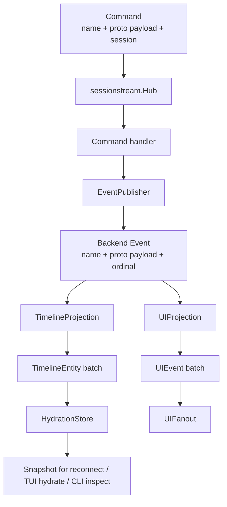
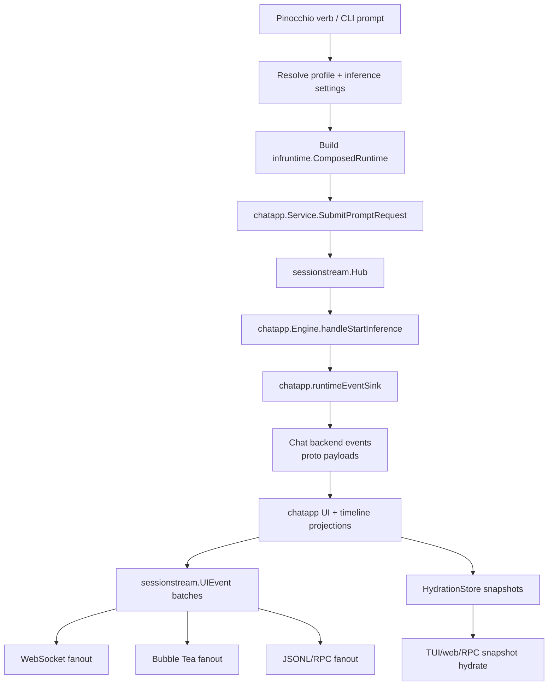
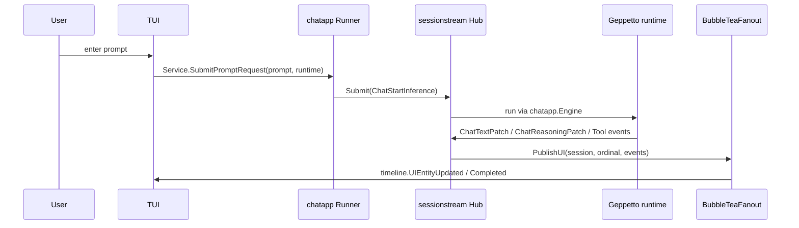

# Unify Pinocchio CLI TUI and RPC streams on sessionstream chatapp

## Executive summary

The first design document in this ticket proposed adding a dedicated JSONL/RPC printer beside the existing Geppetto text and structured printers. That solves the narrow parseability problem, but it risks creating a second event mapping layer that overlaps with code that already exists in `sessionstream/` and `pinocchio/pkg/chatapp/`.

After studying `sessionstream` and `chatapp`, the better long-term direction is to make Pinocchio CLI verbs, the Bubble Tea TUI, web-chat, and JSONL/RPC output share one canonical chat application pipeline:

```text
Geppetto runtime events
        ↓
chatapp runtimeEventSink
        ↓
sessionstream backend events
        ↓
sessionstream projections
        ↓
UI events + timeline entities
        ↓
websocket / Bubble Tea / JSONL RPC / final-text renderers
```

`chatapp` already translates Geppetto runtime events into typed Pinocchio chat events: text patches, run lifecycle events, provider metadata, reasoning segments, and tool-call lifecycle events. `sessionstream` already provides the command/event/projection substrate: typed command submission, event ordinals, UI projections, timeline projections, hydration stores, fanout, and websocket transport. The web-chat server already wires these pieces together. The current CLI/TUI path does not; it still decodes raw Geppetto Watermill messages with ad-hoc handlers such as `StepChatForwardFunc` and `StepTimelinePersistFunc`.

Therefore, the revised recommendation is:

1. Do not implement CLI RPC as a one-off raw Geppetto event printer if the goal is a durable product protocol.
2. Extract the web-chat-specific runtime composition pieces into reusable package-level APIs.
3. Add transport adapters around `sessionstream.UIFanout` for:
   - JSONL/RPC stdout.
   - Bubble Tea timeline messages.
   - Existing web websocket fanout.
   - Optional final-text/plain rendering.
4. Route Pinocchio verbs through `chatapp.Service.SubmitPromptRequest` in RPC/TUI/chat modes, passing the resolved `infruntime.ComposedRuntime` that the CLI already knows how to build.
5. Keep the old raw Geppetto printers only as compatibility/debug output for simple one-shot text/json/yaml modes.

This approach avoids recreating streaming event mapping and makes all surfaces observe the same semantic chat events and timeline entities.

## Problem statement

### What we were about to duplicate

The initial RPC proposal planned a new `events.NewRPCJSONLPrinter` that would map raw Geppetto events like `EventTextDelta`, `EventReasoningDelta`, `EventToolCallRequested`, and `EventError` into an RPC JSONL envelope.

That mapping is almost the same responsibility that `pinocchio/pkg/chatapp` already performs:

- `runtimeEventSink` receives Geppetto runtime events.
- It publishes canonical Pinocchio chat backend events such as `ChatTextPatch`, `ChatTextSegmentFinished`, and `ChatRunFailed`.
- Plugins extend the mapping for reasoning and tools.
- Projections turn backend events into live UI events and durable timeline entities.

If CLI RPC implements its own raw Geppetto mapping, then Pinocchio will have multiple semantic contracts for the same stream:

| Surface | Current or proposed mapping source | Risk |
|---|---|---|
| web-chat | `chatapp` + `sessionstream` | Canonical but web-only today. |
| TUI | `pkg/ui.StepChatForwardFunc` from raw Geppetto events | Duplicates entity and reasoning mapping. |
| CLI timeline persistence | `pkg/ui.StepTimelinePersistFunc` from raw Geppetto events | Duplicates chatapp timeline projection. |
| Proposed RPC JSONL | new raw Geppetto printer | Would duplicate chatapp backend/UI mapping again. |

The user is right: we are close to recreating the same thing.

### Desired outcome

The desired architecture is that Pinocchio has one canonical event model for chat-like LLM runs, and every presentation layer adapts that model:

- Web-chat receives sessionstream websocket frames.
- TUI receives Bubble Tea messages derived from sessionstream UI events and timeline snapshots.
- CLI RPC receives JSONL frames derived from sessionstream UI events or backend events.
- Plain CLI text receives either final answer text or a compatibility stream.

## Current-state architecture

## 1. sessionstream is the reusable substrate

`sessionstream` is explicitly designed for session-scoped, event-driven applications. Its README says handlers publish canonical backend events, projections derive live UI and durable timeline state, and clients reconnect through hydrated snapshots.

Key files and APIs:

- `sessionstream/README.md`: describes command routing, backend events, UI projections, timeline projections, hydration, and websocket transport.
- `sessionstream/pkg/sessionstream/types.go:12-17`: defines `Command` with `Name`, `Payload`, and `SessionId`.
- `sessionstream/pkg/sessionstream/types.go:21-26`: defines canonical backend `Event` with `Name`, `Payload`, `SessionId`, and `Ordinal`.
- `sessionstream/pkg/sessionstream/schema.go:12-18`: defines `SchemaRegistry` maps for commands, backend events, UI events, and timeline entities.
- `sessionstream/pkg/sessionstream/hub.go:215`: `Hub.Submit` validates command payload type and dispatches by session.
- `sessionstream/pkg/sessionstream/hub.go:319`: `dispatch` resolves the command handler and session, then calls the handler with an `EventPublisher`.
- `sessionstream/pkg/sessionstream/hub.go:338-360`: `localEventPublisher.Publish` validates event payloads, assigns ordinals, and calls `projectAndApply`.
- `sessionstream/pkg/sessionstream/hub.go:463-550`: `projectAndApply` appends events, loads the current view, runs UI and timeline projections, applies timeline entities, advances cursors, and fans out UI events.
- `sessionstream/pkg/sessionstream/projection.go:10-22`: defines `UIEvent` and `TimelineEntity`.
- `sessionstream/pkg/sessionstream/hydration.go:6-13`: defines `HydrationStore` for applying entities and returning snapshots.
- `sessionstream/pkg/sessionstream/fanout.go:8`: defines `UIFanout.PublishUI`, the exact seam that web, TUI, and RPC adapters can share.

The important point for an intern: `sessionstream` does not know about chat. It only knows how to route commands, publish typed events, run projections, persist projected state, and fan out client-facing events.



## 2. chatapp is the canonical Pinocchio chat application on top of sessionstream

`pinocchio/pkg/chatapp` is already the product-specific chat layer that sits on sessionstream.

### Commands and event names

`pinocchio/pkg/chatapp/chat.go` defines the canonical names:

- `CommandStartInference` and `CommandStopInference` at `chat.go:15-16`.
- Text event names including `EventChatTextSegmentStarted`, `EventChatTextPatch`, and `EventChatTextSegmentFinished` at `chat.go:27-29`.
- Run lifecycle events, provider events, reasoning events, and tool-call events at `chat.go:19-36`.
- `TimelineEntityChatMessage` at `chat.go:38`.

### Schema registration

`chatapp.RegisterSchemas` registers concrete protobuf payloads with sessionstream:

- `chat.go:98` starts `RegisterSchemas`.
- `chat.go:100-102` registers start/stop commands and user acceptance events.
- `chat.go:103-113` registers run, provider, and text backend events.
- `chat.go:114-123` registers matching UI events.
- `chat.go:124` registers `ChatMessage` timeline entities.
- `chat.go:134-139` lets plugins register additional schemas.

The protobuf contract lives in `pinocchio/proto/pinocchio/chatapp/v1/chat.proto`. Important messages include:

- `StartInferenceCommand` and `StopInferenceCommand`.
- `ChatRunStarted`, `ChatRunFinished`, `ChatRunStopped`, `ChatRunFailed`.
- `ChatTextSegmentStarted`, `ChatTextPatch`, `ChatTextSegmentFinished`.
- `ChatReasoningPatch` and `ChatReasoningSegmentFinished`.
- `ChatToolCallStarted`, `ChatToolArgumentsPatch`, `ChatToolResultReady`.
- `ChatMessageEntity`, `ToolCallEntity`, and `ToolResultEntity`.

### Installation into sessionstream

`chatapp.Install` wires the product behavior into a hub:

- `chat.go:141` starts `Install`.
- `chat.go:148-153` registers `ChatStartInference` and `ChatStopInference` handlers.
- `chat.go:154-159` registers UI and timeline projections.

### Service surface

`chatapp.Service` is the application-facing surface:

- `service.go:18-22` defines `PromptRequest` with `Prompt`, `IdempotencyKey`, and `Runtime *infruntime.ComposedRuntime`.
- `service.go:27-31` wraps a hub and engine.
- `service.go:63` submits `CommandStartInference` through the hub.
- `service.go:75-83` submits stop commands.
- `service.go:85-94` waits until active inference is idle.
- `service.go:96-104` returns a session snapshot.

This is exactly the kind of API a CLI/TUI adapter should call.

## 3. chatapp already maps Geppetto runtime events

`chatapp` does not merely wrap sessionstream; it also bridges from Geppetto runtime events to canonical chat events.

### Runtime inference

`pinocchio/pkg/chatapp/runtime_inference.go` handles start commands:

- `runtime_inference.go:20` starts `handleStartInference`.
- It accepts the user prompt as a `ChatUserMessageAccepted` event.
- It creates an `activeRun` and launches `runPrompt` in a goroutine.
- `runtime_inference.go:65` starts `runRuntimeInference` when a real composed runtime is provided.
- `runtime_inference.go:74` creates a `runtimeEventSink` as the Geppetto `EventSink`.
- `runtime_inference.go:101-121` loads prior turn history from a `TurnStore` when available.
- `runtime_inference.go:137-155` handles wait errors, cancellation, max-iteration warnings, and run failure.
- `runtime_inference.go:164` publishes `ChatRunFinished` after successful completion.

### Runtime event sink

`pinocchio/pkg/chatapp/runtime_sink.go` is the central evidence that a new raw Geppetto RPC mapper would duplicate existing logic:

- `runtime_sink.go:14-27` defines `runtimeEventSink` state.
- `runtime_sink.go:30` implements `PublishEvent(event gepevents.Event) error`.
- `runtime_sink.go:49-53` maps `EventTextSegmentStarted` to `ChatTextSegmentStarted`.
- `runtime_sink.go:54-60` maps `EventTextDelta` to `ChatTextPatch`, including stream ID, sequence, offset, patch mode, and correlation.
- `runtime_sink.go:61-67` maps `EventTextSegmentFinished` to `ChatTextSegmentFinished`.
- `runtime_sink.go:68-79` maps `EventError` to `ChatRunFailed` and finalizes active text.
- `runtime_sink.go:80-89` maps interrupts to `ChatRunStopped`.
- `runtime_sink.go:90` delegates non-base events to chat plugins.

### Plugins already cover reasoning and tools

`pinocchio/pkg/chatapp/features.go` defines the plugin contract:

```go
type ChatPlugin interface {
    RegisterSchemas(reg *sessionstream.SchemaRegistry) error
    HandleRuntimeEvent(ctx context.Context, runtime RuntimeEventContext, event gepevents.Event) (handled bool, err error)
    ProjectUI(ctx context.Context, ev sessionstream.Event, session *sessionstream.Session, view sessionstream.TimelineView) ([]sessionstream.UIEvent, bool, error)
    ProjectTimeline(ctx context.Context, ev sessionstream.Event, session *sessionstream.Session, view sessionstream.TimelineView) ([]sessionstream.TimelineEntity, bool, error)
}
```

Evidence:

- `features.go:11-16` defines the interface.
- `features.go:49-61` runs plugin runtime-event handlers.
- `features.go:67-77` merges plugin UI projections.
- `features.go:84-94` merges plugin timeline projections.

Reasoning plugin:

- `plugins/reasoning.go:35-48` registers reasoning schemas.
- `plugins/reasoning.go:52-99` maps Geppetto reasoning events to canonical chat reasoning events.
- `plugins/reasoning.go:103-111` forwards reasoning backend events as UI events.
- `plugins/reasoning.go:116-123` projects reasoning into timeline `ChatMessage` entities with role `thinking`.

Tool plugin:

- `plugins/toolcall.go:42-62` registers tool schemas and timeline entities.
- `plugins/toolcall.go:67-83` maps Geppetto tool events to canonical chat tool events.
- `plugins/toolcall.go:87-95` forwards tool backend events as UI events.
- `plugins/toolcall.go:100-130` projects tool events into `ChatToolCall` and `ChatToolResult` timeline entities.

## 4. web-chat already uses chatapp + sessionstream

`cmd/web-chat/app/server.go` is the reference production integration:

- `server.go:126` starts `NewServer`.
- `server.go:135` registers chatapp schemas with plugins.
- `server.go:137` creates a hydration store.
- `server.go:147` creates a sessionstream websocket transport.
- `server.go:152-156` creates a `chatapp.Engine` with plugins and turn-store support.
- `server.go:153-156` configures a hub with schema registry, hydration store, and `WithUIFanout(ws)`.
- `server.go:160` creates the sessionstream hub.
- `server.go:164` installs chatapp into the hub.
- `server.go:167` creates the `chatapp.Service`.
- `server.go:286-292` exposes websocket transport via `HandleWS`.
- `server.go:294-333` handles HTTP message submission by resolving a runtime and calling `service.SubmitPromptRequest`.

`cmd/web-chat/main.go` builds the runtime resolver and passes plugins:

- `main.go:370-376` builds a runtime composer with turn-store support.
- `main.go:385` wraps that composer in a canonical runtime resolver.
- `main.go:420-428` constructs the app server with runtime resolver, turn store, debug recorder, and chat plugins.

## 5. TUI and CLI still use raw Geppetto event handlers

The Pinocchio CLI chat path in `pkg/cmds/cmd.go` still uses a raw event router topic and attaches UI handlers:

- `pkg/cmds/cmd.go:755` adds `pinui.StepChatForwardFunc(p)` to the `ui` topic.
- `pkg/cmds/cmd.go:757` adds `pinui.StepTimelinePersistFunc(...)` to persist timeline snapshots.
- `pkg/cmds/cmd.go:807-811` repeats timeline persistence and UI handler setup in another chat backend branch.

The handlers themselves decode raw Geppetto messages:

- `pkg/ui/backend.go:253` starts `StepChatForwardFunc`.
- `pkg/ui/backend.go:307` decodes a raw event with `events.NewEventFromJson`.
- `pkg/ui/backend.go:318-363` maps text events to `timeline.UIEntityCreated`, `UIEntityUpdated`, and `UIEntityCompleted`.
- `pkg/ui/backend.go:394-420` maps reasoning events to thinking entities.
- `pkg/ui/timeline_persist.go:21` starts `StepTimelinePersistFunc`.
- `pkg/ui/timeline_persist.go:108` decodes raw Geppetto events.
- `pkg/ui/timeline_persist.go:145-179` persists assistant text from raw text events.
- `pkg/ui/timeline_persist.go:231-252` persists reasoning from raw reasoning events.

These are useful legacy adapters, but they now overlap with chatapp projections.

## Revised architecture: chatapp as the canonical stream model

### Target shape



The key change is not that every output uses the websocket protocol. The key change is that every output consumes the same sessionstream UI events and timeline entities.

### Conceptual layers

| Layer | Owns | Should not own |
|---|---|---|
| Geppetto | Provider events, tool-loop runtime, low-level streaming events | Pinocchio UI contracts |
| chatapp | Pinocchio chat semantics, Geppetto-to-chat mapping, chat projections | Websocket or Bubble Tea-specific rendering |
| sessionstream | Command/event/projection/hydration/fanout substrate | Chat product semantics |
| adapters | stdout JSONL, Bubble Tea messages, websocket frames, final text | Runtime event interpretation |

## Proposed implementation strategy

### Phase 0: Reframe the first RPC design

Treat `01-jsonl-rpc-output-mode-for-pinocchio-cli-verbs.md` as the narrow compatibility option. For a durable product RPC, prefer JSONL over sessionstream/chatapp records instead of raw Geppetto records.

The JSONL stream should emit one of these layers explicitly:

1. `ui_event` frames: projected client-facing events.
2. `backend_event` frames: canonical chat backend events.
3. `snapshot` frames: hydration state.
4. `error` frames: adapter/protocol errors.
5. Optional `final_text` convenience frames.

Recommended default for `--rpc`:

```jsonl
{"version":1,"frame":"hello","sessionId":"...","protocol":"pinocchio.chatapp.rpc.v1"}
{"version":1,"frame":"snapshot","sessionId":"...","snapshotOrdinal":"0","entities":[]}
{"version":1,"frame":"ui_event","sessionId":"...","ordinal":"1","name":"ChatUserMessageAccepted","payload":{"messageId":"chat-msg-1-user","role":"user","content":"hello","status":"accepted"}}
{"version":1,"frame":"ui_event","sessionId":"...","ordinal":"2","name":"ChatRunStarted","payload":{"messageId":"chat-msg-1","prompt":"hello"}}
{"version":1,"frame":"ui_event","sessionId":"...","ordinal":"4","name":"ChatTextPatch","payload":{"messageId":"chat-msg-1:text:...","text":"hi","mode":"CHAT_STREAM_PATCH_MODE_APPEND"}}
{"version":1,"frame":"ui_event","sessionId":"...","ordinal":"5","name":"ChatTextSegmentFinished","payload":{"messageId":"chat-msg-1:text:...","content":"hi","status":"finished","final":true}}
{"version":1,"frame":"ui_event","sessionId":"...","ordinal":"6","name":"ChatRunFinished","payload":{"messageId":"chat-msg-1","status":"finished"}}
```

Why UI events by default?

- They are already projected for clients.
- They include user message acceptance, assistant patches, reasoning patches, tool events, run lifecycle, and failure events.
- They are proto-backed and schema-registered.
- They match what web clients already consume after websocket framing.

Add `--rpc-events=backend|ui|timeline|all` later if operators need lower-level streams.

### Phase 1: Extract reusable chatapp runtime construction

Today web-chat owns useful runtime composition in `cmd/web-chat/runtime_composer.go`, but CLI verbs cannot import from `cmd/web-chat` cleanly. Move or duplicate intentionally into a package-level API, for example:

```text
pkg/chatapp/runtimecomposer/
    composer.go
    middleware_inputs.go
    sink_wrapper.go
```

Or, if the runtime composer is broader than chatapp:

```text
pkg/inference/runtime/profilecomposer/
    composer.go
```

Intern guidance:

- Start by moving pure code from `cmd/web-chat/runtime_composer.go` behind package APIs.
- Keep HTTP/request resolver code in `cmd/web-chat`; only move engine/middleware composition.
- Preserve tests from `cmd/web-chat/runtime_composer_test.go` by relocating them with the package.
- The target API should return `infruntime.ComposedRuntime`, because `chatapp.PromptRequest` already consumes that type.

Sketch:

```go
type CLIChatRuntimeBuilder struct {
    EngineFactory factory.EngineFactory
    TurnStore chatstore.TurnStore
}

func (b *CLIChatRuntimeBuilder) BuildFromParsedValues(
    ctx context.Context,
    parsed *values.Values,
    profile profilebootstrap.ProfileSettings,
    base *settings.InferenceSettings,
    final *settings.InferenceSettings,
) (*infruntime.ComposedRuntime, error) {
    // Use existing profilebootstrap resolution.
    // Build the same ComposedRuntime web-chat builds.
}
```

### Phase 2: Build a reusable chatapp runner for non-web surfaces

Create a helper that constructs the common `sessionstream` + `chatapp` stack without HTTP:

```go
type RunnerOptions struct {
    HydrationStore sessionstream.HydrationStore
    Fanout sessionstream.UIFanout
    TurnStore chatstore.TurnStore
    Plugins []chatapp.ChatPlugin
}

type Runner struct {
    Service *chatapp.Service
    Hub *sessionstream.Hub
    Engine *chatapp.Engine
    Store sessionstream.HydrationStore
}

func NewRunner(opts RunnerOptions) (*Runner, error) {
    reg := sessionstream.NewSchemaRegistry()
    if err := chatapp.RegisterSchemas(reg, opts.Plugins...); err != nil { return nil, err }
    store := opts.HydrationStore
    if store == nil { store = new in-memory store using reg }
    engine := chatapp.NewEngine(chatapp.WithPlugins(opts.Plugins...), chatapp.WithTurnStore(opts.TurnStore))
    hub, err := sessionstream.NewHub(
        sessionstream.WithSchemaRegistry(reg),
        sessionstream.WithHydrationStore(store),
        sessionstream.WithUIFanout(opts.Fanout),
    )
    if err != nil { return nil, err }
    if err := chatapp.Install(hub, engine); err != nil { return nil, err }
    service, err := chatapp.NewService(hub, engine)
    if err != nil { return nil, err }
    return &Runner{Service: service, Hub: hub, Engine: engine, Store: store}, nil
}
```

This mirrors `cmd/web-chat/app/server.go:126-170`, but without HTTP/websocket assumptions.

Recommended package location:

```text
pkg/chatapp/runner.go
```

### Phase 3: Add a JSONL sessionstream fanout adapter

Implement a `sessionstream.UIFanout` that writes protobuf JSON UI events to stdout as JSON Lines.

```go
type JSONLUIFanout struct {
    W io.Writer
    Reg *sessionstream.SchemaRegistry
    IncludeSnapshots bool
    mu sync.Mutex
}

func (f *JSONLUIFanout) PublishUI(ctx context.Context, sid sessionstream.SessionId, ord uint64, events []sessionstream.UIEvent) error {
    f.mu.Lock()
    defer f.mu.Unlock()
    for _, ev := range events {
        payload, err := protojson.MarshalOptions{EmitUnpopulated:false, UseProtoNames:false}.Marshal(ev.Payload)
        if err != nil { return err }
        frame := RPCFrame{
            Version: 1,
            Frame: "ui_event",
            SessionID: string(sid),
            Ordinal: strconv.FormatUint(ord, 10),
            Name: ev.Name,
            Payload: json.RawMessage(payload),
        }
        if err := writeJSONLine(f.W, frame); err != nil { return err }
    }
    return nil
}
```

Also add helper functions for snapshot and hello frames:

```go
func WriteHello(w io.Writer, sid sessionstream.SessionId) error
func WriteSnapshot(w io.Writer, snap sessionstream.Snapshot) error
func WriteError(w io.Writer, sid sessionstream.SessionId, err error) error
```

Why fanout instead of a raw event printer?

- `UIFanout` is the existing sessionstream output seam.
- It receives ordinals and batches after projection.
- It automatically benefits from chatapp plugin mappings.
- It matches websocket fanout conceptually without requiring websocket.

### Phase 4: Add a Bubble Tea fanout adapter

Replace or wrap `StepChatForwardFunc` with a fanout adapter that consumes `sessionstream.UIEvent` values rather than raw Geppetto events.

Sketch:

```go
type BubbleTeaFanout struct {
    Program *tea.Program
}

func (f *BubbleTeaFanout) PublishUI(ctx context.Context, sid sessionstream.SessionId, ord uint64, events []sessionstream.UIEvent) error {
    for _, ev := range events {
        switch payload := ev.Payload.(type) {
        case *chatappv1.ChatUserMessageAccepted:
            f.sendMessageEntity(payload.MessageId, "user", payload.Content, false)
        case *chatappv1.ChatTextSegmentStarted:
            // maybe defer creation until first patch, like current TUI does
        case *chatappv1.ChatTextPatch:
            f.sendMessagePatch(payload.MessageId, "assistant", payload.Text, true)
        case *chatappv1.ChatTextSegmentFinished:
            f.sendMessageComplete(payload.MessageId, payload.Content)
        case *chatappv1.ChatReasoningPatch:
            f.sendMessagePatch(payload.MessageId, "thinking", payload.Text, true)
        case *chatappv1.ChatToolCallStarted:
            f.sendToolCall(payload)
        }
    }
    return nil
}
```

This adapter can preserve current TUI rendering semantics while removing duplicate raw Geppetto decoding.

Migration pattern:

1. Add `BubbleTeaFanout` without deleting `StepChatForwardFunc`.
2. Add tests that feed `ChatTextPatch` and assert equivalent Bubble Tea timeline messages.
3. Switch TUI chat mode to chatapp runner behind a flag or internal option.
4. Remove raw handler only after parity tests cover text, error, interrupt, reasoning, and tools.

### Phase 5: Route Pinocchio verbs through chatapp in RPC/TUI modes

`pkg/cmds/cmd.go` currently has two execution paths:

- `runBlocking` for one-shot CLI streaming.
- `runChat` for interactive/TUI chat.

Do not replace all modes at once. Add a mode selector:

```go
func shouldUseChatApp(ui *run.UISettings) bool {
    if ui == nil { return false }
    return ui.RPC || ui.Output == "jsonl" || ui.StartInChat || ui.Interactive
}
```

Recommended initial migration:

- Use chatapp for `--rpc` / `--output jsonl` first.
- Then use chatapp for TUI chat mode.
- Keep existing `--output text|json|yaml` raw Geppetto printers for compatibility until the new path can exactly match expectations.

RPC flow pseudocode:

```go
func (g *PinocchioCommand) runRPCViaChatApp(ctx context.Context, rc *run.RunContext) (*turns.Turn, error) {
    sid := sessionstream.SessionId(uuid.NewString())
    fanout := chatrpc.NewJSONLUIFanout(rc.Writer)
    runner, err := chatapp.NewRunner(chatapp.RunnerOptions{
        Fanout: fanout,
        Plugins: []chatapp.ChatPlugin{
            plugins.NewReasoningPlugin(),
            plugins.NewToolCallPlugin(),
        },
        TurnStore: optionalTurnStore,
    })
    if err != nil { return nil, err }

    runtime, err := buildComposedRuntimeForCLI(ctx, rc)
    if err != nil { return nil, err }

    seed, err := g.buildInitialTurn(rc.Variables, rc.ImagePaths)
    if err != nil { return nil, err }
    prompt := promptTextFromSeed(seed) // see open questions below

    snap, _ := runner.Service.Snapshot(ctx, sid)
    _ = fanout.WriteHello(sid)
    _ = fanout.WriteSnapshot(snap)

    if err := runner.Service.SubmitPromptRequest(ctx, sid, chatapp.PromptRequest{
        Prompt: prompt,
        Runtime: runtime,
    }); err != nil { return nil, err }
    if err := runner.Service.WaitIdle(ctx, sid); err != nil { return nil, err }
    return nil, nil
}
```

Important implementation caveat: `chatapp.PromptRequest` currently carries a simple prompt string, while Pinocchio verbs can build a `turns.Turn` from system prompts, blocks, images, and templates. See the open questions section for options.

### Phase 6: Add optional backend-event JSONL for debugging

UI events are client-facing. Sometimes scripts need canonical backend events, especially for testing projections. Add a separate observer/fanout only if needed:

- A `Hooks.OnBackendEvent` already exists in `chatapp.Engine` at `chat.go:41-43`.
- It receives `sessionID`, event name, and proto payload as `map[string]any`.

A backend JSONL recorder could wrap that hook:

```go
engine := chatapp.NewEngine(chatapp.WithHooks(chatapp.Hooks{
    OnBackendEvent: func(sessionID, eventName string, payload map[string]any) {
        writeBackendEventFrame(w, sessionID, eventName, payload)
    },
}))
```

However, default `--rpc` should probably emit UI events, because those are what client authors expect.

## Design decisions

### Decision 1: Make chatapp the semantic owner of chat stream mapping

Reasoning:

- It already maps text, lifecycle, provider metadata, reasoning, and tool events.
- It already has typed protobuf contracts.
- It already supports plugins for new event families.
- It already projects timeline entities.

Rejected alternative: make `geppetto/pkg/events` own Pinocchio RPC semantics. Geppetto should remain lower-level and reusable; Pinocchio-specific chat payload names belong in Pinocchio.

### Decision 2: Use sessionstream.UIFanout as the adapter seam

Reasoning:

- Websocket transport already implements `UIFanout`.
- The interface is tiny: one method with session ID, ordinal, and UI event batch.
- It sits after projections, so adapters do not need to know Geppetto event details.

### Decision 3: Preserve raw Geppetto printers for compatibility

Reasoning:

- Some users expect current text stream behavior.
- `--output json|yaml` currently mean Geppetto structured event output.
- Migrating all output modes at once increases breakage risk.

### Decision 4: Treat JSONL/RPC as a product protocol over chatapp, not a debug event dump

Reasoning:

- Scripts should parse stable Pinocchio chat concepts: `ChatTextPatch`, `ChatRunFinished`, `ChatToolResultReady`.
- Raw Geppetto event types are lower-level and may change as provider integrations evolve.

## Main mismatch to solve: Pinocchio verbs are Turn-based, chatapp is prompt-string-based

This is the biggest implementation issue.

Current `PinocchioCommand` builds a seed turn:

- `pkg/cmds/cmd.go:127` has `buildInitialTurn`.
- It can include system prompt, pre-seeded blocks, user prompt, and image paths.
- `runEngineAndCollectMessages` sends that seed turn directly through the enginebuilder path.

Current `chatapp.Service.SubmitPromptRequest` accepts `PromptRequest{Prompt string, Runtime *ComposedRuntime}`.

Three migration options exist.

### Option A: Add Turn input to chatapp PromptRequest

```go
type PromptRequest struct {
    Prompt string
    InitialTurn *turns.Turn
    IdempotencyKey string
    Runtime *infruntime.ComposedRuntime
}
```

Then `runRuntimeInference` uses `InitialTurn` when provided:

```go
if pending.InitialTurn != nil {
    sess.Append(pending.InitialTurn.Clone())
} else {
    _, err := sess.AppendNewTurnFromUserPrompt(prompt)
}
```

Pros:

- Preserves Pinocchio verb semantics.
- Minimal loss of images, blocks, or system prompts.
- Keeps chatapp service useful beyond simple chat prompts.

Cons:

- `chatapp` protobuf command still only has prompt string; pending in-memory request carries the turn. This is already the pattern for `Runtime`, so it is acceptable for local process use but not enough for durable command replay.

### Option B: Encode the rendered turn in protobuf

Add a typed `StartInferenceCommand.initial_turn_yaml` or a protobuf turn schema.

Pros:

- More replayable and transportable.

Cons:

- Larger schema change.
- Requires deciding the canonical turn wire format.
- Not necessary for first CLI migration.

### Option C: Keep raw Geppetto path for complex verbs and use chatapp only for chat prompts

Pros:

- Smallest change.

Cons:

- Does not satisfy the goal of unifying Pinocchio verbs broadly.
- Leaves duplicate stream mappings in place.

Recommendation: implement Option A first, then consider a replayable schema later.

## RPC protocol revised around sessionstream

### Frame schema

```go
type RPCFrameV1 struct {
    Version int `json:"version"`
    Frame string `json:"frame"` // hello, snapshot, ui_event, backend_event, error, done
    SessionID string `json:"sessionId,omitempty"`
    Ordinal string `json:"ordinal,omitempty"`
    Name string `json:"name,omitempty"`
    Payload json.RawMessage `json:"payload,omitempty"`
    Snapshot *SnapshotFrame `json:"snapshot,omitempty"`
    Error *ErrorFrame `json:"error,omitempty"`
}
```

Use strings for ordinals if JavaScript clients may consume the stream and exact integer safety matters.

### Frame meanings

| Frame | Meaning | Source |
|---|---|---|
| `hello` | Protocol/version/session metadata | RPC adapter |
| `snapshot` | Initial hydration state | `chatapp.Service.Snapshot` / `sessionstream.HydrationStore` |
| `ui_event` | Projected live event | `sessionstream.UIFanout` |
| `backend_event` | Optional canonical backend event | `chatapp.Hooks.OnBackendEvent` |
| `error` | Protocol/runtime error | adapter or `ChatRunFailed` convenience |
| `done` | Adapter observed idle completion | RPC runner after `Service.WaitIdle` |

### jq examples

Stream assistant patches:

```bash
pinocchio summarize --rpc --input article.md |
  jq -r 'select(.frame == "ui_event" and .name == "ChatTextPatch") | .payload.text'
```

Get final assistant segments:

```bash
pinocchio summarize --rpc |
  jq -r 'select(.frame == "ui_event" and .name == "ChatTextSegmentFinished") | .payload.content'
```

Watch tool results:

```bash
pinocchio agent --rpc |
  jq -c 'select(.frame == "ui_event" and .name == "ChatToolResultReady") | .payload'
```


## Protobuf-defined JSONL line format

The JSONL boundary itself should be protobuf-defined. This is now a core design decision, not a future embellishment. The CLI should emit **one protobuf JSON message per stdout line**. The line is newline-delimited JSON for shell ergonomics, but the JSON object is produced by `protojson.Marshal` from a generated protobuf message.

This gives Pinocchio a clear protocol boundary:

```text
Transport framing:
    JSON Lines: exactly one complete JSON object per stdout line

Envelope schema:
    pinocchio.chatapp.rpc.v1.RpcLine

Payload schemas:
    pinocchio.chatapp.v1.ChatTextPatch
    pinocchio.chatapp.v1.ChatRunFinished
    pinocchio.chatapp.v1.ChatToolResultReady
    pinocchio.chatapp.v1.ChatMessageEntity
    etc.

Runtime source:
    sessionstream.UIFanout over chatapp UI events and snapshots
```

The important rule is: **do not hand-write an ad-hoc `map[string]any` JSON contract for RPC lines**. Use generated protobuf types for the outer line and generated protobuf types for inner payloads.

### Proposed proto location

Add a new proto file under Pinocchio, not sessionstream:

```text
pinocchio/proto/pinocchio/chatapp/rpc/v1/rpc.proto
```

Recommended generated Go package:

```text
pinocchio/pkg/chatapp/rpc/pb/proto/pinocchio/chatapp/rpc/v1
```

Reasoning:

- The protocol is Pinocchio chatapp-specific, even though it is built on sessionstream concepts.
- It can include CLI/subprocess concepts such as `request_id`, `done`, final status, and optional backend-event mode.
- It can carry `pinocchio.chatapp.v1.*` payloads through `google.protobuf.Any`.
- It avoids coupling CLI JSONL to websocket subscribe/unsubscribe semantics.

### Recommended rpc.proto sketch

```proto
syntax = "proto3";

package pinocchio.chatapp.rpc.v1;

option go_package = "github.com/go-go-golems/pinocchio/pkg/chatapp/rpc/pb/proto/pinocchio/chatapp/rpc/v1;chatapprpcv1";

import "google/protobuf/any.proto";

message RpcLine {
  uint32 version = 1;
  string session_id = 2;
  string request_id = 3;

  oneof frame {
    HelloFrame hello = 10;
    SnapshotFrame snapshot = 11;
    UiEventFrame ui_event = 12;
    BackendEventFrame backend_event = 13;
    ErrorFrame error = 14;
    DoneFrame done = 15;
  }
}

message HelloFrame {
  string protocol = 1;
  string server = 2;
  repeated string capabilities = 3;
}

message SnapshotFrame {
  uint64 snapshot_ordinal = 1;
  repeated SnapshotEntity entities = 2;
}

message SnapshotEntity {
  string kind = 1;
  string id = 2;
  uint64 created_ordinal = 3;
  uint64 last_event_ordinal = 4;
  bool tombstone = 5;
  google.protobuf.Any payload = 6;
}

message UiEventFrame {
  uint64 ordinal = 1;
  string name = 2;
  google.protobuf.Any payload = 3;
}

message BackendEventFrame {
  uint64 ordinal = 1;
  string name = 2;
  google.protobuf.Any payload = 3;
}

message ErrorFrame {
  string code = 1;
  string message = 2;
  string detail = 3;
  bool terminal = 4;
}

message DoneFrame {
  string status = 1;
}
```

### Example JSONL output

Because the stream uses protobuf JSON, field names use lowerCamelCase by default and `uint64` fields are encoded as strings. This is normal protobuf JSON behavior and protects JavaScript clients from integer precision loss.

```jsonl
{"version":1,"sessionId":"sess-1","hello":{"protocol":"pinocchio.chatapp.rpc.v1","server":"pinocchio","capabilities":["snapshots","ui_events","done"]}}
{"version":1,"sessionId":"sess-1","snapshot":{"snapshotOrdinal":"0","entities":[]}}
{"version":1,"sessionId":"sess-1","uiEvent":{"ordinal":"1","name":"ChatUserMessageAccepted","payload":{"@type":"type.googleapis.com/pinocchio.chatapp.v1.ChatUserMessageAccepted","messageId":"chat-msg-1-user","role":"user","content":"hello","status":"accepted"}}}
{"version":1,"sessionId":"sess-1","uiEvent":{"ordinal":"4","name":"ChatTextPatch","payload":{"@type":"type.googleapis.com/pinocchio.chatapp.v1.ChatTextPatch","messageId":"chat-msg-1:text:1","streamId":"chat-msg-1:text:1","sequence":"1","text":"hi","mode":"CHAT_STREAM_PATCH_MODE_APPEND","status":"streaming"}}}
{"version":1,"sessionId":"sess-1","uiEvent":{"ordinal":"5","name":"ChatTextSegmentFinished","payload":{"@type":"type.googleapis.com/pinocchio.chatapp.v1.ChatTextSegmentFinished","messageId":"chat-msg-1:text:1","content":"hi","status":"finished","final":true}}}
{"version":1,"sessionId":"sess-1","done":{"status":"finished"}}
```

Shell clients can still use `jq`:

```bash
pinocchio summarize --rpc |
  jq -r 'select(.uiEvent.name == "ChatTextPatch") | .uiEvent.payload.text'
```

For ordinals:

```bash
jq -r '.uiEvent.ordinal | tonumber'
```

### Why google.protobuf.Any, not Struct

Use `google.protobuf.Any` for `payload`, not top-level `google.protobuf.Struct`.

Reasons:

- `sessionstream` is intentionally protobuf-first.
- `chatapp` already registers concrete payload schemas.
- `Any` preserves the concrete payload type through the `@type` field.
- TypeScript and Go clients can decode known payloads into generated types.
- `Struct` would reintroduce an untyped JSON blob at the protocol boundary.

`Struct` can still appear inside a concrete payload field when the domain schema intentionally allows open-ended metadata. It should not be the top-level event payload type for RPC frames.

### Writer API sketch

```go
type Writer struct {
    w io.Writer
    mu sync.Mutex
    marshal protojson.MarshalOptions
}

func NewWriter(w io.Writer) *Writer {
    return &Writer{
        w: w,
        marshal: protojson.MarshalOptions{
            EmitUnpopulated: false,
            UseProtoNames:   false,
        },
    }
}

func (w *Writer) WriteLine(line *chatapprpcv1.RpcLine) error {
    w.mu.Lock()
    defer w.mu.Unlock()

    b, err := w.marshal.Marshal(line)
    if err != nil {
        return err
    }
    b = append(b, '
')
    _, err = w.w.Write(b)
    return err
}
```

### JSONL UIFanout sketch

```go
type JSONLUIFanout struct {
    writer *Writer
}

func (f *JSONLUIFanout) PublishUI(
    ctx context.Context,
    sid sessionstream.SessionId,
    ord uint64,
    events []sessionstream.UIEvent,
) error {
    for _, ev := range events {
        payload, err := anypb.New(ev.Payload)
        if err != nil {
            return err
        }
        if err := f.writer.WriteLine(&chatapprpcv1.RpcLine{
            Version:   1,
            SessionId: string(sid),
            Frame: &chatapprpcv1.RpcLine_UiEvent{
                UiEvent: &chatapprpcv1.UiEventFrame{
                    Ordinal: ord,
                    Name:    ev.Name,
                    Payload: payload,
                },
            },
        }); err != nil {
            return err
        }
    }
    return nil
}
```

### Snapshot writer sketch

```go
func (f *JSONLUIFanout) WriteSnapshot(snap sessionstream.Snapshot) error {
    entities := make([]*chatapprpcv1.SnapshotEntity, 0, len(snap.Entities))
    for _, entity := range snap.Entities {
        payload, err := anypb.New(entity.Payload)
        if err != nil {
            return err
        }
        entities = append(entities, &chatapprpcv1.SnapshotEntity{
            Kind:             entity.Kind,
            Id:               entity.Id,
            CreatedOrdinal:   entity.CreatedOrdinal,
            LastEventOrdinal: entity.LastEventOrdinal,
            Tombstone:        entity.Tombstone,
            Payload:          payload,
        })
    }
    return f.writer.WriteLine(&chatapprpcv1.RpcLine{
        Version:   1,
        SessionId: string(snap.SessionId),
        Frame: &chatapprpcv1.RpcLine_Snapshot{
            Snapshot: &chatapprpcv1.SnapshotFrame{
                SnapshotOrdinal: snap.SnapshotOrdinal,
                Entities:        entities,
            },
        },
    })
}
```

### Reuse sessionstream ServerFrame or define Pinocchio RpcLine?

The decision is to define `pinocchio.chatapp.rpc.v1.RpcLine`.

`sessionstream/proto/sessionstream/v1/transport.proto` remains the websocket transport contract. It is valuable reference material, but it includes websocket subscription semantics that are not the best CLI boundary. The CLI needs a subprocess-friendly stream with request IDs, done frames, optional backend event frames, and future bidirectional stdin support.

The new `RpcLine` should mirror sessionstream concepts but not reuse `ServerFrame` directly.

### Implementation tasks added by protobuf boundary

Add these concrete tasks to the implementation plan:

1. Create `proto/pinocchio/chatapp/rpc/v1/rpc.proto`.
2. Regenerate Go and TypeScript protobuf bindings using the repository's Buf workflow.
3. Add `pkg/chatapp/rpc/jsonl.Writer` around `protojson.MarshalOptions`.
4. Add `pkg/chatapp/rpc/jsonl.JSONLUIFanout` implementing `sessionstream.UIFanout`.
5. Add snapshot, hello, error, and done frame helpers.
6. Add tests that unmarshal every emitted line back into `chatapprpcv1.RpcLine`.
7. Add tests that decode `Any` payloads for at least `ChatTextPatch`, `ChatTextSegmentFinished`, and `ChatRunFinished`.
8. Document protobuf JSON `uint64` string encoding in CLI help examples.

## TUI migration design

### Current TUI path

Current TUI mode builds an engine backend and raw event handlers. It receives Geppetto events and sends Bubble Tea messages itself. This makes the TUI a parallel projection system.

### Target TUI path

The TUI should become a consumer of chatapp/sessionstream UI events and snapshots:



### Snapshot hydration for TUI

When entering chat mode after an initial command run, TUI should hydrate from `sessionstream.Snapshot` rather than re-emitting initial entities by inspecting a `turns.Turn`.

Adapter sketch:

```go
func HydrateBubbleTeaTimeline(p *tea.Program, snap sessionstream.Snapshot) error {
    for _, entity := range snap.Entities {
        switch payload := entity.Payload.(type) {
        case *chatappv1.ChatMessageEntity:
            p.Send(timeline.UIEntityCreated{...})
            if !payload.Streaming { p.Send(timeline.UIEntityCompleted{...}) }
        case *chatappv1.ToolCallEntity:
            p.Send(tool entity messages)
        }
    }
    return nil
}
```

This gives TUI the same reconnect/reload model as web-chat.

## Testing strategy

### Unit tests

1. `JSONLUIFanout`:
   - Given `ChatTextPatch`, writes one valid JSONL frame.
   - Uses proto JSON field names such as `messageId`, `streamId`, `text`.
   - Serializes ordinals as strings if that is the chosen contract.

2. `BubbleTeaFanout`:
   - Given `ChatUserMessageAccepted`, emits a user message entity.
   - Given `ChatTextPatch`, emits assistant update.
   - Given `ChatTextSegmentFinished`, emits completed message.
   - Given reasoning/tool events, emits matching entities.

3. `chatapp PromptRequest InitialTurn`:
   - If `InitialTurn` is provided, runtime receives that turn instead of a prompt-only turn.
   - Existing prompt-only tests keep passing.

### Integration tests

1. CLI RPC with fake runtime:
   - Build a `chatapp.Runner` with `JSONLUIFanout`.
   - Submit a prompt to a fake engine that emits Geppetto text events.
   - Assert JSONL contains `ChatUserMessageAccepted`, `ChatTextPatch`, `ChatTextSegmentFinished`, and `ChatRunFinished`.

2. TUI equivalence:
   - Feed the old raw Geppetto handler and the new chatapp UI fanout equivalent streams.
   - Assert the resulting timeline messages are equivalent for text, error, interrupt, reasoning, and tool events.

3. Web-chat regression:
   - Existing web-chat tests should pass unchanged.
   - Add a test that the extracted runner/runtime composer behaves like `cmd/web-chat/app.NewServer` for schema and plugin registration.

## Implementation plan for an intern

### Step 1: Read the right files

Read in this order:

1. `sessionstream/README.md` for the concept model.
2. `sessionstream/pkg/sessionstream/types.go` for commands/events.
3. `sessionstream/pkg/sessionstream/hub.go` for submit, publish, projection, fanout.
4. `sessionstream/pkg/sessionstream/projection.go` for UI events and timeline entities.
5. `pinocchio/pkg/chatapp/chat.go` for canonical chat names and schema registration.
6. `pinocchio/pkg/chatapp/runtime_inference.go` for service-to-runtime flow.
7. `pinocchio/pkg/chatapp/runtime_sink.go` for Geppetto-to-chat mapping.
8. `pinocchio/pkg/chatapp/projections.go` for base UI/timeline projections.
9. `pinocchio/pkg/chatapp/plugins/reasoning.go` and `plugins/toolcall.go` for extension patterns.
10. `cmd/web-chat/app/server.go` for the working integration.
11. `pkg/ui/backend.go` and `pkg/ui/timeline_persist.go` for legacy TUI/persistence mappings to replace.
12. `pkg/cmds/cmd.go` for CLI run-mode integration points.

### Step 2: Add a package-level chatapp runner

Implement `pkg/chatapp/runner.go` using `cmd/web-chat/app/server.go` as the template, but without HTTP or websocket assumptions.

### Step 3: Add JSONL UI fanout

Implement `pkg/chatapp/transport/jsonl` or `pkg/chatapp/rpcjsonl` with a `sessionstream.UIFanout` implementation and explicit hello/snapshot/done helpers.

### Step 4: Add Bubble Tea UI fanout

Implement `pkg/chatapp/transport/bubbletea` or `pkg/ui/chatapp_fanout.go`. Keep the rendering decisions near current TUI code, but consume `sessionstream.UIEvent` instead of raw Geppetto events.

### Step 5: Extend PromptRequest for initial turns

Add `InitialTurn *turns.Turn` to `chatapp.PromptRequest` and update `runRuntimeInference` to use it when present.

### Step 6: Wire RPC mode first

In `pkg/cmds/cmd.go`, route `--rpc`/`--output jsonl` to the chatapp runner. Keep old text/json/yaml modes unchanged.

### Step 7: Wire TUI mode second

Replace TUI raw event forwarding with the Bubble Tea fanout after parity tests pass.

### Step 8: Collapse duplicate code

Once the new path is stable, deprecate or remove:

- Raw CLI RPC printer if it was started.
- `StepChatForwardFunc` raw Geppetto mapping.
- `StepTimelinePersistFunc` raw Geppetto mapping, if sessionstream hydration store fully covers persistence needs.

## Risks and mitigations

### Risk: chatapp currently assumes prompt-only input

Mitigation: add `InitialTurn` to `PromptRequest` and keep `Prompt` for display/user-message content.

### Risk: sessionstream UI events may be too web-oriented

Mitigation: they are currently just names plus proto payloads. The websocket transport is only one adapter. Add Bubble Tea and JSONL adapters against the same interface.

### Risk: web-chat code owns reusable runtime composition

Mitigation: move pure runtime composition code from `cmd/web-chat` into `pkg/inference/runtime` or `pkg/chatapp` so CLI can reuse it without importing a command package.

### Risk: users rely on raw Geppetto `--output json`

Mitigation: keep `--output json` unchanged. Make `--rpc`/`--output jsonl` the new chatapp/sessionstream protocol.

### Risk: timeline entity schemas differ between old TUI and chatapp

Mitigation: add snapshot hydration and fanout parity tests. Treat chatapp entities as canonical and adapt TUI renderers to them.

## Open questions

1. Should `--rpc` emit UI events only, or both backend and UI events by default?
   - Recommendation: UI events by default; add `--rpc-events=backend|ui|all` later.
2. Should `--output jsonl` be an alias for `--rpc`, or should only `--rpc` switch to chatapp/sessionstream?
   - Recommendation: both should select the same JSONL protocol to avoid two machine-readable contracts.
3. How should complex Pinocchio verb input be represented in chatapp?
   - Recommendation: add `InitialTurn *turns.Turn` first; design a durable protobuf turn schema later.
4. Should the CLI use sessionstream's websocket `ServerFrame` protobuf JSON shape exactly?
   - Decision: no. Define `pinocchio.chatapp.rpc.v1.RpcLine` as the protobuf JSONL envelope, while reusing chatapp payload messages via `google.protobuf.Any`.
5. Should `sessionstream` itself provide a JSONL transport?
   - Maybe later. Start in Pinocchio/chatapp because the first protocol is Pinocchio chat-specific.

## Bottom line

The JSONL/RPC problem should be solved at the Pinocchio chat application layer with a protobuf-defined JSONL boundary, not by adding another direct Geppetto event mapper or ad-hoc JSON map. `sessionstream` and `chatapp` already contain the machinery and semantics that the CLI/TUI/RPC surfaces need. The implementation should therefore create new adapters around `sessionstream.UIFanout` and move Pinocchio verbs toward `chatapp.Service`, while preserving existing raw printers as compatibility output during migration.

## References

- `/home/manuel/workspaces/2026-05-20/pinocchio-structured-data-cli/sessionstream/README.md`: overview of command/event/projection/hydration architecture.
- `/home/manuel/workspaces/2026-05-20/pinocchio-structured-data-cli/sessionstream/pkg/sessionstream/types.go`: command, event, and session types.
- `/home/manuel/workspaces/2026-05-20/pinocchio-structured-data-cli/sessionstream/pkg/sessionstream/schema.go`: protobuf schema registry.
- `/home/manuel/workspaces/2026-05-20/pinocchio-structured-data-cli/sessionstream/pkg/sessionstream/hub.go`: submit, dispatch, publish, projection, fanout pipeline.
- `/home/manuel/workspaces/2026-05-20/pinocchio-structured-data-cli/sessionstream/pkg/sessionstream/projection.go`: UI event and timeline entity contracts.
- `/home/manuel/workspaces/2026-05-20/pinocchio-structured-data-cli/sessionstream/pkg/sessionstream/hydration.go`: hydration store and snapshot contracts.
- `/home/manuel/workspaces/2026-05-20/pinocchio-structured-data-cli/sessionstream/pkg/sessionstream/fanout.go`: `UIFanout` adapter seam.
- `/home/manuel/workspaces/2026-05-20/pinocchio-structured-data-cli/sessionstream/pkg/sessionstream/transport/ws/server.go`: websocket fanout and snapshot transport.
- `/home/manuel/workspaces/2026-05-20/pinocchio-structured-data-cli/sessionstream/proto/sessionstream/v1/transport.proto`: websocket frame schema.
- `/home/manuel/workspaces/2026-05-20/pinocchio-structured-data-cli/pinocchio/proto/pinocchio/chatapp/v1/chat.proto`: canonical Pinocchio chat protobuf payloads.
- `/home/manuel/workspaces/2026-05-20/pinocchio-structured-data-cli/pinocchio/proto/pinocchio/chatapp/rpc/v1/rpc.proto`: proposed protobuf JSONL line envelope for CLI RPC frames.
- `/home/manuel/workspaces/2026-05-20/pinocchio-structured-data-cli/pinocchio/pkg/chatapp/chat.go`: chat command/event names, schema registration, and install function.
- `/home/manuel/workspaces/2026-05-20/pinocchio-structured-data-cli/pinocchio/pkg/chatapp/service.go`: application service surface for prompt submission, stop, wait, and snapshot.
- `/home/manuel/workspaces/2026-05-20/pinocchio-structured-data-cli/pinocchio/pkg/chatapp/runtime_inference.go`: chatapp runtime execution path.
- `/home/manuel/workspaces/2026-05-20/pinocchio-structured-data-cli/pinocchio/pkg/chatapp/runtime_sink.go`: Geppetto runtime event to chat backend event mapping.
- `/home/manuel/workspaces/2026-05-20/pinocchio-structured-data-cli/pinocchio/pkg/chatapp/projections.go`: base UI and timeline projections.
- `/home/manuel/workspaces/2026-05-20/pinocchio-structured-data-cli/pinocchio/pkg/chatapp/features.go`: plugin extension contract.
- `/home/manuel/workspaces/2026-05-20/pinocchio-structured-data-cli/pinocchio/pkg/chatapp/plugins/reasoning.go`: reasoning event plugin.
- `/home/manuel/workspaces/2026-05-20/pinocchio-structured-data-cli/pinocchio/pkg/chatapp/plugins/toolcall.go`: tool-call event plugin.
- `/home/manuel/workspaces/2026-05-20/pinocchio-structured-data-cli/pinocchio/cmd/web-chat/app/server.go`: working web integration of sessionstream + chatapp.
- `/home/manuel/workspaces/2026-05-20/pinocchio-structured-data-cli/pinocchio/cmd/web-chat/main.go`: runtime resolver/composer and plugin wiring for web-chat.
- `/home/manuel/workspaces/2026-05-20/pinocchio-structured-data-cli/pinocchio/cmd/web-chat/runtime_composer.go`: reusable runtime composition candidate currently located under command package.
- `/home/manuel/workspaces/2026-05-20/pinocchio-structured-data-cli/pinocchio/pkg/ui/backend.go`: current raw Geppetto TUI forwarding path.
- `/home/manuel/workspaces/2026-05-20/pinocchio-structured-data-cli/pinocchio/pkg/ui/timeline_persist.go`: current raw Geppetto timeline persistence path.
- `/home/manuel/workspaces/2026-05-20/pinocchio-structured-data-cli/pinocchio/pkg/cmds/cmd.go`: Pinocchio verb execution and run-mode integration point.
