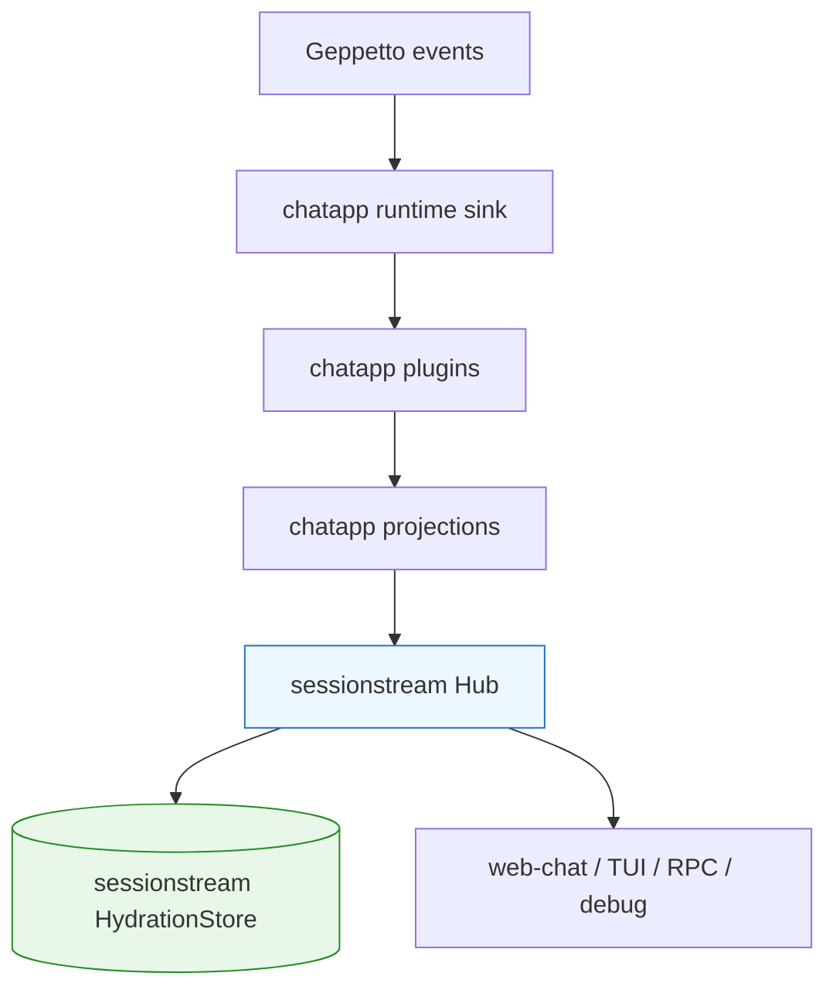
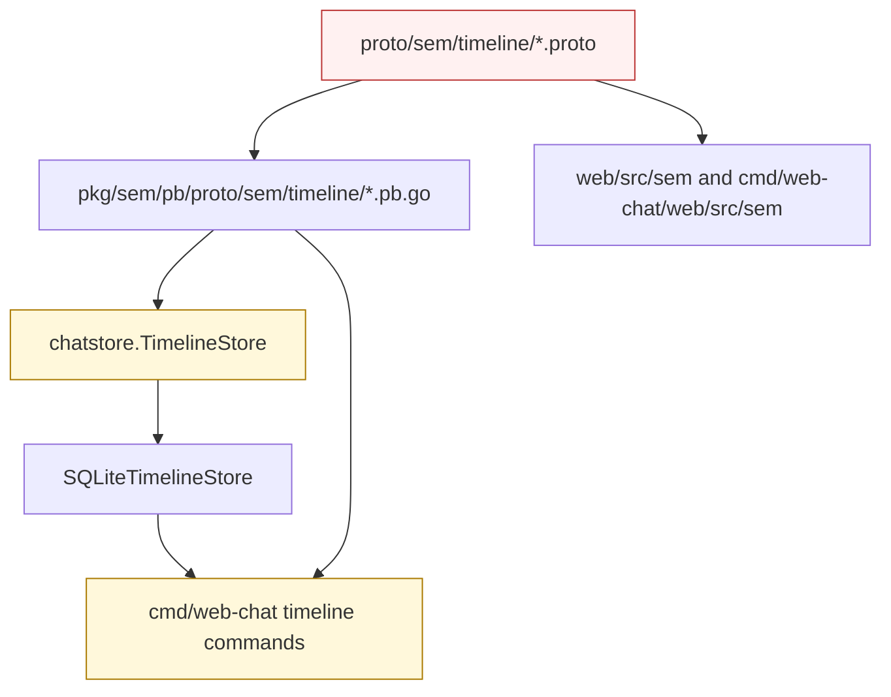
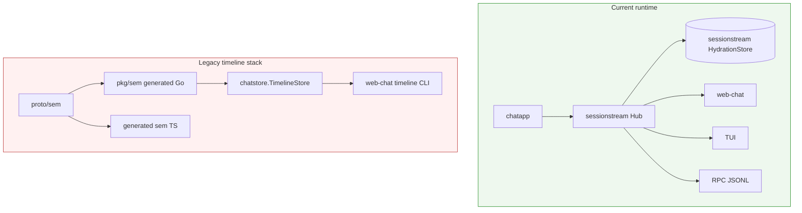
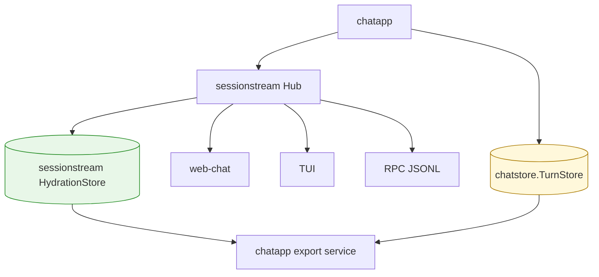

# Removing the Legacy `sem` Timeline Stack

## Executive Summary

Pinocchio now has a current chat streaming model based on `pinocchio/pkg/chatapp` and `github.com/go-go-golems/sessionstream`. The remaining `sem` timeline stack predates that model. It defines protobufs under `proto/sem`, generated Go and TypeScript code under `pkg/sem` and `*/src/sem`, an older `chatstore.TimelineStore` abstraction, and a `cmd/web-chat timeline` command group that inspects the old SQLite schema.

This ticket exists to remove that legacy stack deliberately. The cleanup should not delete `chatstore.TurnStore`; final turn persistence is still current and is required by web-chat and the TUI turns persistence follow-up. The cleanup target is specifically the older timeline store based on `sem.timeline.TimelineEntityV2` and `sem.timeline.TimelineSnapshotV2`.

The new live timeline abstraction is:

```go
sessionstream.HydrationStore
```

The old legacy timeline abstraction is:

```go
chatstore.TimelineStore
```

The migration rule is:

> Keep `chatstore.TurnStore`. Delete or replace `chatstore.TimelineStore`. Use `sessionstream.HydrationStore` for live chatapp timeline persistence.

This document explains the remaining files, how they relate, why they are now legacy, what can be removed, and the safest implementation sequence.

## Problem Statement

The sessionstream migration removed the old raw TUI path and made `chatapp/sessionstream` the canonical stream model for web-chat, CLI RPC JSONL, debug event logs, and command TUI rendering. However, the repository still contains an older timeline system:

- source protobufs under `proto/sem/*`;
- generated Go under `pkg/sem/pb/*`;
- generated TypeScript under `web/src/sem/pb/*` and `cmd/web-chat/web/src/sem/pb/*`;
- timeline store implementations under `pkg/persistence/chatstore/timeline_store*`;
- read-only timeline inspection commands under `cmd/web-chat/timeline/*`;
- Makefile and Buf generation rules for `proto/sem`.

This creates confusion for future work. A new intern looking for "timeline persistence" can find two incompatible concepts:

| Name | Current role | Problem |
|---|---|---|
| `chatstore.TimelineStore` | Older SQLite store for `sem.timeline.TimelineEntityV2`. | Not used by live `chatapp.NewRunner`; wrong target for TUI timeline persistence. |
| `sessionstream.HydrationStore` | Current live store for sessionstream entities/snapshots. | Correct target, but less obvious while old code remains. |

The old stack also keeps generated code and CLI commands alive that appear user-facing but do not inspect the current live web-chat sessionstream database. This increases maintenance cost and makes persistence design harder to explain.

## Current Architecture: Two Timeline Worlds

### Current world: chatapp + sessionstream

The current runtime path is:



The important interfaces are from `sessionstream`:

```go
type HydrationStore interface {
    Apply(ctx context.Context, sid SessionId, ord uint64, entities []TimelineEntity) error
    Snapshot(ctx context.Context, sid SessionId, asOf uint64) (Snapshot, error)
    View(ctx context.Context, sid SessionId) (TimelineView, error)
    Cursor(ctx context.Context, sid SessionId) (uint64, error)
}
```

The SQLite implementation is:

```go
storesqlite "github.com/go-go-golems/sessionstream/pkg/sessionstream/hydration/sqlite"
```

web-chat wires this in:

`cmd/web-chat/app/server.go`

```go
store, cleanup, err := newHydrationStore(s, reg)
...
sessionstream.WithHydrationStore(store)
```

`newHydrationStore` uses:

```go
storesqlite.FileDSN(path)
storesqlite.New(dsn, reg)
```

This is the live model. New TUI timeline persistence should use this store.

### Legacy world: sem timeline + chatstore.TimelineStore

The old stack is:



The old interface is:

`pkg/persistence/chatstore/timeline_store.go`

```go
type TimelineStore interface {
    Upsert(ctx context.Context, convID string, version uint64, entity *timelinepb.TimelineEntityV2) error
    GetSnapshot(ctx context.Context, convID string, sinceVersion uint64, limit int) (*timelinepb.TimelineSnapshotV2, error)
    UpsertConversation(ctx context.Context, record ConversationRecord) error
    GetConversation(ctx context.Context, convID string) (ConversationRecord, bool, error)
    ListConversations(ctx context.Context, limit int, sinceMs int64) ([]ConversationRecord, error)
    Close() error
}
```

This store uses protobuf types from:

```go
github.com/go-go-golems/pinocchio/pkg/sem/pb/proto/sem/timeline
```

It is not the same as `sessionstream.HydrationStore`.

## Inventory of Remaining Legacy Files

### `proto/sem`

Source schemas:

```text
proto/sem/base/agent.proto
proto/sem/base/debugger.proto
proto/sem/base/llm.proto
proto/sem/base/log.proto
proto/sem/base/metadata.proto
proto/sem/base/tool.proto
proto/sem/base/ws.proto
proto/sem/domain/team_analysis.proto
proto/sem/team/team_selection.proto
proto/sem/timeline/message.proto
proto/sem/timeline/status.proto
proto/sem/timeline/team_analysis.proto
proto/sem/timeline/tool.proto
proto/sem/timeline/transport.proto
```

The only sem schemas still referenced by non-generated Go code are the timeline transport types used by `chatstore.TimelineStore` and `cmd/web-chat/timeline`.

### Generated Go

```text
pkg/sem/pb/proto/sem/base/*.pb.go
pkg/sem/pb/proto/sem/domain/*.pb.go
pkg/sem/pb/proto/sem/team/*.pb.go
pkg/sem/pb/proto/sem/timeline/*.pb.go
```

These are generated outputs from `proto/sem`.

### Generated TypeScript

```text
web/src/sem/pb/proto/sem/*
cmd/web-chat/web/src/sem/pb/proto/sem/*
```

The quick audit did not find active non-generated frontend imports of these generated files. They appear to be generation leftovers, but the implementation should verify with `rg "sem/pb|proto/sem"` before deletion.

### Legacy timeline store

```text
pkg/persistence/chatstore/timeline_store.go
pkg/persistence/chatstore/timeline_store_memory.go
pkg/persistence/chatstore/timeline_store_memory_test.go
pkg/persistence/chatstore/timeline_store_sqlite.go
pkg/persistence/chatstore/timeline_store_sqlite_test.go
```

These implement and test the old `chatstore.TimelineStore` abstraction.

### Legacy web-chat timeline command group

```text
cmd/web-chat/timeline/db.go
cmd/web-chat/timeline/entities.go
cmd/web-chat/timeline/entity.go
cmd/web-chat/timeline/entity_helpers.go
cmd/web-chat/timeline/list.go
cmd/web-chat/timeline/snapshot.go
cmd/web-chat/timeline/stats.go
cmd/web-chat/timeline/timeline.go
cmd/web-chat/timeline/verify.go
```

Wired in:

`cmd/web-chat/main.go`

```go
timelinecmd "github.com/go-go-golems/pinocchio/cmd/web-chat/timeline"
...
timelinecmd.AddToRootCommand(root)
```

These commands open `chatstore.SQLiteTimelineStore`, not the live `sessionstream` SQLite hydration store.

### CLI persistence helper contamination

`pkg/cmds/chat_persistence.go` currently mixes the legacy timeline store with the current turns store:

```go
func openChatPersistenceStores(settings run.PersistenceSettings) (chatstore.TimelineStore, chatstore.TurnStore, func(), error)
```

That function should be split or simplified. `chatstore.TurnStore` should stay. `chatstore.TimelineStore` should be removed.

### Generation and tooling config

Files to update:

```text
buf.gen.yaml
Makefile
cmd/web-chat/web/biome.json
```

Current `buf.gen.yaml` generates `proto/sem` into:

```text
web/src/sem/pb
cmd/web-chat/web/src/sem/pb
pkg/sem/pb
```

Current `Makefile` includes:

```make
proto-gen-core:
	buf generate --path proto/sem
```

and gosec excludes:

```text
-exclude-dir=pkg/sem/pb
```

Those should change after `proto/sem` is removed.

## What Must Not Be Deleted

Do not delete `chatstore.TurnStore`:

```text
pkg/persistence/chatstore/turn_store.go
pkg/persistence/chatstore/turn_store_sqlite.go
pkg/persistence/chatstore/turn_store_sqlite_test.go
pkg/persistence/chatstore/turn_store_sqlite_benchmark_test.go
```

`TurnStore` is still current. It stores serialized final `turns.Turn` snapshots and is used by web-chat. It is also the intended substrate for the TUI turns persistence ticket.

Do not delete current chatapp protos:

```text
proto/pinocchio/chatapp/v1/chat.proto
proto/pinocchio/chatapp/rpc/v1/rpc.proto
pkg/chatapp/pb/*
cmd/web-chat/web/src/chatapp/pb/*
```

Those define the current chatapp payload and RPC JSONL contracts.

Do not delete `sessionstream` SQLite hydration usage in web-chat:

```text
cmd/web-chat/app/server.go
```

That is current runtime infrastructure.

## Proposed Solution

Remove the legacy sem timeline stack in a dedicated cleanup PR. The PR should not add new TUI turn persistence. It should only delete old timeline code and adjust generation/tooling.

The cleanup has four implementation phases:

1. Remove the old web-chat `timeline` command group and its root wiring.
2. Remove `chatstore.TimelineStore` and its implementations/tests.
3. Split or simplify CLI persistence helpers so they only open `TurnStore` unless/until the TUI ticket adds `sessionstream.HydrationStore` helpers.
4. Remove `proto/sem`, generated `pkg/sem`, generated TS `src/sem`, and update Buf/Makefile/biome/docs.

## Implementation Guide

### Phase 1: Remove `cmd/web-chat/timeline`

Delete directory:

```text
cmd/web-chat/timeline/
```

Update `cmd/web-chat/main.go`:

Remove import:

```go
timelinecmd "github.com/go-go-golems/pinocchio/cmd/web-chat/timeline"
```

Remove root wiring:

```go
timelinecmd.AddToRootCommand(root)
```

Then run:

```bash
go test ./cmd/web-chat/... -count=1
```

Expected issues:

- unused imports in `cmd/web-chat/main.go` if only timeline import was removed;
- docs or tests that mention `web-chat timeline` commands.

If any tests assert these commands exist, update the tests to reflect removal or write a replacement ticket for sessionstream hydration inspection commands.

### Phase 2: Remove `chatstore.TimelineStore`

Delete:

```text
pkg/persistence/chatstore/timeline_store.go
pkg/persistence/chatstore/timeline_store_memory.go
pkg/persistence/chatstore/timeline_store_memory_test.go
pkg/persistence/chatstore/timeline_store_sqlite.go
pkg/persistence/chatstore/timeline_store_sqlite_test.go
```

Search and fix remaining references:

```bash
rg "TimelineStore|NewSQLiteTimelineStore|NewInMemoryTimelineStore|SQLiteTimelineDSNForFile|TimelineEntityV2|TimelineSnapshotV2|timelinepb" -n --glob '!ttmp/**'
```

The main expected remaining reference is `pkg/cmds/chat_persistence.go`.

### Phase 3: Split `pkg/cmds/chat_persistence.go`

Current function:

```go
func openChatPersistenceStores(settings run.PersistenceSettings) (chatstore.TimelineStore, chatstore.TurnStore, func(), error)
```

Replace it with a turns-only helper:

```go
func openCLITurnStore(settings run.PersistenceSettings) (chatstore.TurnStore, func(), error) {
    var turnStore chatstore.TurnStore
    cleanup := func() {
        if turnStore != nil {
            _ = turnStore.Close()
        }
    }

    openTurns := strings.TrimSpace(settings.TurnsDSN) != "" || strings.TrimSpace(settings.TurnsDB) != ""
    if !openTurns {
        return nil, cleanup, nil
    }

    dsn := strings.TrimSpace(settings.TurnsDSN)
    if dsn == "" {
        turnsDB := strings.TrimSpace(settings.TurnsDB)
        if dir := filepath.Dir(turnsDB); dir != "" && dir != "." {
            if err := os.MkdirAll(dir, 0o755); err != nil {
                return nil, cleanup, errors.Wrap(err, "create turns db dir")
            }
        }
        var err error
        dsn, err = chatstore.SQLiteTurnDSNForFile(turnsDB)
        if err != nil {
            return nil, cleanup, err
        }
    }

    s, err := chatstore.NewSQLiteTurnStore(dsn)
    if err != nil {
        return nil, cleanup, err
    }
    turnStore = s
    return turnStore, cleanup, nil
}
```

Update tests:

- remove timeline-store tests in `pkg/cmds/chat_persistence_test.go`;
- keep/add tests for turns DB opening and `cliTurnStorePersister`.

If the TUI turns persistence ticket is implemented first, coordinate this helper name with that ticket. The preferred end-state is:

```go
openCLITurnStore(...)                     // chatstore.TurnStore
openCLISessionstreamHydrationStore(...)   // sessionstream.HydrationStore, added by TUI persistence work
```

### Phase 4: Remove `proto/sem` and generated outputs

Delete:

```text
proto/sem/
pkg/sem/
web/src/sem/
cmd/web-chat/web/src/sem/
```

Then update `buf.gen.yaml`. Current file is sem-only:

```yaml
version: v1
plugins:
  - plugin: buf.build/bufbuild/es
    out: web/src/sem/pb
  - plugin: buf.build/bufbuild/es
    out: cmd/web-chat/web/src/sem/pb
  - plugin: buf.build/protocolbuffers/go
    out: pkg/sem/pb
```

Possible target after cleanup depends on current active proto generation. If chatapp protos are generated by another command/config, remove this file or remove sem-specific outputs. If this root config should now generate active Pinocchio protos, rewrite it to target `proto/pinocchio` and the current generated output dirs.

Update `Makefile`:

Current:

```make
proto-gen-core:
	buf generate --path proto/sem
```

Recommended after sem removal:

```make
proto-gen-core:
	buf generate --path proto/pinocchio
```

or remove `proto-gen-core` if active proto generation is handled elsewhere.

Update gosec exclude:

```diff
- -exclude-dir=pkg/sem/pb
```

Update `cmd/web-chat/web/biome.json` to remove generated sem ignore entries such as:

```json
"!!**/src/sem/pb"
```

### Phase 5: Audit `cmd/web-chat/proto/sem`

There is a second excluded proto island:

```text
cmd/web-chat/proto/sem/middleware/disco_dialogue.proto
cmd/web-chat/proto/sem/middleware/inner_thoughts.proto
cmd/web-chat/proto/sem/middleware/mode_evaluation.proto
cmd/web-chat/proto/sem/middleware/next_thinking_mode.proto
cmd/web-chat/proto/sem/middleware/thinking_mode.proto
cmd/web-chat/proto/sem/timeline/middleware.proto
```

Root `buf.yaml` excludes it:

```yaml
build:
  excludes:
    - cmd/web-chat/proto
```

Makefile has:

```make
proto-gen-web-chat:
	cd cmd/web-chat/proto && buf generate
```

The quick audit did not find current imports from generated middleware sem outputs, but this should be verified separately:

```bash
rg "inner_thoughts|disco_dialogue|mode_evaluation|next_thinking_mode|thinking_mode|sem.middleware|sem.timeline" cmd/web-chat -n --glob '!cmd/web-chat/proto/**'
```

If unused, remove `cmd/web-chat/proto/sem` and update `proto-gen-web-chat`. If used, leave it and document that it is not part of the root `proto/sem` cleanup.

## Before and After Diagrams

### Before



### After



After cleanup, there should be one current visible timeline persistence abstraction: `sessionstream.HydrationStore`. There should be one current model-context persistence abstraction: `chatstore.TurnStore`.

## Search Commands for the Implementer

Run these before deletion:

```bash
cd /home/manuel/workspaces/2026-05-20/pinocchio-structured-data-cli/pinocchio

rg "pkg/sem/pb|web/src/sem/pb|cmd/web-chat/web/src/sem/pb|proto/sem" \
  -n --glob '!ttmp/**' \
     --glob '!pkg/sem/pb/**' \
     --glob '!web/src/sem/pb/**' \
     --glob '!cmd/web-chat/web/src/sem/pb/**'

rg "TimelineEntityV2|TimelineSnapshotV2|TimelineStore|NewSQLiteTimelineStore|NewInMemoryTimelineStore|timelinepb" \
  -n --glob '!ttmp/**'

rg "HydrationStore|WithHydrationStore|sessionstream/hydration/sqlite|newHydrationStore" \
  -n --glob '!ttmp/**'
```

After deletion, the first two commands should return no live-code references except docs/ticket notes if those are intentionally kept under `ttmp` or documentation.

## Validation Plan

Run in this order:

```bash
go test ./pkg/persistence/chatstore -count=1
```

This should still test `TurnStore` after timeline store tests are removed.

```bash
go test ./cmd/web-chat/... ./pkg/chatapp/... ./pkg/cmds/... ./pkg/ui -count=1
```

This validates the areas most likely to be affected by timeline command removal and CLI helper refactoring.

```bash
make proto-gen
```

This validates generation configuration after removing `proto/sem`. If `proto-gen` still refers to deleted sem paths, fix `Makefile`/Buf config.

```bash
make schema-vet
```

This validates current protobuf/event schema usage.

```bash
go test ./... -count=1
```

Run the full suite after targeted tests pass.

For frontend:

```bash
cd cmd/web-chat/web
npm run typecheck
npm run lint
```

If generated `src/sem` files were removed and no imports exist, typecheck should pass. If typecheck fails, inspect whether an old frontend path still imports sem outputs and either remove that frontend code or migrate it to `chatapp/pb` or sessionstream-facing types.

## Rollback Plan

If deletion breaks unexpected external workflows, revert in two layers:

1. Restore `cmd/web-chat/timeline` and `chatstore.TimelineStore` only if old DB inspection commands are still required.
2. Keep `proto/sem` generated outputs only if a still-supported external API consumes those generated schemas.

Do not revert by reintroducing `chatstore.TimelineStore` into new TUI persistence. If timeline inspection is still needed, prefer a new sessionstream hydration inspection command instead of preserving the old sem schema indefinitely.

## Design Decisions

### Decision 1: Treat `chatstore.TimelineStore` as legacy

The current runtime uses `sessionstream.HydrationStore`. Keeping another timeline store with a similar name creates wrong implementation paths for new work.

### Decision 2: Preserve `chatstore.TurnStore`

Turn persistence remains current and necessary. This cleanup is only about the legacy timeline stack.

### Decision 3: Remove old web-chat timeline CLI before removing generated sem code

The CLI command group is the main non-generated user of `sem.timeline` types. Removing it first makes the dependency graph simpler.

### Decision 4: Do not fold this cleanup into TUI turns persistence

The TUI turns persistence ticket is a feature/persistence change. This ticket is a cleanup/deletion change. Keeping them separate makes review safer.

### Decision 5: Replace old timeline tooling only if there is a user need

If timeline inspection is still useful, build a new command against `sessionstream.HydrationStore` rather than preserving the old `sem` store.

## Alternatives Considered

### Alternative A: Leave legacy sem stack in place

Rejected. It keeps confusing types and old code paths alive, and makes new persistence work harder to explain.

### Alternative B: Migrate old `chatstore.TimelineStore` to wrap sessionstream

Rejected for now. A wrapper would preserve old names and old mental models. If inspection tooling is needed, create explicit sessionstream inspection tooling.

### Alternative C: Delete all `chatstore` package code

Rejected. `chatstore.TurnStore` is current and needed.

### Alternative D: Keep generated sem TS for compatibility

Probably unnecessary, but verify frontend imports first. If no imports exist, generated TS should be deleted with the source schemas.

## Risks and Mitigations

### Risk: external users still run `web-chat timeline`

Mitigation: check release notes / docs and mention command removal. If needed, create replacement `web-chat sessionstream` inspection commands.

### Risk: hidden frontend imports of generated sem TS

Mitigation: run `rg`, TypeScript typecheck, and Biome lint after deletion.

### Risk: Makefile/proto generation drift

Mitigation: run `make proto-gen` and `make schema-vet`. Update `buf.gen.yaml` and Makefile together.

### Risk: deleting useful old DB migration tooling

Mitigation: if migration from old timeline DBs is needed, move old inspection code under a short-lived `scripts/legacy-timeline/` migration script before deleting production commands. Do not keep it wired into the main CLI indefinitely.

## API References

### Legacy API to delete

```go
type TimelineStore interface {
    Upsert(ctx context.Context, convID string, version uint64, entity *timelinepb.TimelineEntityV2) error
    GetSnapshot(ctx context.Context, convID string, sinceVersion uint64, limit int) (*timelinepb.TimelineSnapshotV2, error)
    UpsertConversation(ctx context.Context, record ConversationRecord) error
    GetConversation(ctx context.Context, convID string) (ConversationRecord, bool, error)
    ListConversations(ctx context.Context, limit int, sinceMs int64) ([]ConversationRecord, error)
    Close() error
}
```

### Current API to keep/use

```go
type HydrationStore interface {
    Apply(ctx context.Context, sid SessionId, ord uint64, entities []TimelineEntity) error
    Snapshot(ctx context.Context, sid SessionId, asOf uint64) (Snapshot, error)
    View(ctx context.Context, sid SessionId) (TimelineView, error)
    Cursor(ctx context.Context, sid SessionId) (uint64, error)
}
```

### Current turn API to keep/use

```go
type TurnStore interface {
    Save(ctx context.Context, convID, sessionID, turnID, phase string, createdAtMs int64, payload string, opts TurnSaveOptions) error
    LoadLatestTurn(ctx context.Context, convID, phase string) (TurnRecord, error)
    List(ctx context.Context, query TurnQuery) ([]TurnRecord, error)
    Close() error
}
```

Confirm exact `TurnStore` signatures from `pkg/persistence/chatstore/turn_store.go` before implementation.

## Recommended First PR Scope

The first PR should remove:

- `cmd/web-chat/timeline/`;
- `chatstore.TimelineStore` implementation/tests;
- root `proto/sem` and generated outputs if no references remain;
- Makefile/Buf/biome references to generated sem outputs.

It should keep:

- `chatstore.TurnStore`;
- current `chatapp` protobufs;
- current `sessionstream` hydration store wiring;
- web-chat HTTP timeline export based on `chatapp/export.Service` and `sessionstream.Snapshot`.

## Intern Checklist

Before editing:

- Read this document fully.
- Run the three `rg` audit commands above.
- Open `cmd/web-chat/app/server.go` and confirm current `newHydrationStore` uses `sessionstream` SQLite.
- Open `pkg/chatapp/export/service.go` and confirm timeline export uses `SnapshotProvider`, not `chatstore.TimelineStore`.
- Open `pkg/persistence/chatstore/turn_store.go` and confirm this package must stay.

While editing:

- Delete old timeline command group first.
- Delete old timeline store second.
- Fix `chat_persistence.go` third.
- Delete sem proto/generated files last.
- Update generation/tooling config.

After editing:

- Run targeted Go tests.
- Run `make proto-gen` and inspect generated diffs.
- Run `make schema-vet`.
- Run full tests and web checks.
- Update user-facing docs if any mention `web-chat timeline`.

The expected final state is that `rg "pkg/sem/pb|TimelineEntityV2|chatstore.TimelineStore"` finds no live code references.
