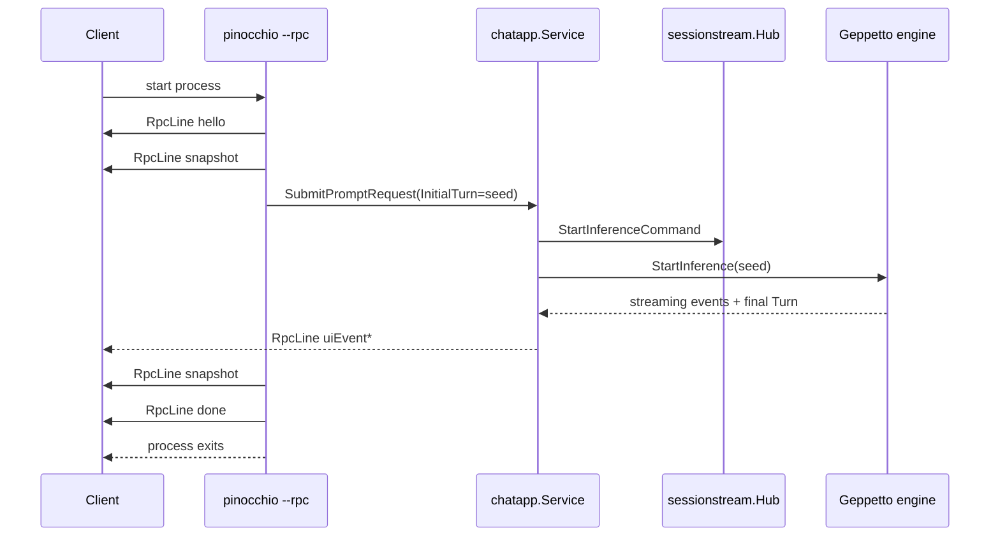

# Multi-turn stdin stdout RPC mode

## Executive Summary

Pinocchio currently has a protobuf-defined JSONL RPC output mode. The flags `--rpc` and `--output jsonl` run one command invocation, stream `RpcLine` frames to stdout, emit a terminal `done` or `error`, and exit. This is useful for subprocess clients that want streaming output from a single model call, but it is not yet a true multi-turn RPC protocol.

This ticket designs the next step: an explicit stdin/stdout RPC mode for multi-turn chat. The first implementation should be intentionally narrow. Keep existing one-shot `--rpc` behavior unchanged. Add a separate opt-in mode, tentatively `--stdin-rpc`, that keeps the Pinocchio process alive, reads one JSON request per stdin line, submits prompts through the existing `chatapp` + `sessionstream` stack, emits the existing protobuf JSON `RpcLine` family on stdout, and maintains a server-held `turns.Turn` accumulator per `session_id` for the lifetime of the process.

The core rule is:

```text
stdin request lines -> prompt submission
chatapp/sessionstream -> projected UI events
stdout RpcLine lines -> client-visible event stream
final Geppetto turns.Turn -> next model context
```

Do not build a second Geppetto event mapper. Do not use `sessionstream.Snapshot` as model context. Use final `turns.Turn` values returned by `PromptRequest.OnFinalTurn` as the conversation accumulator, exactly like the command TUI backend now does.

## How To Use This Guide As A New Intern

Read this document in order before writing code. The first half explains the system pieces and the invariants that keep model context, visible UI state, and JSONL transport separate. The second half gives the concrete API and implementation plan.

Recommended reading path:

1. Read **Problem Statement** to understand why current `--rpc` is one-shot.
2. Read **System Background for a New Intern** to learn the vocabulary: `turns.Turn`, `Block`, `sessionstream`, `chatapp`, `RpcLine`, and `PromptRequest`.
3. Read **Proposed Solution** to understand the intended stdin/stdout protocol.
4. Read **Detailed API Design** before touching protobufs or command flags.
5. Follow **Implementation Plan** phase-by-phase; do not skip directly to the server loop.
6. Use **File Reference Map** as the review checklist for code navigation.

The most important mental model is:

```text
turns.Turn            = model/inference context
sessionstream         = visible UI/projection state
RpcLine JSONL stdout  = transport of projected state to subprocess clients
RpcRequestLine stdin  = transport of client instructions into the long-lived process
```

If an implementation blurs these boundaries, stop and redesign before coding further.

## Problem Statement

### Current behavior

Current RPC JSONL mode is one-shot:

```bash
pinocchio run-command ./cmd.yaml --rpc
pinocchio run-command ./cmd.yaml --output jsonl
```

The implementation path is `PinocchioCommand.runRPCJSONL` in `pkg/cmds/cmd.go`. It:

1. builds the command's initial `turns.Turn`;
2. derives a `sessionstream.SessionId`;
3. creates an RPC JSONL fanout;
4. creates a `chatapp.Runner`;
5. emits `hello` and initial `snapshot` frames;
6. submits exactly one `chatapp.PromptRequest` with `InitialTurn`;
7. waits for the run to become idle;
8. emits a final snapshot and `done`;
9. returns.

That means current subprocess clients can stream one answer but cannot send another prompt to the same process.

### What is missing

A multi-turn RPC client needs to be able to:

- start one Pinocchio process;
- send a prompt request on stdin;
- receive streaming UI/progress frames on stdout;
- wait for `done` for that request;
- send a second prompt request on stdin;
- have the model see the first prompt and first assistant answer as context;
- optionally cancel a running request;
- terminate the process cleanly.

Current `--rpc` cannot do this because stdin is not part of the protocol and the process exits after one run.

### Non-goals for the first implementation

The first implementation should not try to solve every daemon problem. It should not include:

- a full JSON-RPC 2.0 implementation;
- request multiplexing where multiple prompts run concurrently in the same session;
- rich session discovery/listing commands;
- distributed resume semantics;
- a separate `--conversation-id` concept;
- a second event mapping stack;
- backwards-compatible behavior changes to existing `--rpc` output-only mode.

The goal is a minimal, testable, line-oriented protocol that can grow later.

## System Background for a New Intern

### Turns, blocks, and model context

Geppetto represents model context as a `turns.Turn`. A turn contains ordered blocks. Blocks can represent system text, user text, assistant text, images, tool calls, and other typed payloads.

For this work, the most important concept is that the final `turns.Turn` returned by inference contains the accumulated model context. It is the correct thing to carry into the next prompt.

Simplified model:

```text
turns.Turn
  Block 1: system: "You are helpful"
  Block 2: user: "first prompt"
  Block 3: assistant: "first answer"
  Block 4: user: "second prompt"
  Block 5: assistant: "second answer"
```

When the user asks the second prompt, the model should receive blocks 1-4 as context. After the second answer, the final turn contains blocks 1-5.

### sessionstream visible state

`sessionstream` is not the model context. It is the visible event/timeline/hydration layer. It stores projected UI entities such as:

- accepted user messages;
- assistant text segments;
- reasoning patches;
- run started/finished/failed events;
- snapshots of UI entities.

This is the right substrate for:

- TUI hydration;
- web-chat UI state;
- RPC/debug JSONL output;
- timeline inspection.

It is not the source of truth for the next model prompt when a final `turns.Turn` is available.

### chatapp service

`pkg/chatapp/service.go` exposes the core prompt submission API:

```go
type PromptRequest struct {
    Prompt         string
    IdempotencyKey string
    Runtime        *infruntime.ComposedRuntime
    InitialTurn    *turns.Turn
    OnFinalTurn    func(*turns.Turn)
}
```

Important fields:

- `Prompt`: the visible prompt text.
- `Runtime`: the inference runtime/engine.
- `InitialTurn`: optional complete input turn supplied by the caller.
- `OnFinalTurn`: callback with the final Geppetto turn after successful inference.

For multi-turn stdin RPC, the adapter should use `InitialTurn` and `OnFinalTurn` similarly to the TUI backend:

1. Keep `currentTurn` in memory per `session_id`.
2. For each prompt, clone `currentTurn` and append a user prompt.
3. Submit that full turn as `InitialTurn`.
4. On success, replace `currentTurn` with the final turn from `OnFinalTurn`.

### Current RPC stdout envelope

`proto/pinocchio/chatapp/rpc/v1/rpc.proto` defines `RpcLine`:

```protobuf
message RpcLine {
  uint32 version = 1;
  string session_id = 2;
  string request_id = 3;

  oneof frame {
    HelloFrame hello = 10;
    SnapshotFrame snapshot = 11;
    UiEventFrame ui_event = 12;
    BackendEventFrame backend_event = 13;
    ErrorFrame error = 14;
    DoneFrame done = 15;
  }
}
```

Each stdout line is protobuf JSON encoding of one `RpcLine`. The existing line family should remain the stdout contract. Multi-turn stdin RPC should reuse it so clients do not need two event parsers.

### Current one-shot RPC implementation

`PinocchioCommand.runRPCJSONL` currently does exactly one prompt:

```go
seed, err := g.buildInitialTurn(rc.Variables, rc.ImagePaths)
sid := commandSessionID(seed)
prompt := displayPromptForTurn(seed)
fanout, err := chatapprpcjsonl.NewUIFanout(rc.Writer)
runner, err := chatapp.NewRunner(commandRunnerOptions(statusFanout))
engine, err := rc.EngineFactory.CreateEngine(rc.InferenceSettings)
req := chatapp.PromptRequest{
    Prompt: prompt,
    InitialTurn: seed,
    Runtime: &infruntime.ComposedRuntime{Engine: engine},
}
err = runner.Service.SubmitPromptRequest(ctx, sid, req)
err = runner.Service.WaitIdle(ctx, sid)
```

The new mode should not mutate this path. Add a separate path so existing users of `--rpc` and `--output jsonl` keep the same behavior.

## Proposed Solution

### User-facing UX

Keep current behavior:

```bash
pinocchio run-command ./cmd.yaml --rpc
pinocchio run-command ./cmd.yaml --output jsonl
```

Add a new explicit mode:

```bash
pinocchio run-command ./cmd.yaml --rpc --stdin-rpc
```

or, if command organization changes later:

```bash
pinocchio chat --rpc --stdin-rpc
```

For the first implementation inside the existing command framework, prefer the flag-based version because it can reuse `PinocchioCommand` rendering, profile resolution, engine creation, RPC JSONL writer, debug fanout, and persistence helpers.

### Protocol shape

The process writes a `hello` frame to stdout when ready. The client then writes request JSON lines to stdin. Each request line is one protobuf JSON object, not arbitrary JSON-RPC.

Recommended request proto:

```protobuf
message RpcRequestLine {
  uint32 version = 1;
  string session_id = 2;
  string request_id = 3;

  oneof request {
    SubmitPromptRequest submit = 10;
    CancelRequest cancel = 11;
    SnapshotRequest snapshot = 12;
    ShutdownRequest shutdown = 13;
  }
}

message SubmitPromptRequest {
  string prompt = 1;
  bool reset = 2;
  repeated google.protobuf.Any attachments = 3;
}

message CancelRequest {}
message SnapshotRequest {}
message ShutdownRequest {}
```

The exact proto file can either extend `rpc.proto` or create a sibling file such as:

```text
proto/pinocchio/chatapp/rpc/v1/rpc_request.proto
```

For simplicity, adding request messages to `rpc.proto` is acceptable if package ownership remains clean. Keep stdout response frames in `RpcLine`; use `RpcRequestLine` only for stdin.

### JSON examples

Startup from server:

```json
{"version":1,"sessionId":"server-default","hello":{"protocol":"pinocchio.chatapp.rpc.v1","server":"pinocchio","capabilities":["ui-events","snapshot","done","stdin-rpc","cancel","multi-turn"]}}
```

Client submits first prompt:

```json
{"version":1,"sessionId":"chat-1","requestId":"req-1","submit":{"prompt":"Say hello in one sentence."}}
```

Server emits normal stdout frames with the same `sessionId` and `requestId`:

```json
{"version":1,"sessionId":"chat-1","requestId":"req-1","uiEvent":{"ordinal":"1","name":"ChatUserMessageAccepted","payload":{"@type":"type.googleapis.com/pinocchio.chatapp.v1.ChatUserMessageAccepted","text":"Say hello in one sentence."}}}
```

Server ends that request:

```json
{"version":1,"sessionId":"chat-1","requestId":"req-1","done":{"status":"ok"}}
```

Client submits second prompt to the same session:

```json
{"version":1,"sessionId":"chat-1","requestId":"req-2","submit":{"prompt":"Now translate that to French."}}
```

The server should use the final turn from `req-1` as the model context for `req-2`.

### Runtime model

Use one adapter object for the lifetime of the process:

```go
type StdinRPCServer struct {
    service *chatapp.Service
    runner  *chatapp.Runner
    writer  *chatapprpcjsonl.Writer
    engineFactory factory.EngineFactory
    settings *settings.InferenceSettings

    mu       sync.Mutex
    sessions map[sessionstream.SessionId]*RPCSessionState
}

type RPCSessionState struct {
    CurrentTurn *turns.Turn
    Running     bool
}
```

The implementation can be simpler than this exact struct, but these are the logical responsibilities.

### Turn accumulation algorithm

For each submit request:

```go
func (s *StdinRPCServer) handleSubmit(ctx context.Context, req *RpcRequestLine) error {
    sid := sessionstream.SessionId(req.SessionId)
    requestID := strings.TrimSpace(req.RequestId)
    prompt := strings.TrimSpace(req.Submit.Prompt)

    state := s.sessionState(sid)

    state.mu.Lock()
    if state.Running {
        state.mu.Unlock()
        return s.writeError(sid, requestID, "busy", "session already has an active run", false)
    }
    initial := buildInitialTurnForSubmit(state.CurrentTurn, prompt, req.Submit.Reset)
    state.Running = true
    state.mu.Unlock()

    engine, err := s.engineFactory.CreateEngine(s.settings)
    if err != nil { ... }

    var finalTurn *turns.Turn
    var finalTurnMu sync.Mutex
    promptReq := chatapp.PromptRequest{
        Prompt: prompt,
        InitialTurn: initial,
        Runtime: &infruntime.ComposedRuntime{Engine: engine},
        OnFinalTurn: func(t *turns.Turn) {
            finalTurnMu.Lock()
            defer finalTurnMu.Unlock()
            if t != nil {
                finalTurn = t.Clone()
            }
        },
    }

    err = s.service.SubmitPromptRequest(ctx, sid, promptReq)
    if err == nil {
        err = s.service.WaitIdle(ctx, sid)
    }

    state.mu.Lock()
    defer state.mu.Unlock()
    state.Running = false
    if err != nil {
        return err
    }
    if finalTurn != nil {
        state.CurrentTurn = finalTurn.Clone()
    } else {
        state.CurrentTurn = initial.Clone()
    }
    return nil
}
```

The first implementation can serialize requests per session. Do not allow two active submits in the same session. Later versions may support cancellation and overlapping sessions, but the invariant should remain: one active inference per session.

### Initial turn policy

The command invocation still has a seed turn from YAML, CLI flags, system prompts, blocks, images, and template rendering. For stdin RPC, that seed is the initial state for new sessions unless the request says `reset`.

Rules:

1. On process startup, render a command seed turn once.
2. For a new `session_id`, set `CurrentTurn = seed.Clone()`.
3. For each prompt, append a user prompt to the current turn.
4. Submit the full resulting turn as `InitialTurn`.
5. Replace `CurrentTurn` with the final turn after success.
6. If a request has `submit.reset = true`, reset that session state to the seed before appending the prompt.

Pseudo-code:

```go
func buildInitialTurnForSubmit(seed, current *turns.Turn, prompt string, reset bool) *turns.Turn {
    var t *turns.Turn
    if reset || current == nil {
        t = seed.Clone()
    } else {
        t = current.Clone()
    }
    turns.AppendBlock(t, turns.NewUserTextBlock(prompt))
    return t
}
```

Implementation note: reuse or mirror `turnWithUserPrompt` from `pkg/ui/chatapp_backend.go` if it is suitable. If the function is unexported and duplication is tiny, a small helper in the RPC server is fine. Do not make `pkg/ui` a dependency of command RPC logic just to reuse it.

### Output frame rules

Each request should have a clear lifecycle:

```text
client submit req-1
server uiEvent ... requestId=req-1
server snapshot requestId=req-1 (optional final snapshot)
server done requestId=req-1 status=ok
```

Errors:

- malformed stdin JSON: emit `error{code="bad_request", terminal=false}` if stdout is usable;
- unknown request oneof: emit `error{code="unknown_request", terminal=false}`;
- submit while busy: emit `error{code="busy", terminal=false}`;
- engine creation failure: emit `error{code="engine_init_failed", terminal=false}`, then `done{status="failed"}` for that request;
- fatal IO failure writing stdout: process should exit non-zero.

Do not emit a global terminal `done` for the whole process until shutdown. Per-request done frames must carry `request_id`.

### Request id propagation

Current `RpcLine` already has `request_id`, but much of the current fanout path is session-oriented. The multi-turn implementation should ensure request ids appear on frames for the active request.

There are two viable implementation paths:

#### Option A: request-id annotating fanout wrapper

Wrap the existing RPC fanout with a small adapter that injects the current request id when writing frames:

```go
type RequestScopedFanout struct {
    inner *chatapprpcjsonl.UIFanout
    active sync.Map // sid -> requestID
}

func (f *RequestScopedFanout) SetActive(sid sessionstream.SessionId, requestID string) { ... }
func (f *RequestScopedFanout) PublishUI(ctx context.Context, sid sessionstream.SessionId, ord uint64, events []sessionstream.Event) error {
    requestID := f.activeRequestID(sid)
    return f.inner.WriteUIEventsWithRequestID(sid, requestID, ord, events)
}
```

This may require extending `pkg/chatapp/rpc/jsonl` with request-aware writer methods.

#### Option B: allow writer/fanout to accept a request id provider

Change `chatapprpcjsonl.UIFanout` construction to accept an optional function:

```go
type RequestIDProvider func(sessionstream.SessionId) string

func NewUIFanoutWithRequestIDs(w io.Writer, provider RequestIDProvider) (*UIFanout, error)
```

This keeps request id injection close to the JSONL writer. It is probably cleaner if several call sites need request ids later.

For the first implementation, Option B is recommended if it stays small. Otherwise, Option A is acceptable.

### Persistence model

The first implementation should keep multi-turn state in memory. This is the easiest way to prove the protocol.

Recommended first pass:

```text
server process memory:
  map[session_id]currentTurn
```

Optional second pass:

```text
--turns-db configured:
  persist final turns with conv_id=session_id, session_id=session_id, phase=final
```

Do not block the first protocol implementation on durable resume. TUI resume is already implemented and can inform a later RPC persistence pass.

That said, if `--turns-db` is already easy to wire into the stdin RPC runner, it is reasonable to persist successful final turns using `newCLITurnStorePersister`. The important part is that persistence remains a sink after successful inference, not the primary intra-process accumulator.

### Cancellation

A `cancel` request should call:

```go
service.Stop(ctx, sid)
```

The engine already handles stop through `CommandStopInference` and active run cancellation. The output should include a run stopped event and `done{status="stopped"}` if the cancellation is associated with an active request.

First pass can support cancellation or explicitly reject it with `unimplemented`. If time is limited, implement submit + shutdown first, then cancellation.

### Shutdown

A shutdown request should:

1. refuse new requests;
2. cancel active runs if any;
3. optionally emit a final snapshot per active session;
4. emit a terminal `done{status="ok"}` or `done{status="stopped"}` for active requests;
5. return from the stdin loop and exit zero.

Example:

```json
{"version":1,"requestId":"quit-1","shutdown":{}}
```

### Diagram: current one-shot RPC



### Diagram: proposed stdin multi-turn RPC

```mermaid
sequenceDiagram
    participant Client
    participant Pin as pinocchio --rpc --stdin-rpc
    participant State as map[session_id]Turn
    participant Chat as chatapp.Service
    participant LLM as Geppetto engine

    Client->>Pin: start process
    Pin->>Client: hello(capabilities include stdin-rpc,multi-turn)
    Client->>Pin: Submit req-1(session=chat-1,prompt=A)
    Pin->>State: current = seed.Clone(); input = current + A
    Pin->>Chat: SubmitPromptRequest(InitialTurn=input, OnFinalTurn)
    Chat->>LLM: StartInference(input)
    Chat-->>Client: uiEvent*(request_id=req-1)
    Chat-->>Pin: OnFinalTurn(turn A+answer)
    Pin->>State: current = finalTurn
    Pin->>Client: done(request_id=req-1,status=ok)
    Client->>Pin: Submit req-2(session=chat-1,prompt=B)
    Pin->>State: input = current + B
    Pin->>Chat: SubmitPromptRequest(InitialTurn=input, OnFinalTurn)
    Chat->>LLM: StartInference(input)
    Chat-->>Client: uiEvent*(request_id=req-2)
    Chat-->>Pin: OnFinalTurn(turn A+answer+B+answer)
    Pin->>State: current = finalTurn
    Pin->>Client: done(request_id=req-2,status=ok)
```

## Detailed API Design

### CLI flags

Add to helper settings:

```go
type HelpersSettings struct {
    // existing fields
    RPC       bool   `glazed:"rpc"`
    Output    string `glazed:"output"`
    StdinRPC  bool   `glazed:"stdin-rpc"`
}
```

Add to `run.UISettings`:

```go
type UISettings struct {
    // existing fields
    RPC      bool
    StdinRPC bool
}
```

Run mode selection:

```go
if settings.RPC && settings.StdinRPC {
    return run.RunModeRPCStdin
}
if settings.RPC || strings.EqualFold(settings.Output, "jsonl") {
    return run.RunModeRPCJSONL
}
```

Add a new `RunMode`:

```go
const (
    RunModeBlocking RunMode = iota
    RunModeInteractive
    RunModeChat
    RunModeRPCJSONL
    RunModeRPCStdin
)
```

Dispatch in `RunWithOptions`:

```go
case run.RunModeRPCStdin:
    return g.runStdinRPCJSONL(ctx, rc)
```

Naming note: `RunModeRPCStdin` or `RunModeStdinRPCJSONL` are both acceptable. Prefer the clearer name in code review.

### Protobuf additions

Recommended proto addition in `proto/pinocchio/chatapp/rpc/v1/rpc.proto`:

```protobuf
message RpcRequestLine {
  uint32 version = 1;
  string session_id = 2;
  string request_id = 3;

  oneof request {
    SubmitPromptRequest submit = 10;
    CancelRequest cancel = 11;
    SnapshotRequest snapshot = 12;
    ShutdownRequest shutdown = 13;
  }
}

message SubmitPromptRequest {
  string prompt = 1;
  bool reset = 2;
}

message CancelRequest {}
message SnapshotRequest {}
message ShutdownRequest {}
```

Reserved ranges:

```protobuf
message RpcRequestLine {
  reserved 100 to 199;
}
```

After modifying proto:

```bash
make proto-gen
```

Then run:

```bash
go test ./pkg/chatapp/rpc ./pkg/chatapp/rpc/jsonl ./pkg/cmds -count=1
cd cmd/web-chat/web && npm run typecheck
cd cmd/web-chat/web && npm run lint
```

### Stdin reader

Use `bufio.Scanner` or `bufio.Reader`. Prefer `bufio.Reader.ReadBytes('\n')` if very long request lines are possible. For first pass, `Scanner` with larger buffer is fine:

```go
scanner := bufio.NewScanner(rc.Reader)
scanner.Buffer(make([]byte, 64*1024), 4*1024*1024)
for scanner.Scan() {
    line := bytes.TrimSpace(scanner.Bytes())
    if len(line) == 0 {
        continue
    }
    var req chatapprpcv1.RpcRequestLine
    if err := protojson.Unmarshal(line, &req); err != nil {
        writeError(...)
        continue
    }
    handleRequest(ctx, &req)
}
if err := scanner.Err(); err != nil {
    writeTerminalErrorDoneAll(...)
}
```

`run.RunContext` currently has `Writer` but no `Reader`. Add:

```go
type RunContext struct {
    Writer io.Writer
    Reader io.Reader
}

func WithReader(r io.Reader) RunOption { ... }
```

Default `Reader` to `os.Stdin` in stdin RPC mode.

### Request handling loop

Pseudo-code:

```go
func (g *PinocchioCommand) runStdinRPCJSONL(ctx context.Context, rc *run.RunContext) (*turns.Turn, error) {
    if rc.Reader == nil { rc.Reader = os.Stdin }
    if rc.Writer == nil { rc.Writer = os.Stdout }

    seed, err := g.buildInitialTurn(rc.Variables, rc.ImagePaths)
    if err != nil { return nil, err }

    server, err := newCommandStdinRPCServer(ctx, g, rc, seed)
    if err != nil { return nil, err }
    defer server.Close()

    if err := server.WriteHello(); err != nil { return nil, err }
    return nil, server.Serve(ctx, rc.Reader)
}
```

The return turn can be nil for long-lived server mode. If needed, set `rc.ResultTurn` to the last final turn of the default session before shutdown.

### Server state

Recommended server state:

```go
type stdinRPCServer struct {
    service *chatapp.Service
    runner  *chatapp.Runner
    seed    *turns.Turn

    fanout *chatapprpcjsonl.UIFanout
    debugFanout *chatapprpcjsonl.UIFanout

    engineFactory factory.EngineFactory
    inferenceSettings *settings.InferenceSettings

    mu sync.Mutex
    sessions map[sessionstream.SessionId]*stdinRPCSession
}

type stdinRPCSession struct {
    mu sync.Mutex
    currentTurn *turns.Turn
    running bool
    activeRequestID string
}
```

Keep the session state small. Do not store sessionstream snapshots in this state; the hub already owns visible state.

### Building per-request turns

Pseudo-code:

```go
func (s *stdinRPCServer) turnForSubmit(st *stdinRPCSession, prompt string, reset bool) (*turns.Turn, error) {
    var base *turns.Turn
    if reset || st.currentTurn == nil {
        base = s.seed.Clone()
    } else {
        base = st.currentTurn.Clone()
    }
    if base == nil {
        base = &turns.Turn{}
    }
    turns.AppendBlock(base, turns.NewUserTextBlock(prompt))
    return base, nil
}
```

If images or attachments are added later, this helper is the right place to append them.

### Per-request lifecycle

Pseudo-code:

```go
func (s *stdinRPCServer) handleSubmit(ctx context.Context, req *chatapprpcv1.RpcRequestLine) error {
    sid := sessionIDOrDefault(req.GetSessionId())
    requestID := requestIDOrGenerate(req.GetRequestId())
    submit := req.GetSubmit()
    prompt := strings.TrimSpace(submit.GetPrompt())
    if prompt == "" {
        return s.writeRequestError(sid, requestID, "empty_prompt", "submit.prompt is empty")
    }

    st := s.stateFor(sid)
    st.mu.Lock()
    if st.running {
        st.mu.Unlock()
        return s.writeRequestError(sid, requestID, "busy", "session already has an active run")
    }
    inputTurn, err := s.turnForSubmit(st, prompt, submit.GetReset())
    if err != nil { ... }
    st.running = true
    st.activeRequestID = requestID
    st.mu.Unlock()

    defer func() {
        st.mu.Lock()
        st.running = false
        st.activeRequestID = ""
        st.mu.Unlock()
    }()

    var finalTurn *turns.Turn
    var finalTurnMu sync.Mutex

    engine, err := s.engineFactory.CreateEngine(s.inferenceSettings)
    if err != nil {
        _ = s.writeErrorDone(sid, requestID, "engine_init_failed", err)
        return nil
    }

    err = s.service.SubmitPromptRequest(ctx, sid, chatapp.PromptRequest{
        Prompt: prompt,
        InitialTurn: inputTurn,
        Runtime: &infruntime.ComposedRuntime{Engine: engine},
        OnFinalTurn: func(t *turns.Turn) {
            finalTurnMu.Lock()
            defer finalTurnMu.Unlock()
            if t != nil { finalTurn = t.Clone() }
        },
    })
    if err == nil { err = s.service.WaitIdle(ctx, sid) }
    if err != nil {
        _ = s.writeErrorDone(sid, requestID, "run_failed", err)
        return nil
    }

    finalTurnMu.Lock()
    ft := finalTurn
    finalTurnMu.Unlock()
    st.mu.Lock()
    if ft != nil { st.currentTurn = ft.Clone() } else { st.currentTurn = inputTurn.Clone() }
    st.mu.Unlock()

    snap, err := s.service.Snapshot(ctx, sid)
    if err == nil { _ = s.writeSnapshot(sid, requestID, snap) }
    return s.writeDone(sid, requestID, "ok")
}
```

### Snapshot requests

A snapshot request should emit the current `sessionstream` snapshot for the requested session:

```json
{"version":1,"sessionId":"chat-1","requestId":"snap-1","snapshot":{}}
```

Server:

```go
snap, err := service.Snapshot(ctx, sid)
if err != nil { writeError(...) }
else { writeSnapshotWithRequestID(sid, requestID, snap) }
writeDone(sid, requestID, "ok")
```

This helps clients resynchronize without submitting a prompt.

### Error semantics

Prefer request-scoped non-terminal errors for bad requests. A malformed line should not kill the server unless stdout is broken or context is cancelled.

Examples:

```json
{"version":1,"sessionId":"","requestId":"bad-1","error":{"code":"bad_request","message":"protojson: syntax error","terminal":false}}
```

```json
{"version":1,"sessionId":"chat-1","requestId":"req-2","error":{"code":"busy","message":"session already has an active run","terminal":false}}
```

Then the server continues reading stdin.

Fatal errors:

- stdout write failure;
- unrecoverable runner initialization failure;
- context cancellation from parent process;
- scanner error after stdin read loop.

Fatal errors should return non-zero from the command.

## Implementation Plan

### Phase 1: Protobuf request contract

Files:

- `proto/pinocchio/chatapp/rpc/v1/rpc.proto`
- generated Go under `pkg/chatapp/pb/proto/pinocchio/chatapp/rpc/v1/`
- generated TS under `cmd/web-chat/web/src/chatapp/pb/proto/pinocchio/chatapp/rpc/v1/`

Tasks:

1. Add `RpcRequestLine` and request message types.
2. Run `make proto-gen`.
3. If generated TS import order changes, run Biome on generated files if necessary.
4. Add small protojson round-trip tests if the package has a good test location.

Acceptance:

- generated Go compiles;
- generated TS typechecks/lints;
- no current stdout `RpcLine` JSON changes unless intentional.

### Phase 2: Request-aware JSONL writer/fanout

Files:

- `pkg/chatapp/rpc/jsonl/writer.go`
- `pkg/chatapp/rpc/jsonl/writer_test.go`
- `pkg/chatapp/rpc/jsonl/fanout.go`
- `pkg/chatapp/rpc/jsonl/fanout_test.go`

Tasks:

1. Add writer methods that accept `requestID` for hello/snapshot/uiEvent/error/done or add options.
2. Add a request-id provider to `UIFanout` or a wrapper fanout.
3. Verify existing one-shot tests still pass with empty request id.
4. Add tests that `requestId` is set on UI event frames when provider returns an active id.

Acceptance:

- existing `--rpc` output remains valid;
- stdin RPC can annotate frames with the active request id.

### Phase 3: CLI flags and run mode

Files:

- `pkg/cmds/cmdlayers/helpers.go`
- `pkg/cmds/run/context.go`
- `pkg/cmds/cmd.go`

Tasks:

1. Add `--stdin-rpc` flag.
2. Add `RunModeRPCStdin`.
3. Add `Reader io.Reader` to `run.RunContext` if needed for tests.
4. Dispatch to `runStdinRPCJSONL` only when both `--rpc` and `--stdin-rpc` are set.
5. Reject `--stdin-rpc` without `--rpc` with a clear error, or make `--stdin-rpc` imply `--rpc`. Prefer explicit error for first pass.

Acceptance:

- `--rpc` alone behaves exactly as before;
- `--output jsonl` behaves exactly as before;
- `--rpc --stdin-rpc` enters long-lived stdin loop.

### Phase 4: Stdin RPC server

Files:

- new file: `pkg/cmds/rpc_stdin.go` or `pkg/cmds/stdin_rpc.go`
- tests: `pkg/cmds/rpc_stdin_test.go`

Tasks:

1. Build seed turn once at startup.
2. Create runner with `commandRunnerOptions` and current command plugins.
3. Create request-aware JSONL fanout.
4. Emit hello with `stdin-rpc` and `multi-turn` capabilities.
5. Read stdin lines with protojson.
6. Handle submit, snapshot, shutdown.
7. Optionally handle cancel.
8. Maintain `map[session_id]currentTurn`.
9. Capture final turn via `OnFinalTurn` and update state after success.
10. Emit request-scoped `done` frames.

Acceptance:

- two submit requests to the same `session_id` result in the second run receiving context from the first final turn;
- requests to different sessions keep independent turns;
- malformed request lines produce non-terminal error frames and do not crash the server;
- shutdown exits cleanly.

### Phase 5: Tests

Unit/integration tests should not require real providers.

Recommended tests:

1. **Single submit emits hello/user/text/done**
   - Use fake engine factory.
   - Feed one `RpcRequestLine` submit and one shutdown line.
   - Assert stdout has `hello`, `ChatUserMessageAccepted`, assistant text, `done`.

2. **Two submits carry multi-turn history**
   - Fake engine should answer based on all user blocks it sees.
   - Submit `first` then `second` to same session.
   - Assert second engine call saw both user prompts.

3. **Different sessions are isolated**
   - Submit to `a`, submit to `b`, submit to `a` again.
   - Assert `a` has its history and `b` does not.

4. **Malformed stdin line is recoverable**
   - Feed invalid JSON then valid submit.
   - Assert error frame then successful run.

5. **Busy session rejects overlapping submit**
   - This may need a blocking fake engine.
   - If first implementation processes stdin serially, this test can be deferred.

6. **Cancel request**
   - If cancellation is implemented, assert stopped status.

Suggested commands:

```bash
go test ./pkg/chatapp/rpc ./pkg/chatapp/rpc/jsonl ./pkg/cmds -count=1
go test ./... -count=1
make schema-vet
cd cmd/web-chat/web && npm run typecheck
cd cmd/web-chat/web && npm run lint
```

### Phase 6: Real subprocess smoke test

After unit tests pass, run a local subprocess smoke with a cheap profile:

```bash
PINOCCHIO_PROFILE=gpt-5-nano-low \
  pinocchio run-command ./cmd.yaml --rpc --stdin-rpc \
  > /tmp/pin-rpc-stdout.jsonl \
  2> /tmp/pin-rpc-stderr.log
```

Use a small script to write requests and read until matching `done` frames. Do not type by hand for final validation.

Pseudo-client:

```python
proc = subprocess.Popen([...], stdin=subprocess.PIPE, stdout=subprocess.PIPE, text=True)
read_hello(proc.stdout)
send({"version":1,"sessionId":"smoke","requestId":"1","submit":{"prompt":"Reply one"}})
read_until_done("1")
send({"version":1,"sessionId":"smoke","requestId":"2","submit":{"prompt":"What did I ask first?"}})
read_until_done("2")
send({"version":1,"requestId":"quit","shutdown":{}})
```

## Design Decisions

### Decision 1: Existing `--rpc` stays one-shot

Do not change current `--rpc` or `--output jsonl` semantics. They are already useful and tested. Multi-turn stdin mode must be explicit.

### Decision 2: Reuse stdout `RpcLine`

Clients should consume one family of output frames. Adding a separate stdout response type would fragment the contract and duplicate adapters.

### Decision 3: Add stdin request proto

The stdout envelope is not a request envelope. Add a request-specific protobuf message so stdin is typed and future-proof.

### Decision 4: Server-held in-memory turns first

The simplest correct multi-turn model is a process-local map of `session_id -> final turns.Turn`. This avoids forcing the client to send a full serialized turn with every prompt and avoids designing durable resume at the same time.

### Decision 5: Final turns are model context

Use `PromptRequest.OnFinalTurn`. Do not reconstruct context from `sessionstream.Snapshot` or streamed `ChatTextPatch` events.

### Decision 6: One active run per session

Reject or cancel overlapping submits in the same session. This keeps accumulator state deterministic.

### Decision 7: Request ids are required for clients, but server can generate them

If client omits `request_id`, the server may generate one and include it in frames. For robust clients, request ids should be treated as required in documentation.

## Alternatives Considered

### Alternative A: Client sends full turn every request

The client could send a full serialized `turns.Turn` on every stdin submit. This makes the server stateless but pushes Geppetto turn serialization into every client.

Rejected for first pass because:

- it makes simple clients harder;
- it exposes more internal model-context details over the protocol;
- it duplicates what the TUI already proved server-side.

It may be useful later as an advanced request mode.

### Alternative B: Use JSON-RPC 2.0

A standard JSON-RPC 2.0 protocol could model methods such as `submit`, `cancel`, and `snapshot`.

Rejected for first pass because:

- the project already has a protobuf-defined JSONL envelope;
- stdout events are streaming, not simple method responses;
- request/response plus event notification semantics would need extra conventions anyway.

### Alternative C: Use the web-chat websocket protocol

The CLI could reuse web-chat websocket frames.

Rejected because subprocess stdin/stdout has different constraints:

- stdout must be clean line-delimited JSON;
- request ids and done frames are mandatory for scripts;
- no websocket subscription layer exists;
- CLI clients should not need browser/websocket assumptions.

### Alternative D: Use sessionstream snapshots as prompt history

The adapter could rebuild turns from `sessionstream.Snapshot`.

Rejected because snapshots are visible UI state, not canonical inference context. They may omit details, transform content, or include UI-only entities.

## Risks and Mitigations

### Risk: stdout contamination

RPC clients require stdout to contain only JSONL protocol frames.

Mitigation:

- keep logs on stderr or log files;
- document that `--log-to-stdout` is incompatible;
- write tests that parse every stdout line as protojson.

### Risk: request id missing from streamed events

Without request ids, clients cannot reliably group events for multi-turn sessions.

Mitigation:

- add request-aware writer/fanout tests;
- include request id in all request-scoped frames;
- document that hello may have empty request id, but submit lifecycle frames should not.

### Risk: concurrent requests corrupt turn state

If two prompts in one session run at once, whichever final turn arrives last could overwrite context.

Mitigation:

- serialize per session;
- reject second submit with `busy` until the first request is done;
- consider cancellation semantics later.

### Risk: provider engine reuse assumptions

Some engines may or may not be safe to reuse across requests.

Mitigation:

- create a fresh engine per submit initially, matching current command behavior;
- optimize reuse later only after provider-specific review.

### Risk: unbounded memory

Long-lived stdin RPC can accumulate many sessions and very large turns.

Mitigation:

- first implementation is intended for subprocess lifetime, not daemon lifetime;
- add optional `reset` request;
- consider `max-sessions`, `max-turn-bytes`, or TTL later.

## Open Questions

1. Should `--stdin-rpc` imply `--rpc`, or should it error unless `--rpc` is also set? Recommendation: require both for clarity.
2. Should cancellation be included in the first implementation or reserved for Phase 2? Recommendation: implement submit/snapshot/shutdown first; add cancel if small.
3. Should final turns be persisted to `--turns-db` in the first pass? Recommendation: optional; in-memory is sufficient for the protocol.
4. Should request proto live in `rpc.proto` or a sibling `rpc_request.proto`? Recommendation: same file unless it becomes unwieldy.
5. Should stdin RPC support attachments/images immediately? Recommendation: no; add after prompt-only multi-turn is correct.

## Review Checklist

A reviewer should verify:

- existing `--rpc` one-shot tests still pass;
- `--output jsonl` still means output-only one-shot mode;
- stdin RPC is opt-in;
- every stdout line is valid protobuf JSON for `RpcLine`;
- request ids are included on request-scoped frames;
- the second prompt in a session sees the first final turn;
- different sessions have isolated accumulators;
- malformed stdin does not crash the server;
- shutdown exits cleanly;
- no new event mapper duplicates `sessionstream`/`chatapp` projections.

## File Reference Map

| File | Why it matters |
|---|---|
| `pkg/cmds/cmd.go` | Current `runRPCJSONL`, run-mode dispatch, command seed construction, debug fanout helpers |
| `pkg/cmds/cmdlayers/helpers.go` | Add `--stdin-rpc` flag |
| `pkg/cmds/run/context.go` | Add reader and run mode/settings fields |
| `proto/pinocchio/chatapp/rpc/v1/rpc.proto` | Existing stdout `RpcLine`; add stdin request messages |
| `pkg/chatapp/service.go` | `PromptRequest`, `InitialTurn`, `OnFinalTurn` |
| `pkg/chatapp/runtime_inference.go` | TurnStore vs InitialTurn semantics and final turn callback |
| `pkg/chatapp/runner.go` | Runner construction with `UIFanout`, `HydrationStore`, `TurnStore`, plugins |
| `pkg/chatapp/rpc/jsonl/writer.go` | Protojson stdout writer |
| `pkg/chatapp/rpc/jsonl/fanout.go` | sessionstream UI event to RPC JSONL adapter |
| `pkg/ui/chatapp_backend.go` | Reference implementation for multi-turn currentTurn accumulator |
| `pkg/cmds/chat_persistence.go` | Optional turn persistence helpers |
| `cmd/pinocchio/doc/general/06-rpc-jsonl-output.md` | User-facing RPC/TUI persistence help to update |

## Done Criteria

This ticket is done when:

- a new explicit stdin RPC mode exists;
- it supports at least submit and shutdown request lines;
- two submits to the same session preserve model context;
- stdout uses existing `RpcLine` protobuf JSONL frames;
- existing one-shot RPC behavior remains unchanged;
- unit tests cover multi-turn, session isolation, malformed input, and shutdown;
- real subprocess smoke test passes;
- docs explain the protocol, examples, and limitations.
