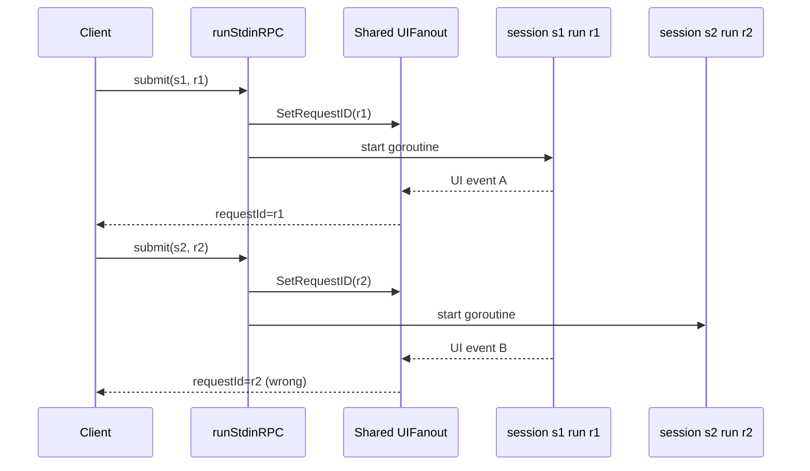
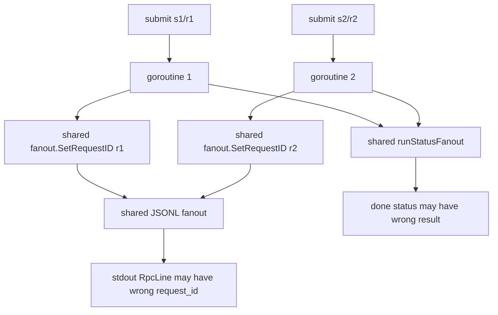
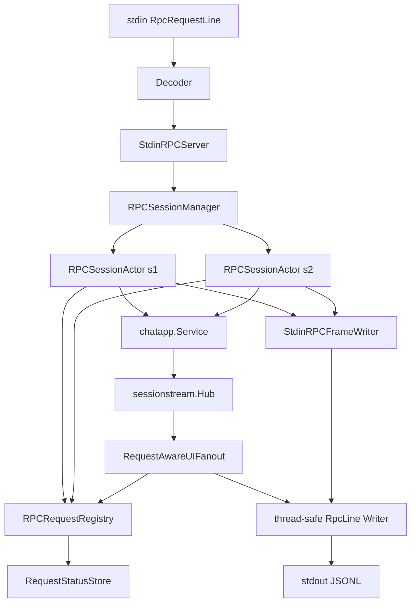

# Multi-session RPC foundations and PR 156 review response

## Executive Summary

PR 156 correctly identified that the first stdin RPC implementation is not a safe foundation for true multi-session concurrency. It works for sequential scripts and a narrow cancel-while-running path, but it uses two mutable process-level variables for information that is actually request-scoped:

- `jsonl.UIFanout.SetRequestID(reqID)` stores a single current request id on a shared stdout fanout.
- `runStatusFanout.Reset()` / `Result()` stores a single current run status on a shared status accumulator.

Those two shortcuts are acceptable only when one request is active at a time. The moment two sessions run concurrently, one request can overwrite another request's request id or run status. The result is a protocol violation: frames from session `s1` request `r1` can be stamped as request `r2`, and a `done` frame can report the wrong status.

The correct foundation is to introduce an explicit RPC coordination layer with request-scoped state and session-owned turn accumulation. The recommended design has three core abstractions:

1. **`RPCRequestKey` and `RPCRequestState`** — immutable request identity plus mutable per-request runtime state.
2. **`RPCSessionActor`** — one actor/mailbox per `session_id`, owning that session's final-turn accumulator and active request.
3. **`RequestAwareUIFanout` plus `RequestStatusStore`** — fanout and status tracking keyed by `session_id` and request identity, not by mutable global state.

This guide is written for a new intern. It explains the system, the bug class, the right data structures, and a staged implementation plan that can replace the current `runStdinRPC` internals without changing the external protobuf JSONL contract.

## What PR 156 said

The inline review comments on PR 156 were:

> **Isolate request_id stamping per active RPC request**
>
> `runStdinRPC` starts one goroutine per submitted session and each goroutine calls `setRequestID(reqID)` on the same shared fanout before emitting frames. Because other sessions can run concurrently, overlapping goroutines can overwrite that shared request ID, so UI/snapshot/error/done frames may be tagged with the wrong `request_id`. This breaks request correlation for multi-session clients and can cause responses from one request to appear under another request’s ID.

and:

> **Track run status independently for concurrent sessions**
>
> `statusFanout` is a single shared accumulator, but each submit goroutine calls `Reset()` and later `Result()` while runs from other sessions may still be publishing events. In overlapping requests, one session can clear or overwrite another session’s status/error, producing incorrect `done` status (or false run failures) for the current request. Multi-turn stdin RPC needs status bookkeeping keyed by session/request to avoid cross-talk.

Both comments point to the same architectural issue: request-local facts are stored in shared mutable adapter state.

## Reader map: parts of the system you need to understand

### The stdin RPC transport

The stdin RPC mode is defined by protobuf JSONL messages in:

- `proto/pinocchio/chatapp/rpc/v1/rpc.proto`

Stdout emits `RpcLine` frames. Stdin reads `RpcRequestLine` requests. A typical client sends one JSON object per line:

```jsonl
{"version":1,"sessionId":"s1","requestId":"r1","submit":{"prompt":"hello"}}
{"version":1,"sessionId":"s1","requestId":"r2","snapshot":{}}
{"version":1,"sessionId":"s1","requestId":"r3","shutdown":{}}
```

Important fields:

- `session_id`: model conversation and UI session routing key.
- `request_id`: transport-level correlation key chosen by the RPC client.
- `submit`: starts inference for a prompt.
- `cancel`: asks the active run for a session to stop.
- `snapshot`: asks for visible UI state.
- `shutdown`: terminates the long-lived process.

Stdout frames reuse the existing one-shot RPC shape:

```protobuf
message RpcLine {
  uint32 version = 1;
  string session_id = 2;
  string request_id = 3;

  oneof frame {
    HelloFrame hello = 10;
    SnapshotFrame snapshot = 11;
    UiEventFrame ui_event = 12;
    BackendEventFrame backend_event = 13;
    ErrorFrame error = 14;
    DoneFrame done = 15;
  }
}
```

### The chatapp runtime

The stdin RPC server does not call providers directly. It goes through the reusable chatapp runtime:

- `pkg/chatapp/runner.go`
- `pkg/chatapp/service.go`
- `pkg/chatapp/runtime_inference.go`

The important API is:

```go
type PromptRequest struct {
    Prompt      string
    Runtime     *infruntime.ComposedRuntime
    InitialTurn *turns.Turn
    OnFinalTurn func(*turns.Turn)
}

func (s *Service) SubmitPromptRequest(
    ctx context.Context,
    sid sessionstream.SessionId,
    req PromptRequest,
) error

func (s *Service) Stop(ctx context.Context, sid sessionstream.SessionId) error
func (s *Service) WaitIdle(ctx context.Context, sid sessionstream.SessionId) error
func (s *Service) Snapshot(ctx context.Context, sid sessionstream.SessionId) (sessionstream.Snapshot, error)
```

For stdin RPC, `PromptRequest.InitialTurn` is the model-context input. `PromptRequest.OnFinalTurn` returns the final model-context accumulator. That final turn is what the next prompt in the same session should build on.

### Sessionstream fanout

`sessionstream` emits UI events through this interface:

```go
type UIFanout interface {
    PublishUI(ctx context.Context, sid SessionId, ord uint64, events []UIEvent) error
}
```

Pinocchio adapts UI events to protobuf JSONL in:

- `pkg/chatapp/rpc/jsonl/fanout.go`
- `pkg/chatapp/rpc/jsonl/writer.go`

The current fanout writes one `RpcLine` per UI event. The writer is safe for concurrent use, but request-id selection is not currently request-scoped.

### Current stdin RPC implementation entrypoint

The current implementation lives inside:

- `pkg/cmds/cmd.go`
- function: `runStdinRPC`

It currently owns too many responsibilities:

- parsing stdin lines;
- mapping request ids;
- tracking session turn accumulators;
- launching submit goroutines;
- handling cancel;
- writing done/error/snapshot frames;
- tracking status;
- protecting state with ad hoc mutexes.

The next refactor should split those responsibilities into explicit types.

## The core bug class

### Mutable request id stamping

Current pattern:

```go
setRequestID(reqID)        // stores reqID on a shared fanout
...
fanout.WriteDone(sid, ...) // reads whatever request id is current
```

This becomes wrong with overlapping sessions.



The frame is syntactically valid JSONL, but semantically wrong. This is worse than a crash because clients may silently attach events to the wrong request.

### Mutable run status tracking

Current pattern:

```go
statusFanout.Reset()
...
status, err := statusFanout.Result()
```

The status accumulator is a single shared object. If two runs overlap:

- run `s1/r1` resets status;
- run `s2/r2` resets status;
- `s1/r1` fails and records `failed`;
- `s2/r2` finishes and records `ok`;
- `s1/r1` calls `Result()` and sees `ok`.

That would emit a false-success `done` frame.

## Design goals

The fix should satisfy these goals:

- **Correct request correlation**: every stdout frame caused by request `r1` must carry `request_id = r1`.
- **Correct session isolation**: one session's turn accumulator, run state, cancellation, and status must not affect another session.
- **One active submit per session**: keep the first implementation deterministic by rejecting or serializing overlapping submits in the same session.
- **Concurrent sessions are allowed**: `s1/r1` and `s2/r2` may run at the same time without corrupting request ids or statuses.
- **No global request-id knob**: remove `SetRequestID` from the hot path for stdin RPC.
- **Status is request-scoped**: no shared `Reset()` / `Result()` accumulator for concurrent requests.
- **Transport contract remains stable**: keep `RpcRequestLine` on stdin and `RpcLine` on stdout.
- **Model context remains `turns.Turn`**: do not reconstruct model context from sessionstream snapshots.

## Recommended architecture

### Overview

Introduce a small stdin RPC server layer with explicit request/session state:

```text
stdin JSONL
   |
   v
RpcLineScanner / Decoder
   |
   v
RPCServer -----------------------------------------------------+
   |                                                         |
   | gets/creates                                            | writes explicit frames
   v                                                         v
RPCSessionActor(session_id) ---- submit/cancel/snapshot --> RpcLineWriter
   |
   | owns
   v
SessionState { currentTurn, activeRequest }
   |
   | submits prompt through
   v
chatapp.Service / sessionstream.Hub
   |
   | publishes UI events
   v
RequestAwareUIFanout -- uses RequestRegistry --> RpcLineWriter
```

The server should stop asking “what is the current request id globally?” and instead ask “which request is active for this session/event?”

### Data structure 1: request key

Use a small immutable key type everywhere:

```go
type RPCRequestKey struct {
    SessionID sessionstream.SessionId
    RequestID string
}

func (k RPCRequestKey) IsZero() bool {
    return k.SessionID == "" || strings.TrimSpace(k.RequestID) == ""
}
```

Why this matters:

- Makes session/request identity explicit.
- Prevents code from passing `requestID` without `sessionID`.
- Good map key for request-scoped status and active runs.

### Data structure 2: active request state

```go
type RPCRequestKind string

const (
    RPCRequestSubmit   RPCRequestKind = "submit"
    RPCRequestCancel   RPCRequestKind = "cancel"
    RPCRequestSnapshot RPCRequestKind = "snapshot"
    RPCRequestShutdown RPCRequestKind = "shutdown"
)

type RPCRequestState struct {
    Key        RPCRequestKey
    Kind       RPCRequestKind
    Prompt     string
    StartedAt  time.Time
    FinishedAt time.Time

    Done       chan struct{}
    FinalTurn  *turns.Turn
    Status     RPCStatus
}

type RPCStatus struct {
    Status  string // ok, failed, stopped, shutdown
    ErrText string
}
```

Only one goroutine should mutate a given `RPCRequestState`, or mutations should go through methods guarded by a mutex.

### Data structure 3: session state

Each session owns its final-turn accumulator and active request:

```go
type RPCSessionState struct {
    SessionID sessionstream.SessionId

    CurrentTurn *turns.Turn
    Active      *RPCRequestState
}
```

Important invariant:

> `CurrentTurn` changes only after a submit finishes successfully and `OnFinalTurn` returns a non-nil final turn.

Cancellation should not update `CurrentTurn`. A stopped run is not a reliable model-context accumulator.

### Data structure 4: request registry

The fanout and status tracker need a thread-safe way to resolve the request for a session.

```go
type RPCRequestRegistry struct {
    mu sync.RWMutex

    activeBySession map[sessionstream.SessionId]*RPCRequestState
    byKey           map[RPCRequestKey]*RPCRequestState
}

func (r *RPCRequestRegistry) Begin(req *RPCRequestState) error
func (r *RPCRequestRegistry) Finish(key RPCRequestKey)
func (r *RPCRequestRegistry) ActiveForSession(sid sessionstream.SessionId) (*RPCRequestState, bool)
func (r *RPCRequestRegistry) Get(key RPCRequestKey) (*RPCRequestState, bool)
func (r *RPCRequestRegistry) RecordStatus(key RPCRequestKey, events []sessionstream.UIEvent)
func (r *RPCRequestRegistry) Result(key RPCRequestKey) (string, error)
```

`Begin` should enforce one active submit per session:

```go
func (r *RPCRequestRegistry) Begin(req *RPCRequestState) error {
    r.mu.Lock()
    defer r.mu.Unlock()

    if existing := r.activeBySession[req.Key.SessionID]; existing != nil {
        return fmt.Errorf("session %s already has active request %s", req.Key.SessionID, existing.Key.RequestID)
    }
    r.activeBySession[req.Key.SessionID] = req
    r.byKey[req.Key] = req
    return nil
}
```

For the first refactor, do not allow two active submits in the same session. That keeps turn accumulation deterministic.

### Data structure 5: request-aware fanout

The `sessionstream.UIFanout` adapter should derive request ids through a resolver instead of global mutable state.

```go
type RequestIDResolver interface {
    RequestIDForUIEvent(sid sessionstream.SessionId, ev sessionstream.UIEvent) string
}

type RequestAwareUIFanout struct {
    writer   *jsonl.Writer
    resolver RequestIDResolver
}

func (f *RequestAwareUIFanout) PublishUI(
    ctx context.Context,
    sid sessionstream.SessionId,
    ord uint64,
    events []sessionstream.UIEvent,
) error {
    for _, ev := range events {
        requestID := f.resolver.RequestIDForUIEvent(sid, ev)
        line := NewUIEventLine(sid, ord, ev)
        line.RequestId = requestID
        if err := f.writer.WriteLine(line); err != nil {
            return err
        }
    }
    return nil
}
```

The first resolver can be session-based:

```go
func (r *RPCRequestRegistry) RequestIDForUIEvent(sid sessionstream.SessionId, ev sessionstream.UIEvent) string {
    r.mu.RLock()
    defer r.mu.RUnlock()

    active := r.activeBySession[sid]
    if active == nil {
        return ""
    }
    return active.Key.RequestID
}
```

This is correct as long as there is only one active request per session.

A future resolver can use event correlation metadata (`run_id`, `message_id`, provider call id) if we decide to allow overlapping submits in the same session.

### Data structure 6: request-scoped explicit frame writer

Not all frames are UI events. `hello`, `snapshot`, `error`, and `done` are adapter frames. Those should be written with explicit keys, never through mutable fanout state.

```go
type RPCFrameWriter struct {
    writer *jsonl.Writer
}

func (w *RPCFrameWriter) WriteDone(key RPCRequestKey, status string) error {
    line := jsonl.NewDoneLine(string(key.SessionID), status)
    line.RequestId = key.RequestID
    return w.writer.WriteLine(line)
}

func (w *RPCFrameWriter) WriteError(key RPCRequestKey, code string, err error, terminal bool) error
func (w *RPCFrameWriter) WriteSnapshot(key RPCRequestKey, snap sessionstream.Snapshot) error
func (w *RPCFrameWriter) WriteHello(sessionID sessionstream.SessionId, capabilities []string) error
```

This is the simplest way to eliminate the mutable `SetRequestID` calls for adapter frames.

## Recommended design pattern: actor per session

The cleanest way to preserve turn accumulation and cancellation semantics is one actor per session.

### Why an actor?

A session actor is a goroutine that owns all mutable state for one `session_id`:

- current final `turns.Turn` accumulator;
- active submit request;
- cancellation state;
- sequencing of submit/snapshot/cancel/shutdown messages.

Instead of sharing maps and locking every turn update, the server sends messages to the actor. The actor processes messages sequentially.

### Actor message types

```go
type SessionMessage interface{ isSessionMessage() }

type SubmitMessage struct {
    Key    RPCRequestKey
    Prompt string
    Reply  chan error
}

type CancelMessage struct {
    Key   RPCRequestKey
    Reply chan error
}

type SnapshotMessage struct {
    Key   RPCRequestKey
    Reply chan error
}

type ShutdownMessage struct {
    Key   RPCRequestKey
    Reply chan error
}
```

### Actor state

```go
type RPCSessionActor struct {
    sid      sessionstream.SessionId
    service  *chatapp.Service
    factory  engine.Factory
    writer   *RPCFrameWriter
    registry *RPCRequestRegistry

    currentTurn *turns.Turn
    active      *RPCRequestState

    inbox chan SessionMessage
}
```

### Actor submit pseudocode

```go
func (a *RPCSessionActor) handleSubmit(ctx context.Context, msg SubmitMessage) {
    if a.active != nil {
        a.writer.WriteError(msg.Key, "session_busy", fmt.Errorf("session has active request"), false)
        a.writer.WriteDone(msg.Key, "failed")
        return
    }

    req := &RPCRequestState{
        Key:       msg.Key,
        Kind:      RPCRequestSubmit,
        Prompt:    msg.Prompt,
        StartedAt: time.Now(),
        Done:      make(chan struct{}),
    }
    if err := a.registry.Begin(req); err != nil {
        a.writer.WriteError(msg.Key, "session_busy", err, false)
        a.writer.WriteDone(msg.Key, "failed")
        return
    }
    a.active = req

    go a.runSubmit(ctx, req)
}
```

The actor starts inference in a goroutine so it can continue processing cancel messages.

### Actor cancel pseudocode

```go
func (a *RPCSessionActor) handleCancel(ctx context.Context, msg CancelMessage) {
    if a.active == nil {
        a.writer.WriteError(msg.Key, "no_active_request", fmt.Errorf("nothing to cancel"), false)
        a.writer.WriteDone(msg.Key, "ok")
        return
    }

    if err := a.service.Stop(ctx, a.sid); err != nil {
        a.writer.WriteError(msg.Key, "cancel_failed", err, false)
        a.writer.WriteDone(msg.Key, "failed")
        return
    }

    // The cancel request itself succeeded. The active submit request should later
    // receive ChatRunStopped and done{status="stopped"}.
    a.writer.WriteDone(msg.Key, "ok")
}
```

### Actor runSubmit pseudocode

```go
func (a *RPCSessionActor) runSubmit(ctx context.Context, req *RPCRequestState) {
    defer func() {
        a.registry.Finish(req.Key)
        close(req.Done)
        a.inbox <- submitFinished{Key: req.Key, FinalTurn: req.FinalTurn}
    }()

    base := a.currentTurn
    if base == nil {
        base = a.initialSeed
    }
    input := turnWithUserPrompt(base, req.Prompt)

    engine, err := a.factory.CreateEngine(...)
    if err != nil {
        a.writer.WriteError(req.Key, "engine_init_failed", err, true)
        a.writer.WriteDone(req.Key, "failed")
        return
    }

    err = a.service.SubmitPromptRequest(ctx, a.sid, chatapp.PromptRequest{
        Prompt:      req.Prompt,
        InitialTurn: input,
        Runtime:     &infruntime.ComposedRuntime{Engine: engine},
        OnFinalTurn: func(t *turns.Turn) {
            if t != nil {
                req.FinalTurn = t.Clone()
            }
        },
    })
    if err != nil { ... }

    if err := a.service.WaitIdle(ctx, a.sid); err != nil { ... }

    snap, err := a.service.Snapshot(ctx, a.sid)
    if err == nil {
        a.writer.WriteSnapshot(req.Key, snap)
    }

    status, err := a.registry.Result(req.Key)
    if err != nil {
        a.writer.WriteError(req.Key, "run_failed", err, true)
    }
    a.writer.WriteDone(req.Key, status)
}
```

The actor should update `currentTurn` only after receiving a `submitFinished` message for the same active request and only if the status is successful.

## Request status tracking

### Status extraction rules

`RequestStatusStore.Record` should inspect UI events for terminal run events:

- `ChatRunFinished` -> `status = "ok"` or payload status normalized to `ok`.
- `ChatRunStopped` -> `status = "stopped"`.
- `ChatRunFailed` -> `status = "failed"`, error text from payload.

Current code already knows these event names in:

- `pkg/cmds/run_status_fanout.go`

But it stores exactly one result. The refactor should preserve the event interpretation logic and change the storage shape.

### Proposed API

```go
type RequestStatusStore struct {
    mu sync.Mutex
    byKey map[RPCRequestKey]RPCStatus
}

func (s *RequestStatusStore) Record(key RPCRequestKey, events []sessionstream.UIEvent) {
    s.mu.Lock()
    defer s.mu.Unlock()

    current := s.byKey[key]
    for _, ev := range events {
        current = reduceStatus(current, ev)
    }
    s.byKey[key] = current
}

func (s *RequestStatusStore) Result(key RPCRequestKey) (string, error) {
    s.mu.Lock()
    defer s.mu.Unlock()

    status := s.byKey[key]
    if status.Status == "" || status.Status == "finished" {
        status.Status = "ok"
    }
    if status.Status == "failed" {
        return "failed", fmt.Errorf("%s", firstNonEmptyString(status.ErrText, "chat run failed"))
    }
    return status.Status, nil
}
```

### Where status recording should happen

The request-aware fanout can record status as it stamps UI frames:

```go
func (f *RequestAwareUIFanout) PublishUI(ctx context.Context, sid sessionstream.SessionId, ord uint64, events []sessionstream.UIEvent) error {
    key, ok := f.registry.ActiveKeyForSession(sid)
    if ok {
        f.status.Record(key, events)
    }
    ... write RpcLine with key.RequestID ...
}
```

This keeps the invariant simple:

> The same key used to stamp frames is the key used to record status.

That prevents request-id/status cross-talk.

## API references and file references

### Protobuf API

- `proto/pinocchio/chatapp/rpc/v1/rpc.proto`
  - `RpcLine`
  - `RpcRequestLine`
  - `SubmitPromptRequest`
  - `CancelRequest`
  - `SnapshotRequest`
  - `ShutdownRequest`

### Generated API

- `pkg/chatapp/pb/proto/pinocchio/chatapp/rpc/v1/rpc.pb.go`
- `cmd/web-chat/web/src/chatapp/pb/proto/pinocchio/chatapp/rpc/v1/rpc_pb.ts`

### JSONL writer/fanout API

- `pkg/chatapp/rpc/jsonl/writer.go`
  - `Writer.WriteLine`
  - `NewHelloLine`
  - `NewErrorLine`
  - `NewDoneLine`
- `pkg/chatapp/rpc/jsonl/fanout.go`
  - current `UIFanout.PublishUI`
  - current `SetRequestID` should not be used for concurrent stdin RPC

### Chatapp API

- `pkg/chatapp/service.go`
  - `SubmitPromptRequest`
  - `Stop`
  - `WaitIdle`
  - `Snapshot`
- `pkg/chatapp/runtime_inference.go`
  - `PromptRequest.InitialTurn`
  - `PromptRequest.OnFinalTurn`
  - `ChatRunFinished` / `ChatRunStopped` / `ChatRunFailed` publishing
- `pkg/chatapp/runner.go`
  - `NewRunner`
  - `RunnerOptions.UIFanout`

### Current command-layer API

- `pkg/cmds/cmd.go`
  - `RunWithOptions`
  - `determineRunMode`
  - current `runStdinRPC`
- `pkg/cmds/run/context.go`
  - `RunModeRPCStdin`
  - `RunContext.Reader`
- `pkg/cmds/cmdlayers/helpers.go`
  - `--stdin-rpc`
- `pkg/cmds/run_status_fanout.go`
  - current single-status accumulator to replace

## Implementation guide

### Phase 0: protect existing behavior with tests

Before refactoring, keep and expand the current tests in:

- `pkg/cmds/cmd_rpc_stdin_test.go`

Required tests:

- one session, two submits, accumulator carries context;
- two sessions, interleaved submits, accumulators stay isolated;
- malformed JSON reports `invalid_request_json` and server continues;
- cancel while running produces:
  - cancel request `done.status = "ok"`;
  - submit request `done.status = "stopped"`;
  - `ChatRunStopped` UI event;
- overlapping sessions stream with correct request ids;
- overlapping sessions produce correct independent done statuses.

The last two are the PR 156 regression tests.

Pseudocode for the request-id regression test:

```go
func TestStdinRPCConcurrentSessionsDoNotCrossStampRequestIDs(t *testing.T) {
    // Use two blocking/streaming fake engines.
    // Start s1/r1 and s2/r2.
    // Release s1 to emit a patch after s2 has started.
    // Assert every frame with session_id=s1 has request_id=r1.
    // Assert every frame with session_id=s2 has request_id=r2.
}
```

Pseudocode for the status regression test:

```go
func TestStdinRPCConcurrentSessionsTrackStatusIndependently(t *testing.T) {
    // s1/r1 fails.
    // s2/r2 succeeds.
    // Let events overlap.
    // Assert done(r1).status == failed.
    // Assert done(r2).status == ok.
}
```

### Phase 1: introduce request identity types

Add a small file, for example:

- `pkg/cmds/stdin_rpc_types.go`

Types:

```go
type RPCRequestKey struct { ... }
type RPCRequestKind string
type RPCRequestState struct { ... }
type RPCStatus struct { ... }
```

Do not move behavior yet. Compile-only types are easy to review.

### Phase 2: replace global status accumulator

Add:

- `pkg/cmds/stdin_rpc_status.go`

Move the event interpretation logic out of `run_status_fanout.go` into a reusable reducer:

```go
func reduceRPCStatus(current RPCStatus, events []sessionstream.UIEvent) RPCStatus
```

Then add keyed storage:

```go
type RequestStatusStore struct { ... }
```

Keep `runStatusFanout` for one-shot RPC if it still needs it. Do not break one-shot `--rpc`.

### Phase 3: add request-aware fanout

Add:

- `pkg/chatapp/rpc/jsonl/request_fanout.go`

or, if you want to keep command-specific request resolution out of `pkg/chatapp`, add:

- `pkg/cmds/stdin_rpc_fanout.go`

Preferred split:

- generic JSONL writing helpers stay in `pkg/chatapp/rpc/jsonl`;
- stdin-RPC-specific request resolution lives in `pkg/cmds`.

Example command-specific fanout:

```go
type stdinRPCUIFanout struct {
    writer   *chatapprpcjsonl.Writer
    registry *RPCRequestRegistry
    status   *RequestStatusStore
}
```

It implements `sessionstream.UIFanout` and writes `RpcLine` directly.

### Phase 4: add explicit frame writer

Add:

- `pkg/cmds/stdin_rpc_writer.go`

This writer should expose methods that always accept `RPCRequestKey`:

```go
func (w *StdinRPCFrameWriter) WriteRequestError(key RPCRequestKey, code string, err error, terminal bool) error
func (w *StdinRPCFrameWriter) WriteRequestDone(key RPCRequestKey, status string) error
func (w *StdinRPCFrameWriter) WriteRequestSnapshot(key RPCRequestKey, snap sessionstream.Snapshot) error
```

After this phase, `runStdinRPC` should no longer call `fanout.SetRequestID`.

### Phase 5: extract the RPC server

Add:

- `pkg/cmds/stdin_rpc_server.go`

```go
type StdinRPCServer struct {
    reader io.Reader
    writer *StdinRPCFrameWriter
    runner *chatapp.Runner
    registry *RPCRequestRegistry
    sessions *RPCSessionManager
}

func (s *StdinRPCServer) Run(ctx context.Context) (*turns.Turn, error)
```

`runStdinRPC` should become wiring:

```go
func (g *PinocchioCommand) runStdinRPC(ctx context.Context, rc *run.RunContext) (*turns.Turn, error) {
    seed, err := g.buildInitialTurn(...)
    ... build writer, registry, fanout, runner ...
    server := NewStdinRPCServer(...)
    return server.Run(ctx)
}
```

### Phase 6: add session actors

Add:

- `pkg/cmds/stdin_rpc_session.go`

Session manager:

```go
type RPCSessionManager struct {
    mu sync.Mutex
    sessions map[sessionstream.SessionId]*RPCSessionActor
}

func (m *RPCSessionManager) Get(sid sessionstream.SessionId) *RPCSessionActor
```

Actor:

```go
type RPCSessionActor struct { ... }
func (a *RPCSessionActor) Run(ctx context.Context)
func (a *RPCSessionActor) Submit(ctx context.Context, msg SubmitMessage) error
func (a *RPCSessionActor) Cancel(ctx context.Context, msg CancelMessage) error
```

### Phase 7: remove or quarantine mutable fanout request id

If one-shot RPC still uses `jsonl.UIFanout.SetRequestID`, keep it for one-shot only and document that it is not safe for concurrent stdin RPC.

Better long-term cleanup:

- remove `SetRequestID` from the generic fanout;
- write adapter frames through `StdinRPCFrameWriter`;
- write UI frames through `stdinRPCUIFanout`.

## Mermaid diagrams

### Current unsafe shared state



### Proposed request-scoped state



### Actor cancellation flow

```mermaid
sequenceDiagram
    participant Client
    participant Server as StdinRPCServer
    participant Actor as RPCSessionActor(s1)
    participant Service as chatapp.Service
    participant Fanout as RequestAwareUIFanout
    participant Writer as RpcLineWriter

    Client->>Server: submit(s1,r1)
    Server->>Actor: SubmitMessage(r1)
    Actor->>Service: SubmitPromptRequest
    Service-->>Fanout: ChatUserMessageAccepted
    Fanout-->>Writer: RpcLine(requestId=r1)

    Client->>Server: cancel(s1,r2)
    Server->>Actor: CancelMessage(r2)
    Actor->>Service: Stop(s1)
    Actor-->>Writer: Done(requestId=r2,status=ok)

    Service-->>Fanout: ChatRunStopped
    Fanout-->>Writer: RpcLine(requestId=r1, ChatRunStopped)
    Actor-->>Writer: Done(requestId=r1,status=stopped)
```

## Alternatives considered

### Alternative A: keep global `SetRequestID` and serialize everything

This would mean one active request for the whole process. It is easy, but it fails the multi-session requirement. It also wastes the long-lived server model because independent sessions cannot run concurrently.

Reject this for PR 156.

### Alternative B: keep global `SetRequestID` but use locks around writes

A lock can prevent interleaved line writes, but it cannot make a long-running provider stream keep the right request id. The wrong id can still be set before a later event arrives.

Reject this. Locking the mutable knob is not enough.

### Alternative C: run one chatapp runner per request

Each request could get its own fanout with a fixed request id. That avoids shared request-id state, but it breaks session continuity and makes snapshots/hydration/turn accumulation awkward. It also creates unnecessary runtime overhead.

Reject this as the primary design.

### Alternative D: add request id to every chatapp event payload

This is robust but invasive. It requires changing many event payloads in `proto/pinocchio/chatapp/v1/chat.proto` and plugin event projections. It may be appropriate later if request ids become a first-class chatapp concept.

Do not choose this for the first foundation refactor.

### Recommended approach

Use a request registry plus request-aware fanout. It is minimally invasive, matches the current one-active-run-per-session invariant, and solves the PR 156 cross-session bugs.

## Review checklist for the implementation

A reviewer should be able to answer yes to all of these:

- Is every `RpcLine.request_id` assigned from an `RPCRequestKey`, not a global current request id?
- Can two sessions submit concurrently without changing each other's request ids?
- Is run status stored by `RPCRequestKey`?
- Does `done` for request `r1` read only status recorded for `r1`?
- Does cancel request `r2` for session `s1` stop active submit `r1` without stealing `r1`'s UI frames?
- Does `CurrentTurn` update only on successful final turns?
- Are overlapping submits in the same session rejected or serialized explicitly?
- Does one-shot `--rpc` still behave as before?
- Does malformed stdin JSON remain non-terminal?
- Are stdout lines still one protobuf JSON object per line?

## Test matrix

| Test | Purpose | Expected result |
|---|---|---|
| sequential two-turn same session | preserve accumulator | second turn sees first final turn |
| interleaved sessions | isolate accumulators | s1 and s2 counts/history differ correctly |
| concurrent sessions request id | PR 156 request-id regression | s1 frames always r1, s2 frames always r2 |
| concurrent sessions status | PR 156 status regression | failing request gets failed, succeeding request gets ok |
| cancel while running | active cancellation | cancel done ok; submit done stopped |
| snapshot during active run | explicit policy | either wait or return documented active snapshot |
| submit while same session active | deterministic state | reject with session_busy or queue explicitly |
| malformed line | protocol robustness | non-terminal invalid_request_json error |
| stdout write failure | terminal failure | server returns error |

## Concrete next implementation tasks

1. Create `pkg/cmds/stdin_rpc_types.go` with request key/state/status types.
2. Create `pkg/cmds/stdin_rpc_status.go` with keyed status reducer/store.
3. Create `pkg/cmds/stdin_rpc_writer.go` for explicit request-keyed adapter frames.
4. Create `pkg/cmds/stdin_rpc_fanout.go` implementing request-aware UI fanout.
5. Create `pkg/cmds/stdin_rpc_server.go` to move scanning/dispatch out of `cmd.go`.
6. Create `pkg/cmds/stdin_rpc_session.go` for session manager and actors.
7. Refactor `runStdinRPC` to compose those pieces.
8. Add PR 156 regression tests for request-id and status cross-talk.
9. Keep existing tests green.
10. Run a real subprocess smoke with `PINOCCHIO_PROFILE=gpt-5-nano-low`.

## Implementation notes for interns

When implementing, resist the temptation to fix the review comments by adding more locks around the current code. Locks are necessary for shared maps, but the primary bug is not a data race in the Go race-detector sense. The primary bug is an ownership error: request id and status belong to a request, but the current code stores them in process-global adapter state.

The safest implementation pattern is:

- derive a `RPCRequestKey` as soon as a line is decoded;
- pass that key through every function that writes request-specific frames;
- register active submit requests before calling `SubmitPromptRequest`;
- let UI fanout resolve request id from the active session registry;
- record run status under the same key used for frame stamping;
- remove active request state only after final snapshot/done has been written.

## Open questions

1. Should `snapshot` during an active submit wait for completion, return an active partial snapshot, or be a separate request that does not claim the active request id?
   - Recommendation for now: wait, because it preserves simple request-id attribution.
2. Should same-session submit while active be rejected or queued?
   - Recommendation for now: reject with `session_busy`; queuing can be added later.
3. Should `cancel` include the target request id to cancel?
   - Current proto has `CancelRequest {}` and uses `session_id` to cancel the active run. This is fine while one active submit per session is enforced.
4. Should external `request_id` be added to chatapp event correlation?
   - Not necessary for one-active-run-per-session, but useful if same-session concurrency is ever needed.

## References

- PR 156: <https://github.com/go-go-golems/pinocchio/pull/156>
- Existing stdin RPC guide: `ttmp/2026/05/21/PIN-20260521-RPC-STDIN-MULTITURN--add-multi-turn-stdin-rpc-mode/design-doc/01-multi-turn-stdin-stdout-rpc-mode.md`
- Implementation diary: `ttmp/2026/05/21/PIN-20260521-RPC-STDIN-MULTITURN--add-multi-turn-stdin-rpc-mode/reference/01-implementation-diary.md`
- Current stdin RPC implementation: `pkg/cmds/cmd.go`, `runStdinRPC`
- Current mutable request-id fanout: `pkg/chatapp/rpc/jsonl/fanout.go`
- Current mutable status accumulator: `pkg/cmds/run_status_fanout.go`
