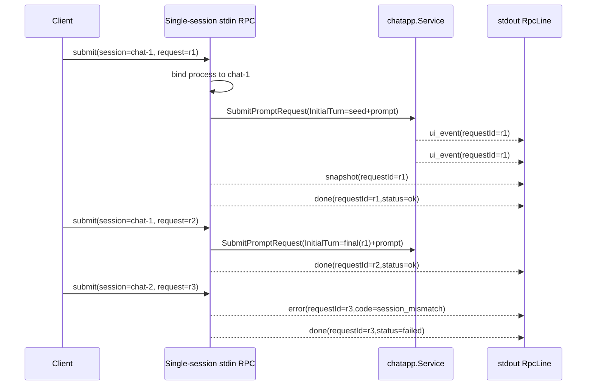
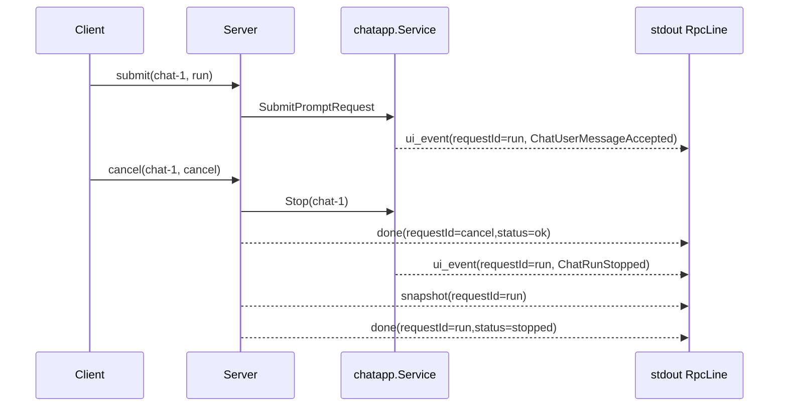

# Single-session stdin RPC implementation guide

## Executive Summary

This guide defines the chosen simplification for Pinocchio stdin RPC after the PR 156 review: **one stdin/stdout RPC process owns exactly one conversation session**. The process still supports multiple turns, cancellation, snapshots, and shutdown, but it does not multiplex independent conversations inside one process.

The operational model is intentionally simple:

```text
one RPC process = one conversation/session
```

If a client wants another independent conversation, it should start another Pinocchio RPC process. This is a good fit for local subprocess clients such as editor integrations, terminal tools, and agent harnesses because process creation is explicit and cheap compared with the complexity of building a multi-session daemon.

This design directly addresses the PR 156 review comments by avoiding concurrent multi-session request attribution entirely. It also tightens the contract so the code cannot accidentally claim to support multi-session concurrency while using shared mutable request-id/status state.

## Problem Statement

The first stdin RPC implementation allowed requests with arbitrary `session_id` values. It then added enough asynchronous submit handling to support cancel-while-running. That combination created an architectural mismatch:

- the code could start submit goroutines for different sessions;
- but request-id stamping used one shared mutable fanout field;
- and run-status tracking used one shared mutable accumulator.

The PR 156 review correctly flagged this. If multiple sessions run concurrently, one session can overwrite another session's active request id or status. That breaks JSONL protocol correlation.

There are two possible responses:

1. build a full multi-session request-scoped runtime; or
2. intentionally enforce one session per process.

We choose option 2 for elegance and simplicity.

## Contract: what single-session stdin RPC means

### Process-level invariant

A stdin RPC process binds to one `session_id` and rejects any different `session_id` for the rest of the process lifetime.

The session is bound on the first valid request:

- if the first request has `session_id`, use it;
- if the first request omits `session_id`, use the generated default session id;
- every later request must use the same id or omit it.

### Turn-level invariant

The process keeps one model-context accumulator:

```go
currentTurn *turns.Turn
```

On each successful submit:

1. clone `currentTurn` or the initial seed turn;
2. append the new user prompt;
3. submit via `chatapp.Service.SubmitPromptRequest` with `InitialTurn`;
4. capture the successful final turn from `OnFinalTurn`;
5. replace `currentTurn` with that final turn.

A canceled or failed submit must not update `currentTurn`.

### Active-run invariant

There is at most one active submit at a time.

- A second submit while one is active returns `session_busy`.
- A cancel request may arrive while a submit is active.
- Snapshot and shutdown either wait for the active submit or return a documented control response. For this implementation, shutdown waits for the active submit to finish or stop.

## Protocol behavior

### Hello capabilities

The server should advertise `single-session` and should not advertise `multi-session`.

Recommended capabilities:

```json
[
  "ui-events",
  "snapshot",
  "done",
  "stdin-rpc",
  "single-session",
  "multi-turn",
  "cancel"
]
```

`multi-turn` remains correct: the one session can have many turns.

### Request examples

First request binds the session:

```jsonl
{"version":1,"sessionId":"chat-1","requestId":"r1","submit":{"prompt":"hello"}}
```

Later request may omit session id:

```jsonl
{"version":1,"requestId":"r2","submit":{"prompt":"continue"}}
```

The server treats it as `chat-1`.

A different session is rejected:

```jsonl
{"version":1,"sessionId":"chat-2","requestId":"r3","submit":{"prompt":"new conversation"}}
```

Response:

```jsonl
{"version":1,"sessionId":"chat-1","requestId":"r3","error":{"code":"session_mismatch","message":"stdin RPC process is bound to session chat-1; got chat-2","terminal":false}}
{"version":1,"sessionId":"chat-1","requestId":"r3","done":{"status":"failed"}}
```

### Cancel behavior

Cancel is a control request. It has its own `request_id`, but it targets the active submit for the bound session.

Input:

```jsonl
{"version":1,"sessionId":"chat-1","requestId":"run","submit":{"prompt":"long task"}}
{"version":1,"sessionId":"chat-1","requestId":"cancel","cancel":{}}
```

Expected output properties:

- UI events from the active submit carry `requestId = "run"`.
- The cancel control response carries `requestId = "cancel"`.
- The active submit eventually receives `ChatRunStopped` and `done.status = "stopped"`.

This distinction matters. Even in single-session mode, cancel overlaps with submit, so the code must not stamp cancel responses by globally changing the active submit request id.

## System parts for a new intern

### `RpcRequestLine` and `RpcLine`

File:

- `proto/pinocchio/chatapp/rpc/v1/rpc.proto`

`RpcRequestLine` is read from stdin. `RpcLine` is written to stdout. They are protobuf messages encoded as JSON, one object per line.

### `chatapp.Service`

Files:

- `pkg/chatapp/service.go`
- `pkg/chatapp/runtime_inference.go`

Important methods:

```go
SubmitPromptRequest(ctx, sid, PromptRequest) error
Stop(ctx, sid) error
WaitIdle(ctx, sid) error
Snapshot(ctx, sid) (sessionstream.Snapshot, error)
```

Important fields:

```go
type PromptRequest struct {
    Prompt      string
    Runtime     *infruntime.ComposedRuntime
    InitialTurn *turns.Turn
    OnFinalTurn func(*turns.Turn)
}
```

### `sessionstream.UIFanout`

Files:

- `pkg/chatapp/rpc/jsonl/fanout.go`
- `pkg/chatapp/rpc/jsonl/writer.go`

`UIFanout.PublishUI` receives projected UI events and writes `RpcLine.ui_event` frames. In the single-session design, UI events should be stamped with the active submit request id.

### Current command entrypoint

File:

- `pkg/cmds/cmd.go`

Function:

```go
func (g *PinocchioCommand) runStdinRPC(ctx context.Context, rc *run.RunContext) (*turns.Turn, error)
```

This function should become a small single-session event loop rather than a multi-session dispatcher.

## Proposed data structures

### Request key

```go
type stdinRPCRequestKey struct {
    sessionID sessionstream.SessionId
    requestID string
}
```

Use this for explicit adapter frames: error, done, snapshot.

### Active submit

```go
type stdinRPCActiveSubmit struct {
    requestID string
    prompt    string
    done      chan struct{}

    finalTurn *turns.Turn
}
```

This represents the one in-flight submit request.

### Single-session state

```go
type stdinRPCSingleSessionState struct {
    mu sync.Mutex

    boundSessionID sessionstream.SessionId
    currentTurn    *turns.Turn
    active         *stdinRPCActiveSubmit
}
```

Ownership rules:

- `boundSessionID` is set once.
- `currentTurn` updates only on successful final turns.
- `active` is non-nil only while a submit is running.

## Proposed implementation shape

### Session binding helper

```go
func bindOrValidateSession(
    state *stdinRPCSingleSessionState,
    defaultSID sessionstream.SessionId,
    raw string,
) (sessionstream.SessionId, error) {
    sid := sessionstream.SessionId(strings.TrimSpace(raw))
    if sid == "" {
        sid = defaultSID
    }

    state.mu.Lock()
    defer state.mu.Unlock()

    if state.boundSessionID == "" {
        state.boundSessionID = sid
        return sid, nil
    }
    if sid != state.boundSessionID {
        return state.boundSessionID, fmt.Errorf(
            "stdin RPC process is bound to session %s; got %s",
            state.boundSessionID,
            sid,
        )
    }
    return sid, nil
}
```

### Explicit frame writer helpers

Avoid changing global fanout request ids for control responses. Add helpers that stamp `request_id` explicitly.

Possible API in `pkg/chatapp/rpc/jsonl/fanout.go`:

```go
func (f *UIFanout) WriteDoneForRequest(sid sessionstream.SessionId, requestID string, status string) error
func (f *UIFanout) WriteErrorForRequest(sid sessionstream.SessionId, requestID string, code string, err error, terminal bool) error
func (f *UIFanout) WriteSnapshotForRequest(requestID string, snap sessionstream.Snapshot) error
```

The implementation can reuse existing constructors:

```go
return f.writer.WriteLine(WithRequestID(NewDoneLine(string(sid), status), requestID))
```

### Submit handling pseudocode

```go
func handleSubmit(reqKey, prompt) {
    state.mu.Lock()
    if state.active != nil {
        state.mu.Unlock()
        fanout.WriteErrorForRequest(reqKey.sessionID, reqKey.requestID, "session_busy", err, false)
        fanout.WriteDoneForRequest(reqKey.sessionID, reqKey.requestID, "failed")
        return
    }

    base := state.currentTurn
    if base == nil {
        base = seed
    }
    inputTurn := turnWithUserPrompt(base, prompt)
    active := &stdinRPCActiveSubmit{requestID: reqKey.requestID, prompt: prompt, done: make(chan struct{})}
    state.active = active
    fanout.SetRequestID(reqKey.requestID) // only for active submit UI events
    state.mu.Unlock()

    go runSubmit(reqKey, inputTurn, active)
}
```

### Submit goroutine pseudocode

```go
func runSubmit(key, inputTurn, active) {
    defer close(active.done)

    statusFanout.Reset()
    finalTurn := nil

    service.SubmitPromptRequest(ctx, key.sessionID, PromptRequest{
        Prompt: active.prompt,
        InitialTurn: inputTurn,
        Runtime: ..., 
        OnFinalTurn: func(t *turns.Turn) { finalTurn = t.Clone() },
    })
    service.WaitIdle(ctx, key.sessionID)
    snapshot := service.Snapshot(ctx, key.sessionID)

    status, runErr := statusFanout.Result()

    state.mu.Lock()
    if state.active == active {
        if runErr == nil && status == "ok" && finalTurn != nil {
            state.currentTurn = finalTurn
        }
        state.active = nil
        fanout.SetRequestID("")
    }
    state.mu.Unlock()

    fanout.WriteSnapshotForRequest(key.requestID, snapshot)
    fanout.WriteDoneForRequest(key.sessionID, key.requestID, status)
}
```

The implementation should take care to write the snapshot and done frames with explicit request ids.

### Cancel handling pseudocode

```go
func handleCancel(key) {
    state.mu.Lock()
    active := state.active
    state.mu.Unlock()

    if active == nil {
        fanout.WriteErrorForRequest(key.sessionID, key.requestID, "no_active_request", err, false)
        fanout.WriteDoneForRequest(key.sessionID, key.requestID, "ok")
        return
    }

    if err := service.Stop(ctx, key.sessionID); err != nil {
        fanout.WriteErrorForRequest(key.sessionID, key.requestID, "cancel_failed", err, false)
        fanout.WriteDoneForRequest(key.sessionID, key.requestID, "failed")
        return
    }

    fanout.WriteDoneForRequest(key.sessionID, key.requestID, "ok")
}
```

### Session mismatch handling pseudocode

```go
sid, err := bindOrValidateSession(state, defaultSID, line.GetSessionId())
if err != nil {
    requestID := requestIDOrGenerated(line.GetRequestId())
    fanout.WriteErrorForRequest(sid, requestID, "session_mismatch", err, false)
    fanout.WriteDoneForRequest(sid, requestID, "failed")
    continue
}
```

## Diagrams

### Single process lifecycle



### Cancel flow



## Implementation plan

### Task 1: write this guide

- Add the design guide to the existing ticket.
- Relate it to the current implementation and protobuf files.
- Upload to reMarkable.

### Task 2: add explicit request-id frame helpers

Modify `pkg/chatapp/rpc/jsonl/fanout.go`:

- `WriteHelloForRequest` if needed;
- `WriteErrorForRequest`;
- `WriteDoneForRequest`;
- `WriteSnapshotForRequest`.

Keep existing methods for one-shot RPC compatibility.

### Task 3: simplify `runStdinRPC` to single-session state

Modify `pkg/cmds/cmd.go`:

- remove `turnsBySession` map;
- remove `activeBySession` map;
- add single `boundSessionID`;
- add single `currentTurn`;
- add single `activeSubmit`;
- reject session mismatch;
- reject submit while active;
- keep async submit only so cancel can be read while running.

### Task 4: add tests

Modify `pkg/cmds/cmd_rpc_stdin_test.go`:

- `TestRunWithOptionsStdinRPCRejectsDifferentSession`;
- `TestRunWithOptionsStdinRPCRejectsSubmitWhileActive`;
- update cancel test to assert active submit frames keep the submit request id;
- keep existing sequential accumulation test;
- keep malformed JSON test.

### Task 5: update user-facing docs

Modify:

- `cmd/pinocchio/doc/general/06-rpc-jsonl-output.md`

Document:

- single-session process semantics;
- one process per independent conversation;
- first request binds session id;
- `session_mismatch`;
- `session_busy`;
- cancel request-id behavior.

### Task 6: validate and commit

Run:

```bash
go test ./pkg/cmds -run 'TestRunWithOptionsStdinRPC' -count=1 -timeout=30s
go test ./pkg/cmds ./pkg/chatapp/rpc/jsonl ./pkg/chatapp -count=1
docmgr doctor --ticket PIN-20260521-RPC-STDIN-MULTITURN --stale-after 30
```

Then commit code and docs in focused commits.

## Review checklist

A reviewer should check:

- Does `hello.capabilities` include `single-session`?
- Does a different `session_id` get `session_mismatch`?
- Does omitted `session_id` use the bound/default session?
- Does a second submit while active get `session_busy`?
- Does cancel write its own `done` frame under the cancel request id?
- Do active submit UI events remain under the submit request id after cancel?
- Does `currentTurn` update only after successful final turns?
- Does one-shot `--rpc` still work?

## Why this is elegant

The single-session approach removes the need for:

- maps of session ids to turns;
- request registries;
- session actors;
- multi-session status stores;
- event correlation by run id;
- multi-session scheduling policy.

The process boundary becomes the concurrency boundary. That is a clear Unix-style design:

```text
Need another independent conversation? Start another process.
```

Inside one process, Pinocchio can focus on doing one thing well: managing a single multi-turn model session with robust streaming, cancellation, snapshots, and clean JSONL output.
