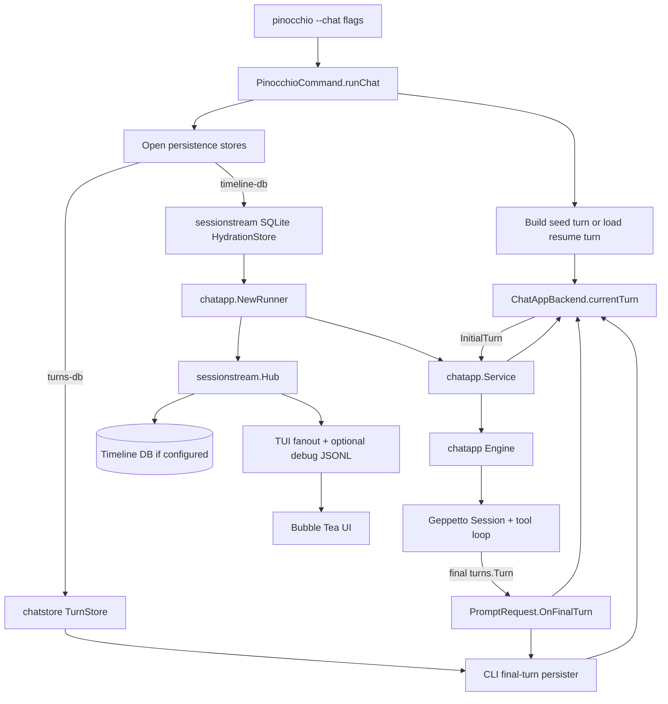

# Persisting Turns in the TUI Chatapp

## Executive Summary

Pinocchio's command TUI chat mode now uses `chatapp` and `sessionstream`, but its conversation accumulator is still process-local. The TUI backend stores the latest `*turns.Turn` in memory as `ChatAppBackend.currentTurn`; after each successful inference run, `PromptRequest.OnFinalTurn` receives the final Geppetto turn and the backend replaces `currentTurn` with that final turn. This is correct for a single running TUI, but it does not persist the model-context accumulator to disk and it does not allow command chat sessions to be inspected or resumed like web-chat sessions.

This design adds durable TUI turn persistence using the same `chatstore.TurnStore` concept already used by web-chat. It also recommends wiring `--timeline-db` to the live `sessionstream.HydrationStore` so command chat can persist visible timeline snapshots alongside final turns. These are related but distinct tracks:

- **Turns DB** stores the inference accumulator: the final `turns.Turn` that should seed the next model call.
- **Timeline DB** stores the visible UI state: sessionstream timeline entities, ordinals, snapshots, and projected UI events.

The most important design rule is:

> Persist and resume inference context from final `turns.Turn` values, not from `sessionstream` timeline entities. Use the timeline DB for UI hydration, debugging, and inspection.

The implementation should be incremental:

1. Reuse existing CLI flags `--turns-db`, `--turns-dsn`, `--timeline-db`, and `--timeline-dsn`.
2. Wire `--timeline-db` / `--timeline-dsn` into `chatapp.NewRunner` as a `sessionstream.HydrationStore`.
3. Wire `--turns-db` / `--turns-dsn` into `ChatAppBackend` as a final-turn persistence sink.
4. Add a stable session/conversation id policy for persistence and later resume.
5. Add tests for final-turn persistence, timeline persistence, and optional resume behavior.

This document is written for a new intern. It explains the moving parts, the current code, the desired behavior, the APIs involved, and a concrete implementation plan.

## Problem Statement

### Current behavior

Command TUI chat mode has a correct in-memory turn accumulator:

```text
seed turn
  -> ChatAppBackend.currentTurn
  -> currentTurn.Clone() + new user prompt
  -> PromptRequest.InitialTurn
  -> Geppetto inference/tool loop
  -> PromptRequest.OnFinalTurn(finalTurn)
  -> ChatAppBackend.currentTurn = finalTurn.Clone()
```

This solves multi-turn continuity while the TUI process is alive. It does not solve durability.

If the user runs:

```bash
pinocchio code professional "hello" --chat
```

and then has a multi-turn conversation, the final model-context turn exists only in memory. When the TUI exits, the final turn is lost unless some other path exports it. That means:

- we cannot inspect the exact final `turns.Turn` used by command chat after the run;
- we cannot resume a previous TUI chat session from the latest final turn;
- command chat persistence is not at parity with web-chat;
- `--turns-db` and `--timeline-db` flags exist in CLI helper settings, but command chat currently does not wire them into `runChat` in a useful way.

### What web-chat already does

web-chat has two persistence tracks:

1. A `sessionstream` hydration store for visible timeline state.
2. A `chatstore.TurnStore` for final `turns.Turn` snapshots.

The web-chat HTTP handler submits a prompt without `InitialTurn`. Because there is no explicit initial turn, `chatapp` may load the latest final turn from `TurnStore`, append the user prompt, and run inference. The runtime persister then saves the new final turn back to the turns DB.

Command TUI differs from web-chat because it explicitly passes `InitialTurn` on each prompt. This is intentional. The TUI backend owns the in-memory accumulator and sends a complete input turn to `chatapp`. Therefore, adding turns persistence to TUI should not blindly copy web-chat's load-on-every-request behavior. The TUI should persist final turns from `OnFinalTurn`, and optional resume should load the latest final turn at startup.

### Desired result

The desired command TUI persistence model is:

```text
startup:
  seed := rendered command turn OR loaded latest final turn for session id
  currentTurn := seed.Clone()

on each user message:
  inputTurn := currentTurn.Clone() + user prompt
  run inference with PromptRequest.InitialTurn = inputTurn
  finalTurn := OnFinalTurn output
  currentTurn := finalTurn.Clone()
  if turns DB configured:
      save finalTurn as phase="final"

visible UI:
  sessionstream timeline persists to timeline DB if configured
```

This gives us durability without confusing turns and timelines.

## Vocabulary and Mental Model

### Block

A `turns.Block` is an ordered unit inside a turn. Blocks can represent system instructions, user text, assistant text, tool calls, tool results, images, or other typed payloads. Blocks are not only strings; they have roles and payload maps.

### Turn

A `turns.Turn` is the model-context accumulator. It is what the model should see for an inference run. A final turn after inference contains the prior context plus assistant output and any tool-loop changes that should affect future inference.

Example shape:

```text
system: You are a professional assistant.
user: hello i am manuel
assistant: Hello Manuel. How can I help?
user: Reply with exactly continue_ok
assistant: continue_ok
```

### Session

A Geppetto `Session` is the runtime object used to run inference. It is not the durable conversation store for command TUI. A new runtime session may be created for each submitted prompt as long as the correct latest turn is appended before inference.

### sessionstream timeline

`sessionstream` is the visible UI/event/snapshot layer. It stores projected timeline entities such as user messages, assistant message patches, reasoning entities, run status, and snapshots. It is correct for UI hydration, websocket/RPC/debug views, and timeline inspection. It is not the primary source of model context when a final `turns.Turn` exists.

## Current Code Map

### CLI settings and persistence flags

File:

`/home/manuel/workspaces/2026-05-20/pinocchio-structured-data-cli/pinocchio/pkg/cmds/cmdlayers/helpers.go`

Relevant fields:

```go
type HelpersSettings struct {
    TimelineDSN string `glazed:"timeline-dsn"`
    TimelineDB  string `glazed:"timeline-db"`
    TurnsDSN    string `glazed:"turns-dsn"`
    TurnsDB     string `glazed:"turns-db"`
}
```

The flags are already exposed to command invocations. The command setup passes them into the run context.

File:

`/home/manuel/workspaces/2026-05-20/pinocchio-structured-data-cli/pinocchio/pkg/cmds/cmd.go`

Relevant call:

```go
run.WithPersistenceSettings(run.PersistenceSettings{
    TimelineDSN: helpersSettings.TimelineDSN,
    TimelineDB:  helpersSettings.TimelineDB,
    TurnsDSN:    helpersSettings.TurnsDSN,
    TurnsDB:     helpersSettings.TurnsDB,
})
```

### Run context persistence settings

File:

`/home/manuel/workspaces/2026-05-20/pinocchio-structured-data-cli/pinocchio/pkg/cmds/run/context.go`

Relevant type:

```go
type PersistenceSettings struct {
    TimelineDSN string
    TimelineDB  string
    TurnsDSN    string
    TurnsDB     string
}
```

### Existing CLI persistence helper

File:

`/home/manuel/workspaces/2026-05-20/pinocchio-structured-data-cli/pinocchio/pkg/cmds/chat_persistence.go`

This file already has two useful pieces:

1. `openChatPersistenceStores(settings run.PersistenceSettings)` opens the older `chatstore.TimelineStore` and `chatstore.TurnStore` from DSNs or file paths.
2. `cliTurnStorePersister` serializes a final `turns.Turn` to YAML and saves it to `chatstore.TurnStore`.

Relevant API:

```go
type cliTurnStorePersister struct {
    store             chatstore.TurnStore
    convID            string
    fallbackSessionID string
    phase             string
}

func newCLITurnStorePersister(store chatstore.TurnStore, convID string, sessionID string, phase string) *cliTurnStorePersister

func (p *cliTurnStorePersister) PersistTurn(ctx context.Context, t *turns.Turn) error
```

The persister saves YAML with:

```go
payload, err := serde.ToYAML(t, serde.Options{})
return p.store.Save(ctx, p.convID, sessionID, turnID, phase, now, string(payload), chatstore.TurnSaveOptions{
    RuntimeKey:  runtimeKey,
    InferenceID: inferenceID,
})
```

This is useful for TUI final-turn persistence. However, `openChatPersistenceStores` currently returns `chatstore.TimelineStore`, not the live `sessionstream.HydrationStore` that `chatapp.NewRunner` expects. For command chat timeline parity, we should use `sessionstream/pkg/sessionstream/hydration/sqlite.Store` for timeline persistence.

### chatapp runner

File:

`/home/manuel/workspaces/2026-05-20/pinocchio-structured-data-cli/pinocchio/pkg/chatapp/runner.go`

Relevant API:

```go
type RunnerOptions struct {
    Registry       *sessionstream.SchemaRegistry
    HydrationStore sessionstream.HydrationStore
    UIFanout       sessionstream.UIFanout
    TurnStore      chatstore.TurnStore
    Plugins        []ChatPlugin
    ChunkDelay     time.Duration
}
```

`chatapp.NewRunner` already supports both persistence seams:

```go
runner, err := chatapp.NewRunner(chatapp.RunnerOptions{
    Registry:       reg,
    HydrationStore: hydrationStore,
    UIFanout:       fanout,
    TurnStore:      turnStore,
    Plugins:        plugins,
})
```

If `HydrationStore` is nil, the runner creates an in-memory SQLite sessionstream store. This is the current command TUI behavior.

### PromptRequest and final turn callback

File:

`/home/manuel/workspaces/2026-05-20/pinocchio-structured-data-cli/pinocchio/pkg/chatapp/service.go`

Relevant API:

```go
type PromptRequest struct {
    Prompt         string
    IdempotencyKey string
    Runtime        *infruntime.ComposedRuntime
    InitialTurn    *turns.Turn
    OnFinalTurn    func(*turns.Turn)
}
```

`InitialTurn` means the caller supplies the complete input turn. `OnFinalTurn` is called after successful runtime inference with the final Geppetto turn.

### Runtime inference

File:

`/home/manuel/workspaces/2026-05-20/pinocchio-structured-data-cli/pinocchio/pkg/chatapp/runtime_inference.go`

Relevant behavior:

```go
if pending.InitialTurn != nil {
    sess.Append(pending.InitialTurn.Clone())
} else {
    // Load latest final turn from TurnStore when available.
    // Append Prompt as a new user prompt.
}

handle, err := sess.StartInference(ctx)
output, err := handle.Wait()

if pending.OnFinalTurn != nil && output != nil {
    pending.OnFinalTurn(output.Clone())
}
```

This means TUI can persist final turns without reconstructing them from UI events.

### Command TUI backend

File:

`/home/manuel/workspaces/2026-05-20/pinocchio-structured-data-cli/pinocchio/pkg/ui/chatapp_backend.go`

Relevant current state:

```go
type ChatAppBackend struct {
    service *chatapp.Service
    sid     sessionstream.SessionId
    runtime *infruntime.ComposedRuntime

    mu          sync.Mutex
    currentTurn *turns.Turn
    running     bool
    killed      atomic.Bool
}
```

Current `Start` flow:

```go
initialTurn := turnWithUserPrompt(b.currentTurn, prompt)

req := chatapp.PromptRequest{
    Prompt:      prompt,
    InitialTurn: initialTurn,
    Runtime:     b.runtime,
    OnFinalTurn: func(t *turns.Turn) {
        finalTurn = t.Clone()
    },
}

b.service.SubmitPromptRequest(ctx, b.sid, req)
b.service.WaitIdle(ctx, b.sid)

if finalTurn != nil {
    b.currentTurn = finalTurn.Clone()
} else {
    b.currentTurn = initialTurn.Clone()
}
```

This is the right place to persist the final turn for command TUI.

### runChat wiring

File:

`/home/manuel/workspaces/2026-05-20/pinocchio-structured-data-cli/pinocchio/pkg/cmds/cmd.go`

Current high-level flow:

```go
seed := rc.ResultTurn
if seed == nil {
    seed = buildInitialTurnFromBlocksRendered(...)
}

sid := commandSessionID(seed)
eng := rc.EngineFactory.CreateEngine(rc.InferenceSettings)

fanoutProxy := pinui.NewUIFanoutProxy()
runner, err := chatapp.NewRunner(commandRunnerOptions(fanoutProxy))

backend, err := pinui.NewChatAppBackend(
    runner.Service,
    sid,
    &infruntime.ComposedRuntime{Engine: eng},
    seed,
)
```

The missing pieces are:

- Open configured turns store and timeline/hydration store.
- Pass hydration store to `chatapp.NewRunner`.
- Pass turn persister into `ChatAppBackend`.
- Close stores at process exit.
- Decide whether startup can load from turns DB for resume.

## Proposed Solution

### Overview

Add command-chat persistence in two layers:

```text
TUI chat process
├── turns.Turn accumulator
│   ├── in memory: ChatAppBackend.currentTurn
│   └── durable: chatstore.TurnStore, if --turns-db/--turns-dsn configured
└── sessionstream timeline
    ├── in memory: default runner store when no --timeline-db/--timeline-dsn
    └── durable: sessionstream SQLite HydrationStore, if configured
```

The TUI should continue to use `PromptRequest.InitialTurn` because it owns the current turn. The turns DB should be an output persistence sink after successful inference. Optional resume can later load the latest final turn at startup.

### Target architecture diagram



### Turn persistence semantics

When `--turns-db` or `--turns-dsn` is configured:

- Persist every successful final turn from TUI prompt submissions.
- Use `phase = "final"`.
- Use a conversation id derived from the session id unless a future explicit conversation id flag is added.
- Store the final turn payload as YAML through existing `serde.ToYAML` serialization.
- Do not persist fallback `initialTurn` when `OnFinalTurn` did not run, unless a deliberate partial/failed phase is later designed.

Recommended initial policy:

```text
if finalTurn != nil and WaitIdle returned nil:
    currentTurn = finalTurn.Clone()
    persist finalTurn as phase="final"
else if WaitIdle returned nil:
    currentTurn = initialTurn.Clone()
    do not persist final phase, because model output was not observed
else:
    keep previous currentTurn
    do not persist final phase
```

The current backend falls back to `initialTurn` if final turn is nil. That fallback is acceptable for in-memory continuity in unusual cases, but it should not be saved as a successful final turn unless we intentionally call it `phase="input"` or `phase="partial"`.

### Timeline persistence semantics

When `--timeline-db` or `--timeline-dsn` is configured:

- Create a `sessionstream` SQLite hydration store.
- Pass it to `chatapp.NewRunner` through `RunnerOptions.HydrationStore`.
- Keep using `sessionstream.UIFanout` for live TUI rendering and debug JSONL.
- Timeline persistence should not affect model context accumulation.

This is closer to web-chat's live timeline persistence than the older `chatstore.TimelineStore` helper. The old helper may still be useful for export-era timeline tables, but `chatapp.NewRunner` needs `sessionstream.HydrationStore`.

### Session id and conversation id policy

Today command chat gets its session id from `commandSessionID(seed)`. That function either reads an existing `turns.KeyTurnMetaSessionID` from the seed metadata or creates a new UUID and writes it into seed metadata.

For persistence, the initial implementation should use:

```text
session id = commandSessionID(seed)
conversation id = string(session id)
```

This is simple and avoids adding another flag in the first pass.

However, durable resume needs a stable id across process invocations. The chosen minimal UX is:

```bash
--session-id ID
--resume
```

For this first resume implementation, do not add `--conversation-id`, `pinocchio chat resume`, or list/resume helper commands. Keep the identity rule simple:

```text
conversation id = session id = --session-id
```

For this ticket, the implementation guide includes resume as Phase 3. Phase 1 and Phase 2 should persist data first.

## API Design

### New backend persistence interface

Add a small interface to `pkg/ui` so the TUI backend does not depend directly on `chatstore`:

```go
package ui

import (
    "context"
    "github.com/go-go-golems/geppetto/pkg/turns"
)

type TurnPersister interface {
    PersistTurn(ctx context.Context, t *turns.Turn) error
}
```

Then extend `ChatAppBackend`:

```go
type ChatAppBackend struct {
    service *chatapp.Service
    sid     sessionstream.SessionId
    runtime *infruntime.ComposedRuntime

    turnPersister TurnPersister

    mu          sync.Mutex
    currentTurn *turns.Turn
    running     bool
    killed      atomic.Bool
}
```

Constructor option options are preferable to a long positional constructor. To minimize disruption, use a functional option:

```go
type ChatAppBackendOption func(*ChatAppBackend)

func WithTurnPersister(p TurnPersister) ChatAppBackendOption {
    return func(b *ChatAppBackend) { b.turnPersister = p }
}

func NewChatAppBackend(
    service *chatapp.Service,
    sid sessionstream.SessionId,
    runtime *infruntime.ComposedRuntime,
    seed *turns.Turn,
    opts ...ChatAppBackendOption,
) (*ChatAppBackend, error) {
    // existing validation and seed clone
    b := &ChatAppBackend{...}
    for _, opt := range opts { opt(b) }
    return b, nil
}
```

This keeps existing call sites mostly compatible and avoids importing CLI packages into `pkg/ui`.

### Persist in backend after final turn capture

Update the `tea.Cmd` returned by `Start`:

```go
return func() tea.Msg {
    err := b.service.WaitIdle(ctx, b.sid)
    if err != nil {
        markNotRunning()
        return boba_chat.ErrorMsg(err)
    }

    finalTurnMu.Lock()
    updatedTurn := finalTurn
    finalTurnMu.Unlock()

    if updatedTurn != nil {
        if b.turnPersister != nil {
            if err := b.turnPersister.PersistTurn(ctx, updatedTurn.Clone()); err != nil {
                markNotRunning()
                return boba_chat.ErrorMsg(err)
            }
        }
        b.mu.Lock()
        b.currentTurn = updatedTurn.Clone()
        b.running = false
        b.mu.Unlock()
    } else {
        b.mu.Lock()
        b.currentTurn = initialTurn.Clone()
        b.running = false
        b.mu.Unlock()
    }

    return boba_chat.BackendFinishedMsg{}
}
```

Persist before or after updating `currentTurn`? Recommended order:

1. Capture `updatedTurn` locally.
2. Persist it.
3. If persistence succeeds, set `currentTurn`.
4. If persistence fails, return an error and do not silently advance durable state.

There is a product decision here. A TUI could choose to continue even if persistence fails. For the first implementation, explicit error is safer because the user requested durable turns and a silent persistence failure undermines resume/debugging. If this is too harsh in practice, add a best-effort mode later.

### Open turns store in runChat

Use existing helper functions:

```go
_, turnStore, cleanup, err := openChatPersistenceStores(rc.Persistence)
if err != nil { return nil, err }
defer cleanup()
```

But avoid opening `chatstore.TimelineStore` for command chat timeline persistence if we are going to use sessionstream SQLite hydration. There are two design options:

#### Option 1: Split helpers

Create dedicated helpers:

```go
func openCLITurnStore(settings run.PersistenceSettings) (chatstore.TurnStore, func(), error)
func openCLISessionstreamHydrationStore(settings run.PersistenceSettings, reg *sessionstream.SchemaRegistry) (sessionstream.HydrationStore, func(), error)
```

This is cleaner and avoids opening the wrong timeline store.

#### Option 2: Reuse `openChatPersistenceStores` for turns only

Call it and ignore the timeline store initially:

```go
_, turnStore, cleanupTurns, err := openChatPersistenceStores(run.PersistenceSettings{
    TurnsDSN: rc.Persistence.TurnsDSN,
    TurnsDB:  rc.Persistence.TurnsDB,
})
```

This is acceptable for Phase 1 turns persistence. Phase 2 should add the dedicated sessionstream hydration helper.

### Create CLI turn persister

In `runChat`:

```go
var turnPersister pinui.TurnPersister
if turnStore != nil {
    convID := string(sid)
    turnPersister = newCLITurnStorePersister(turnStore, convID, string(sid), "final")
}

backend, err := pinui.NewChatAppBackend(
    runner.Service,
    sid,
    &infruntime.ComposedRuntime{Engine: eng},
    seed,
    pinui.WithTurnPersister(turnPersister),
)
```

Because `newCLITurnStorePersister` lives in `pkg/cmds`, `pkg/ui` should only know the interface.

### Open sessionstream hydration store

The `sessionstream` package already provides SQLite hydration persistence:

Import path observed in `chatapp/runner.go`:

```go
storesqlite "github.com/go-go-golems/sessionstream/pkg/sessionstream/hydration/sqlite"
```

Relevant functions from the module:

```go
func New(dsn string, reg *sessionstream.SchemaRegistry) (*Store, error)
func FileDSN(path string) (string, error)
func NewInMemory(reg *sessionstream.SchemaRegistry) (*Store, error)
```

Add helper:

```go
func openSessionstreamHydrationStore(settings run.PersistenceSettings, reg *sessionstream.SchemaRegistry) (sessionstream.HydrationStore, func(), error) {
    if strings.TrimSpace(settings.TimelineDSN) == "" && strings.TrimSpace(settings.TimelineDB) == "" {
        return nil, func(){}, nil
    }
    dsn := strings.TrimSpace(settings.TimelineDSN)
    if dsn == "" {
        path := strings.TrimSpace(settings.TimelineDB)
        if dir := filepath.Dir(path); dir != "." && dir != "" {
            if err := os.MkdirAll(dir, 0o755); err != nil { return nil, nil, err }
        }
        var err error
        dsn, err = storesqlite.FileDSN(path)
        if err != nil { return nil, nil, err }
    }
    store, err := storesqlite.New(dsn, reg)
    if err != nil { return nil, nil, err }
    return store, func(){ _ = store.Close() }, nil
}
```

Then wire in `runChat`:

```go
reg := sessionstream.NewSchemaRegistry()
hydrationStore, closeHydration, err := openSessionstreamHydrationStore(rc.Persistence, reg)
if err != nil { return nil, err }
defer closeHydration()

runner, err := chatapp.NewRunner(commandRunnerOptionsWithStore(reg, hydrationStore, fanoutProxy, turnStore))
```

### Command runner options

Current command paths use `commandRunnerOptions(fanout)`. It installs reasoning and tool-call plugins. The implementation should preserve that behavior.

A possible refactor:

```go
func commandRunnerOptions(fanout sessionstream.UIFanout) chatapp.RunnerOptions {
    return commandRunnerOptionsWithPersistence(fanout, nil, nil, nil)
}

func commandRunnerOptionsWithPersistence(
    fanout sessionstream.UIFanout,
    reg *sessionstream.SchemaRegistry,
    hydrationStore sessionstream.HydrationStore,
    turnStore chatstore.TurnStore,
) chatapp.RunnerOptions {
    return chatapp.RunnerOptions{
        Registry:       reg,
        HydrationStore: hydrationStore,
        UIFanout:       fanout,
        TurnStore:      turnStore,
        Plugins: []chatapp.ChatPlugin{
            plugins.NewReasoningPlugin(),
            plugins.NewToolCallPlugin(),
        },
    }
}
```

Do not drop plugin registration. Without these plugins, command TUI/debug/RPC can miss canonical reasoning and tool-call UI events.

## Detailed Runtime Flow After Implementation

### Startup without persistence

```text
pinocchio --chat
  -> build seed turn
  -> no timeline store configured: runner uses in-memory hydration store
  -> no turns store configured: backend has no persister
  -> backend.currentTurn = seed.Clone()
```

This preserves current behavior.

### Startup with turns DB only

```text
pinocchio --chat --turns-db /tmp/pin-turns.db
  -> open SQLite TurnStore
  -> build seed turn
  -> sid = commandSessionID(seed)
  -> turnPersister = cliTurnStorePersister(turnStore, sid, sid, "final")
  -> backend.currentTurn = seed.Clone()
```

Each successful message:

```text
prompt
  -> initialTurn = currentTurn.Clone() + user(prompt)
  -> chatapp runs InitialTurn
  -> OnFinalTurn(finalTurn)
  -> PersistTurn(finalTurn)
  -> currentTurn = finalTurn.Clone()
```

### Startup with timeline DB only

```text
pinocchio --chat --timeline-db /tmp/pin-timeline.db
  -> create sessionstream SQLite HydrationStore
  -> chatapp.NewRunner uses durable hydration store
  -> sessionstream applies timeline entity changes to DB
  -> TUI fanout still receives live events
```

The model context remains in `currentTurn`. The timeline DB is for visible state and inspection.

### Startup with both DBs

```text
pinocchio --chat --timeline-db /tmp/timeline.db --turns-db /tmp/turns.db
  -> timeline entities persist to sessionstream DB
  -> final turns persist to turns DB
  -> TUI remains live and streaming
```

This is the closest command-TUI equivalent to web-chat's durable model.

### Future startup with resume

With a future `--session-id` or `--conversation-id`:

```text
pinocchio --chat --turns-db /tmp/turns.db --session-id abc
  -> load latest final turn for convID/sessionID abc, phase="final"
  -> backend.currentTurn = loadedTurn.Clone()
  -> hydrate visible TUI from either:
       a) sessionstream timeline DB snapshot if available, or
       b) snapshotFromTurnForHydration(loadedTurn) fallback
```

Resume should be a separate implementation phase because it needs user-facing session id UX and tests.

## File-by-File Implementation Guide

### 1. `pkg/ui/chatapp_backend.go`

Add a backend-level turn persister interface and option.

```go
type TurnPersister interface {
    PersistTurn(ctx context.Context, t *turns.Turn) error
}

type ChatAppBackendOption func(*ChatAppBackend)

func WithTurnPersister(p TurnPersister) ChatAppBackendOption {
    return func(b *ChatAppBackend) { b.turnPersister = p }
}
```

Extend struct:

```go
type ChatAppBackend struct {
    service *chatapp.Service
    sid     sessionstream.SessionId
    runtime *infruntime.ComposedRuntime

    turnPersister TurnPersister

    mu          sync.Mutex
    currentTurn *turns.Turn
    running     bool
    killed      atomic.Bool
}
```

Update constructor to accept options:

```go
func NewChatAppBackend(..., seed *turns.Turn, opts ...ChatAppBackendOption) (*ChatAppBackend, error) {
    b := &ChatAppBackend{...}
    for _, opt := range opts {
        if opt != nil { opt(b) }
    }
    return b, nil
}
```

Update `Start` so successful final turns are persisted:

```go
if updatedTurn != nil {
    if b.turnPersister != nil {
        if err := b.turnPersister.PersistTurn(ctx, updatedTurn.Clone()); err != nil {
            b.mu.Lock()
            b.running = false
            b.mu.Unlock()
            return boba_chat.ErrorMsg(err)
        }
    }
    b.mu.Lock()
    b.currentTurn = updatedTurn.Clone()
    b.running = false
    b.mu.Unlock()
}
```

### 2. `pkg/ui/chatapp_backend_test.go`

Add tests using a fake persister.

Pseudocode:

```go
type recordingTurnPersister struct {
    turns []*turns.Turn
    err error
}

func (p *recordingTurnPersister) PersistTurn(ctx context.Context, t *turns.Turn) error {
    if p.err != nil { return p.err }
    p.turns = append(p.turns, t.Clone())
    return nil
}
```

Test successful persistence:

```go
func TestChatAppBackendPersistsFinalTurn(t *testing.T) {
    service := fake service or real chatapp runner with fake runtime
    persister := &recordingTurnPersister{}
    backend := NewChatAppBackend(..., WithTurnPersister(persister))

    cmd, err := backend.Start(ctx, "hello")
    msg := cmd()

    require.IsType(t, boba_chat.BackendFinishedMsg{}, msg)
    require.Len(t, persister.turns, 1)
    require.Contains(t, assistantText(persister.turns[0]), "...")
}
```

Test persistence error:

```go
func TestChatAppBackendReturnsErrorWhenTurnPersistenceFails(t *testing.T) {
    persister.err = errors.New("persist failed")
    msg := cmd()
    require.IsType(t, boba_chat.ErrorMsg{}, msg)
}
```

Test no final turn behavior if practical. If hard to trigger, document why and keep core success/error tests.

### 3. `pkg/cmds/chat_persistence.go`

Add or refactor helpers.

Recommended new helpers:

```go
func openCLITurnStore(settings run.PersistenceSettings) (chatstore.TurnStore, func(), error)
func openCLISessionstreamHydrationStore(settings run.PersistenceSettings, reg *sessionstream.SchemaRegistry) (sessionstream.HydrationStore, func(), error)
```

Keep `openChatPersistenceStores` if existing tests depend on it. Do not remove compatibility in this ticket unless the implementation intentionally cleans it up.

For `openCLITurnStore`, reuse the existing DSN/path code for turns.

For `openCLISessionstreamHydrationStore`, use:

```go
storesqlite "github.com/go-go-golems/sessionstream/pkg/sessionstream/hydration/sqlite"
```

### 4. `pkg/cmds/cmd.go`

Update `runChat` only after seed and sid are known.

Pseudocode:

```go
seed := rc.ResultTurn
if seed == nil { seed = buildInitialTurnFromBlocksRendered(...) }
sid := commandSessionID(seed)

reg := sessionstream.NewSchemaRegistry()
hydrationStore, closeHydration, err := openCLISessionstreamHydrationStore(rc.Persistence, reg)
if err != nil { return nil, err }
defer closeHydration()

turnStore, closeTurnStore, err := openCLITurnStore(rc.Persistence)
if err != nil { return nil, err }
defer closeTurnStore()

fanoutProxy := pinui.NewUIFanoutProxy()
runner, err := chatapp.NewRunner(commandRunnerOptionsWithPersistence(
    fanoutProxy,
    reg,
    hydrationStore,
    turnStore,
))
```

Then create persister:

```go
var turnPersister pinui.TurnPersister
if turnStore != nil {
    turnPersister = newCLITurnStorePersister(turnStore, string(sid), string(sid), "final")
}

backend, err := pinui.NewChatAppBackend(
    runner.Service,
    sid,
    &infruntime.ComposedRuntime{Engine: eng},
    seed,
    pinui.WithTurnPersister(turnPersister),
)
```

Important: pass `TurnStore` to runner only if you want `chatapp` no-`InitialTurn` fallback paths to have access to it. TUI prompt submissions currently use `InitialTurn`, so runner `TurnStore` is not required for TUI continuation. Passing it is harmless and keeps the runner complete, but do not expect it to persist TUI final turns by itself.

### 5. `pkg/cmds/cmd_sessionstream_finalize_test.go` or new test file

Add command-level tests for store opening and wiring if practical.

Suggested focused tests:

- `TestRunChatPersistsFinalTurnWhenTurnsDBConfigured`
- `TestRunChatUsesTimelineHydrationStoreWhenTimelineDBConfigured`

If full Bubble Tea TUI tests are cumbersome, test lower-level helpers and backend persistence directly, then add one integration smoke if existing TUI test harness supports it.

### 6. User-facing help

Update:

`/home/manuel/workspaces/2026-05-20/pinocchio-structured-data-cli/pinocchio/cmd/pinocchio/doc/general/06-rpc-jsonl-output.md`

or create a new help page if this is not RPC/debug-specific.

Document:

```bash
pinocchio code professional "hello" --chat \
  --turns-db ~/.local/share/pinocchio/chat/turns.db \
  --timeline-db ~/.local/share/pinocchio/chat/timeline.db
```

Explain:

- `--turns-db` stores final model-context turns.
- `--timeline-db` stores visible sessionstream timeline entities.
- initial implementation persists; resume may require a future session id flag.

## Implementation Phases

### Phase 1: Persist TUI final turns

Goal: `--chat --turns-db PATH` saves final `turns.Turn` after each successful TUI inference.

Tasks:

- Add `ui.TurnPersister` and `ui.WithTurnPersister`.
- Update `ChatAppBackend.Start` to persist final turns.
- Open `chatstore.TurnStore` in `runChat` when configured.
- Attach `newCLITurnStorePersister` to backend.
- Add backend unit tests.
- Add helper tests for turns DB path/DSN.

Validation:

```bash
go test ./pkg/ui ./pkg/cmds -count=1
```

Manual smoke:

```bash
rm -f /tmp/pin-turns.db
PINOCCHIO_PROFILE=gpt-5-nano-low \
  go run ./cmd/pinocchio code professional "hello" \
  --chat --turns-db /tmp/pin-turns.db
```

Then inspect with existing web-chat export/turn tooling if available, or a small SQLite query:

```bash
sqlite3 /tmp/pin-turns.db '.tables'
sqlite3 /tmp/pin-turns.db 'select conv_id, session_id, phase, length(payload) from turns order by created_at_ms desc limit 5;'
```

Exact table names should be confirmed from `pkg/persistence/chatstore/turn_store_sqlite.go` before writing final smoke instructions.

### Phase 2: Persist TUI sessionstream timeline

Goal: `--chat --timeline-db PATH` uses a durable `sessionstream.HydrationStore`.

Tasks:

- Add `openCLISessionstreamHydrationStore` using `storesqlite.FileDSN` and `storesqlite.New`.
- Create a shared schema registry before runner creation.
- Pass registry and hydration store to `chatapp.NewRunner`.
- Keep plugin registration unchanged.
- Add helper tests or runner snapshot tests.

Validation:

```bash
go test ./pkg/cmds ./pkg/chatapp ./pkg/ui -count=1
```

Manual smoke:

```bash
rm -f /tmp/pin-timeline.db
PINOCCHIO_PROFILE=gpt-5-nano-low \
  go run ./cmd/pinocchio code professional "hello" \
  --chat --timeline-db /tmp/pin-timeline.db
```

Inspect:

```bash
sqlite3 /tmp/pin-timeline.db '.tables'
```

Use sessionstream or web-chat timeline tools if they support the same schema.

### Phase 3: Resume support

Goal: user can resume TUI chat from a prior persisted final turn.

The UX decision is intentionally minimal:

```bash
--session-id ID
--resume
```

Do not add `--conversation-id` for the first resume implementation. Do not add a dedicated `pinocchio chat resume` command yet. Use the explicit session id as both the turn-store `conv_id` and `session_id`.

Startup logic:

```go
if resumeRequested {
    latest, err := turnStore.LoadLatestTurn(ctx, convID, "final")
    turn, err := serde.FromYAML([]byte(latest.Payload))
    seed = turn
} else {
    seed = rendered command turn
}
```

Visible hydration logic:

```go
if timelineStore has snapshot for sid {
    hydrate from sessionstream snapshot
} else {
    hydrate from snapshotFromTurnForHydration(sid, seed)
}
```

Phase 3 no longer needs a broad UX design review before implementation; the accepted first UX is `--session-id ID --resume`. A review should still check loading semantics, persistence key consistency, and error messages.

## Testing Strategy

### Unit tests

#### `ChatAppBackend` final-turn persistence

Test that a successful run persists exactly the final turn returned by `OnFinalTurn`.

Assertions:

- persister called once;
- persisted turn contains assistant output;
- persisted turn contains the latest user prompt;
- backend returns `BackendFinishedMsg`.

#### Persistence failure

Test that persister errors surface to Bubble Tea as an error message.

Assertions:

- returned message is `boba_chat.ErrorMsg`;
- backend is not left in running state;
- no silent success is reported.

#### Store-opening helpers

Test file-path helpers create parent directories and return non-nil stores.

Assertions:

- parent directories exist;
- DB files can be opened;
- cleanup closes stores.

### Integration tests

#### TUI turns DB integration

If existing fake engine harness can drive `runChat` without a real terminal, assert the turns DB has a final row after one run.

If not, keep this as a tmux smoke test for now and unit-test the backend-level persistence thoroughly.

#### TUI timeline DB integration

Use a real `chatapp.Runner` with a file-backed sessionstream hydration store, submit a prompt through backend, then query `runner.Service.Snapshot` or reopen store and verify snapshot entities exist.

### Manual tmux smoke tests

Use the known TUI submission key: TAB.

```bash
tmux new-session -d -s pin-persist-smoke \
  'cd /home/manuel/workspaces/2026-05-20/pinocchio-structured-data-cli/pinocchio && PINOCCHIO_PROFILE=gpt-5-nano-low go run ./cmd/pinocchio code professional "hello" --chat --turns-db /tmp/pin-turns.db --timeline-db /tmp/pin-timeline.db --debug-events-jsonl /tmp/pin-debug.jsonl'

tmux send-keys -t pin-persist-smoke -l 'Reply with exactly persist_ok'
tmux send-keys -t pin-persist-smoke Tab
```

Validate:

```bash
test -s /tmp/pin-turns.db
test -s /tmp/pin-timeline.db
test -s /tmp/pin-debug.jsonl
```

Then inspect the turns payload and debug frame counts.

## API References

### `chatapp.RunnerOptions`

File:

`pkg/chatapp/runner.go`

```go
type RunnerOptions struct {
    Registry       *sessionstream.SchemaRegistry
    HydrationStore sessionstream.HydrationStore
    UIFanout       sessionstream.UIFanout
    TurnStore      chatstore.TurnStore
    Plugins        []ChatPlugin
    ChunkDelay     time.Duration
}
```

Use `HydrationStore` for sessionstream timeline persistence. Use `TurnStore` for no-`InitialTurn` history loading paths. TUI final-turn persistence still needs an explicit persister because TUI uses `InitialTurn`.

### `chatapp.PromptRequest`

File:

`pkg/chatapp/service.go`

```go
type PromptRequest struct {
    Prompt         string
    IdempotencyKey string
    Runtime        *infruntime.ComposedRuntime
    InitialTurn    *turns.Turn
    OnFinalTurn    func(*turns.Turn)
}
```

Use `InitialTurn` when the caller has complete model context. Use `OnFinalTurn` to capture the final accumulator after successful inference.

### `chatstore.TurnStore`

File family:

`pkg/persistence/chatstore/turn_store*.go`

Expected operations include saving final turns and loading latest final turns. Confirm exact method signatures before implementing resume. The current CLI persister already uses:

```go
store.Save(ctx, convID, sessionID, turnID, phase, createdAtMs, payload, chatstore.TurnSaveOptions{...})
```

### `sessionstream.HydrationStore`

Module:

`github.com/go-go-golems/sessionstream/pkg/sessionstream`

Relevant interface:

```go
type HydrationStore interface {
    Apply(ctx context.Context, sid SessionId, ord uint64, entities []TimelineEntity) error
    Snapshot(ctx context.Context, sid SessionId, asOf uint64) (Snapshot, error)
    View(ctx context.Context, sid SessionId) (TimelineView, error)
    Cursor(ctx context.Context, sid SessionId) (uint64, error)
}
```

SQLite implementation:

```go
storesqlite "github.com/go-go-golems/sessionstream/pkg/sessionstream/hydration/sqlite"

storesqlite.FileDSN(path)
storesqlite.New(dsn, reg)
```

## Design Decisions

### Decision 1: Persist final turns from `OnFinalTurn`

`OnFinalTurn` carries the final Geppetto accumulator. It is more accurate than rebuilding from projected timeline entities.

Rationale:

- preserves non-visible blocks;
- preserves tool-loop effects;
- preserves model-context order;
- avoids flattening streamed UI patches into approximate assistant text;
- matches the existing TUI accumulator model.

### Decision 2: Keep TUI using `InitialTurn`

The TUI backend owns `currentTurn`, so each prompt should continue to pass a complete `InitialTurn`.

Rationale:

- TUI already needs explicit seed handling for command-rendered blocks;
- continuation from blocking command output uses `rc.ResultTurn` directly;
- no accidental double loading from `TurnStore`;
- model context remains deterministic.

### Decision 3: Do not use timeline DB as turn DB

Timeline entities are for UI state. They may omit or transform inference-relevant data. Do not resume model context from timeline entities when final turns are available.

### Decision 4: Initial persistence does not imply resume

Persisting final turns is useful by itself for inspection, export, debugging, and future migration. Resume needs stable session id UX and should be implemented deliberately.

### Decision 5: Preserve plugin registration

Command runners must keep reasoning and tool-call plugins installed. Persistence wiring must not regress `ChatReasoningPatch`, tool-call UI events, or debug JSONL behavior.

## Alternatives Considered

### Alternative A: Reconstruct turns from sessionstream snapshots

Rejected for inference continuity.

This drops or approximates blocks that are not visible chat messages. It also couples model context to UI projection details and can flatten incremental assistant/reasoning/tool state incorrectly.

### Alternative B: Let `chatapp` TurnStore automatically persist TUI turns

Not sufficient.

`chatapp` can load from `TurnStore` when `InitialTurn` is absent, and runtime builders can install persisters in web-chat. The TUI uses explicit `InitialTurn`; the backend must persist the `OnFinalTurn` output or install a runtime persister. Backend-level persistence is the smallest direct seam.

### Alternative C: Store only debug JSONL

Rejected.

Debug JSONL records projected UI events, which is excellent for diagnosing rendering boundaries. It is not a durable model-context accumulator.

### Alternative D: Make web-chat and TUI both use no-`InitialTurn`

Rejected for TUI.

Pinocchio command inputs can contain rendered system prompts, images, and rich blocks. Explicit `InitialTurn` is the correct mechanism for command-originated context.

## Risks and Mitigations

### Risk: persistence failure interrupts the TUI

If the turns DB becomes unavailable after a run, the backend may return an error. This is strict but safe. If users prefer best-effort persistence, add a flag later.

Mitigation:

- clear error messages;
- tests for running-state cleanup;
- consider a future `--persistence-best-effort` flag only if needed.

### Risk: confusing two SQLite schemas

There is an older `chatstore.TimelineStore` and a newer/live `sessionstream.HydrationStore`. They are not the same API.

Mitigation:

- name helpers explicitly: `openCLISessionstreamHydrationStore`, not `openTimelineStore`;
- document which one `chatapp.NewRunner` needs;
- add tests that call `runner.Service.Snapshot` with a file-backed hydration store.

### Risk: generated session ids make resume hard

If every run generates a new session id, persisted turns are still useful but not easily resumable.

Mitigation:

- Phase 1 persists with convID=sessionID;
- Phase 3 adds explicit session/resume UX.

### Risk: persisting duplicate or incomplete turns

If final turn capture fails or fallback logic persists `initialTurn`, the DB may contain incomplete turns.

Mitigation:

- persist only when `finalTurn != nil`;
- use `phase="final"` only for successful final output;
- optionally add `phase="input"` later for submitted input snapshots.

## Open Questions

1. Should persistence failure fail the TUI message, or should it be best-effort with a visible warning?
2. Should `--resume` require `--session-id`, or may it fall back to `commandSessionID(seed)` for deterministic command seeds?
3. Should timeline hydration on resume be implemented immediately, or should first resume only restore model context from the turns DB?
4. Should we add CLI tools for listing/resuming persisted command chat sessions later, after the minimal `--session-id ID --resume` UX is proven?

## Recommended First PR Scope

The safest first PR should include:

- backend `TurnPersister` interface;
- final-turn persistence from `ChatAppBackend.Start`;
- `runChat` wiring for `--turns-db` and `--turns-dsn`;
- unit tests for backend persistence success/error;
- CLI helper tests for opening turns DB paths;
- documentation that `--turns-db` persists final turns but does not yet provide resume UX.

The second PR should add:

- `--timeline-db` as sessionstream SQLite hydration store;
- tests for file-backed hydration snapshots;
- user help for turns DB versus timeline DB.

The third PR should add:

- minimal `--session-id ID --resume` UX;
- `convID=sessionID=--session-id` persistence keying;
- load-latest-final-turn startup path;
- visible hydration from timeline DB or turn fallback if this is low-risk;
- no `--conversation-id` and no list/resume helper commands in the first resume pass.

## Appendix: New Intern Checklist

Before implementing, read these files in order:

1. `pkg/ui/chatapp_backend.go` — understand `currentTurn` and `OnFinalTurn`.
2. `pkg/chatapp/service.go` — understand `PromptRequest.InitialTurn` and `OnFinalTurn`.
3. `pkg/chatapp/runtime_inference.go` — understand InitialTurn versus TurnStore paths.
4. `pkg/chatapp/runner.go` — understand runner wiring, hydration store, UI fanout, TurnStore.
5. `pkg/cmds/cmd.go` — find `runChat` and command runner options.
6. `pkg/cmds/chat_persistence.go` — reuse turn persister and store-opening logic.
7. `cmd/web-chat/runtime_composer.go` and `cmd/web-chat/turn_persistence.go` — compare web-chat's final-turn persistence model.
8. `cmd/pinocchio/doc/general/06-rpc-jsonl-output.md` or a future chat persistence help page — update user-facing docs.

Then implement in this order:

```text
1. Add backend TurnPersister option.
2. Unit-test backend persistence with fake persister.
3. Wire turns store in runChat.
4. Test turns DB creation and saved final rows.
5. Wire sessionstream timeline store if included in same PR.
6. Add docs/help.
7. Run gofmt and targeted tests.
8. Run broader tests.
9. Do one tmux smoke test with --chat --turns-db.
```

## References

- `PIN-20260520-SESSIONSTREAM-FINALIZE` diary for the existing TUI migration and final-turn accumulator fix.
- `Research/KB/Tribal/session-turn-blocks-chat-applications.md` in the Obsidian vault for the general Session/Turn/Blocks model.
- `Research/KB/Tribal/bubbletea-streaming-llm-uis.md` in the Obsidian vault for Bubble Tea streaming LLM UI architecture and sessionstream boundaries.
