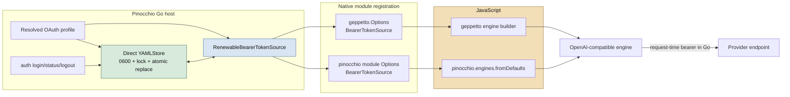

# Host-owned OAuth sources in Pinocchio JavaScript runtimes and local lifecycle commands

## Executive summary

Pinocchio already owns a complete local OAuth profile lifecycle: the versioned `extensions."pinocchio.oauth@v1"` profile extension holds provider policy and a credential tuple in one direct owner-only YAML registry; `pinocchio auth login` performs loopback PKCE login; and `profilebootstrap` constructs a Geppetto `RenewableBearerTokenSource` for normal Go engine construction. Geppetto `v0.13.6` now publishes the reviewed generic renewal and JavaScript host-injection APIs.

Two JavaScript construction paths still bypass Pinocchio’s resolved OAuth source. The `pinocchio js` command registers Geppetto’s native module without `gp.Options.BearerTokenSource`, and Pinocchio’s own `pinocchio.engines.fromDefaults()` module calls `factory.NewEngineFromSettings` without an option. Both paths therefore fall back to static-key validation even when the selected profile is OAuth-backed. This ticket fixes those paths by carrying one host-created Go interface through native-module options. No token value, refresh callback, source selector, or credential metadata is exposed to JavaScript.

The ticket also adds the two remaining local lifecycle operations that users need: a secret-free `auth status` command and an atomic `auth logout` command. It explicitly does not add a manual refresh command. Refresh is request-time behavior owned by `RenewableBearerTokenSource`; a separate command would create a second lifecycle path with weaker operational semantics. Remote `auth revoke` remains deferred until a selected provider documents a compatible revocation endpoint and policy.

## 1. Problem statement

### 1.1 The Go path is source-aware

`pkg/cmds/profilebootstrap/oauth.go` resolves an OAuth profile only from one writable direct YAML registry. It verifies that the final inference settings do not also contain a static key, creates the profile-bound `YAMLStore`, constructs a Geppetto OAuth client/refresher, and creates `credentials.RenewableBearerTokenSource`.

`NewEngineFactoryForResolvedSettings` sends that source to `factory.WithBearerTokenSource`. The standard Go CLI path therefore retains all Geppetto renewal behavior: source authority, proactive refresh, atomic host persistence, caller-local cancellation, and one bounded pre-stream 401 recovery where supported.

### 1.2 JavaScript has two bypasses

The Pinocchio JavaScript command creates a Goja runtime in `cmd/pinocchio/cmds/js.go`. It already resolves the selected profile and passes defaults and profile registry data into `newPinocchioJSRuntime`. At registration, however, it constructs `gp.Options` without the `BearerTokenSource` field published in Geppetto `v0.13.6`.

```text
current `pinocchio js` path

resolved OAuth profile -> source exists in Go
                              X
script -> require("geppetto").engine().inference(...).build()
                              |
                              v
                   gp.Options has no source
                              |
                              v
                   static-key-only factory helper
```

A second bypass is inside Pinocchio’s own native module. `pkg/js/modules/pinocchio/module.go` implements `pinocchio.engines.fromDefaults()` by cloning inference settings and calling `factory.NewEngineFromSettings`. This helper deliberately has no option parameter, so it cannot pass the source either.

The bug is construction plumbing, not a reason to put credentials in a JavaScript object. A source can remain in Go while either builder creates an engine that resolves credentials at request time.

### 1.3 Operators need state management, not bearer handling

`pinocchio auth login` already provides initial login and re-login. It binds an exact loopback listener, uses PKCE S256 and state validation, exchanges the code, and saves the credential tuple through the owner-only YAML store. It emits only registry/profile/status metadata.

Two local operations remain absent:

- **Status** should tell an operator whether the selected OAuth profile is eligible, locally configured, and has a usable/expired/missing credential state. It must not print a bearer, refresh value, authorization code, client secret, raw YAML, or arbitrary source errors. It must not call a provider endpoint or trigger refresh.
- **Logout** should atomically remove `access_token`, `refresh_token`, and `expires_at` from the selected profile’s extension while preserving protocol configuration such as authorization URL, token URL, client ID, scopes, and refresh-token policy. It must use the existing lock, permission checks, fsync, rename, and directory sync path.

A manual `auth refresh` command is unnecessary and undesirable. Inference needs a bearer at a specific time for a specific provider request; the source is the component that can refresh correctly under concurrent callers and persist rotation before caching. A CLI refresh command would race with inference, add a new interactive error surface, and encourage users to treat copied bearer state as a manageable artifact.

## 2. Architecture and security boundary



The source capability moves only across Go calls. The JS builders receive settings wrappers and return engine wrappers. The JavaScript public surface stays unchanged. This is the same boundary used by Geppetto itself: its `Options.BearerTokenSource` is a Go interface copied into a private runtime field and consumed only while constructing the provider engine.

The following invariants are required:

1. An OAuth profile still rejects overlapping static provider keys.
2. A nil source retains exactly the prior static-key behavior.
3. A configured source permits an OpenAI-compatible engine to build without a static key.
4. The source is never placed in settings, module exports, engine metadata, JavaScript values, errors, logs, or profile display output.
5. Both JavaScript builders receive the same one selected host source; they must not independently resolve profile state or implement OAuth protocol behavior.
6. Status and logout operate only on a selected direct YAML profile owner; inline, SQLite, composed, remote-like, and ambiguous direct YAML sources remain rejected.

## 3. Proposed APIs and implementation plan

### 3.1 Centralize source creation in profile bootstrap

Add a small helper beside `NewEngineFactoryForResolvedSettings`:

```go
func NewBearerTokenSourceForResolvedSettings(
    ctx context.Context,
    resolved *ResolvedCLIEngineSettings,
) (credentials.BearerTokenSource, error) {
    profile, err := ResolveOAuthProfile(ctx, resolved)
    if err != nil || profile == nil {
        return nil, err
    }
    return profile.NewBearerTokenSource()
}
```

The helper returns nil for static profiles and the existing host-owned source for OAuth profiles. The current factory helper should call it instead of duplicating resolution. This keeps direct Go engines and both JavaScript paths consistent.

### 3.2 Carry the opaque source through `pinocchio js`

Add `BearerTokenSource credentials.BearerTokenSource` to `pinocchioJSRuntimeOptions`. Once `resolvePinocchioJSRuntimeBootstrap` has returned resolved settings, `RunIntoWriter` calls the new profilebootstrap helper and passes its result to runtime construction.

At registration time, the source is passed to both native modules:

```go
gpOptions := gp.Options{
    // existing fields
    BearerTokenSource: opts.BearerTokenSource,
}
gp.Register(reg, gpOptions)

pjs.Register(reg, pjs.Options{
    DefaultInferenceSettings: opts.DefaultInferenceSettings,
    BearerTokenSource:       opts.BearerTokenSource,
})
```

This is not a JavaScript API change. `BearerTokenSource` is set by Pinocchio before `require("geppetto")` or `require("pinocchio")` executes.

### 3.3 Make `pinocchio.engines.fromDefaults()` source-aware

Add the same interface field to `pkg/js/modules/pinocchio.Options`. Preserve the existing helper when nil; when non-nil, create the standard factory with `factory.WithBearerTokenSource(source)`.

```go
func (m *module) engineFromDefaults(call goja.FunctionCall) (any, error) {
    settings, err := m.cloneInferenceSettingsWithOverrides(call)
    if err != nil { return nil, err }
    if m.opts.BearerTokenSource == nil {
        return factory.NewEngineFromSettings(settings)
    }
    return factory.NewStandardEngineFactory(
        factory.WithBearerTokenSource(m.opts.BearerTokenSource),
    ).CreateEngine(settings)
}
```

Overrides require special care. The source belongs to the selected OAuth profile’s exact provider/base URL identity. JavaScript must not use a source-backed engine with an override that changes provider or base URL. The initial implementation should reject source-backed `apiType` or `baseURL` overrides when they differ from the resolved settings, rather than allowing an OAuth source intended for one endpoint to release a bearer for another.

### 3.4 Add status and logout as Glazed verbs

The current `auth` Cobra group already contains only Glazed verbs. Add `status` and `logout` in the same style, using `profilebootstrap.NewProfileSettingsSection`, the Glazed section, command section, and one structured token-free row.

Suggested status row:

```text
profile          selected profile slug
registry         selected registry slug
oauth_profile    true
storage          direct_yaml
credential_state missing | usable | expiring | expired | unavailable
```

`unavailable` represents an expected local-store load failure after emitting a generic command error category. It must not include raw OS error text if that could include a credential path or provider body. The default should not display an expiry timestamp. A later explicit verbose mode can be considered only after a privacy review.

`logout` returns the same non-secret profile/registry fields plus `status=logged_out`. It has no remote side effect. It calls `YAMLStore.Delete` (new) after profile resolution. `Delete` removes only the credential tuple fields from the extension mapping and persists the changed registry through the exact same trusted write path as `Save`.

```go
func (s *YAMLStore) Delete(ctx context.Context, request credentials.Request) error {
    validate request and context
    with owner-only registry lock:
        load and validate selected profile extension
        delete access_token, refresh_token, expires_at
        encode registry
        atomicWriteOwnerOnly(path, bytes)
}
```

Logout is idempotent: deleting a missing tuple succeeds after validating the profile owner/configuration. That allows recovery scripts to run it safely.

### 3.5 Tests

The tests must cover behavior rather than private field shape.

| Area | Required evidence |
| --- | --- |
| Bootstrap helper | OAuth resolution yields a source; static profile yields nil; errors retain direct-owner/static-key checks. |
| Geppetto JS builder | An OAuth-selected source allows `require("geppetto").engine().inference(...).build()` with an empty static-key map. |
| Pinocchio JS builder | `require("pinocchio").engines.fromDefaults()` builds with source and empty static-key map. |
| Source secrecy | Neither module exports a source, bearer property, metadata value, or callback. |
| Override identity | Source-backed API type/base URL changes are rejected without a request/source call. |
| Status | Rows report only structured local state and omit credential fields. |
| Logout | Removes only tuple fields, preserves protocol config/unrelated profiles, uses owner-only permissions, and is idempotent. |
| Concurrency | Logout/save races leave one parseable YAML registry; no partial tuple/document is produced. |

## 4. Provider compatibility investigation

The ticket archives source material under `sources/`. The result is intentionally conservative: none of the three candidates supplies a documented, compatible end-user authorization-code-and-refresh contract for Pinocchio’s OpenAI-compatible inference profile.

### 4.1 Umans AI

The public Umans landing page (`sources/03-umans-ai-home.md`) describes setup through an API key and explicitly presents key creation/pasting as the provider setup path. A focused public search found no Umans OAuth authorization endpoint, token endpoint, PKCE client registration, refresh policy, scopes, or revocation contract.

**Decision:** do not attempt browser login, refresh, or inference smoke against Umans OAuth. A profile with guessed endpoints would create an unsafe, non-reproducible integration. Umans remains a static-key provider until its OAuth contract is published or received through an authorized provider channel.

### 4.2 OpenAI

OpenAI’s official API quickstart (`sources/06-openai-api-quickstart.md`) directs API users to create and export an API key. The OpenAI Apps SDK authentication page (`sources/01-openai-apps-sdk-auth.md`) describes a different role: ChatGPT acts as an OAuth client to authenticate a user against a third-party MCP server and its authorization server. It is not a public OAuth client contract for Pinocchio to obtain a renewable bearer for the OpenAI API.

**Decision:** do not use the Apps SDK connector flow as an OpenAI inference OAuth smoke. It would authenticate the wrong resource relationship. Keep OpenAI API access static-key based in Pinocchio unless OpenAI publishes a compatible end-user API OAuth contract.

### 4.3 Claude / Anthropic

Anthropic’s connector authentication documentation (`sources/02-claude-connectors-authentication.md`) again describes Claude as an OAuth client for third-party remote MCP servers. It is not a Pinocchio-to-Claude API authorization grant. Anthropic’s Claude Platform authentication documentation (`sources/05-claude-platform-api-authentication.md`) specifies API keys or workload identity federation for Claude API access. Workload federation exchanges a workload identity token; it is not an interactive browser authorization-code flow backed by a local user refresh credential.

**Decision:** do not use Claude connector OAuth or workload federation for the requested Pinocchio browser profile smoke. Claude API support would need a separate provider adapter and engine/auth-path audit, because Geppetto’s renewable bearer work currently targets OpenAI-compatible bearer header paths, not Claude’s `x-api-key` semantics.

### 4.4 Smoke-test rule

A real smoke is allowed only when all of the following are documented and authorized:

1. exact authorization and token endpoints;
2. public PKCE client ID and registered exact loopback redirect behavior;
3. scopes for the inference resource;
4. token response expiry and refresh-token rotation policy;
5. provider/base URL and OpenAI-compatible bearer header semantics;
6. safe disposable account or test tenant;
7. a procedure that never places secrets in terminal output, ticket docs, test fixtures, or commits.

Until then, fake-provider tests are the appropriate executable proof for Pinocchio’s browser, store, and source integration.

## 5. Decisions

### Decision: source resolution occurs once in the trusted host

- **Context:** Two JS modules need the selected source, while profile resolution and direct-YAML ownership are security-sensitive.
- **Options considered:** resolve source independently inside each module; expose profile data to JS; resolve once in command runtime bootstrap.
- **Decision:** Add a reusable profilebootstrap helper and call it from the Go command before module registration.
- **Rationale:** It retains one direct-owner/static-key validation implementation and prevents JS modules from interpreting secret profile extensions.
- **Consequences:** All builders in one runtime share one selected source. Multi-identity routing remains a future host-authorized design.
- **Status:** proposed.

### Decision: reject source-incompatible JS endpoint overrides

- **Context:** A source identifies credentials by provider/base URL; JavaScript overrides can otherwise redirect the request identity.
- **Options considered:** permit any override; silently disable source; reject incompatible changes.
- **Decision:** Reject provider/base URL changes that differ from a source-backed resolved profile.
- **Rationale:** Silent fallback weakens source authority; allowing arbitrary overrides risks sending a bearer to the wrong endpoint.
- **Consequences:** Scripts can still override model and safe inference parameters. A future multi-endpoint policy needs a host resolver.
- **Status:** proposed.

### Decision: status and logout, not refresh and revoke

- **Context:** Operators need visibility and local recovery without a credential-inspection command.
- **Options considered:** login only; status/logout; manual refresh; generic revoke.
- **Decision:** Add status and local logout. Defer manual refresh and remote revoke.
- **Rationale:** Request-time source refresh is the authoritative lifecycle path. Remote revoke has provider-specific semantics and needs a documented contract.
- **Consequences:** Logout removes local state only. Users who need remote revocation use provider tooling until a provider adapter exists.
- **Status:** proposed.

## 6. Implementation phases

1. **Evidence and design.** Archive provider resources, document current gaps, and commit the design/diary before code.
2. **Source injection.** Add the bootstrap helper, thread source through runtime options, update both native module factories, and add JS behavioral tests. Commit separately.
3. **Local lifecycle verbs.** Add store deletion, Glazed `auth status` and `auth logout`, and secret-safety/concurrency tests. Commit separately.
4. **Validation and smoke decision.** Run focused normal/race tests, standalone `GOWORK=off` suite, lint/security checks, ticket doctor, and a provider smoke only if the contract gate passes.

## 7. File reference map

- `cmd/pinocchio/cmds/js.go:203-345` — resolves settings and registers both native modules; the source must enter here.
- `pkg/js/modules/pinocchio/module.go:17-67` — Pinocchio JS options and `engines.fromDefaults()` factory bypass.
- `pkg/cmds/profilebootstrap/oauth.go:30-118` — trusted OAuth profile resolution and existing source/factory creation.
- `pkg/oauthprofiles/store.go:35-225` — owner-only lock/read/encode/atomic-write persistence path to reuse for logout.
- `cmd/pinocchio/cmds/auth/login.go` — Glazed command construction and secret-safe profile selection pattern.
- `cmd/pinocchio/cmds/auth/root.go` — auth group registration for new Glazed verbs.
- `pkg/oauthprofiles/profile.go` — optional credential fields; removing the tuple leaves valid reusable protocol configuration.
- `sources/01-openai-apps-sdk-auth.md` through `sources/06-openai-api-quickstart.md` — provider-role and compatibility evidence.
