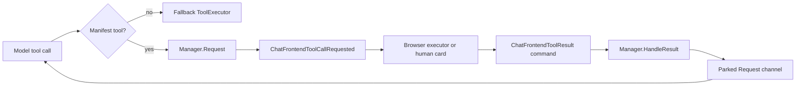
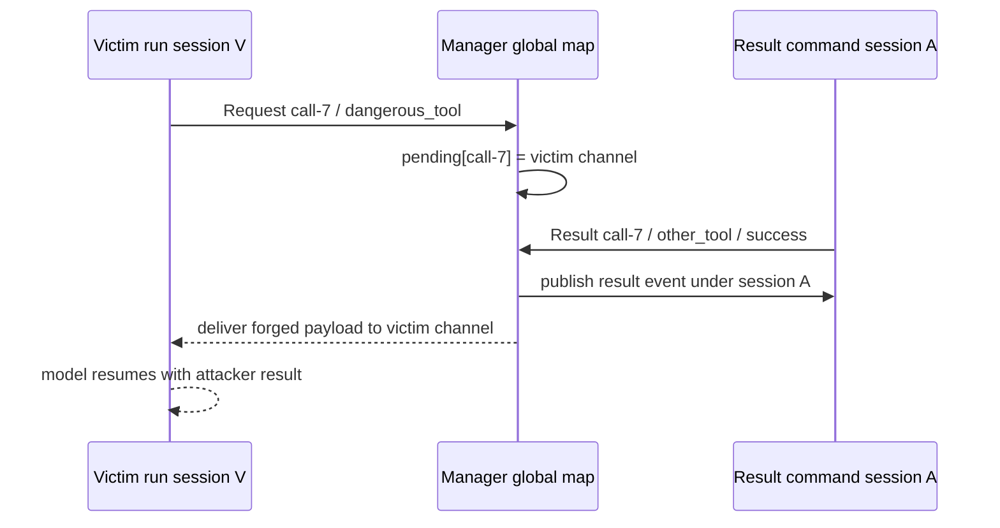

# Pinocchio frontend-tool bridge hardening: invocation identity, result validation, implementation guide

## Executive summary

Pinocchio's frontend-tool bridge lets a model call a tool whose implementation lives in a browser. To the model, `workbench_perform` or `pbui_propose` looks like any other Geppetto tool. Internally, Pinocchio publishes a request through sessionstream, waits while the browser executes or asks a person, accepts a result command, and returns that result to the parked model run.

That bridge is a distributed transaction. Its identity currently collapses to one string: `tool_call_id`. `Manager.pending` is a process-global `map[string]*pendingCall`; `HandleResult` looks up only that id. It does not require the result command's session id or supplied tool name to match the parked call. Two sessions using the same call id can overwrite each other's pending entry, and a result submitted under one session can resolve another session's run.

The defect was reproduced from the current workspace without changing production code:

```text
pending request session: victim-session
result command session: attacker-session
pending tool name: dangerous_browser_tool
submitted tool name: different_name_is_accepted
value returned to victim request: source=attacker
```

The immediate correction is to key and validate pending calls with at least `(session_id, tool_call_id, tool_name)`. The durable target is a first-class invocation identity containing session, run/message, call id, tool name, manifest generation, and executor client. Completion must be compare-and-set: one pending invocation can transition to one terminal result. Duplicate identical delivery receives an idempotent acknowledgement; mismatched, unsolicited, late, or second terminal results are rejected and diagnosed.

This document explains the entire subsystem for an intern, then gives file-level implementation steps, protobuf/API sketches, migration ordering, locking rules, and tests.

## Implementation status (2026-08-24)

The server-only phases that do not require a coordinated consumer protocol change are implemented:

- **Phase 0 complete** in `8cdc9af`: `(session_id, tool_call_id)` pending keys, duplicate insertion rejection, exact-record cleanup, strict session/tool/status validation, trusted timeline identity, and stable HTTP rejection mapping.
- **Phase 1 complete** in `84c6e63`: atomic pending-to-terminal completion, bounded count/age retention, deterministic result digests, identical retry acknowledgement, conflicting/late/key-reuse rejection, cancellation/timeout terminalization, and deterministic publisher-failure completion.
- **Bridge/status validation complete** in `d1e1741`: all accepted non-success statuses map to model-visible tool errors; unused terminal fields were removed.

Current stable rejection codes are `duplicate_pending`, `unknown_result`, `session_mismatch`, `tool_mismatch`, `invalid_status`, `terminal_conflict`, `late_result`, and `key_reuse`. Defaults retain at most 4,096 terminal digests for 15 minutes; `NewManagerWithConfig` requires positive count and TTL values.

Phases 2–4 remain open. Protocol-v2 run/manifest/executor/capability identity must be coordinated with `REACT-CHAT-TOOL-RUNTIME-1` and `PBUI-TOOLCALL-1`; this implementation intentionally does not add a hidden dual-identity compatibility path.

## 1. Scope and non-goals

### In scope

- `pkg/chatapp/frontendtools.Manager` manifest and pending-call state.
- `BridgeExecutor` provider-name resolution and browser request execution.
- the frontend-tool protobuf protocol.
- sessionstream command/event/timeline projection used by the bridge.
- result validation, idempotency, cancellation, and diagnostics.
- manifest ordering and browser-executor identity as server contracts.
- tests under `pkg/chatapp/frontendtools`.
- caller-facing changes needed by PBUI and react-chat/chat-provider.

### Non-goals

- implementing PBUI's workbench/sandbox/conversation policy.
- deciding the visual design of browser approval cards.
- replacing sessionstream.
- changing Geppetto's generic backend tool executor.
- solving HTTP authentication inside this package; the hosting server must authenticate, while this package enforces invocation identity after authentication.

## 2. System orientation for a new intern

### 2.1 The packages involved

| Package | Role |
|---|---|
| Geppetto `pkg/inference/tools` | defines provider-visible tools, calls, results, registries, and executors |
| Pinocchio `pkg/chatapp` | binds a model runtime to sessionstream messages/events |
| Pinocchio `pkg/chatapp/frontendtools` | converts a model call into a browser request and waits for the result |
| sessionstream | command/event bus, durable timeline projection, WebSocket UI fanout |
| browser client | advertises descriptors, executes automatic tools, renders human tools, submits results |

The critical point is that the browser is not a passive renderer. For a frontend tool it is the executor, so its result crosses a trust boundary back into the model run.

### 2.2 Files to read in order

1. `proto/pinocchio/chatapp/frontendtools/v1/frontend_tool.proto` — wire vocabulary.
2. `pkg/chatapp/frontendtools/manager.go` — manifests, pending calls, request/result handling.
3. `pkg/chatapp/frontendtools/bridge.go` — Geppetto `ToolExecutor` adapter.
4. `pkg/chatapp/frontendtools/plugin.go` — UI/timeline projection.
5. `manager_test.go`, `bridge_test.go`, `plugin_test.go` — intended behavior and current coverage.
6. `pkg/chatapp/service.go` and runtime setup call sites — cancellation and publisher context.

### 2.3 Backend versus frontend tools

A backend tool executes inside the Go process through the fallback executor. A frontend descriptor is supplied by a browser manifest. During run construction, `RegisterManifestTools` converts each available descriptor into a Geppetto tool definition. `BridgeExecutor` recognizes provider-safe aliases and routes matching calls through `Manager.Request`.



### 2.4 Manifest lifecycle

A browser sends `FrontendToolManifestCommand{tools, revision}`. `HandleManifest` clones it into `m.manifests[sessionID]` and publishes `FrontendToolManifestUpdated`. `RegisterManifestTools` later reads that session manifest and registers only descriptors with `available=true`.

Provider names may have stricter syntax than browser names. `ProviderToolName` sanitizes them; `RegisterManifestTools` rejects alias collisions. `ResolveProviderToolName` maps the provider call back to the browser-facing descriptor.

### 2.5 Request lifecycle

`BridgeExecutor.ExecuteToolCall`:

1. reads `BridgeContext` from `context.Context`;
2. resolves the provider tool name against the session manifest;
3. parses JSON arguments into a map;
4. reads descriptor execution mode;
5. calls `Manager.Request`;
6. blocks until browser result or context cancellation;
7. converts non-success status into `ToolResult.Error`.

`Manager.Request` creates a buffered channel, stores it in `pending`, publishes the request using `context.WithoutCancel(ctx)`, and waits on the result channel or `ctx.Done()`.

Using `WithoutCancel` for publication is intentional: cancellation of the model context should not prevent the durable request event from being published after request setup. It also means cancellation and late results require explicit terminal semantics.

## 3. Current wire and state model

### 3.1 Current protocol

The protocol has five central messages:

- `FrontendToolManifestCommand`.
- `FrontendToolCallRequested`.
- `FrontendToolResultCommand`.
- `FrontendToolResultReceived`.
- `FrontendToolCallEntity`.

The request carries message id, call id, tool name, input, mode, and a free-form status string. The result command carries call id, tool name, result, free-form status, and error. Session id is outside the protobuf in the sessionstream command envelope.

### 3.2 Current pending state

```go
type pendingCall struct {
    messageID string
    toolName  string
    ch        chan *FrontendToolResultCommand
}

type Manager struct {
    mu        sync.Mutex
    manifests map[SessionId]*FrontendToolManifestUpdated
    pending   map[string]*pendingCall // toolCallId only
}
```

This representation cannot answer:

- which session owns an entry;
- whether a supplied result tool name matches;
- which run/message generation owns a reused call id;
- which browser client was selected to execute it;
- whether a terminal result already won;
- whether an identical retry should be acknowledged;
- whether cancellation occurred before a late result.

### 3.3 Current timeline projection

`plugin.go` projects `EventCallRequested` into a `ChatFrontendToolCall` entity keyed by call id. `EventResultReceived` reads the current entity and writes result/status/error. The timeline gives browser hydration and observability, but an id-only entity key mirrors the same cross-session/run ambiguity if one timeline view ever contains reused ids.

Within one session view, call ids may be sufficiently unique in practice. The server manager is process-global, so practical provider uniqueness does not replace required namespacing.

## 4. Critical finding and threat model

### 4.1 Cross-session result acceptance

`HandleResult` receives a sessionstream command with `cmd.SessionId`, but it reads:

```go
pending := m.pending[payload.ToolCallId]
```

If pending exists, it fills only a blank tool name, copies message id, publishes a result event under the command's session, and sends the payload to the pending channel. A nonblank mismatched name is accepted. No session comparison is possible because `pendingCall` does not store one.



### 4.2 Collision without an attacker

Two providers/runs can use the same call id:

```text
session A Request(call-1) -> pending[call-1] = A
session B Request(call-1) -> pending[call-1] = B (A overwritten)
```

A's deferred cleanup later deletes `pending[call-1]`, potentially removing B's entry. Results can wake B, A can hang, and cleanup order corrupts state. This is a concurrency correctness issue even if every caller is trusted.

### 4.3 Deployment severity

- **Critical:** shared service where another principal can address result/session routes.
- **High:** local service reachable by untrusted browser origins or local processes.
- **Correctness defect:** trusted loopback-only development.

HTTP authentication belongs to hosts such as PBUI. This package must still reject identity mismatch; defense in depth and multi-session correctness are package responsibilities.

## 5. Target invariants

The implementation is complete only when these invariants hold:

1. A pending call belongs to exactly one session.
2. A pending call belongs to exactly one message/run and tool name.
3. Duplicate pending insertion never overwrites another call silently.
4. Only the selected browser executor may complete the call.
5. Exactly one terminal result wins.
6. An identical terminal retry is idempotent.
7. A conflicting terminal retry is rejected and diagnosed.
8. Cancellation removes pending state without enabling key reuse races.
9. A late result cannot wake a newer invocation.
10. Manifest selection is bound to the invocation.
11. Timeline event session/message/name match the accepted invocation, not untrusted result fields.
12. Every rejection has a stable error code and safe diagnostic context.

## 6. Proposed domain types

### 6.1 Invocation key

The minimum safe key for the immediate patch:

```go
type PendingKey struct {
    SessionID  sessionstream.SessionId
    ToolCallID string
}
```

The target key:

```go
type InvocationKey struct {
    SessionID  sessionstream.SessionId
    MessageID  string
    RunID      string
    ToolCallID string
    ToolName   string
}
```

Map keys must be comparable; strings and `SessionId` are suitable. The tool name may either be part of the key or a strictly checked field. Including it makes logs and accidental lookup mistakes safer.

### 6.2 Pending and terminal records

```go
type pendingCall struct {
    key               InvocationKey
    executorClientID  string
    manifest          ManifestVersion
    resultCapability  [32]byte
    requestedAt       time.Time
    deadline          time.Time
    ch                chan Completion
}

type terminalCall struct {
    key          InvocationKey
    status       ResultStatus
    resultDigest [32]byte
    completedAt  time.Time
    completion   Completion
}

type Manager struct {
    mu        sync.Mutex
    manifests map[ManifestKey]ManifestState
    pending   map[InvocationKey]*pendingCall
    terminal  *boundedTerminalStore
}
```

Do not store unbounded terminal results. Retain enough to cover HTTP/WebSocket retry and hydration windows: configurable count plus age, with metrics for eviction.

### 6.3 Result status

Replace arbitrary strings in package logic with a typed enum:

```go
type ResultStatus string

const (
    ResultSuccess   ResultStatus = "success"
    ResultFailed    ResultStatus = "failed"
    ResultDenied    ResultStatus = "denied"
    ResultCancelled ResultStatus = "cancelled"
    ResultTimeout   ResultStatus = "timeout"
)
```

Protobuf may use an enum in a protocol-breaking release. If wire strings remain temporarily, parse strictly at the command boundary and emit canonical strings. Do not accept unknown values as successful model results.

## 7. Proposed protobuf/API changes

A coordinated protocol revision should add identity fields rather than infer them from timeline state:

```proto
message FrontendToolInvocationKey {
  string session_id = 1;
  string message_id = 2;
  string run_id = 3;
  string tool_call_id = 4;
  string tool_name = 5;
  string client_instance_id = 6;
  uint64 connection_generation = 7;
  uint64 manifest_revision = 8;
}

message FrontendToolCallRequested {
  FrontendToolInvocationKey key = 1;
  google.protobuf.Struct input = 2;
  ToolExecutionMode mode = 3;
  string executor_client_id = 4;
  string result_capability = 5;
  google.protobuf.Timestamp deadline = 6;
}

message FrontendToolResultCommand {
  FrontendToolInvocationKey key = 1;
  string executor_client_id = 2;
  string result_capability = 3;
  FrontendToolResultStatus status = 4;
  google.protobuf.Struct result = 5;
  string error = 6;
}
```

`session_id` is redundant with the command envelope, intentionally: handlers must verify equality. Signed/random capability limits confused-deputy replay but does not replace authenticated transport.

### Rollout rule

Do not maintain two ambiguous identities indefinitely. Use an explicit protocol version or coordinated release:

1. Pinocchio accepts and emits v2.
2. react-chat/chat-provider understands v2.
3. PBUI maps HTTP bodies to v2 and upgrades dependencies.
4. Remove v1 acceptance after the coordinated migration window.

The immediate composite-key server patch can land before protobuf v2 because the session id already exists in the command envelope.

## 8. Completion algorithm

### 8.1 Register request

```text
request(ctx, key, descriptor, executor):
  validate key fields and descriptor
  lock manager
  if pending contains key:
    reject duplicate_pending
  if terminal contains key:
    reject key_reuse
  create channel and pending record
  insert pending
  unlock

  publish request event
  wait for completion or ctx.Done
  on cancellation: cancel(key)
```

Insertion and duplicate checking happen under one lock. Cleanup must delete only the exact record it inserted:

```go
if current := m.pending[key]; current == pending {
    delete(m.pending, key)
}
```

That pointer comparison prevents an old deferred cleanup from deleting a later record even if a programmer accidentally permits key reuse.

### 8.2 Complete result

```text
complete(principal, command):
  parse and canonicalize status
  derive key from command envelope + payload
  lock manager

  if terminal contains key:
    if digest matches: return idempotent acknowledgement
    reject conflicting_terminal_result

  pending = pending[key]
  if absent: reject unknown_or_late_result
  require payload session == envelope session
  require tool name == pending key tool name
  require executor id == pending executor
  require capability == pending capability
  validate result shape/size

  atomically move pending -> terminal
  unlock

  publish accepted result using trusted pending identity
  deliver completion to channel once
```

Publishing and channel delivery ordering needs a decision. Prefer durable publish before waking the run, but do not hold `Manager.mu` across publisher I/O. Use an internal completion state (`completing`) or a small transaction object so a publish error can be represented without allowing another result to win.

A simpler first implementation:

1. mark terminal under lock;
2. unlock;
3. publish;
4. if publish fails, deliver a failed completion to the waiting run and emit operational error.

Document that terminal acceptance is authoritative even if timeline publication fails; retries remain idempotent.

## 9. Manifest hardening

Current manifests are stored by session and replaced by arrival order. Revision is copied but not compared. Two browser clients have independent revision counters, so “highest session revision” is also insufficient.

### Target manifest key

```go
type ManifestKey struct {
    SessionID            sessionstream.SessionId
    ClientInstanceID     string
    ConnectionGeneration uint64
}

type ManifestState struct {
    Revision uint64
    Tools    []*FrontendToolDescriptor
    AcceptedAt time.Time
}
```

`HandleManifest` rules:

- reject blank client id/generation in v2;
- same key, lower/equal conflicting revision: reject stale/conflict;
- same key, equal identical digest: idempotent acknowledgement;
- newer revision: replace;
- executor lease chooses which client manifest becomes provider-visible.

`RegisterManifestTools` must receive selected manifest identity, not “whatever is currently in the session map.” Freeze it into run construction so provider schema and browser executor agree.

## 10. BridgeExecutor changes

### 10.1 Keep provider alias behavior

`ProviderToolName`, alias collision rejection, and original-name description are good. Preserve them.

### 10.2 Build full request identity

`BridgeContext` should carry:

```go
type BridgeContext struct {
    SessionID       sessionstream.SessionId
    MessageID       string
    RunID           string
    Publisher       sessionstream.EventPublisher
    Executor        ExecutorLease
    ManifestVersion ManifestVersion
}
```

`ExecuteToolCall` validates context completeness for a frontend descriptor. Missing executor/manifest context must return an explicit frontend-bridge configuration error; silently falling back can execute a same-named backend tool unexpectedly.

### 10.3 Concurrency classification

Today `ExecuteToolCalls` runs every call sequentially. Keep sequential execution as the default for UI writes. Add descriptor metadata later:

```go
type ToolConcurrencyClass int
const (
    ToolSequentialUIWrite ToolConcurrencyClass = iota
    ToolConcurrentRead
    ToolHumanWait
)
```

Parallelization is not part of the critical patch. First make identity/completion safe; then benchmark and introduce bounded `errgroup` execution for explicitly independent reads.

## 11. Timeline and diagnostics

### 11.1 Entity identity

Within a session timeline, use a stable entity id derived from run/message/call rather than call id alone:

```go
func toolEntityID(key InvocationKey) string {
    return key.MessageID + ":" + key.ToolCallID
}
```

If message ids can contain separators, use length-prefix encoding or a digest. Preserve the raw call id as a field for provider correlation.

### 11.2 Diagnostics

Add structured diagnostics for:

- duplicate pending request;
- cross-session/mismatched result;
- wrong executor;
- invalid status/result;
- idempotent retry;
- conflicting retry;
- late-after-cancel result;
- terminal store eviction;
- stale manifest.

Do not publish rejected result payloads into the normal conversation timeline. Log safe metadata and emit an operational diagnostic channel; results may contain sensitive data.

### 11.3 Metrics

Recommended counters/gauges:

```text
frontend_tools_pending
frontend_tool_requests_total{mode,tool}
frontend_tool_results_total{status,tool}
frontend_tool_result_rejections_total{reason}
frontend_tool_request_duration_seconds{mode,tool}
frontend_tool_manifest_updates_total{outcome}
frontend_tool_terminal_cache_entries
```

Tool names may create high cardinality in extensible products; constrain/sanitize or omit the label in shared telemetry.

## 12. File-level implementation guide

### Phase 0 — Critical containment without protocol expansion

**Files:** `manager.go`, `manager_test.go`, `bridge_test.go`.

1. Define `pendingKey{sessionID, toolCallID}`.
2. Add `sessionID` and immutable `toolName` to `pendingCall`.
3. Change `pending` map type.
4. Reject duplicate insertion.
5. In `HandleResult`, look up with `cmd.SessionId` + call id.
6. Reject nonblank mismatched tool name; fill blank only after lookup.
7. Validate allowed statuses.
8. Delete exact record only.
9. Reject unknown/late normal results rather than publishing them.
10. Add the regression matrix in §13.

This phase closes the demonstrated cross-session path and collision race.

### Phase 1 — Terminal idempotency

**Files:** `manager.go`, new focused terminal-store file/tests.

1. Define canonical completion and digest.
2. Add bounded terminal cache.
3. Atomically move pending to terminal.
4. Acknowledge identical retries; reject conflicting retries.
5. Represent cancellation/timeout as terminal states.
6. Ensure late results cannot wake reused calls.

### Phase 2 — Protocol v2 identity

**Files:** protobuf, generated code, manager, bridge, plugin, tests.

1. Add invocation key/status enum/manifest identity.
2. Regenerate protobufs using repository generation targets.
3. Expand `BridgeContext` and `Request`.
4. Verify envelope and payload identity equality.
5. Update timeline entity identity and projection.
6. Coordinate consumer upgrades.

### Phase 3 — Manifest/executor ownership

**Files:** manager, bridge, server integration packages.

1. Store client-scoped manifests.
2. Add monotonic compare-and-set.
3. accept selected executor lease from host/session service.
4. freeze manifest into run.
5. reject results from non-owner client.

### Phase 4 — Concurrency and operations

1. Add descriptor concurrency metadata only after safety phases.
2. instrument metrics and diagnostics.
3. load-test thousands of pending/terminal records.
4. document retention and shutdown behavior.

## 13. Test plan

### 13.1 Required manager matrix

| Case | Expected |
|---|---|
| same id, different sessions | independent pending calls |
| result from session B for A's id | rejected; A remains pending |
| same session/id, wrong tool | rejected |
| duplicate pending same key | second request rejected, first preserved |
| old deferred cleanup after new record | new record preserved |
| first valid success | one timeline result + one channel completion |
| identical success retry | idempotent acknowledgement, no second event |
| different retry | conflict rejection |
| result after cancellation | late rejection/diagnostic |
| unknown id | rejection/diagnostic |
| unknown status | validation rejection |
| publication failure | deterministic terminal behavior |

### 13.2 Bridge tests

- provider alias resolves to exact browser tool.
- alias collision remains rejected.
- missing bridge context falls back only for non-manifest tools.
- complete invocation identity reaches request.
- non-success statuses map to `ToolResult.Error`.
- context cancellation cleans pending state.
- selected manifest revision is stable during a run.

### 13.3 Race tests

Run:

```bash
go test -race ./pkg/chatapp/frontendtools -count=20
```

Include concurrent requests/results/cancellations and manifest reads/writes. No test should rely on sleeps where a channel/barrier can establish ordering.

### 13.4 Full validation

```bash
go test ./pkg/chatapp/frontendtools -count=1
go test -race ./pkg/chatapp/frontendtools -count=1
go test ./pkg/chatapp/... -count=1
make build
```

Follow `AGENTS.md`: use contexts, descriptive table-driven tests, exported-doc comments, `pkg/errors` wrapping where context is added, and avoid untracked goroutines.

## 14. Cross-repo contracts

### PBUI host responsibilities

- authenticate and authorize session routes/WS.
- map HTTP result/manifest bodies to protocol v2.
- pass authenticated browser client identity.
- return stable error codes/statuses.
- bump Pinocchio dependency after release/commit.

### react-chat/chat-provider responsibilities

- include invocation key, executor id, capability, and manifest identity in results.
- execute only calls assigned to this browser.
- keep a terminal browser ledger so reconciliation does not re-run effects.
- submit human completion exactly once.

### sessionstream responsibilities

No core change is required for Phase 0. Executor-targeted UI delivery may later require subscriber identity/routing; alternatively clients can receive all events and execute only matching assignments. Choose based on sessionstream's broader subscriber model, not solely this feature.

## 15. Risks and alternatives

### Alternative: assume provider call ids are globally unique

Rejected. The package cannot impose that guarantee across providers, sessions, tests, imports, or retries. Even cryptographically random ids do not authorize a result.

### Alternative: key only by session and call id forever

Acceptable containment, incomplete target. It does not distinguish late reuse across runs or bind tool/manifest/executor identity.

### Alternative: trust HTTP authentication alone

Rejected. Authentication answers who sent a request; invocation matching answers which parked operation it may complete. Both are required.

### Alternative: publish every unsolicited result for observability

Rejected for the normal timeline. It makes forged/late data look accepted. Emit a diagnostic without normal result projection.

### Alternative: hold manager lock while publishing

Rejected. Publisher I/O under the global lock can block unrelated sessions and deadlock reentrant paths. Move state atomically, unlock, then publish with explicit failure semantics.

## 16. Intern review checklist

Before opening a PR, verify:

- [ ] no map is keyed by bare tool-call id across sessions;
- [ ] pending insertion cannot overwrite;
- [ ] cleanup checks record identity;
- [ ] result session and tool name are exact;
- [ ] terminal completion is atomic and idempotent;
- [ ] cancellation and late result have tests;
- [ ] rejected payloads do not enter normal timeline;
- [ ] no lock is held across publisher/channel operations;
- [ ] race detector passes;
- [ ] protobuf generation produces no unrelated diff;
- [ ] PBUI and chat-provider integration versions are coordinated;
- [ ] docs and logs explain the new stable error codes.

## 17. References

- `proto/pinocchio/chatapp/frontendtools/v1/frontend_tool.proto` — current wire messages.
- `pkg/chatapp/frontendtools/manager.go:25-215` — manifests, global pending map, request/result paths.
- `pkg/chatapp/frontendtools/bridge.go:21-245` — provider aliases, bridge context/executor, manifest registration.
- `pkg/chatapp/frontendtools/plugin.go:26-100` — UI and timeline projections.
- `pkg/chatapp/frontendtools/manager_test.go` — current same-session request/result coverage.
- `pkg/chatapp/frontendtools/bridge_test.go` — executor route and alias collision coverage.
- `pkg/chatapp/frontendtools/plugin_test.go` — timeline projection coverage.
- PBUI ticket `PBUI-AGENT-4`, design doc 06 — system-wide review and executable reproduction provenance.

## Conclusion

The frontend-tool bridge is a valuable architecture: it lets model tools safely reach browser-owned capabilities without moving the browser implementation into Go. The manager is also small enough to harden without redesigning chatapp or sessionstream.

The essential correction is to stop treating a provider-generated call id as global identity or authorization. Make an invocation explicit, bind it to session/tool/run/manifest/executor, complete it once, and diagnose every mismatch. That gives PBUI and every other browser client a reliable server half for idempotent, auditable UI tool execution.
